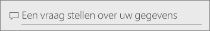
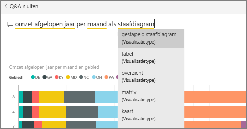
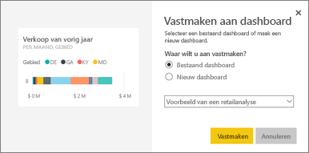
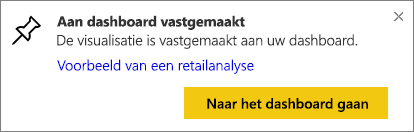
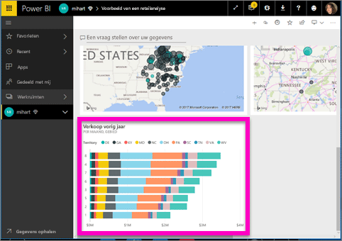
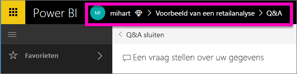

# Een tegel vastmaken aan een dashboard vanuit Q&A
## Een tegel vastmaken vanuit Q&A
Q&A is het ad hoc rapportagehulpmiddel van Power BI. Hebt u een bepaald inzicht nodig? Stel een vraag over uw gegevens en krijg antwoord in de vorm van een visualisatie.

Q&A is beschikbaar via dashboards en rapporten. In dit artikel wordt Q&A vanaf een dashboard geopend. Dashboards zijn wel beschikbaar in de Power BI-service, maar niet in Power BI Desktop. Als u wilt volgen, opent u het [dashboard Voorbeeld van een retailanalyse](sample-retail-analysis.md).
> 
> 

1. Open een [dashboard](service-dashboards.md) waarop ten minste één tegel is vastgemaakt vanuit een rapport. Wanneer u een vraag stelt, zoekt Power BI het antwoord op in elke gegevensset waaraan een tegel is vastgemaakt in dat dashboard.  Zie [Gegevens ophalen](service-get-data.md) voor meer informatie.
2. Typ in het vak Vraag aan de bovenkant van het dashboard wat u wilt weten over uw gegevens.  
   
3. Als u bijvoorbeeld typt 'Omzet afgelopen jaar per maand en gebied'...  
   
   
   geeft het vak Vraag u suggesties.
4. Als u de grafiek als een tegel aan uw dashboard wilt toevoegen, selecteert u de speld  in de rechterbovenhoek van het canvas.
5. Maak de tegel aan een bestaand dashboard of aan een nieuw dashboard vast. 

   

   * Bestaand dashboard: selecteer de naam van het dashboard in de vervolgkeuzelijst. Uw keuzes zijn beperkt tot alleen de dashboards in de huidige werkruimte.
   * Nieuw dashboard: typ de naam van het nieuwe dashboard en het wordt toegevoegd aan uw huidige werkruimte.
6. Selecteer **Vastmaken**.
   
   Een bericht (rechts bovenin) laat u weten dat de visualisatie als tegel aan uw dashboard is toegevoegd.  
   
   
7. Selecteer **Naar dashboard gaan** om de nieuwe tegel te zien. Daar kunt u de tegel [een andere naam geven, vergroten of verkleinen, er een hyperlink aan toevoegen, de tegel verplaatsen en meer](service-dashboard-edit-tile.md) op uw dashboard. 
   
   

## Overwegingen en probleemoplossing
* Wanneer u begint met het typen van een vraag, zoekt Q&A direct naar het beste antwoord in alle gegevenssets die zijn gekoppeld aan het huidige dashboard.  Het 'huidige dashboard' is het dashboard dat in de bovenste navigatiebalk staat vermeld. Deze vraag wordt bijvoorbeeld gesteld in het dashboard **Voorbeeld van een retailanalyse** dat deel uitmaakt van de app-werkruimte **mihart**.
  
  
* **Hoe weet Q&A welke gegevenssets moeten worden gebruikt**?  Q&A heeft toegang tot alle gegevenssets waarvoor visualisaties zijn vastgemaakt aan dat dashboard.

## Volgende stappen
[De naam wijzigen, vergroten of verkleinen, een hyperlink toevoegen, de positie van de tegel wijzigen en meer](service-dashboard-edit-tile.md)    
[Een dashboardtegel weergeven in de focusmodus](service-focus-mode.md)     
Terug naar [Q&A in Power BI](service-q-and-a.md)  
Nog vragen? [Misschien dat de Power BI-community het antwoord weet](http://community.powerbi.com/)

