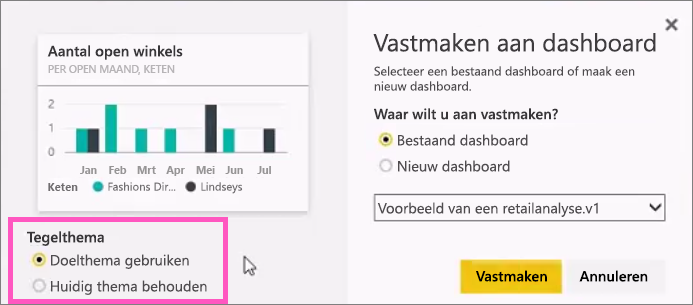
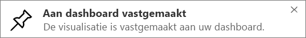

# Vanuit een rapport een tegel vastmaken aan een Power BI-dashboard
## Tegels vanuit een rapport vastmaken
U kunt een nieuwe [dashboardtegel](service-dashboard-tiles.md) onder meer toevoegen vanuit een [Power BI-rapport](service-reports.md). U kunt zelfs veel nieuwe tegels toevoegen uit een rapport.  Elk van deze tegels biedt met een klik een terugkoppeling naar het rapport.

En volledige rapportpagina's kunnen worden vastgemaakt aan een dashboard.  Dit wordt ook wel vastmaken van een *live* tegel genoemd.  *Live* omdat u interactief met de tegel op het dashboard kunt werken en omdat, in tegenstelling tot afzonderlijke visualisatietegels, wijzigingen in het rapport met het dashboard worden gesynchroniseerd. Lees hieronder meer hierover.

U kunt geen tegels vastmaken van rapporten die met u zijn gedeeld of van Power BI Desktop. 

> **TIP**: sommige visualisaties gebruiken achtergrondafbeeldingen. Vastmaken werkt mogelijk niet als de achtergrondafbeelding te groot is.  Verklein de afbeelding of gebruik beeldcompressie.  
> 
> 

## Een tegel uit een rapport vastmaken
Kijk hoe Amanda een dashboard maakt door visualisaties en afbeeldingen vanuit een rapport vast te maken.

<iframe width="560" height="315" src="https://www.youtube.com/embed/lJKgWnvl6bQ" frameborder="0" allowfullscreen></iframe>

Maak nu uw eigen dashboard met een van de Power BI-voorbeeldrapporten.

1. Beweeg de muisaanwijzer over de visualisatie die u wilt vastmaken en selecteer het punaisepictogram . Power BI opent het scherm **Aan dashboard vastmaken**.
   
     
2. Beslis of u een bestaand dashboard of een nieuw dashboard wilt vastmaken.
   
   * Bestaand dashboard: selecteer de naam van het dashboard in de vervolgkeuzelijst. Dashboards die met u zijn gedeeld, worden niet weergegeven in de vervolgkeuzelijst.
   * Nieuw dashboard: typ de naam van het nieuwe dashboard.
3. In sommige gevallen kan het item dat u vastmaakt al een *thema* hebben.  Bijvoorbeeld visuele elementen die vanuit een Excel-werkmap zijn vastgemaakt. Zo ja, selecteer welk thema u wilt toepassen op de tegel.
4. Selecteer **Vastmaken**.
   
   U ontvangt een bericht (in de rechterbovenhoek) dat de visualisatie als tegel aan uw dashboard is toegevoegd.
   
   
5. Selecteer het dashboard met de nieuwe tegel in het navigatievenster. Selecteer de tegel om terug te springen in het rapport. Of, [bewerk de tegelweergave en het gedrag](service-dashboard-edit-tile.md).

## Een volledige rapportpagina vastmaken
Een andere optie is een volledige rapportpagina aan een dashboard vastmaken. Dit is een eenvoudige manier om meer dan één visualisatie tegelijk vast te maken.  Ook zijn bij het vastmaken van een volledige pagina de tegels *live*; u kunt hiermee direct op het dashboard werken. En wijzigingen die u aan visualisaties aanbrengt in de rapporteditor, zoals een filter toevoegen of de velden wijzigen die worden gebruikt in de grafiek, worden ook in de dashboardtegel doorgevoerd.  

Zie voor meer informatie [Een volledige rapportpagina vastmaken](service-dashboard-pin-live-tile-from-report.md)

## Volgende stappen
[Dashboards in Power BI](service-dashboards.md)

[Dashboardtegels in Power BI](service-dashboard-tiles.md)

[Rapporten in Power BI](service-reports.md)

[Gegevens vernieuwen in Power BI](refresh-data.md)

[Basisconcepten van Power BI](service-basic-concepts.md)

Nog vragen? [Misschien dat de Power BI-community het antwoord weet](http://community.powerbi.com/)

