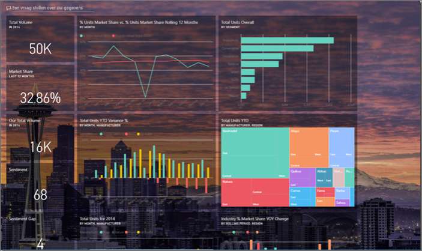
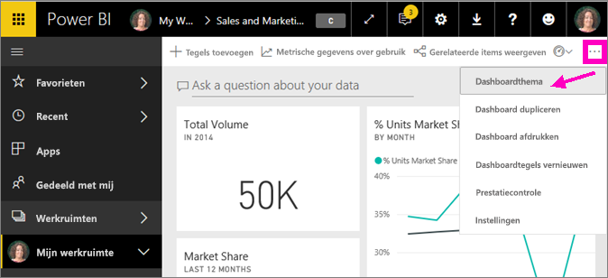
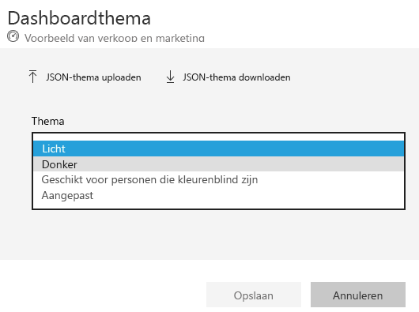
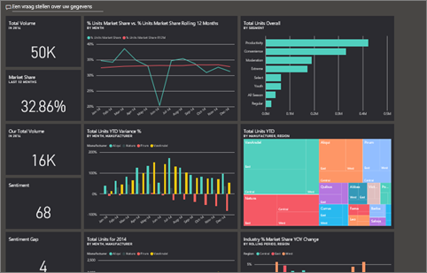
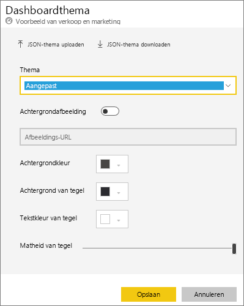
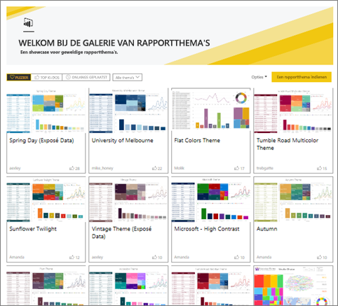
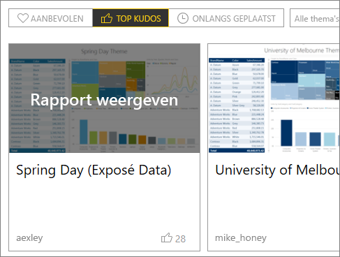
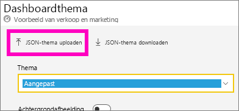
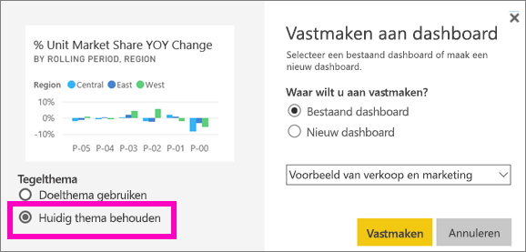
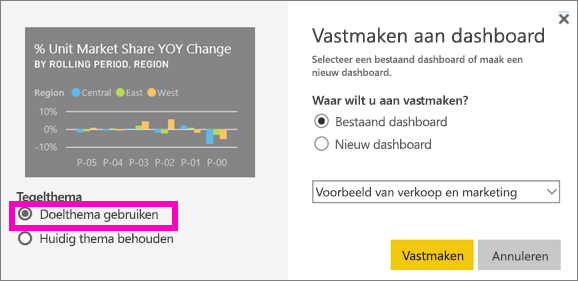

# Dashboardthema’s gebruiken in Power BI-service
Met **Dashboardthema's** kunt u een kleurenthema op uw gehele dashboard toepassen, zoals zakelijke kleuren, seizoensgebonden kleuren of andere kleurthema's die u op een rapport zou willen toepassen. Bij het toepassen van een **Dashboardthema** worden voor alle visuals op het dashboard de kleuren van het geselecteerde thema gebruikt. Er zijn enkele uitzonderingen van toepassing, zoals verderop in dit artikel wordt beschreven.

Het wijzigen van de kleuren van de rapportvisuals op het dashboard heeft geen invloed op de visuals in het rapport. Ook als u tegels vastmaakt vanuit een rapport waarop al een [rapportthema is toegepast](desktop-report-themes.md), kunt u ervoor kiezen het huidige thema te behouden of het dashboardthema te gebruiken.

## Vereisten
* Als u wilt volgen, opent u het [dashboard Voorbeeld van verkoop en marketing](sample-datasets.md).

## Hoe dashboardthema's werken
Om te beginnen opent u een dashboard dat u hebt gemaakt (of waarvoor u een bewerkmachtiging hebt) en dat u wilt aanpassen. Selecteer het beletselteken (...) en kies **Dashboardthema**. 

In het dashboardvenster dat wordt weergegeven, selecteert u één van de vooraf gebouwde thema's.  In het onderstaande voorbeeld hebben we **Donker** geselecteerd.

## Een aangepast thema maken

Het standaardthema voor Power BI-dashboards is **Licht**. Als u de kleuren wilt aanpassen of uw eigen thema wilt maken, selecteert u **Aangepast** in het vervolgkeuzemenu. 

Gebruik de aangepaste opties om uw eigen dashboardthema te maken. Als u een achtergrondafbeelding wilt toevoegen, raden we aan een afbeelding met een minimale resolutie van 1920x1080 te gebruiken.  

### JSON-thema's gebruiken
Een andere manier om een aangepast thema te maken is het uploaden van een JSON-bestand met instellingen voor alle kleuren die u maar wilt gebruiken voor uw dashboard. In Power BI Desktop gebruiken makers van rapporten JSON-bestanden om [thema's voor rapporten te maken](desktop-report-themes.md). Dezelfde JSON-bestanden kunnen worden geüpload voor dashboards of u kunt JSON-bestanden zoeken en uploaden via de [pagina met de themagalerie](https://community.powerbi.com/t5/Themes-Gallery/bd-p/ThemesGallery) in de Power BI-community 

U kunt uw aangepaste thema ook opslaan als een JSON-bestand en dit vervolgens delen met andere dashboardmakers. 

### Een thema uit de themagalerie gebruiken

Net zoals de ingebouwde en aangepaste opties worden de kleuren automatisch toegepast op alle tegels op het dashboard zodra het thema wordt geüpload. 

1. Beweeg de muisaanwijzer over een thema en kies **Rapport weergeven**.

    

2. Schuif omlaag en zoek de koppeling naar het JSON-bestand.  Selecteer het downloadpictogram en sla het bestand op.

    

3. Ga terug naar Power BI-service. In het venster Aangepast dashboardthema selecteert u **JSON-thema uploaden**.

    

4. Navigeer naar de locatie waar u het JSON-themabestand hebt opgeslagen en selecteer **Openen**.

5. Op de pagina Dashboardthema selecteert u **Opslaan**. Het nieuwe thema wordt op uw dashboard toegepast.

    

## Overwegingen en beperkingen

* Als uw rapport een ander thema gebruikt dan het dashboardthema, kunt u bepalen of het actuele visuele thema behouden blijft of dat het dashboardthema wordt gebruikt om consistentie te bereiken tussen visuals uit verschillende bronnen. Wanneer u een tegel op een dashboard vastmaakt, selecteert u **Huidige thema behouden** om het rapportthema te behouden. De visual, op het dashboard, behoudt het rapportthema, inclusief instellingen voor transparantie. 

    U ziet opties voor **Tegelthema’s** alleen als u het rapport in Power BI Desktop hebt gemaakt, [een rapportthema hebt toegevoegd](desktop-report-themes.md) en het rapport vervolgens naar Power BI-service hebt gepubliceerd. 

    

    Probeer de tegel opnieuw vast te maken en selecteer **Dashboardthema gebruiken**.

    

* Dashboardthema's kunnen niet worden toegepast op vastgemaakte liverapportpagina’s, iframe-tegels, SSRS-tegels, werkboektegels of afbeeldingen.
* Dashboardthema's kunnen worden bekeken op mobiele apparaten, maar u kunt een dashboardthema alleen maken in Power BI-service. 
* Aangepaste dashboardthema's werken alleen met tegels die vanuit rapporten zijn vastgemaakt. 

