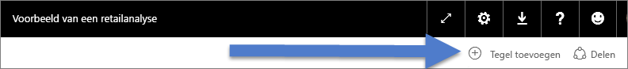
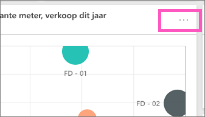
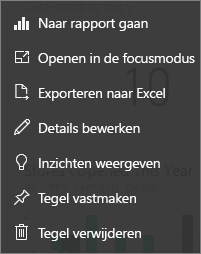

# Inleiding tot dashboardtegels voor Power BI-ontwerpers

Een tegel is een momentopname van uw gegevens, vastgemaakt aan het dashboard. Een tegel kan worden gemaakt vanuit een rapport, een gegevensset, een dashboard, het Q&A-vak, Excel, SQL Server Reporting Services-rapporten (SSRS) en meer.  Deze schermopname laat verschillende tegels zien die zijn vastgemaakt aan een dashboard.

Dashboards en dashboardtegels zijn functies van Power BI-service, niet van Power BI Desktop. U kunt geen dashboards op mobiele apparaten maken, maar u kunt ze daar wel [weergeven en delen](mobile-apps-view-dashboard.md).

Tegels kunnen niet alleen worden vastgemaakt. Zelfstandige tegels kunnen rechtstreeks op het dashboard worden gemaakt met [Tegel toevoegen](service-dashboard-add-widget.md). Zelfstandige tegels bevatten: tekstvakken, afbeeldingen, video's, streaminggegevens en webinhoud.

Hulp nodig om de bouwstenen van Power BI te begrijpen?  Zie [Power BI - Basisconcepten](service-basic-concepts.md).

> [!NOTE]
> Als de oorspronkelijke visualisatie waarmee de tegel is gemaakt wijzigt, verandert de tegel niet.  Als u bijvoorbeeld een lijndiagram uit een rapport hebt vastgemaakt en u het lijndiagram vervolgens wijzigt in een staafdiagram, blijft de dashboardtegel een lijndiagram weergeven. De gegevens worden vernieuwd, maar het visualisatietype niet.
> 
> 

## Maak een tegel vast uit...
Er zijn veel verschillende manieren om een tegel toe te voegen (vastmaken) aan een dashboard. Tegels kunnen worden vastgemaakt uit:

* [Power BI Q&A](service-dashboard-pin-tile-from-q-and-a.md)
* [Een rapport](service-dashboard-pin-tile-from-report.md)
* [Een ander dashboard](service-pin-tile-to-another-dashboard.md)
* [Excel-werkmap in OneDrive voor Bedrijven](service-dashboard-pin-tile-from-excel.md)
* [Power BI Publisher voor Excel](publisher-for-excel.md)
* [Snelle inzichten](service-insights.md)
* [Reporting Services](https://docs.microsoft.com/sql/reporting-services/pin-reporting-services-items-to-power-bi-dashboards)

Zelfstandige tegels voor afbeeldingen, tekstvakken, video's, streaminggegevens en webinhoud kunnen rechtstreeks op het dashboard worden gemaakt met [Tegel toevoegen](service-dashboard-add-widget.md).

  

## Interactie met tegels op een dashboard
### Een tegel verplaatsen en het formaat ervan wijzigen
Pak een tegel en [beweeg deze over het dashboard](service-dashboard-edit-tile.md). Wijs de formaatgreep  aan en selecteer deze om het formaat van de tegel te wijzigen.

### Beweeg de muisaanwijzer over een tegel om het uiterlijk en gedrag ervan te wijzigen
1. Beweeg de muisaanwijzer over de tegel om de weglatingstekens weer te geven.
   
    
2. Selecteer de weglatingstekens om het actiemenu van de tegel te openen.
   
    
   
    Hier kunt u het volgende doen:
   
   * [Het rapport openen waarmee deze tegel is gemaakt ](service-reports.md)   
   
   * [Het werkblad openen waarmee deze tegel is gemaakt ](service-reports.md)   
     
    * [Weergave in de focusmodus ](service-focus-mode.md)   
     * [De in de tegel gebruikte gegevens exporteren](visuals/power-bi-visualization-export-data.md) 
     * [Titel en subtitel bewerken, een hyperlink toevoegen](service-dashboard-edit-tile.md) 
     * [Inzichten uitvoeren](service-insights.md) 
     * [De tegel aan een ander dashboard vastmaken](service-pin-tile-to-another-dashboard.md)
       
     * [De tegel verwijderen](service-dashboard-edit-tile.md)
     
3. Selecteer een leeg gebied op het canvas om het actiemenu te sluiten.

### Selecteer (klik op) een tegel
Wat er gebeurt nadat u een tegel selecteert, hangt af van de manier waarop u de tegel hebt gemaakt. Als de tegel een [aangepaste koppeling](service-dashboard-edit-tile.md) heeft, wordt de koppeling bovendien geopend als u de tegel selecteert. Anders gaat u door het selecteren van de tegel naar het rapport, de Excel Online-werkmap, het on-premises SSRS-rapport of naar de Q&A-vraag die is gebruikt om de tegel te maken.

> [!NOTE]
> Uitzondering hierop zijn videotegels die rechtstreeks op het dashboard zijn gemaakt met **Tegel toevoegen**. Als u een videotegel selecteert (die op deze manier is gemaakt), wordt de video direct op het dashboard afgespeeld.   
> 
> 

## Overwegingen en probleemoplossing

* Als het rapport waarmee de visualisatie is gemaakt, niet is opgeslagen, leidt het selecteren van de tegel niet tot een actie.
* Als de tegel is gemaakt vanuit een werkmap in Excel Online, hebt u minimaal leesmachtigingen voor die werkmap nodig. Anders wordt de werkmap niet in Excel Online geopend als u de tegel selecteert.
* Stel dat u rechtstreeks op het dashboard een tegel maakt met behulp van **Tegel toevoegen** en hiervoor een aangepaste hyperlink instelt. Als dit het geval is en u de titel, subtitel of tegel selecteert, wordt die URL geopend. Het selecteren van een tegel die rechtstreeks op het dashboard is gemaakt voor een afbeelding, webcode of tekstvak, leidt anders standaard niet tot een actie.
* Als u geen machtiging hebt voor het rapport binnen Reporting Services en u een tegel selecteert die vanuit een Reporting Services-rapport is gemaakt, gaat u naar een pagina waarop wordt aangegeven dat u geen toegang hebt (rsAccessDenied).
* Als u geen toegang hebt tot het netwerk waar de Reporting Services-server zich bevindt en u een tegel selecteert die is gemaakt op basis van Reporting Services, gaat u naar een pagina waarop wordt aangegeven dat de server niet kan worden gevonden (HTTP 404). Uw apparaat heeft netwerktoegang tot de rapportserver nodig om het rapport te kunnen weergeven.
* Als de oorspronkelijke visualisatie waarmee de tegel is gemaakt wijzigt, verandert de tegel niet.  Als u bijvoorbeeld een lijndiagram uit een rapport vastmaakt en u het lijndiagram vervolgens wijzigt in een staafdiagram, blijft de dashboardtegel een lijndiagram weergeven. De gegevens worden vernieuwd, maar het visualisatietype niet.

## Volgende stappen
[Kaart maken (tegel met grote cijfers) voor uw dashboard](power-bi-visualization-card.md)

[Dashboards in Power BI](service-dashboards.md)  

[Gegevens vernieuwen](refresh-data.md)

[Power BI - basisconcepten](service-basic-concepts.md)

[Een tegel exporteren naar PowerPoint](http://blogs.msdn.com/b/powerbidev/archive/2015/09/28/integrating-power-bi-tiles-into-office-documents.aspx)

[Items van Reporting Services vastmaken aan Power BI-dashboards](https://msdn.microsoft.com/library/mt604784.aspx)

Nog vragen? [Misschien dat de Power BI-community het antwoord weet](http://community.powerbi.com/)

