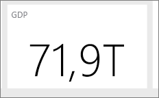

# Tips voor het ontwerpen van een geweldig Power BI-dashboard
Nu u een dashboard hebt gemaakt en een aantal tegels hebt toegevoegd, kunt u nadenken over hoe u ervoor zorgt dat het dashboard niet alleen mooi, maar ook functioneel is. Dit betekent in de praktijk meestal dat de belangrijkste informatie een opvallende plaats krijgt, en dat het dashboard netjes en opgeruimd is.

Hier volgen enkele tips.

> [!TIP]
> Veel ontwerpprincipes voor rapporten zijn ook van toepassing op dashboards.  Lees het technisch document [Best design principles for reports and visualizations](visuals/power-bi-visualization-best-practices.md) (Beste ontwerpprincipes voor rapporten en visualisaties).
>
>

## Webinar [Dashboard Makeover](https://info.microsoft.com/CO-PowerBI-WBNR-FY16-05May-12-Dashboard-Makeover-Registration.html)
Kijk hoe Microsoft Principal Program Manager en Power BI-dashboardexpert Marc Reguera [schitterende dashboards maakt](https://info.microsoft.com/CO-PowerBI-WBNR-FY16-05May-12-Dashboard-Makeover-Registration.html).

## Rekening houden met uw doelgroep
Wat zijn de belangrijkste metrische gegevens op basis waarvan uw doelgroep beslissingen neemt? Hoe wordt het dashboard gebruikt? Welke aangeleerde of culturele aannames hebben mogelijk invloed op dergelijke ontwerpkeuzen? Welke informatie heeft uw doelgroep nodig om succesvol te zijn?

Onthoud dat het dashboard een overzicht is, één plek waarop u de huidige status van de gegevens kunt controleren. Het dashboard is gebaseerd op de onderliggende rapporten en gegevenssets, en deze kunnen heel veel details bevatten. Uw lezers kunnen vanaf het dashboard deze details in de rapporten bekijken. U hoeft de details dus niet op het dashboard te plaatsen, tenzij uw lezers deze willen controleren.

Wanneer wordt het dashboard weergegeven? U kunt meer inhoud op het dashboard plaatsen als het wordt weergegeven op een grote monitor. Als lezers het dashboard op hun tablets bekijken, is de inhoud beter leesbaar door minder tegels te gebruiken.

## Een verhaal vertellen op één enkel scherm
Omdat dashboards zijn bedoeld om belangrijke informatie in één oogopslag te kunnen zien, is het een goed idee om alle tegels op een enkel scherm weer te geven. Kunt u schuifbalken voorkomen op uw dashboard?

Is het dashboard te vol?  Verwijder alle gegevens behalve de essentiële die gemakkelijk kunnen worden gelezen en geïnterpreteerd.

## De modus volledig scherm gebruiken
Geef het dashboard weer op het [volledige scherm](service-fullscreen-mode.md), zodat lezers niet worden afgeleid.

## De belangrijkste informatie het grootste maken
Als de tekst en visualisaties op het dashboard allemaal even groot zijn, kunnen uw lezers moeilijker bepalen wat het belangrijkste is. Kaartvisualisaties zijn bijvoorbeeld een goede manier om een belangrijk getal prominent weer te geven:  

Maar zorg ervoor dat u context biedt.  

Lees meer over [een tegel maken met alleen een getal](visuals/power-bi-visualization-card.md).

## De belangrijkste informatie in de rechterbovenhoek plaatsen
De meeste mensen lezen van boven naar beneden. Plaats daarom het hoogste detailniveau bovenaan en geef meer details weer naarmate in de leesrichting van de doelgroep wordt bewogen (links-naar-rechts, rechts-naar-links).

## De juiste visualisatie gebruiken voor de gegevens en de visualisatie zo opmaken dat deze gemakkelijk te lezen is
Vermijd een verscheidenheid aan visualisaties omwille van de verscheidenheid alleen.  Visualisaties moeten een beeld schetsen, en gemakkelijk te begrijpen en te interpreteren zijn.  Voor sommige gegevens en visualisaties is een eenvoudig grafische visualisatie voldoende. Maar andere gegevens vragen mogelijk om een complexere visualisatie. Zorg ervoor dat u titels en labels, en andere aanpassingen gebruikt om de lezer te helpen.  

* [Kies de juiste gegevensvisualisaties](https://www.youtube.com/watch?v=-tdkUYrzrio). Wees voorzichtig met grafieken die een vertekend beeld van de realiteit geven, bijvoorbeeld 3D-grafieken. Houd er rekening mee dat het menselijk brein moeite heeft met het interpreteren van circulaire vormen. Cirkeldiagrammen, ringdiagrammen, meters en andere cirkelvormige diagramtypen zien er wel mooi uit, maar ze zijn geen aanbevolen manier om gegevens te visualiseren.
* Wees consistent met diagramschalen op assen, de volgorde van diagramdimensies en ook de kleuren die worden gebruikt voor dimensiewaarden binnen diagrammen.
* Zorg ervoor dat u kwantitatieve gegevens goed codeert. Gebruik niet meer dan 3 of 4 cijfers, wanneer u getallen weergeeft. Geef metingen weer met 1 of 2 cijfers links van de decimale punt, en gebruik een schaal voor duizendtallen of miljoenen, bijvoorbeeld 3,4 miljoen en niet 3.400.000.
* Gebruik gaan combinatie van precisie- en tijdsniveaus. Zorg ervoor dat tijdsperioden begrijpelijk zijn.  Gebruik niet een diagram met de gegevens van de afgelopen maand naast gefilterde diagrammen uit een specifieke maand van het jaar.
* Combineer geen grote en kleine metingen op dezelfde schaal, zoals een lijn- of staafdiagram.  Bijvoorbeeld een meting in miljoenen, terwijl een andere in duizenden wordt weergegeven.  Met een dergelijke grote schaal is het lastig om de verschillen te zien in de meting die in duizenden wordt weergegeven.  Als u wilt combineren, kiest u een visualisatie die het gebruik van een tweede as toestaat.
* Gebruikt in diagrammen geen onnodige gegevenslabels. De waarden in staafdiagrammen zijn meestal heel goed te begrijpen zonder dat het werkelijke getal hoeft te worden weergegeven.
* Let op hoe [diagrammen zijn gesorteerd](power-bi-report-change-sort.md).  Als u de aandacht wilt vestigen op het hoogste of laagste getal, sorteert u op de meting.  Als u wilt dat personen snel een bepaalde categorie kunnen vinden in een groot aantal categorieën, sorteert u op as.  
* Cirkeldiagrammen werken het beste als er minder dan acht categorieën worden weergegeven. Omdat u in een cirkeldiagram geen waarden naast elkaar kunt weergeven, is het moeilijker om in een cirkeldiagram waarden te vergelijken dan in een staaf- of kolomdiagram. Cirkeldiagrammen zijn geschikter voor het weergeven van deel-naar-geheelrelaties dan voor het vergelijken van delen. En meterdiagrammen zijn ideaal voor het weergeven van de huidige status in de context van een doel.

Zie [Visualization types in Power BI](visuals/power-bi-visualization-types-for-reports-and-q-and-a.md) (Visualisatietypen in Power BI) voor meer visualisatiespecifieke instructies.  

## Meer informatie over aanbevolen procedures voor het ontwerpen van dashboards
Als u de kunst van het ontwerpen van geweldige dashboards onder de knie wilt krijgen, kunt u overwegen om u te verdiepen in de Gestalt-basisprincipes voor visuele waarneming en te leren hoe u duidelijk informatie waarop actie moet worden ondernomen, in context overbrengt. Gelukkig zijn er al tal van bronnen algemeen beschikbaar, onder andere vermeld in onze blogs. Een aantal van onze favoriete boeken zijn:

* *Information Dashboard Design* (Ontwerpen van informatiedashboards) door Stephen Few  
* *Show Me the Numbers* door Stephen Few  
* *Now You See It* door Stephen Few  
* *Envisioning Information* (Visie op informatie) door Edward Tufte  
* *Advanced Presentations by Design* (Speciaal ontworpen geavanceerde presentaties) door Andrew Abela   

## Volgende stappen
[Een dashboard maken van een rapport](service-dashboard-create.md)  
[Power BI - basisconcepten](service-basic-concepts.md)  
Hebt u nog vragen? [Misschien dat de Power BI-community het antwoord weet](http://community.powerbi.com/)
