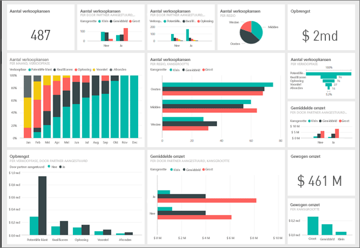
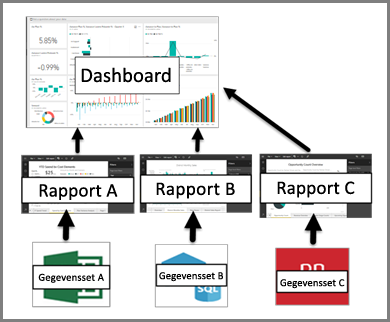

# Inleiding tot dashboards voor Power BI-ontwerpers

Een Power BI-***dashboard*** bestaat uit één pagina, ook wel een canvas genoemd, waarin een verhaal wordt verteld aan de hand van visualisaties. Aangezien het maar één pagina betreft, bevat een goed ontworpen dashboard alleen de belangrijkste elementen van dat verhaal. Lezers kunnen gerelateerde rapporten lezen voor meer informatie.

Dashboards zijn een functie van de Power BI-service. Ze zijn niet beschikbaar in Power BI Desktop. U kunt geen dashboards op mobiele apparaten maken, maar u kunt ze daar wel [weergeven en delen](mobile-apps-view-dashboard.md).

## Basisbeginselen over dashboards 

De visualisaties die u op het dashboard ziet, worden *tegels* genoemd. U kunt tegels vanuit rapporten *vastmaken* aan een dashboard. Als u geen ervaring hebt met Power BI kunt u een goede basis leggen door de [basisconcepten van Power BI](service-basic-concepts.md) te lezen

> [!IMPORTANT]
> U hebt een [Power BI Pro](service-free-vs-pro.md)-licentie nodig om dashboards te maken.

De visualisaties op een dashboard zijn afkomstig uit rapporten en elk rapport is gebaseerd op een gegevensset. Een dashboard kan worden gezien als een ingang tot de onderliggende rapporten en gegevenssets. Als u een visualisatie selecteert, gaat u naar het rapport (en de gegevensset) waarop de visualisatie is gebaseerd.

## Voordelen van dashboards
Dashboards zijn een fantastische manier om uw bedrijf te monitoren en de belangrijkste metrische gegevens in één oogopslag te zien. De visualisaties op een dashboard kunnen afkomstig zijn uit een of meer onderliggende gegevenssets en rapporten. Een dashboard combineert on-premises gegevens en gegevens in de cloud om zo een geconsolideerde weergave te bieden van uw gegevens, ongeacht waar deze zich bevinden.

Een dashboard is niet alleen een mooi plaatje. Het is zeer interactief en de tegels worden bijgewerkt wanneer de onderliggende gegevens worden gewijzigd.

## Dashboards versus rapporten
[Rapporten](service-reports.md) en dashboards lijken veel op elkaar, omdat het beide canvassen zijn die met visualisaties worden ingevuld. Er zijn echter belangrijke verschillen.

| **Mogelijkheid** | **Dashboards** | **Rapporten** |
| --- | --- | --- |
| Pagina's |Eén pagina |Een of meer pagina's |
| Gegevensbronnen |Een of meer rapporten en een of meer gegevenssets per dashboard |Eén gegevensset per rapport |
| Beschikbaar in Power BI Desktop |Nee | Kunnen rapporten maken en weergeven in Power BI Desktop |
| Abonneren |U kunt zich abonneren op een dashboard |U kunt zich abonneren op een rapportpagina |
| Filteren |U kunt niet filteren of segmenteren |Er zijn verschillende manieren voor filteren, markeren en segmenteren |
| Aanbevolen |U kunt één dashboard instellen als uw aanbevolen dashboard |U kunt geen aanbevolen rapport maken |
| Favoriet | U kunt dashboards instellen als *favorieten* | U kunt rapporten instellen als *favorieten*
| Waarschuwingen instellen |Beschikbaar voor dashboardtegels in bepaalde omstandigheden |Niet beschikbaar in rapporten |
| Query's in natuurlijke taal (Q&A) |Beschikbaar op dashboards | Beschikbaar in rapporten |
| U kunt onderliggende tabellen en velden van de gegevensset bekijken |Nee. U kunt gegevens exporteren maar tabellen en velden niet in het dashboard zelf zien. |Ja. U kunt tabellen en velden en waarden van gegevenssets bekijken. |

## Volgende stappen
* Maak kennis met dashboards door het bekijken van een van onze [voorbeelddashboards](sample-tutorial-connect-to-the-samples.md).
* Alles over [dashboardtegels](service-dashboard-tiles.md).
* Wilt u een bepaalde dashboardtegel monitoren en een e-mail ontvangen wanneer deze een bepaalde drempelwaarde bereikt? [Stel dan een waarschuwing in voor de tegel](service-set-data-alerts.md).
* Ontdek hoe u [Q&A van Power BI](power-bi-tutorial-q-and-a.md) gebruikt om een vraag te stellen over uw gegevens en antwoord krijgt in de vorm van een visualisatie.
