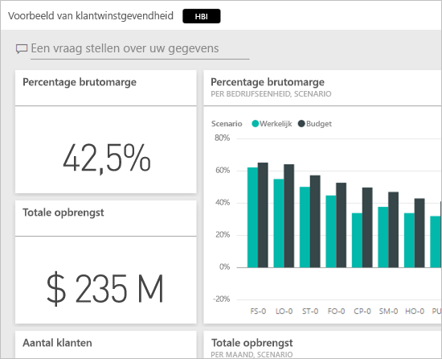
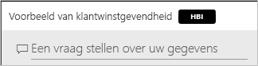
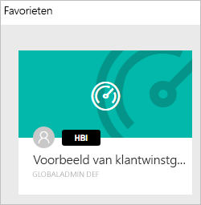
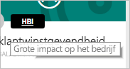
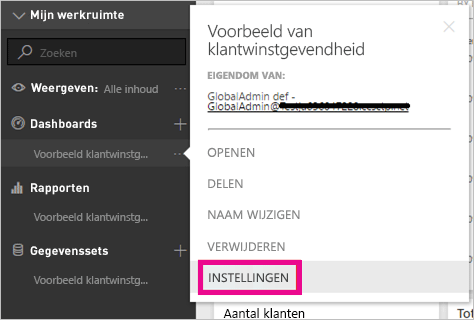
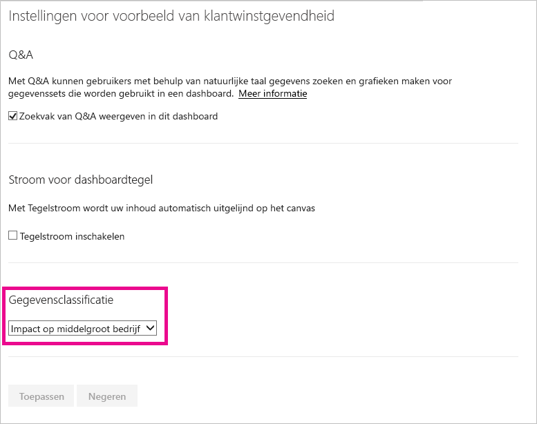
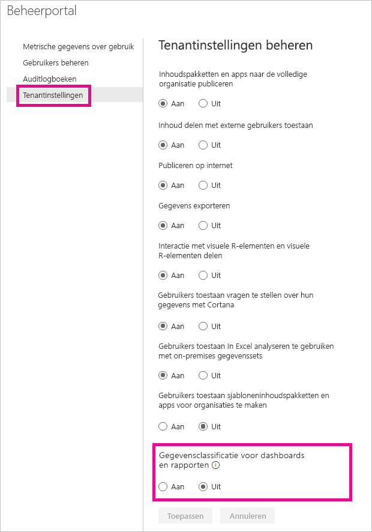
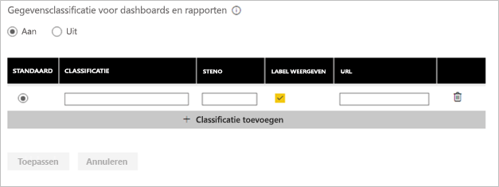
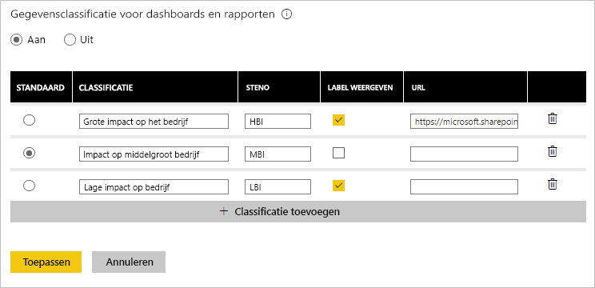

# Classificatie van dashboardgegevens
Elk dashboard is anders en afhankelijk van de gegevensbron waarmee u verbinding maakt, zult u waarschijnlijk merken dat u en de collega's met wie u het dashboard deelt, verschillende voorzorgsmaatregelen zullen moeten nemen, afhankelijk van de vertrouwelijkheid van de gegevens. Sommige dashboards mogen nooit worden afgedrukt of worden gedeeld met personen buiten uw bedrijf, terwijl andere zonder beperkingen kunnen worden gedeeld. Door gegevens in het dashboard te classificeren, kunt u anderen die het dashboard raadplegen, bewust maken van de mate van beveiliging die vereist is. U kunt uw dashboards voorzien van classificatielabels die zijn opgesteld door de IT-afdeling van uw bedrijf, zodat iedereen die de inhoud bekijkt, weet hoe het staat met de vertrouwelijkheid van de gegevens.

## Labels voor gegevensclassificatie
Labels voor gegevensclassificatie worden weergegeven naast de naam van het dashboard, zodat iedereen direct kan zien welk beveiligingsniveau moet worden toegepast op het dashboard en de daarin opgenomen gegevens.

Labels worden ook weergegeven naast de dashboardtegel in de lijst met favorieten.

Wanneer u een label aanwijst met de muis, ziet u de volledige naam van de classificatie.

Beheerders kunnen ook een URL instellen voor een label om extra informatie te bieden.

> [!NOTE]
> Afhankelijk van de classificatie-instellingen die de beheerder heeft geselecteerd, is het mogelijk dat bepaalde typen classificatie niet als een label worden weergegeven op het dashboard. Als u de eigenaar van een dashboard bent, kunt u het type classificatie van het dashboard altijd controleren in de instellingen van het dashboard.
> 
> 

## De classificatie van een dashboard instellen
Als gegevensclassificatie is ingeschakeld voor uw bedrijf, hebben alle dashboards een standaardtype classificatie. Als de eigenaar van een dashboard, kunt u de classificatie echter aanpassen aan het gewenste beveiligingsniveau voor uw dashboard.

Ga als volgt te werk om het type classificatie te wijzigen:

1. Ga naar de instellingen van het dashboard door de **drie puntjes** naast de naam van het dashboard te selecteren en **Instellingen** te kiezen.
   
    
2. In het deelvenster met instellingen kunt u de huidige classificatie voor het dashboard zien en via de vervolgkeuzelijst het type classificatie wijzigen.
   
    
3. Selecteer **Toepassen** wanneer u klaar bent.

Nadat u de wijziging hebt toepast, ziet iedereen met wie u het dashboard hebt gedeeld de nieuwe classificatie wanneer ze het dashboard opnieuw laden.

## Werken met labels voor gegevensclassificatie als beheerder
Gegevensclassificatie wordt ingesteld door de globale beheerder voor uw organisatie. Ga als volgt te werk om gegevensclassificatie in te schakelen:

1. Selecteer het pictogram Instellingen (tandwiel) en selecteer **Beheerportal**.
   
    
2. Ga naar het tabblad **Tenantinstellingen** en zet **Gegevensclassificatie voor dashboards** op *Ingeschakeld* .
   
    

Er wordt nu een formulier weergegeven voor het maken van de verschillende classificaties in uw organisatie.

Voor elke classificatie kunt u een **naam** en **steno** (verkorte schrijfwijze) opgeven, die beide worden weergegeven op het dashboard. Voor elke classificatie kunt u via het selectievakje **Label weergeven** bepalen of de verkorte schrijfwijze al dan niet wordt weergegeven op het dashboard. Als u besluit het type classificatie niet weer te geven op het dashboard, kan de eigenaar het type nog steeds zien door de dashboardinstellingen te controleren. U kunt eventueel ook een **URL** toevoegen die aanvullende informatie bevat over de richtlijnen en gebruiksvereisten die binnen uw gelden voor classificatie.  

Het laatste wat u moet beslissen, is welke classificatie standaard moet worden toegewezen.  

Als u het formulier helemaal hebt ingevuld, selecteert u **Toepassen** om de wijzigingen op te slaan.

Op dit moment krijgen alle dashboards de standaardclassificatie en kunnen eigenaren van een dashboard het type classificatie aanpassen op basis van de inhoud van het dashboard. U kunt hier altijd terugkomen om classificatietypen toe te voegen of te verwijderen of om de standaardinstelling wijzigen.  

> [!NOTE]
> Er zijn een paar dingen die belangrijk zijn als u hier terugkeert om wijzigingen aan te brengen:
> 
> * Als u gegevensclassificatie uitschakelt, wordt geen van de labels onthouden. U moet dus helemaal opnieuw beginnen als u deze functie later weer wilt inschakelen.  
> * Als u een type classificatie verwijdert, krijgen dashboards met dit type classificatie automatisch de standaardclassificatie totdat de eigenaar dit wijzigt.  
> * Als u de standaardclassificatie wijzigt, krijgen alle dashboards die nog geen classificatie van de eigenaar hebben gekregen, de nieuwe standaardclassificatie.
> 
> 

