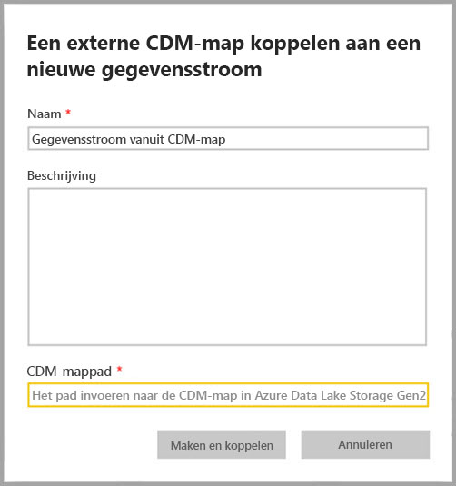
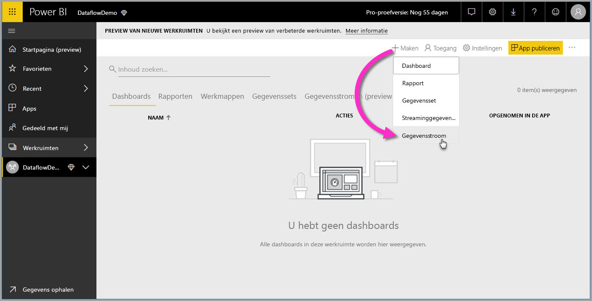
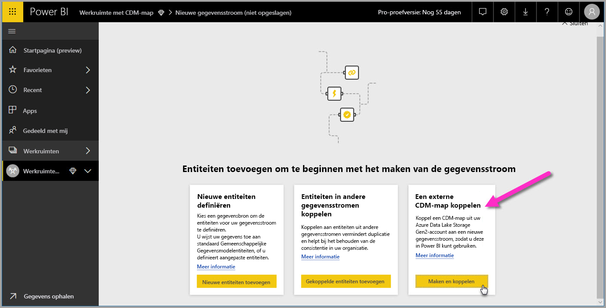

# Een CDM-map aan Power BI toevoegen als een gegevensstroom (preview)

In Power BI kunt u CDM-mappen (Common Data Model) die in Azure Data Lake Store Gen2 van uw organisatie zijn opgeslagen als gegevensstromen toevoegen. En als u een gegevensstroom hebt gemaakt van een CDM-map, kunt u **Power BI Desktop** en de **Power BI-service** gebruiken om gegevenssets, rapporten, dashboards en apps te maken die zijn gebaseerd op de gegevens die u in CDM-mappen plaatst.

Er zijn enkele vereisten voor het maken van gegevensstromen vanuit CDM-mappen, zoals in de volgende lijst wordt beschreven:

* Het maken van gegevensstromen vanuit CDM-mappen is *alleen* beschikbaar in de [nieuwe werkruimte-ervaring](service-create-the-new-workspaces.md). 
* Om een CDM-map toe te voegen aan Power BI, moet de gebruiker die de map toevoegt [autorisatie voor de CDM-map en de bijbehorende bestanden](https://go.microsoft.com/fwlink/?linkid=2029121) hebben.
* Aan u moeten lees- en uitvoermachtigingen zijn verleend voor alle bestanden en mappen in de CDM-map, om deze te kunnen toevoegen aan Power BI.

In de volgende secties wordt beschreven hoe u een gegevensstroom vanuit een CDM-map kunt maken.

> [!NOTE]
> De functionaliteit met betrekking tot gegevensstromen is in de preview-fase en is dus onderhevig aan wijzigingen en updates voordat deze algemeen beschikbaar wordt.

## Een gegevensstroom vanuit een CDM-map maken

Om te beginnen met het maken van een gegevensstroom vanuit een CDM-map, start u de **Power BI-service** en selecteert u een **app-werkruimte** in het navigatiedeelvenster links. U kunt ook een nieuwe werkruimte maken, waarin u dan een nieuwe gegevensstroom kunt maken.

Selecteer in het scherm dat verschijnt de optie **Maken en koppelen** zoals op de volgende afbeelding wordt weergegeven.

In het scherm dat verschijnt kunt u de naam van de gegevensstroom opgeven, een beschrijving van de gegevensstroom geven en het pad naar de CDM-map in het Azure Data Lake Gen2-account van uw organisatie opgeven. Lees de sectie in het artikel waarin wordt beschreven [hoe u het pad voor de CDM-map verkrijgt](service-dataflows-configure-workspace-storage-settings.md#get-the-uri-of-stored-dataflow-files). 

Als u de gegevens hebt opgegeven, selecteert u **Maken en koppelen** om de gegevensstroom te maken.

Gegevensstromen vanuit CDM-mappen worden gemarkeerd met het pictogram *Extern* wanneer ze worden weergegeven in Power BI. In de volgende sectie worden verschillen beschreven tussen standaardgegevensstromen en gegevensstromen die zijn gemaakt op basis van CDM-mappen.

Zodra de machtigingen juist zijn ingesteld, zoals eerder in dit artikel is beschreven, kunt u verbinding maken met uw gegevensstroom in **Power BI Desktop**.

## Overwegingen en beperkingen

Als u werkt met machtigingen voor een gegevensstroom die zijn gemaakt op basis van een CDM-map, is het proces vergelijkbaar met externe gegevensbronnen in Power BI. Machtigingen worden beheerd in de gegevensbron, en niet vanuit Power BI. Machtigingen moeten op de juiste wijze worden ingesteld in de gegevensbron zelf, zoals een gegevensstroom gemaakt op basis van een CDM-map, om goed te kunnen werken met Power BI.

De volgende lijsten helpen te verduidelijken hoe gegevensstromen vanuit CDM-mappen met Power BI werken.

Power BI Pro, Premium- en ingesloten werkruimten:
* Gegevensstromen vanuit CDM-mappen kunnen niet worden bewerkt
* Machtigingen voor het lezen van een gegevensstroom die zijn gemaakt op basis van een CDM-map worden beheerd door de eigenaar van de CDM-map en niet door Power BI

Power BI Desktop:
* Alleen gebruikers die zijn gemachtigd voor de werkruimte waarin de gegevensstroom is gemaakt, en de CDM-map, hebben toegang tot de gegevens van de Power BI-connector voor gegevensstromen

Er zijn ook enkele aanvullende overwegingen. Deze staan beschreven in de volgende lijst:

* Het maken van gegevensstromen vanuit CDM-mappen is *alleen* beschikbaar in de [nieuwe werkruimte-ervaring](service-create-the-new-workspaces.md)
* Gekoppelde entiteiten zijn niet beschikbaar voor gegevensstromen die zijn gemaakt vanuit CDM-mappen

Klanten van **Power BI Desktop** hebben geen toegang tot gegevensstromen die zijn opgeslagen in het Azure Data Lake Storage Gen2-account, tenzij ze eigenaar zijn van de gegevensstroom of ze expliciet zijn geautoriseerd voor de CDM-map van de gegevensstroom. Kijk eens naar de volgende situatie:

1.  Anna maakt een nieuwe app-werkruimte en configureert deze zodanig dat er gegevensstromen kunnen worden opgeslagen vanuit een CDM-map.
2.  Ben, die ook lid is van de werkruimte die Anna heeft gemaakt, wil Power BI Desktop en de gegevensstroomconnector gebruiken om gegevens op te halen uit de gegevensstroom die Anna heeft gemaakt.
3.  Ben krijgt een foutmelding omdat hij niet als geautoriseerde gebruiker is toegevoegd aan de CDM-map van de gegevensstroom in de data lake.

    

Om dit probleem op te lossen, moeten aan Ben leesmachtigingen voor de CDM-map en de bijbehorende bestanden worden verleend. Meer informatie over het verlenen van toegang tot de CDM-map vindt u in [dit artikel](https://go.microsoft.com/fwlink/?linkid=2029121).

## Volgende stappen

In dit artikel vindt u instructies voor het configureren van werkruimteopslag voor gegevensstromen. Raadpleeg de volgende artikelen voor meer informatie:

Raadpleeg de volgende artikelen voor meer informatie over gegevensstromen, CDM en Azure Data Lake Storage Gen2:

* [Integratie van gegevensstromen en Azure Data Lake (preview)](service-dataflows-azure-data-lake-integration.md)
* [Gegevensstroominstellingen voor werkruimten configureren (preview)](service-dataflows-configure-workspace-storage-settings.md)
* [Verbinding maken met Azure Data Lake Storage Gen2 voor gegevensstroomopslag (preview)](service-dataflows-connect-azure-data-lake-storage-gen2.md)

Raadpleeg de volgende artikelen voor algemene informatie over gegevensstromen:

* [Gegevensstromen maken en gebruiken in Power BI](service-dataflows-create-use.md)
* [Berekende entiteiten gebruiken in Power BI Premium (preview)](service-dataflows-computed-entities-premium.md)
* [Gegevensstromen gebruiken met on-premises gegevensbronnen (preview)](service-dataflows-on-premises-gateways.md)
* [Resources voor ontwikkelaars voor Power BI-gegevensstromen (preview)](service-dataflows-developer-resources.md)

Raadpleeg de volgende artikelen voor informatie over Azure-opslag:
* [Azure Storage-beveiligingshandleiding](https://docs.microsoft.com/azure/storage/common/storage-security-guide)
* [Geplande vernieuwing configureren](refresh-scheduled-refresh.md)
* [Aan de slag met GitHub-voorbeelden uit Azure Data Services](https://aka.ms/cdmadstutorial)

U kunt het overzichtsartikel lezen voor meer informatie over Common Data Model:
* [Overzicht van Common Data Model](https://docs.microsoft.com/powerapps/common-data-model/overview)
* [CDM-mappen](https://go.microsoft.com/fwlink/?linkid=2045304)
* [Bestandsdefinitie van CDM-model](https://go.microsoft.com/fwlink/?linkid=2045521)

U kunt altijd [vragen stellen in de Power BI-community](http://community.powerbi.com/).

