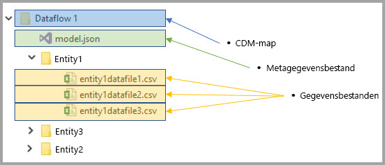
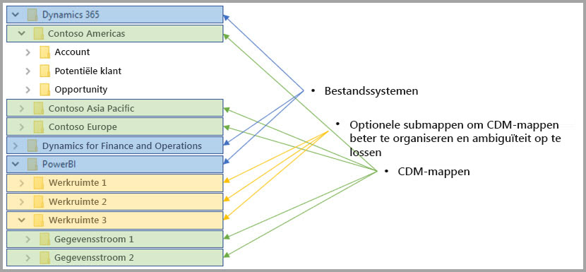

# Integratie van gegevensstromen en Azure Data Lake (preview)

Gegevens die worden gebruikt met Power BI worden standaard opgeslagen in de interne opslag die wordt geleverd door Power BI. Met de integratie van gegevensstromen en Azure Data Lake Storage Gen2 (ADLS Gen2) kunt u uw gegevensstromen opslaan in het Azure Data Lake Storage Gen2-account van uw organisatie. 

> [!NOTE]
> De functionaliteit met betrekking tot gegevensstromen is in de preview-fase en is dus onderhevig aan wijzigingen en updates voordat deze algemeen beschikbaar wordt.

## Hoe CDM-mappen gerelateerd zijn aan gegevensstromen

Met **gegevensstromen** kunnen gebruikers en organisaties gegevens uit verschillende bronnen samenvoegen en voorbereiden op modellering. Met het Common Data Model (CDM) kunnen organisaties een gegevensindeling gebruiken die semantische consistentie biedt tussen toepassingen en implementaties. En met Azure Data Lake Storage gen2 (ADLS Gen2) kan toegangs- en autorisatiebeheer heel nauwkeurig worden toegepast op datalakes in Azure. In combinatie met elkaar bieden deze elementen aantrekkelijke gecentraliseerde gegevens, gestructureerde gegevens, uiterst gedetailleerd toegangsbeheer en semantische consistentie voor apps en initiaties binnen de hele organisatie.

Gegevens die zijn opgeslagen in CDM-indeling bieden semantische consistentie tussen toepassingen en implementaties in een organisatie. Met CDM-integratie met ADLS Gen2 kunnen dezelfde structurele consistentie en semantische betekenis worden toegepast op gegevens die zijn opgeslagen in (ADLS Gen2) met behulp van de CDM-mappen met geschematiseerde gegevens in de CDM-standaardindeling. De gestandaardiseerde metagegevens en zelfbeschrijvende gegevens in een Azure Data Lake vergemakkelijken opsporing van metagegevens, en de samenwerking tussen data producenten en consumenten, zoals Power BI, Azure Data Factory, Azure Data Lake, Databricks en Azure Machine Learning (ML). 

Gegevensstromen slaan hun definitie en gegevens in de volgende indelingen in CDM-mappen op:

**Model.json**
* Het **Model.json**-beschrijvingsbestand van de metagegevens bevat semantische informatie over de entiteitsrecords en kenmerken en koppelingen naar onderliggende gegevensbestanden. Het bestaan van het model.json-bestand geeft aan dat er compatibiliteit is met de CDM-indeling voor metagegevens, en omvat mogelijk standaardentiteiten die aanvullende uitgebreide out-of-box semantische metagegevens hebben die toepassingen kunnen gebruiken.
* Power BI slaat ook alle gegevensbroninformatie op met de **query en transformaties** die worden gegenereerd door de Dataflow Editor in de Power BI-service. Wachtwoorden voor gegevensbronnen worden niet opgeslagen in het modelbestand.

**Gegevensbestanden**
* De gegevensbestanden zijn opgenomen in de CDM-map in een goed gedefinieerde structuur en indeling (submappen zijn optioneel, zoals verderop in dit artikel wordt beschreven) en hiernaar wordt in het model.json-bestand verwezen. Op dit moment moeten gegevensbestanden de CSV-indeling hebben, maar mogelijk worden aanvullende indelingen ondersteund in latere updates. 

Het volgende diagram toont een voorbeeld van een CDM-map, die is gemaakt door een Power BI-gegevensstroom, die drie entiteiten bevat:

Het model.json- of metagegevensbestand in de vorige afbeelding biedt verwijzingen naar de bestanden met entiteitgegevens in de CDM-map.

## Power BI organiseert CDM-mappen in de data lake

Met Power BI-gegevensstromen en de integratie met ADLS Gen2 kan Power BI gegevens in een data lake produceren. Als gegevensproducent moet Power BI een CDM-map maken voor elke gegevensstroom die het model.json-bestand en de bijbehorende gegevensbestanden bevat. Power BI slaat de gegevens geïsoleerd van andere gegevensproducenten op in de data lake met behulp van *bestandssystemen*. Meer informatie over het Azure Data Lake Storage Gen2-bestandssysteem en hiërarchische naamruimte vindt u in [het artikel over dit onderwerp](https://docs.microsoft.com/azure/storage/data-lake-storage/namespace).

Power BI maakt gebruik van submappen voor ondubbelzinnigheid, en voor verbeterde organisatie van de gegevens wanneer deze worden gepresenteerd in de **Power BI-service**. De naam en de structuur van de map vertegenwoordigen werkruimten (mappen) en gegevensstromen (CDM-mappen). Het volgende diagram toont hoe een data lake dat wordt gedeeld door Power BI en andere gegevensproducenten kunnen worden gestructureerd. Elke service, in dit geval Dynamics 365, Dynamics for Finance and Operation en Power BI, maakt en beheert zijn eigen bestandssysteem. Afhankelijk van de ervaring in elke service, worden submappen gemaakt om CDM-mappen in het bestandssysteem beter te organiseren. 

## Power BI beveiligt gegevens in de data lake

Power BI gebruikt *Active Directory OAuth Bearer*-tokens en *POSIX ACL's* die door Azure Data Lake Storage Gen2 worden verstrekt. Met deze functies kan de toegang van Power BI tot het bestandssysteem dat het beheert in de data lake worden bepaald en kan ook worden bepaald dat mensen alleen toegang hebben tot gegevensstromen of CDM-mappen die ze maken. 

Om CDM-mappen in het Power BI-bestandssysteem te maken en te beheren, zijn lees-, schrijf- en uitvoermachtigingen voor het bestandssysteem vereist. Elke gegevensstroom die wordt gemaakt in Power BI wordt opgeslagen in een eigen CDM-map en aan de eigenaar van de gegevensstroom wordt alleen-lezen toegang tot de CDM-map en de inhoud ervan verleend. Zo wordt de integriteit beschermd van de gegevens die Power BI genereert en beschikken beheerders over de mogelijkheid om met behulp van auditlogboeken te controleren welke gebruikers de CDM-map hebben geopend. 

### Gebruikers of services autoriseren voor CDM-mappen

Het delen van CDM-mappen met gebruikers van gegevens, zoals gebruikers of services die nodig zijn om de gegevens te lezen, is vereenvoudigd met Active Directory OAuth Bearer-tokens en POSIX ACL's. Beheerders beschikken hiermee over de mogelijkheid om te controleren wie de CDM-map hebben geopend. De enige actie die vereist is, is het verlenen van toegang aan een Active Directory-object van uw keuze (zoals een gebruikersgroep of service) tot de CDM-map. Het wordt aanbevolen dat alle toegang tot de CDM-map voor elke andere identiteit dan de gegevensproducent als alleen-lezen wordt verleend. Hiermee wordt de integriteit beschermd van de gegevens die door de producent worden gegenereerd.

Voor het toevoegen van CDM-mappen aan Power BI, moet de gebruiker die de CDM-map toevoegt ACL's voor *leestoegang* hebben in zowel de CDM-map zelf en alle bestanden of mappen die de CDM-map bevat. Daarnaast zijn ACL's voor *uitvoer*toegang nodig in zowel de CDM-map zelf als alle bestanden of mappen die de CDM-map bevat. Het wordt aanbevolen dat u de artikelen [Access control lists on files and directory](https://docs.microsoft.com/azure/storage/blobs/data-lake-storage-access-control#access-control-lists-on-files-and-directories) (Toegangsbeheerlijsten voor bestanden en mappen) en [Best practices for using Azure Data Lake Storage Gen2](https://docs.microsoft.com/azure/storage/blobs/data-lake-storage-best-practices) (Aanbevolen procedures voor het gebruik van Azure Data Lake Storage Gen2) beide leest voor meer informatie.

### Alternatieve vormen van autorisatie

Personen of services buiten Power BI kunnen ook gebruikmaken van alternatieve vormen van autorisatie. Deze alternatieve toestemmingshouders krijgen toegang tot *alle* resources in het account, volledige toegang tot alle resources in de lake en kunnen niet worden beperkt tot bestandssystemen of CDM-mappen. Deze alternatieven lijken mogelijk een eenvoudige manier om toegang te verlenen, maar ze beperken de mogelijkheid om specifieke resources in de data lake te delen en bieden gebruikers geen mogelijkheid te controleren wie toegang tot de opslag heeft verkregen. Volledige details van de beschikbare autorisatieschema's vindt u in het artikel [Toegangsbeheer in Azure Data Lake Storage Gen2](https://docs.microsoft.com/azure/storage/blobs/data-lake-storage-access-control
).

## Volgende stappen

Dit artikel bood u een overzicht van de integratie van Power BI-gegevensstromen, CDM-mappen en Azure Data Lake Storage Gen2. Raadpleeg de volgende artikelen voor meer informatie:

Raadpleeg de volgende artikelen voor meer informatie over gegevensstromen, CDM en Azure Data Lake Storage Gen2:

* [Gegevensstroominstellingen voor werkruimten configureren (preview)](service-dataflows-configure-workspace-storage-settings.md)
* [Een CDM-map aan Power BI toevoegen als een gegevensstroom (preview)](service-dataflows-add-cdm-folder.md)
* [Verbinding maken met Azure Data Lake Storage Gen2 voor gegevensstroomopslag (preview)](service-dataflows-connect-azure-data-lake-storage-gen2.md)

Raadpleeg de volgende artikelen voor algemene informatie over gegevensstromen:

* [Gegevensstromen maken en gebruiken in Power BI](service-dataflows-create-use.md)
* [Berekende entiteiten gebruiken in Power BI Premium (preview)](service-dataflows-computed-entities-premium.md)
* [Gegevensstromen gebruiken met on-premises gegevensbronnen (preview)](service-dataflows-on-premises-gateways.md)
* [Resources voor ontwikkelaars voor Power BI-gegevensstromen (preview)](service-dataflows-developer-resources.md)

Raadpleeg de volgende artikelen voor informatie over Azure-opslag:
* [Azure Storage-beveiligingshandleiding](https://docs.microsoft.com/azure/storage/common/storage-security-guide)
* [Aan de slag met GitHub-voorbeelden uit Azure Data Services](https://aka.ms/cdmadstutorial)

U kunt het overzichtsartikel lezen voor meer informatie over Common Data Model:
* [Overzicht van Common Data Model](https://docs.microsoft.com/powerapps/common-data-model/overview)
* [CDM-mappen](https://go.microsoft.com/fwlink/?linkid=2045304)
* [Bestandsdefinitie van CDM-model](https://go.microsoft.com/fwlink/?linkid=2045521)

U kunt altijd [vragen stellen in de Power BI-community](http://community.powerbi.com/).
