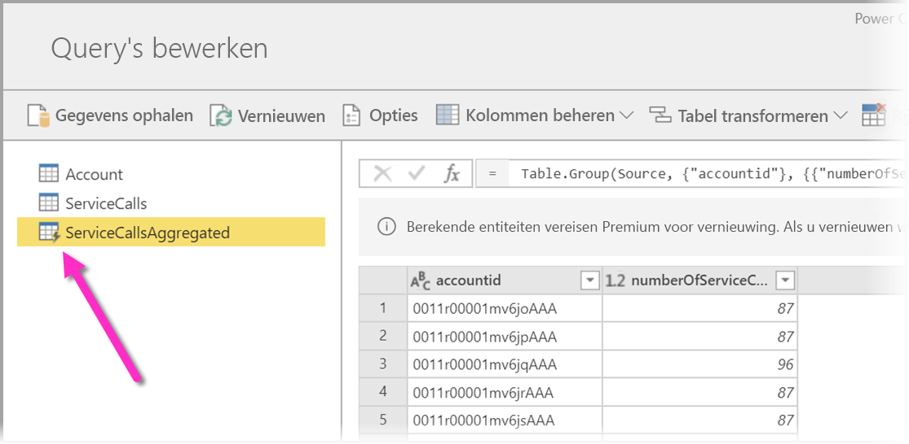
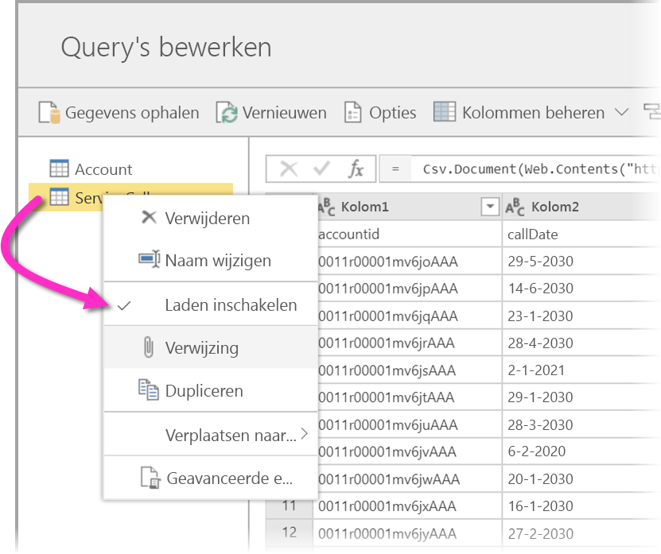
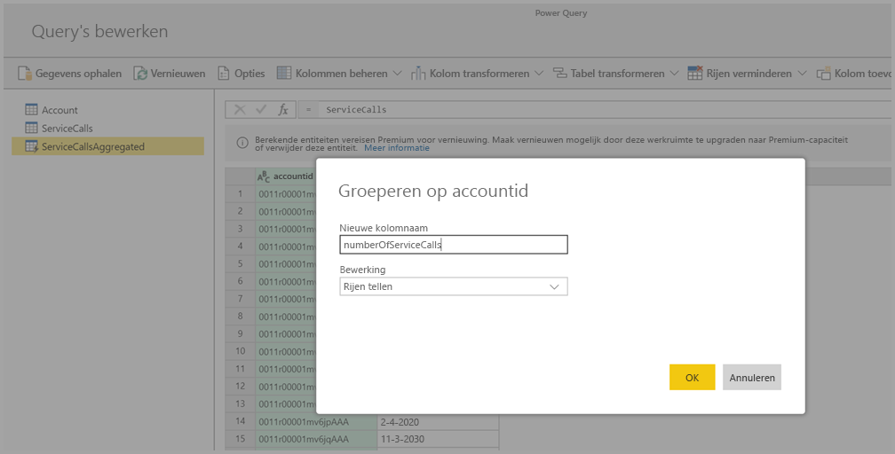
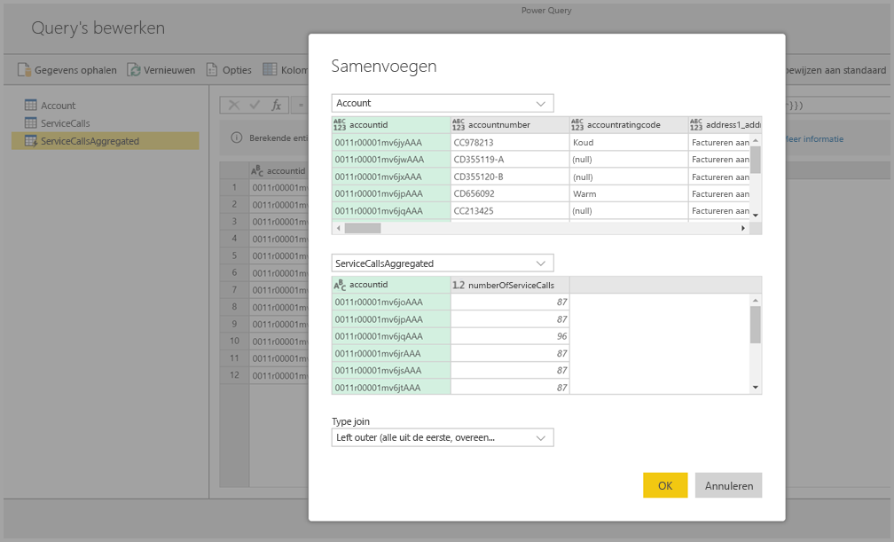
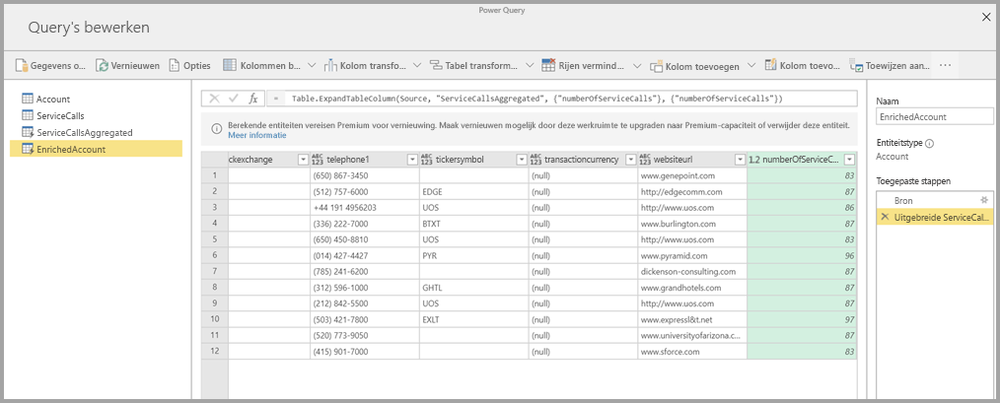

# Berekende entiteiten gebruiken in Power BI Premium (preview)

U kunt **berekeningen in de opslag** uitvoeren wanneer u **gegevensstromen** gebruikt met een Power BI Premium-abonnement. Hierdoor kunt u berekeningen uitvoeren in bestaande gegevensstromen, en worden er resultaten geretourneerd die u in staat stellen om u te focussen op het maken en analyseren van rapporten. 

Als u **berekeningen in de opslag** wilt uitvoeren, moet u eerst de gegevensstroom maken en gegevens verplaatsen naar deze Power BI-gegevensstroomopslag. Zodra u een gegevensstroom hebt die gegevens bevat, kunt u **berekende entiteiten** maken. Dit zijn entiteiten waarmee berekeningen in de opslag worden uitgevoerd. 

U kunt gegevens uit een gegevensstroom op twee manieren verbinden met Power BI:

* [Met behulp van selfservice voor het maken van een gegevensstroom](service-dataflows-create-use.md)
* Met behulp van een externe gegevensstroom

In de volgende secties wordt beschreven hoe u berekende entiteiten kun maken in de gegevens van een gegevensstroom.

> [!NOTE]
> De functionaliteit met betrekking tot gegevensstromen is in de preview-fase en is dus onderhevig aan wijzigingen en updates voordat deze algemeen beschikbaar wordt.

## Het maken van berekende entiteiten 

Zodra u beschikt over een gegevensstroom met een lijst met entiteiten, kunt u berekeningen op deze entiteiten uitvoeren.

Selecteer in het bewerkingsprogramma voor gegevensstromen in de Power BI-service de optie **Entiteiten bewerken**. Klik vervolgens met de rechtermuisknop op de entiteit die u wilt gebruiken als basis voor de berekende entiteit en waarop u berekeningen wilt uitvoeren. Kies in het snelmenu de optie **Verwijzing**.

Als u wilt dat een entiteit in aanmerking komt als berekende entiteit, moet de selectie **Laden inschakelen** zijn aangevinkt, zoals wordt weergegeven in de volgende afbeelding. Klik met de rechtermuisknop op de entiteit om dit snelmenu weer te geven.

Door **Laden inschakelen** te selecteren, maakt u een nieuwe entiteit waarvan de bron de entiteit is waarnaar wordt verwezen. Het pictogram wordt gewijzigd en geeft nu het pictogram voor **berekeningen** weer, zoals wordt weergegeven in het volgende pictogram.

Alle transformaties die u uitvoert op deze zojuist gemaakte entiteit, worden uitgevoerd op de gegevens die zich al in de Power BI-gegevensstroomopslag bevinden. Dit betekent dat de query niet wordt uitgevoerd in de externe gegevensbron waaruit de gegevens zijn geïmporteerd (bijvoorbeeld de SQL-database waaruit de gegevens zijn opgehaald). In plaats hiervan wordt de query uitgevoerd voor de gegevens die zich al in de gegevensstroomopslag bevinden.

### Gebruiksvoorbeelden
Welke soorten transformaties kunnen worden uitgevoerd met berekende entiteiten? Alle transformaties die u meestal opgeeft met behulp van de gebruikersinterface voor transformaties in Power BI, of de M-editor, worden ondersteund tijdens het uitvoeren van berekeningen in de opslag. 

Bekijk het volgende voorbeeld: u hebt een entiteit *Account* dat de onbewerkte gegevens bevat van alle klanten uit uw Dynamics 365-abonnement. U beschikt ook over de onbewerkte *ServiceCalls*-gegevens van de klantenservice, met de gegevens uit ondersteuningsaanvragen die op elke dag van het jaar zijn uitgevoerd vanuit het andere account.

Stel, u wilt de entiteit *Account* verrijken met de gegevens uit *ServiceCalls*. 

Dan moet u eerst de gegevens uit ServiceCalls samenvoegen om het aantal ondersteuningsaanvragen te berekenen die op elke dag van het jaar zijn uitgevoerd vanuit het andere account. 

Daarna wilt u waarschijnlijk de entiteit *Account* samenvoegen met de entiteit *ServiceCallsAggregated* om de verrijkte tabel **Account** te berekenen.

Vervolgens worden de resultaten weergegeven. In de volgende afbeelding ziet u deze resultaten als *EnrichedAccount*.

Dat is alles. De transformatie wordt uitgevoerd voor de gegevens in de gegevensstroom die zich in uw Power BI Premium-abonnement bevindt, en niet voor de brongegevens.

## Overwegingen en beperkingen

Let op: als u de werkruimte verwijdert uit de Power BI Premium-capaciteit, wordt de bijbehorende gegevensstroom niet meer vernieuwd. 

## Volgende stappen

In dit artikel werden berekende entiteiten en de beschikbare gegevensstromen in de Power BI-service beschreven. Hier volgen nog enkele artikelen die misschien nuttig zijn.

* [Self-service data prep with dataflows](service-dataflows-overview.md) (Selfservice voor gegevensvoorbereiding met gegevensstromen)
* [Gegevensstromen maken en gebruiken in Power BI](service-dataflows-create-use.md)
* [Gegevensstromen gebruiken met on-premises gegevensbronnen (preview)](service-dataflows-on-premises-gateways.md)
* [Resources voor ontwikkelaars voor Power BI-gegevensstromen (preview)](service-dataflows-developer-resources.md)

U kunt de volgende artikelen lezen voor meer informatie over Power Query en geplande vernieuwing:
* [Queryoverzicht in Power BI Desktop](desktop-query-overview.md)
* [Geplande vernieuwing configureren](refresh-scheduled-refresh.md)

U kunt het overzichtsartikel lezen voor meer informatie over Common Data Model:
* [Overzicht van Common Data Model](https://docs.microsoft.com/powerapps/common-data-model/overview)

