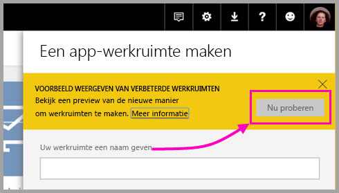
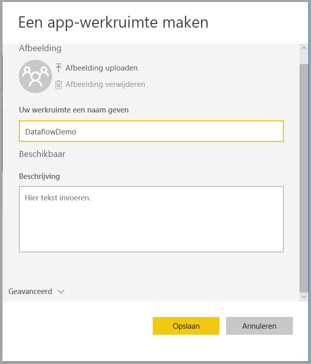
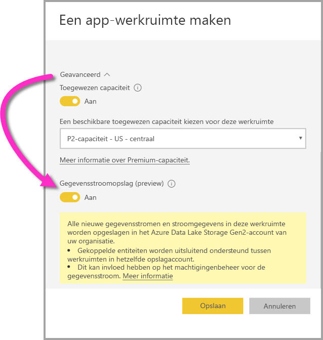
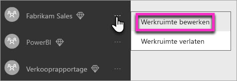
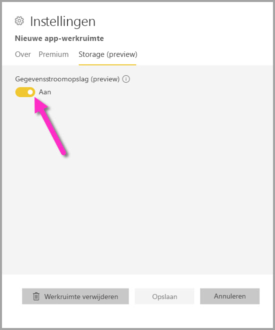
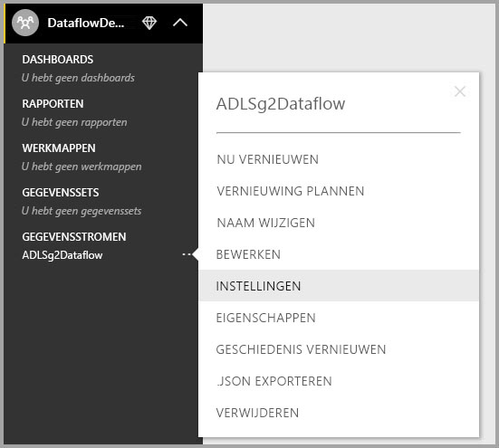
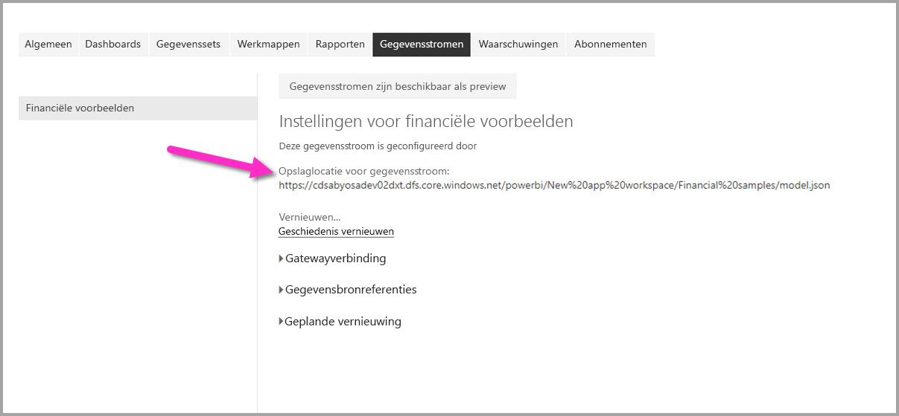

# Gegevensstroominstellingen voor werkruimten configureren (preview)

Met Power BI en gegevensstromen kunt u het definitiebestand van de gegevensstroom en de gegevensbestanden van een werkruimte opslaan in uw Azure Data Lake Storage Gen2-account. Beheerders van werkruimten kunnen hiertoe Power BI configureren. In dit artikel worden de stappen uitgelegd voor hoe u dit moet doen. 

Voordat u de opslaglocatie voor de gegevensstroom van een werkruimte kunt configureren, moet de globale beheerder van uw bedrijf het opslagaccount van uw organisatie verbinden met Power BI en de toewijzingsmachtigingen voor opslag naar dit opslagaccount activeren. * [Verbinding maken met Azure Data Lake Storage Gen2 voor gegevensstroomopslag (preview)](service-dataflows-connect-azure-data-lake-storage-gen2.md) 

Er zijn twee manieren waarop instellingen voor de opslag van de gegevensstroom van de werkruimte kunnen worden geconfigureerd: 

* Tijdens het maken van de werkruimte
* Door een bestaande werkruimte te bewerken

In de volgende secties worden beide mogelijkheden besproken. 

> [!IMPORTANT]
> De instelling voor de opslag van de gegevensstroom van de werkruimte kan alleen worden gewijzigd als de werkruimte geen gegevensstromen bevat. Deze functie is bovendien alleen beschikbaar in de nieuwe werkruimte. U kunt meer informatie vinden over de nieuwe werkruimte in het artikel [De nieuwe werkruimten (preview) maken in Power BI](service-create-the-new-workspaces.md).

## Een nieuwe werkruimte maken; de opslag van de gegevensstroom configureren

Voor het maken van een nieuwe app-werkruimte in de Power BI-service, selecteert u **Werkruimten > App-werkruimte maken**.

In het dialoogvenster App-werkruimte maken kan een geel vak worden weergegeven met de titel **Voorbeeld weergeven van verbeterde werkruimten**. Selecteer in dat gebied de optie **Nu proberen**.

In het dialoogvenster dat wordt weergegeven, kunt u de nieuwe werkruimte een unieke naam geven. Selecteer **Opslaan** nog niet, want u dient nog geavanceerde instellingen in te stellen.

Vouw vervolgens het gebied **Geavanceerd** van het dialoogvenster **App-werkruimte maken** uit. Hier kunt u de instelling **Gegevensstroomopslag (preview-versie)** inschakelen.

Selecteer **Opslaan** om de nieuwe werkruimte te maken. Het definitiebestand (het bestand Model.json) en de gegevens van een nieuwe gegevensstroom die in deze werkruimte is gemaakt, worden nu opgeslagen in het Azure Data Lake Storage Gen2-account van uw organisatie. 

> [!NOTE]
> De functionaliteit met betrekking tot gegevensstromen is in de preview-fase en is dus onderhevig aan wijzigingen en updates voordat deze algemeen beschikbaar wordt.

## Gegevensstroomopslag voor een bestaande werkruimte bijwerken

Naast het maken van een nieuwe werkruimte, kunt u een bestaande werkruimte bijwerken om hierin het definitiebestand en de gegevens in het Azure Data Lake Storage Gen2-account van uw organisatie op te slaan. Vergeet niet dat de instelling voor de opslag van de gegevensstroom alleen kan worden gewijzigd als de werkruimte niet al een gegevensstromen bevat.

Als u een app-werkruimte wilt bewerken, selecteert u achtereenvolgens het beletselteken **(...)** en **Werkruimte bewerken**. 

In het venster **Werkruimte bewerken** dat wordt weergegeven, vouwt u **Geavanceerd** uit en zet u de instelling **Gegevensstroomopslag (preview-versie)** op **Aan**. 

Selecteer vervolgens **Opslaan** en het definitiebestand en de gegevens van een nieuwe gegevensstroom die in deze werkruimte is gemaakt, worden opgeslagen in het Azure Data Lake Storage Gen2-account van uw organisatie.

## De URI van opgeslagen gegevensstroombestanden ophalen

Zodra u een gegevensstroom in een werkruimte hebt gemaakt die is toegewezen aan het Azure Data Lake-account van uw organisatie, hebt u rechtstreeks toegang tot de definitie- en gegevensbestanden. De locatie ervan is beschikbaar op de pagina  **	Gegevensstroominstellingen**. Voer de volgende stappen uit om erheen te gaan:

Selecteer het beletselteken **(...)** naast een gegevensstroom die in de werkruimte staat vermeld onder **Gegevensstromen**. Selecteer in het menu dat wordt weergegeven de optie **Instellingen**.

In de informatie die wordt weergegeven, wordt de locatie van de CDM-map van de gegevensstroom weergegeven onder **Opslaglocatie voor gegevensstroom**, zoals weergegeven in de volgende afbeelding.

> [!NOTE]
> In Power BI krijgt de eigenaar van de gegevensstroom leesrechten voor de CDM-map waarin de gegevensstroombestanden zijn opgeslagen. Als andere personen of services toegang willen krijgen tot de opslaglocatie van de gegevensstroom, moet de eigenaar van het opslagaccount toegang verlenen in Azure.

## Overwegingen en beperkingen

Bepaalde functies van de gegevensstroom worden niet ondersteund wanneer de gegevensstroomopslag zich in Azure Data Lake Storage Gen2 bevindt: 

Power BI Pro, Premium- en ingesloten werkruimten:
* De functie voor **gekoppelde entiteiten** wordt uitsluitend ondersteund voor werkruimten in hetzelfde opslagaccount
* Machtigingen voor werkruimten gelden niet voor gegevensstromen die zijn opgeslagen in Azure Data Lake Storage Gen2; alleen de eigenaar van de gegevensstroom heeft er toegang toe.
* Verder zijn alle functies voor gegevensvoorbereiding dezelfde als die voor gegevensstromen die zijn opgeslagen in de Power BI-opslag 

Er zijn ook enkele aanvullende overwegingen. Deze staan beschreven in de volgende lijst:

* Nadat een opslaglocatie voor een gegevensstroom is geconfigureerd, kan deze niet worden gewijzigd.
* Alleen de eigenaar van een gegevensstroom die is opgeslagen in Azure Data Lake Storage Gen2 heeft toegang tot de gegevens.
* On-premises gegevensbronnen, in Power BI gedeelde capaciteiten, worden niet ondersteund voor gegevensstromen die zijn opgeslagen in het Azure Data Lake Storage Gen2-account van uw organisatie.

Klanten van **Power BI Desktop** hebben geen toegang tot gegevensstromen die zijn opgeslagen in het Azure Data Lake Storage Gen2-account, tenzij ze eigenaar zijn van de gegevensstroom. Kijk eens naar de volgende situatie:

1.  Anna maakt een nieuwe app-werkruimte en configureert deze zodanig dat er gegevensstromen kunnen worden opgeslagen in de data lake van de organisatie.
2.  Ben, die ook lid is van de werkruimte die Anna heeft gemaakt, wil Power BI Desktop en de gegevensstroomconnector gebruiken om gegevens op te halen uit de gegevensstroom die Anna heeft gemaakt.
3.  Ben krijgt een foutmelding omdat hij niet als geautoriseerde gebruiker is toegevoegd aan de CDM-map van de gegevensstroom in de data lake.

    

## Volgende stappen

In dit artikel vindt u instructies voor het configureren van werkruimteopslag voor gegevensstromen. Raadpleeg de volgende artikelen voor meer informatie:

Raadpleeg de volgende artikelen voor meer informatie over gegevensstromen, CDM en Azure Data Lake Storage Gen2:

* [Integratie van gegevensstromen en Azure Data Lake (preview)](service-dataflows-azure-data-lake-integration.md)
* [Een CDM-map aan Power BI toevoegen als een gegevensstroom (preview)](service-dataflows-add-cdm-folder.md)
* [Verbinding maken met Azure Data Lake Storage Gen2 voor gegevensstroomopslag (preview)](service-dataflows-connect-azure-data-lake-storage-gen2.md)

Raadpleeg de volgende artikelen voor algemene informatie over gegevensstromen:

* [Gegevensstromen maken en gebruiken in Power BI](service-dataflows-create-use.md)
* [Berekende entiteiten gebruiken in Power BI Premium (preview)](service-dataflows-computed-entities-premium.md)
* [Gegevensstromen gebruiken met on-premises gegevensbronnen (preview)](service-dataflows-on-premises-gateways.md)
* [Resources voor ontwikkelaars voor Power BI-gegevensstromen (preview)](service-dataflows-developer-resources.md)

Raadpleeg de volgende artikelen voor informatie over Azure-opslag:

* [Azure Storage-beveiligingshandleiding](https://docs.microsoft.com/azure/storage/common/storage-security-guide)
* [Aan de slag met GitHub-voorbeelden uit Azure Data Services](https://aka.ms/cdmadstutorial)

U kunt het overzichtsartikel lezen voor meer informatie over Common Data Model:

* [Overzicht van Common Data Model](https://docs.microsoft.com/powerapps/common-data-model/overview)
* [CDM-mappen](https://go.microsoft.com/fwlink/?linkid=2045304)
* [Bestandsdefinitie van CDM-model](https://go.microsoft.com/fwlink/?linkid=2045521)

U kunt altijd [vragen stellen in de Power BI-community](http://community.powerbi.com/).
