# Gegevensstromen maken en gebruiken in Power BI (Preview)

Met de hulpmiddelen voor geavanceerde gegevensvoorbereiding van **Power BI** kunt u een verzameling gegevens samenstellen die een gegevensstroom wordt genoemd. Deze stroom kunt u vervolgens gebruiken om verbinding te maken met zakelijke gegevens uit verschillende bronnen, de gegevens op te schonen, te transformeren en te laden in Power BI-opslag.

Een **gegevensstroom** is een verzameling *entiteiten* (entiteiten zijn vergelijkbaar met tabellen) die worden gemaakt en beheerd in app-werkruimten in de Power BI-service. U kunt rechtstreeks vanuit de werkruimte waarin de gegevensstroom is gemaakt entiteiten toevoegen en bewerken, maar ook schema's voor gegevensvernieuwing beheren.

Als u een gegevensstroom hebt gemaakt, kunt u **Power BI Desktop** en de **Power BI-service** gebruiken om gegevenssets, rapporten, dashboards en apps te maken die zijn gebaseerd op de gegevens die u in gegevensstromen van Power BI plaatst, om zo inzicht in uw zakelijke activiteiten te krijgen.

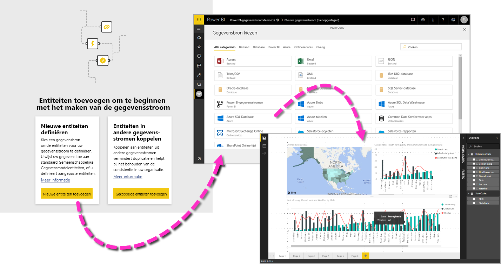

Er zijn drie primaire stappen voor het gebruik van een gegevensstroom:

1. De gegevensstroom samenstellen, met behulp van Microsoft-programma's die hier speciaal voor zijn ontworpen
2. De vernieuwingsfrequentie plannen van de gegevens die u wilt gebruiken in de gegevensstroom
3. De gegevensset maken met behulp van de gegevensstroom, met Power BI Desktop 

In de volgende gedeelten kijken we naar elk van deze stappen en met name de hulpprogramma's die nodig zijn om elke stap te voltooien. Laten we aan de slag gaan.

> [!NOTE]
> De functionaliteit met betrekking tot gegevensstromen is in de preview-fase en is dus onderhevig aan wijzigingen en updates voordat deze algemeen beschikbaar wordt.

## Een gegevensstroom maken
Als u een gegevensstroom wilt maken, start u de Power BI-service in een browser en selecteert u in het navigatiedeelvenster aan de linkerkant een **app-werkruimte** (gegevensstromen zijn niet beschikbaar in *Mijn werkruimte* in de Power BI-service). Zie het onderstaande scherm voor meer informatie. U kunt ook een nieuwe werkruimte maken, waarin u dan een nieuwe gegevensstroom maakt. 

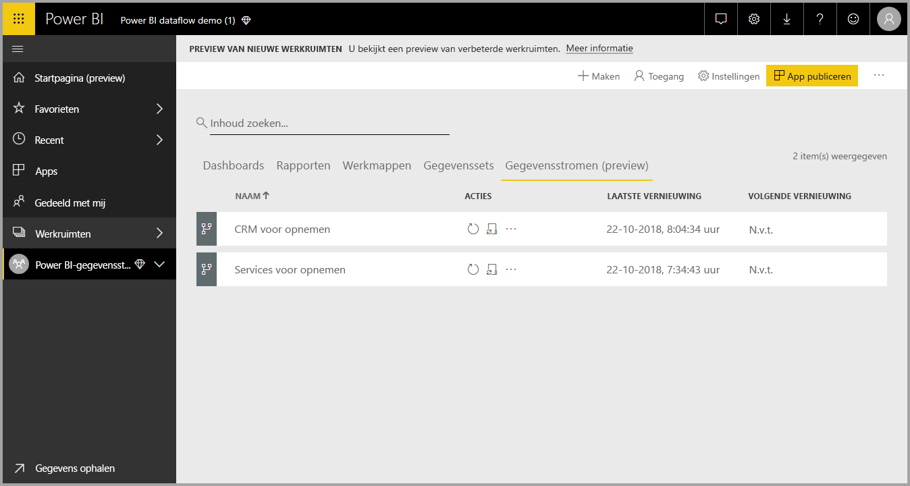

Als u zich in een gebied van een **app-werkruimte** bevindt waar u een gegevensstroom kunt maken, ziet u de knop **+ Maken** in de rechterbovenhoek van het canvas. Selecteer de knop **+ Maken** knop en selecteer vervolgens **Gegevensstroom** in de vervolgkeuzelijst. 

Het is belangrijk om te weten dat er altijd maar *één eigenaar* kan zijn van een gegevensstroom, en dat is de persoon die de stroom maakt. Alleen de eigenaar kan de gegevensstroom bewerken. Alle leden van de **app-werkruimte** die lees- of schrijfmachtigingen hebben voor de app-werkruimte waarin de gegevensstroom wordt gemaakt, kunnen vanuit **Power BI Desktop** verbinding maken met de gegevensstroom. Dit wordt verderop in dit artikel beschreven.

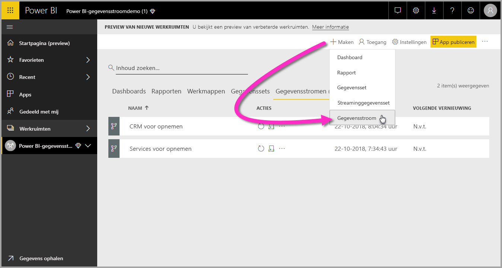

U kunt nu **entiteiten** gaan toevoegen, die we in het volgende gedeelte in meer detail gaan beschrijven.

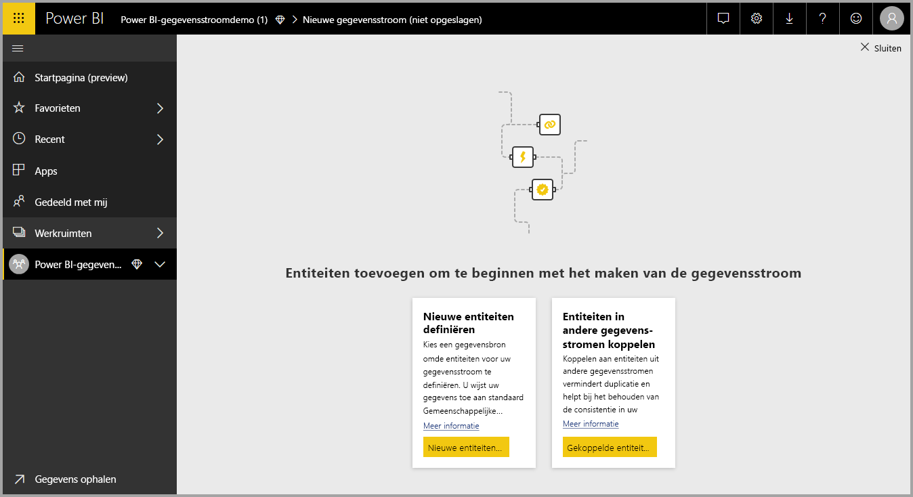

### Entiteiten toevoegen

Een **entiteit** is een set velden die worden gebruikt voor het opslaan van gegevens, vergelijkbaar met een tabel in een database. In de volgende afbeelding ziet u de selectie van gegevensbronnen waaruit u gegevens kunt overbrengen naar Power BI.

Wanneer u een gegevensbron selecteert, wordt u gevraagd de verbindingsinstellingen op te geven, met inbegrip van het account dat moet worden gebruikt bij het maken van verbinding met de gegevensbron, zoals wordt weergegeven in de volgende afbeelding.

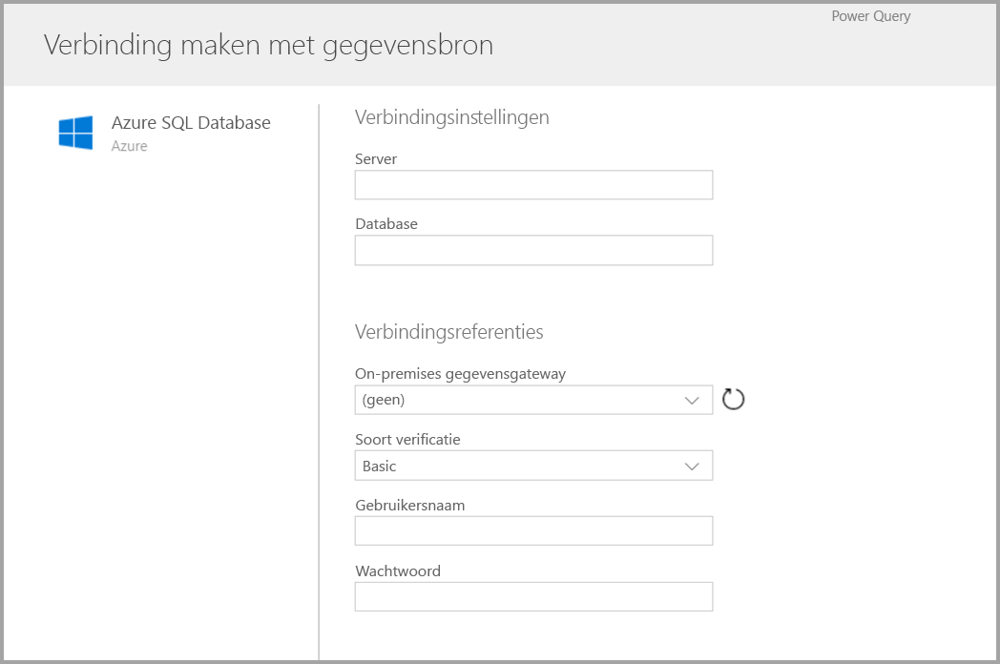

Als er eenmaal verbinding is, kunt u aangeven welke gegevens u wilt gebruiken voor uw entiteit. Als u gegevens en een bron kiest, maakt Power BI daarna opnieuw verbinding met de gegevensbron om de gegevens in de gegevensstroom actueel te houden. Hiervoor wordt de frequentie gehanteerd die u later in het configuratieproces selecteert.

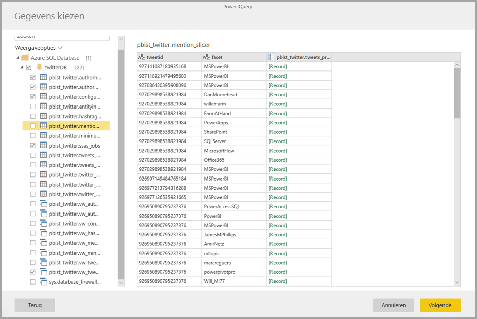

Als u de gegevens hebt geselecteerd die u wilt gebruiken in de entiteit, kunt u de gegevensstroomeditor gebruiken om die gegevens vorm te geven of te transformeren naar de indeling die noodzakelijk is voor gebruik in uw gegevensstroom.

### De gegevensstroomeditor gebruiken

Wanneer u de gegevens hebt geselecteerd in de bron die moeten worden gebruikt voor uw entiteit, kunt u de gegevensselectie de indeling geven die het meest geschikt is voor uw entiteit. Dit kan met behulp van een Power Query-bewerkingservaring die vergelijkbaar is met de **Power Query-editor** in  **Power BI Desktop**. Meer informatie over Power Query (Power Query is opgenomen in Power BI Desktop als de Power Query-editor) kunt u lezen in het artikel [Queryoverzicht in Power BI Desktop](desktop-query-overview.md). 

Als u de code wilt weergeven die bij elke stap in Query-Editor wordt gemaakt, of uw eigen vormgevingscode wilt maken, kunt u de **geavanceerde editor** gebruiken. 

### Gegevensstromen en CDM (Common Data Model)

Gegevensstroomentiteiten bevatten nieuwe hulpmiddelen waarmee u uw zakelijke gegevens eenvoudig kunt toewijzen aan het Common Data Model (het gestandaardiseerde schema van Microsoft), het model kunt verrijken met gegevens van Microsoft en derden en zo op een vereenvoudigde manier toegang kunt krijgen tot machine learning. Deze nieuwe mogelijkheden kunnen worden gebruikt om intelligente en toepasbare inzichten te bieden van uw zakelijke gegevens. Nadat u eventuele transformaties hebt voltooid in de stap Query's bewerken, kunt u kolommen uit de gegevensbrontabellen toewijzen aan velden van standaardentiteiten zoals gedefinieerd door het Common Data Model. Standaardentiteiten hebben een bekend schema dat is gedefinieerd door het Common Data Model.

Meer informatie over deze benadering en over het Common Data Model vindt u in het artikel [Wat is het Common Data Model?](https://docs.microsoft.com/powerapps/common-data-model/overview)

Als u het Common Data Model wilt gebruiken met uw gegevensstroom, klikt u op de transformatie **Toewijzen aan standaardentiteit** in het dialoogvenster **Query's bewerken**. In het scherm **Entiteiten toewijzen** dat verschijnt, kunt u de standaardentiteit selecteren waaraan u wilt toewijzen.

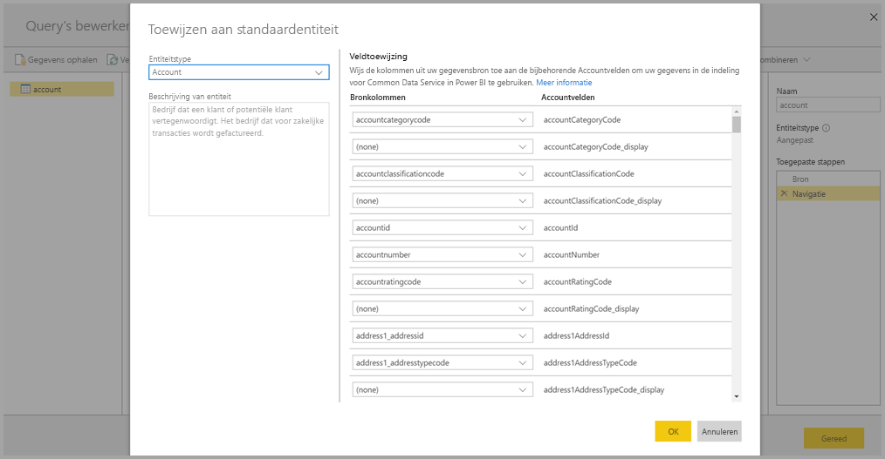

Wanneer u een bronkolom aan een standaardveld toewijst, gebeurt het volgende:

1. De bronkolom krijgt de naam van het standaardveld (de naam van de kolom wordt gewijzigd als de namen verschillen)
2. De bronkolom krijgt het gegevenstype van het standaardveld

Om de standaardentiteit van Common Data Model te behouden, krijgen alle standaardvelden die niet zijn toegewezen *Null*-waarden.

Alle bronkolommen die niet zijn toegewezen, blijven ongewijzigd, om ervoor te zorgen dat het resultaat van de toewijzing een standaardentiteit met aangepaste velden is.

Als u klaar bent met de selecties en de entiteit en de bijbehorende gegevensinstellingen klaar zijn om te worden opgeslagen, selecteert u **Opslaan** in het menu. U kunt meerdere entiteiten maken door de knop **Entiteiten toevoegen** te selecteren. U kunt entiteiten bewerken om de query's en entiteiten die u hebt gemaakt te verfijnen.

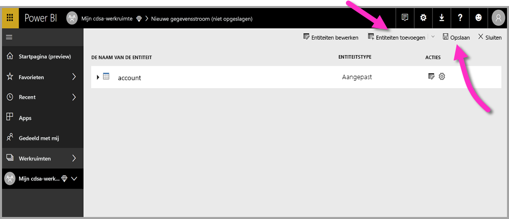

Wanneer u **Opslaan** selecteert, wordt u gevraagd om een naam en beschrijving voor uw gegevensstroom.

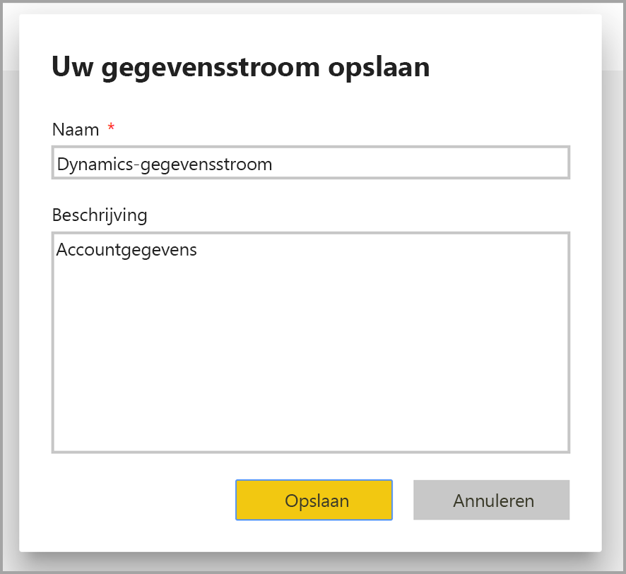

Wanneer u klaar bent en de knop **Opslaan** selecteert, verschijnt er een venster met de mededeling dat uw **gegevensstroom** is gemaakt. 

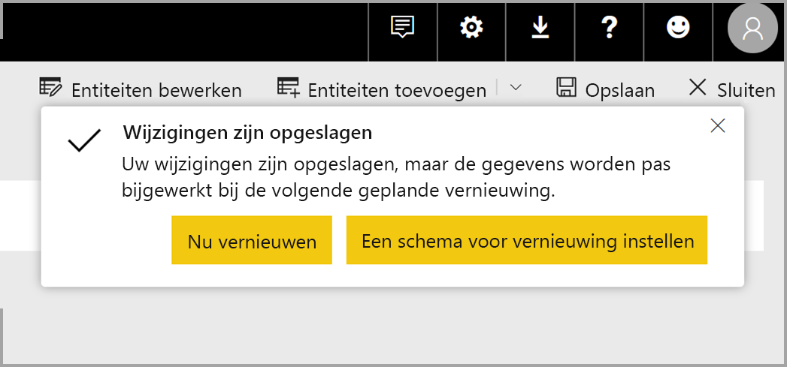

U bent nu klaar voor de volgende stap, het plannen van de vernieuwingsfrequentie voor uw gegevensbronnen.

## De vernieuwingsfrequentie plannen

Als de gegevensstroom is opgeslagen, moet u voor elk van de verbonden gegevensbronnen de vernieuwingsfrequentie plannen.

Power BI-gegevensstromen gebruiken het proces voor het vernieuwen van gegevens van Power BI om uw gegevens up-to-date te houden. In de **Power BI-service**, in het gedeelte **App-werkruimte**, vindt u een aantal gebieden waar uw gegevens kunnen worden weergegeven, met inbegrip van gegevensstromen, zoals u kunt zien in de volgende afbeelding.

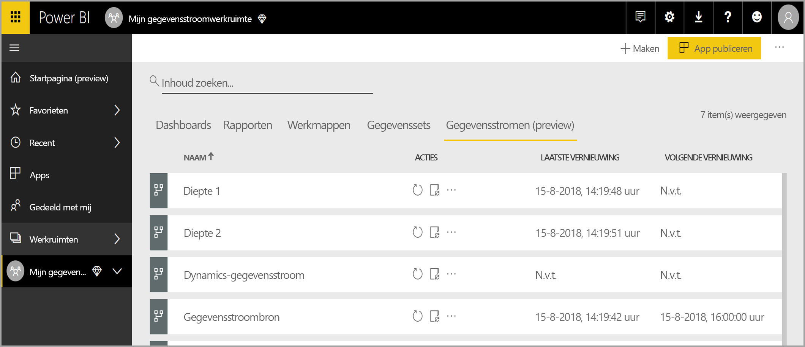

De vermelding *Dynamics Dataflow* in de bovenstaande afbeelding is de gegevensstroom die we in het vorige gedeelte hebben gemaakt. Als u de vernieuwing van de gegevens wilt plannen, selecteert u het pictogram **Vernieuwen plannen**, onder het gedeelte **Acties**, zoals wordt weergegeven in de volgende afbeelding. 

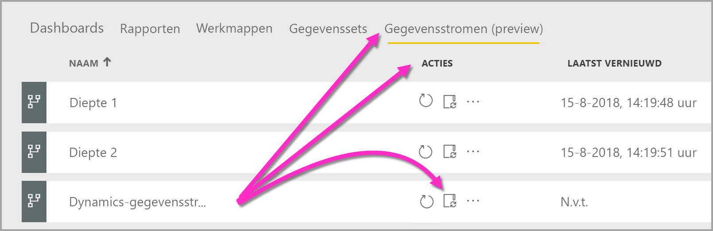

Wanneer u het pictogram **Vernieuwen plannen** selecteert, komt u in het gelijknamige deelvenster **,** waar u de vernieuwingsfrequentie en -tijd van de gegevensstroom kunt instellen.

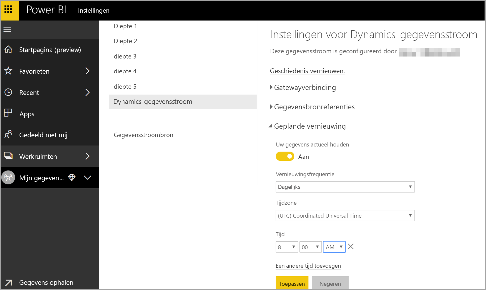

Zie het artikel over het [configureren van geplande vernieuwing](refresh-scheduled-refresh.md) voor meer informatie over het plannen van het vernieuwen van gegevens. Hierin wordt onder andere het vernieuwingsgedrag van Power BI-gegevenssets beschreven. Voor wat betreft vernieuwingsinstellingen hebben gegevensstromen hetzelfde gedrag als Power BI-gegevenssets. 

## Verbinding met uw gegevensstroom maken in Power BI Desktop

Nadat u de gegevensstroom hebt gemaakt en de vernieuwingsfrequentie hebt gepland voor elke gegevensbron die het model gaat vullen, bent u klaar voor de derde en laatste stap: verbinding maken met uw gegevensstroom vanuit **Power BI Desktop**. 

Om verbinding te maken met de gegevensstroom, selecteert u **Gegevens ophalen > Power BI > Power BI-gegevensstromen (bètaversie)**, zoals wordt weergegeven in de volgende afbeelding.

Van daaruit gaat u naar de **app-werkruimte** waarin u de gegevensstroom hebt opgeslagen, selecteert u de gegevensstroom en selecteert u vervolgens de entiteiten die u hebt gemaakt in de lijst.

U kunt ook de **zoekbalk** bovenaan het venster gebruiken om snel de naam van de gegevensstroom of entiteiten te vinden als u anders door een groot aantal gegevensstroomentiteiten moet bladeren.

Wanneer u de entiteit selecteert en vervolgens de knop **Laden** selecteert, worden de entiteiten weergegeven in het deelvenster **Velden** in **Power BI Desktop**, en gedragen deze zich zoals **tabellen** uit iedere andere gegevensset.

## Problemen met gegevensverbindingen oplossen

Er kunnen zich situaties voordoen waarin er problemen optreden wanneer u verbinding gaat maken met gegevensbronnen voor gegevensstromen. In dit gedeelte vindt u tips voor het oplossen van dergelijke problemen. 

* **SalesForce-connector**: als u een proefaccount van Salesforce gebruikt met gegevensstromen treedt er een verbindingsfout op, zonder dat er informatie over de oorzaak wordt vermeld. U kunt dit probleem oplossen door een productie-account van Salesforce te gebruiken voor testdoeleinden.

* **SharePoint-connector**: zorg ervoor dat u het adres van de hoofdmap van de SharePoint-site opgeeft, dus zonder submappen of documenten. Gebruik bijvoorbeeld een koppeling zoals deze: https://microsoft.sharepoint.com/teams/ObjectModel/ 

## Volgende stappen

In dit artikel wordt beschreven hoe u uw eigen **gegevensstroom** kunt maken, evenals een gegevensset en rapport in **Power BI Desktop**, om hier uw voordeel mee te doen. De volgende artikelen zijn nuttig voor aanvullende informatie en scenario's bij het gebruik van gegevensstromen:

* [Self-service data prep with dataflows](service-dataflows-overview.md) (Selfservice voor gegevensvoorbereiding met gegevensstromen)
* [Berekende entiteiten gebruiken in Power BI Premium (preview)](service-dataflows-computed-entities-premium.md)
* [Gegevensstromen gebruiken met on-premises gegevensbronnen (preview)](service-dataflows-on-premises-gateways.md)
* [Resources voor ontwikkelaars voor Power BI-gegevensstromen (preview)](service-dataflows-developer-resources.md)

U kunt het overzichtsartikel lezen voor meer informatie over Common Data Model:
* [Overzicht van Common Data Model](https://docs.microsoft.com/powerapps/common-data-model/overview)
* [Meer informatie over het Common Data Model-schema en entiteiten op GitHub](https://github.com/Microsoft/CDM) (Engelstalig)

Gerelateerde artikelen over Power BI Desktop:

* [Verbinding maken met gegevenssets in de Power BI-service vanuit Power BI Desktop](desktop-report-lifecycle-datasets.md)
* [Queryoverzicht in Power BI Desktop](desktop-query-overview.md)

Gerelateerde artikelen over de Power BI-service:
* [Geplande vernieuwing configureren](refresh-scheduled-refresh.md)
