# Verbinding maken met gegevensbronnen voor Power BI-gegevensstromen (preview)

Met Power BI-gegevensstromen kunt u verbinding maken met tal van verschillende gegevensbronnen om nieuwe gegevensstromen te maken of om nieuwe entiteiten aan een bestaande gegevensstroom toe te voegen.

In dit artikel staan de vele beschikbare gegevensbronnen voor het maken van of toevoegen aan gegevensstromen en wordt beschreven hoe u die gegevensstromen kunt maken met behulp van deze gegevensbronnen.

Raadpleeg [Gegevensstromen maken en gebruiken in Power BI (preview)](service-dataflows-create-use.md) voor een overzicht van de instructies voor het maken en gebruiken van gegevensstromen.

## Een gegevensstroom maken op basis van een gegevensbron

Als u verbinding wilt maken met gegevens, selecteert u in de **Power BI-service** het menu-item **+ Maken** en kiest u **Gegevensstroom** in het menu dat wordt weergegeven. Indien geselecteerd, wordt de volgende afbeelding weergegeven op het canvas van de Power BI-service. 

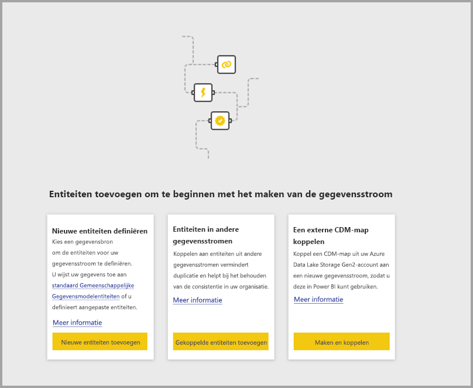

Als uw gegevensstroom al bestaat, kunt u nieuwe entiteiten aan uw gegevensstroom toevoegen door **Entiteiten toevoegen** (zie onder) te selecteren of door **Gegevens ophalen** in het bewerkingsprogramma voor gegevensstromen te selecteren.

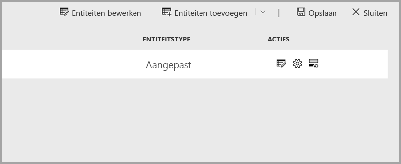

De volgende afbeelding toont de knop **Gegevens ophalen** in het bewerkingsprogramma voor gegevensstromen. 

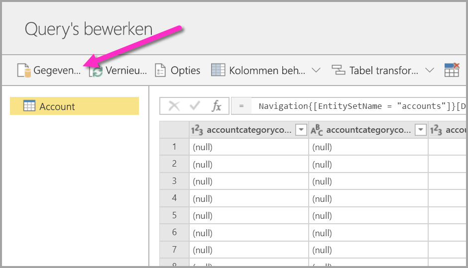

## Gegevensbronnen voor gegevensstromen

U kunt de beschikbare gegevensbronnen bekijken door **Gegevens ophalen** te selecteren in het bewerkingsprogramma voor gegevensstromen. Vervolgens wordt een dialoogvenster voor het selecteren van de categorieën en elke gegevensbron weergegeven (zie onderstaande afbeelding).

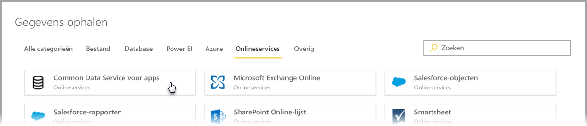

Gegevensbronnen voor gegevensstromen worden georganiseerd in de volgende categorieën, die bovenaan het dialoogvenster **Gegevens ophalen** worden weergegeven:

* Alle categorieën
* Bestand
* Database
* Power BI
* Azure
* Onlineservices
* Overig

De categorie **Alle categorieën** bevat alle gegevensbronnen uit alle categorieën. 

De categorie **Bestand** bevat de volgende beschikbare gegevensverbindingen voor gegevensstromen:

* Access
* Excel
* JSON
* Tekst/CSV
* XML

De categorie **Database** bevat de volgende beschikbare gegevensverbindingen voor gegevensstromen:

* IBM DB2-database
* MySQL-database
* Oracle-database
* PostgreSQL-database
* SQL Server-database
* Sybase-database
* Teradata-database
* Vertica

De categorie **Power BI** bevat de volgende beschikbare gegevensverbindingen voor gegevensstromen:

* Power BI-gegevensstromen

De categorie **Azure** bevat de volgende beschikbare gegevensverbindingen voor gegevensstromen:

* Azure Blobs
* Azure Data Explorer
* Azure SQL Data Warehouse
* Azure SQL Database
* Azure-tabellen

De **Online Services** bevatten de volgende beschikbare gegevensverbindingen voor gegevensstromen:

* Amazon Redshift
* Common Data Service voor apps
* Microsoft Exchange Online
* Salesforce-objecten
* Salesforce-rapporten
* SharePoint Online-lijst
* Smartsheet

De categorie **Overig** bevat de volgende beschikbare gegevensverbindingen voor gegevensstromen:

* Active Directory
* OData
* SharePoint-lijst
* Web-API
* Webpagina
* Lege tabel
* Lege query

## Verbinding maken met een gegevensbron

Als u verbinding wilt maken met een gegevensbron, selecteert u de gegevensbron. We gebruiken één voorbeeld om te laten zien hoe het proces werkt, maar elke gegevensverbinding voor gegevensstromen is vergelijkbaar. Voor verschillende connectors kunnen specifieke referenties of andere gegevens zijn vereist, maar de stroom is vergelijkbaar. In ons voorbeeld ziet u in de volgende afbeelding dat **Common Data Service voor apps** is geselecteerd in de gegevensverbindingscategorie **Onlineservices**.

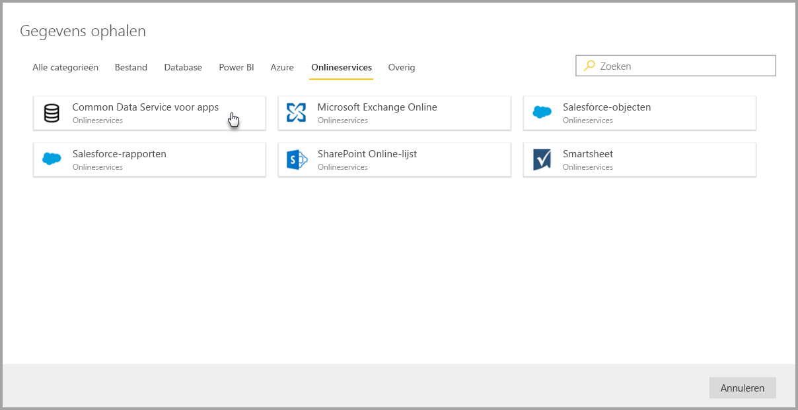

Er wordt een verbindingsvenster voor de geselecteerde gegevensverbinding weergegeven. Als er referenties zijn vereist, wordt u gevraagd ze op te geven. De volgende afbeelding toont een server-URL die wordt ingevoerd om verbinding te maken met een Common Data Service for Apps-server.

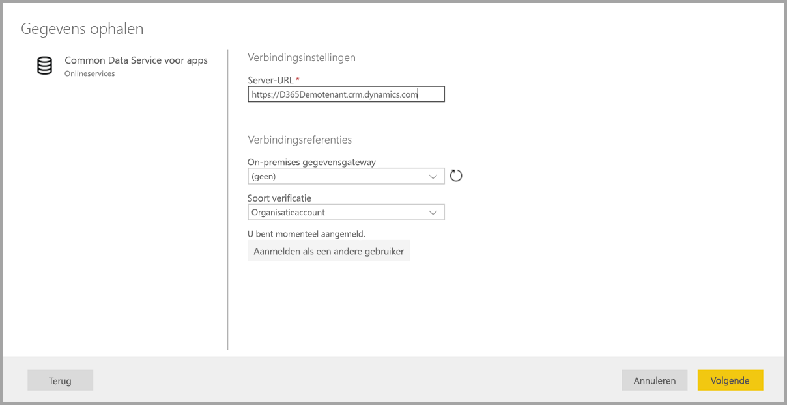

Zodra de server-URL of informatie over de resourceverbinding is opgegeven, selecteert u **Aanmelden** om de referenties in te voeren die moeten worden gebruikt voor toegang tot de gegevens. Selecteer daarna **Volgende**.

Met **Power Query Online** wordt de verbinding met de gegevensbron geïnitieerd en tot stand gebracht. Vervolgens worden de beschikbare tabellen van die gegevensbron in het venster **Navigator** getoond (zie de volgende afbeelding).

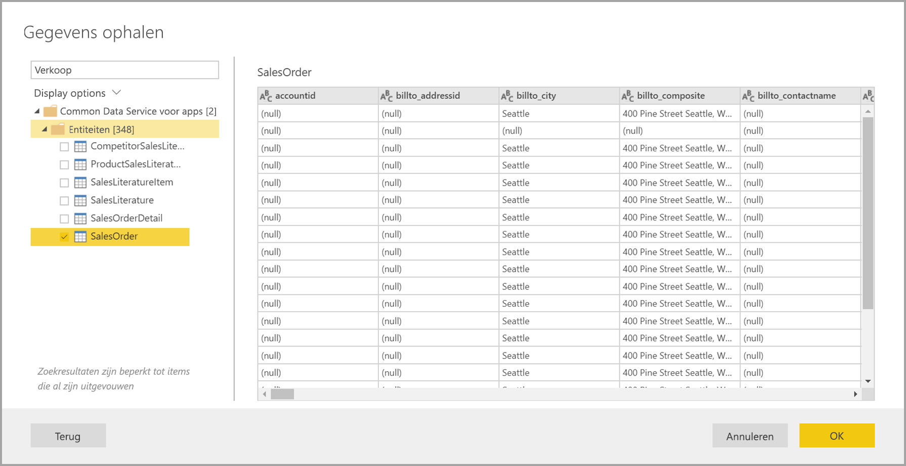

U kunt tabellen en gegevens selecteren die moeten worden geladen, door het selectievakje naast elk element in het linkerdeelvenster in te schakelen. Kies **OK** onder in het deelvenster **Navigator** om de gegevens te laden. Er wordt Power Query Online-dialoogvenster weergegeven waarin u query’s kunt bewerken en eventuele andere wijzigingen kunt doorvoeren die u wilt uitvoeren op de geselecteerde gegevens.

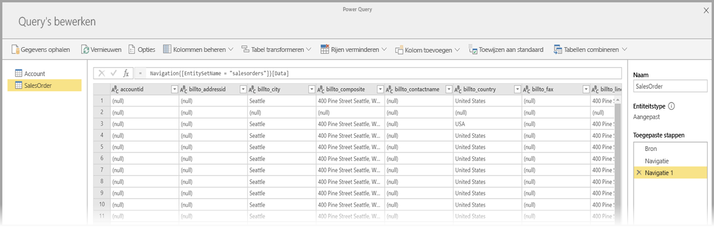

Zo eenvoudig werkt dat. Andere gegevensbronnen hebben vergelijkbare stromen en gebruiken Power Query Online om de gegevens die u in uw gegevensstroom invoert te bewerken en te transformeren.

## Verbinding maken met aanvullende gegevensbronnen

Er zijn aanvullende gegevensconnectors die niet worden weergegeven in de gebruikersinterface van de Power BI-gegevensstromen. Deze worden echter wel ondersteund door een aantal aanvullende stappen uit te voeren. 

U kunt de volgende stappen uitvoeren om een verbinding tot stand te brengen met een connector die niet wordt weergegeven in de gebruikersinterface:

1. Open **Power BI Desktop** en selecteer **Gegevens ophalen**.
2. Open **Power Query Editor** in Power BI Desktop, klik met de rechtermuisknop op de relevante query en open de **Advanced Editor** (zie de volgende afbeelding). Van daaruit kunt u het M-script kopiëren dat in de Advanced Editor wordt weergegeven.

    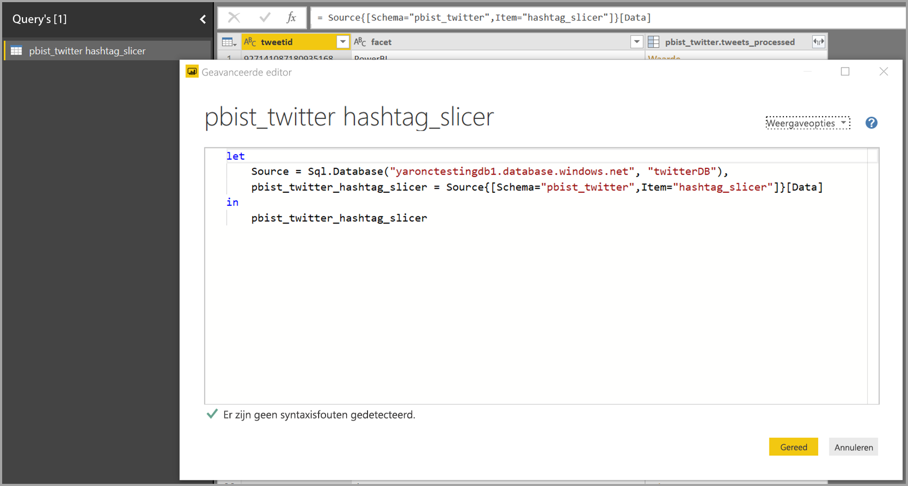 

3. Open de Power BI-gegevensstroom en selecteer **Gegevens ophalen** voor een lege query (zie de volgende afbeelding).

    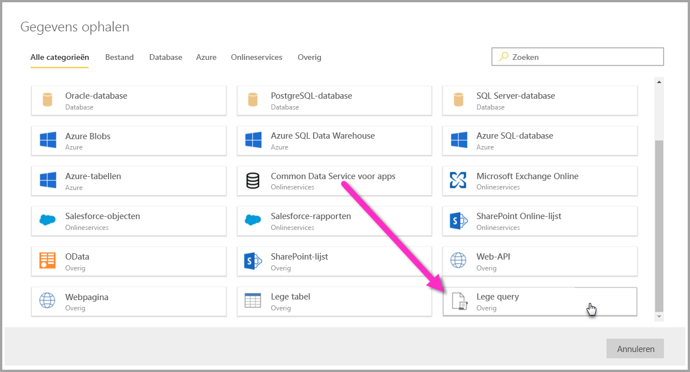 

4. Plak de gekopieerde query in de lege query voor de gegevensstroom.

    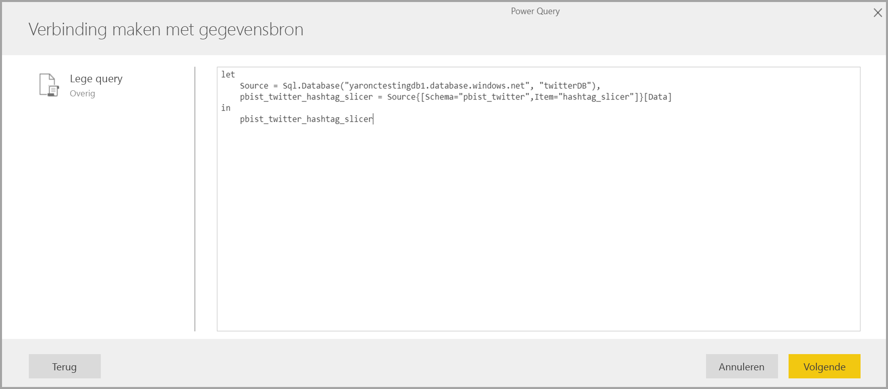 

Vervolgens maakt uw script verbinding met de gegevensbron die u hebt opgegeven. 

De volgende lijst toont welke connectors u momenteel kunt gebruiken door de M-query naar een lege query te kopiëren en te plakken:

* SAP Business Warehouse 
* Azure Analysis Services
* Adobe Analytics
* ODBC
* OLE DB
* Map
* SharePoint Online-map
* SharePoint-map
* Hadoop HDFS
* Azure HDInsight (HDFS)
* Hadoop-bestand HDFS
* Informix (bèta)

Dat is alles wat u hoeft te weten om verbinding te maken met gegevensbronnen in Power BI-gegevensstromen.

## Volgende stappen

In dit artikel hebt u geleerd met welke gegevensbronnen u verbinding kunt maken voor gegevensstromen. In de volgende artikelen wordt dieper ingegaan op veelvoorkomende gebruiksmogelijkheden van gegevensstromen. 

* [Selfservice voor gegevensvoorbereiding in Power BI (preview)](service-dataflows-overview.md)
* [Gegevensstromen maken en gebruiken in Power BI](service-dataflows-create-use.md)
* [Berekende entiteiten gebruiken in Power BI Premium (preview)](service-dataflows-computed-entities-premium.md)
* [Gegevensstromen gebruiken met on-premises gegevensbronnen (preview)](service-dataflows-on-premises-gateways.md)
* [Resources voor ontwikkelaars voor Power BI-gegevensstromen (preview)](service-dataflows-developer-resources.md)
* [Integratie van gegevensstromen en Azure Data Lake (preview)](service-dataflows-azure-data-lake-integration.md)

U kunt de volgende artikelen lezen voor meer informatie over Power Query en geplande vernieuwing:
* [Queryoverzicht in Power BI Desktop](desktop-query-overview.md)
* [Geplande vernieuwing configureren](refresh-scheduled-refresh.md)

U kunt het overzichtsartikel lezen voor meer informatie over Common Data Model:
* [Overzicht van Common Data Model](https://docs.microsoft.com/powerapps/common-data-model/overview)

