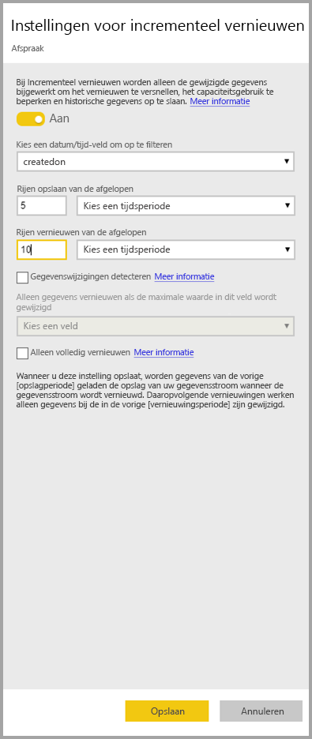
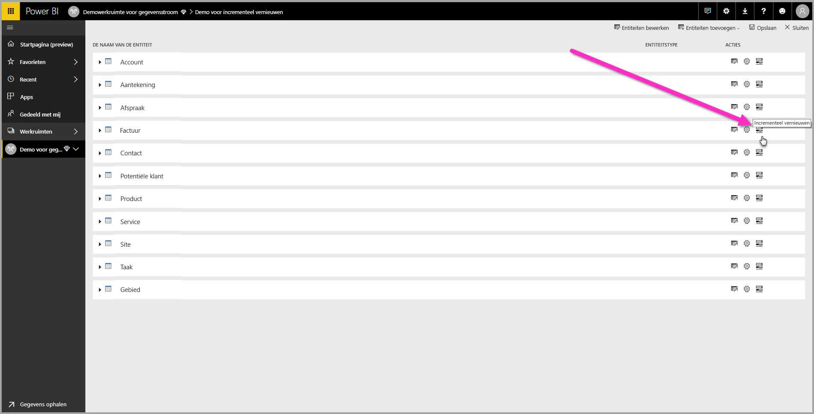
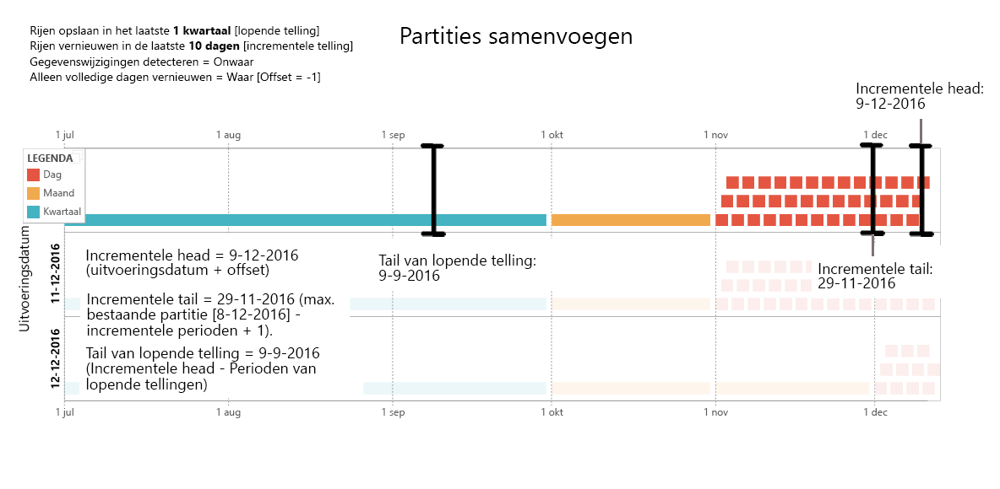
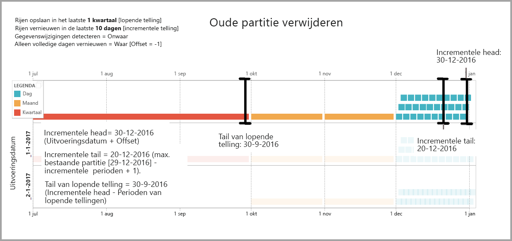
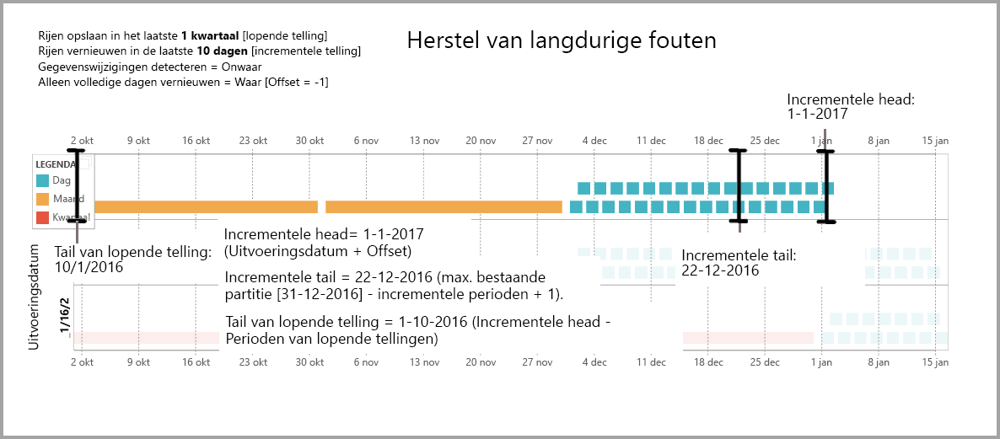

# Incrementeel vernieuwen gebruiken met Power BI-gegevensstromen (preview)

Met behulp van gegevensstromen kunt u grote hoeveelheden gegevens in Power BI gebruiken om overtuigende rapporten en analyses te maken. In sommige gevallen is het echter niet praktisch een volledige kopie van alle brongegevens bij elke vernieuwing bij te werken. Een goed alternatief is **incrementeel vernieuwen**, dat de volgende voordelen voor gegevensstromen biedt:

* **Vernieuwen gaat sneller**: alleen gegevens die zijn gewijzigd, hoeven te worden vernieuwd. Vernieuw bijvoorbeeld alleen de laatste vijf dagen van een gegevensstroom van tien jaar.
* **Vernieuwen is betrouwbaarder**: het is bijvoorbeeld niet nodig om langdurige verbindingen met vluchtige bronsystemen te onderhouden.
* **Verbruik van resources is lager**: als er minder gegevens zijn om te vernieuwen, wordt het algemene verbruik van geheugen en andere resources verlaagd.

Met incrementeel vernieuwen voor Power BI-gegevensstromen moet de werkruimte waarin zich de gegevensstroom bevindt, in [Premium-capaciteit](service-premium.md) zijn om te worden uitgevoerd, en de gegevensbron die in de gegevensstroom is opgenomen, moet een veld *Datum/tijd* hebben waarop voor incrementeel vernieuwen kan worden gefilterd. 

## Incrementeel vernieuwen voor gegevensstromen configureren

Een gegevensstroom kan veel entiteiten bevatten. Incrementeel vernieuwen wordt ingesteld op entiteitsniveau, zodat één gegevensstroom zowel volledig vernieuwde als incrementeel vernieuwde entiteiten kan bevatten.

Als u een incrementeel vernieuwde entiteit wilt instellen, configureert u eerst uw entiteit zoals u dat met elke andere entiteit zou doen. Zie [Self-service data prep in Power BI (Preview)](service-dataflows-overview.md) (Selfservice voor gegevensvoorbereiding in Power BI (preview)) voor meer informatie over het instellen van gegevensstromen.

Als de gegevensstroom is gemaakt en opgeslagen, selecteert u het pictogram **incrementeel vernieuwen** in de entiteitsweergave, zoals u in de volgende afbeelding kunt zien:

Als u op het pictogram klikt, verschijnt het venster **Instellingen voor incrementeel vernieuwen**. Als u de schuifregelaar op **Aan** instelt, kunt u incrementeel vernieuwen configureren.

In de volgende lijst worden de instellingen in het venster **Instellingen voor incrementeel vernieuwen** uitgelegd. 

1. **Wisselknop om incrementeel vernieuwen in of uit te schakelen**: met deze schuifregelaar kunt u beleid voor incrementeel vernieuwen voor de hele entiteit in of uitschakelen
2. **Vervolgkeuzelijst met te filteren velden**: hiermee selecteert u het queryveld waarop de entiteit voor toenames moet worden gefilterd. Dit veld bevat alleen *Datum/tijd*-velden. U kunt incrementeel vernieuwen niet gebruiken als uw entiteit geen veld *Datum/tijd* bevat.
3. **Rijen opslaan van de afgelopen**: in het volgende voorbeeld worden de volgende instellingen uitgelegd.

    In dit voorbeeld wordt een vernieuwingsbeleid gedefinieerd voor het opslaan van in totaal vijf jaar aan gegevens, met incrementele vernieuwing van tien dagen aan gegevens. Als de entiteit dagelijks wordt vernieuwd, wordt het volgende uitgevoerd voor elke vernieuwingsbewerking:

    * Voeg een nieuwe dag aan gegevens toe.
    * Vernieuw tien dagen tot aan de huidige datum.
    * Verwijder kalenderjaren die ouder zijn dan vijf jaar voorafgaand aan de huidige datum. Als de huidige datum bijvoorbeeld 1 januari 2019 is, wordt het jaar 2013 verwijderd.

    De eerste vernieuwing van een gegevensstroom kan enige tijd in beslag nemen omdat alle vijf jaren moeten worden geïmporteerd, maar de volgende vernieuwingen worden waarschijnlijk in een fractie van deze initiële periode uitgevoerd.

4. **Gegevenswijzigingen detecteren**: het incrementeel vernieuwen van tien dagen is veel efficiënter dan een volledige vernieuwing van vijf jaar, maar het kan nog beter. Als u het selectievakje **Gegevenswijzigingen detecteren** inschakelt, kunt u een Datum/tijd-kolom selecteren om alleen die dagen te identificeren en vernieuwen waarvoor gegevens zijn gewijzigd. Hierbij wordt ervan uitgegaan dat een dergelijke kolom in het bronsysteem bestaat, wat gebruikelijk is voor controledoeleinden. De maximumwaarde van deze kolom wordt geëvalueerd voor elke periode in het incrementele bereik. Als die gegevens nog niet zijn gewijzigd sinds de laatste vernieuwing, hoeft u de periode niet te vernieuwen. In het voorbeeld kan hiermee het aantal dagen dat wordt vernieuwd nog eens verder worden beperkt van tien tot misschien twee dagen.

> [!TIP]
> Voor het huidige ontwerp moet de kolom die gegevenswijzigingen detecteert persistent zijn en in het cachegeheugen worden geplaatst. U kunt overwegen een van de volgende technieken te gebruiken om de kardinaliteit en het geheugenverbruik te beperken:
>
>    * Behoud alleen de maximumwaarde van deze kolom op het moment van de vernieuwing, bijvoorbeeld met behulp van een Power Query-functie.
>    * Beperk de nauwkeurigheid naar een niveau dat acceptabel is gezien uw vereisten voor de vernieuwingsfrequentie.

5. **Alleen volledige perioden vernieuwen**: stel dat de vernieuwing gepland staat voor elke ochtend om vier uur. Als er die eerste vier uur van die dag gegevens in het bronsysteem worden weergegeven, wilt u mogelijk dat hier geen rekening mee wordt gehouden. Voor sommige metrische bedrijfsgegevens, zoals het aantal vaten per dag in de olie- en gasindustrie, is het niet praktisch of zinnig dat hiermee rekening wordt gehouden op basis van een deel van de dag.

    Een ander voorbeeld waarbij alleen het vernieuwen van volledige perioden passend is, is het vernieuwen van gegevens van een financieel systeem. Bijvoorbeeld een financieel systeem waar gegevens voor de vorige maand op de twaalfde kalenderdag van de maand worden goedgekeurd. U kunt het incrementele bereik instellen op 1 maand en de vernieuwing plannen op de twaalfde dag van de maand. Als deze optie is aangevinkt, worden de gegevens van januari (de recentste, volledige periode van een maand) vernieuwd op 12 februari.

> [!NOTE]
> Incrementeel vernieuwen voor gegevensstromen stelt datums vast op basis van de volgende logica: als er een vernieuwing wordt gepland, maakt incrementeel vernieuwen voor gegevensstromen gebruik van de tijdzone die in het vernieuwingsbeleid is gedefinieerd. Als er geen schema voor vernieuwing bestaat, maakt incrementeel vernieuwen gebruik van de tijd van de computer die het vernieuwen uitvoert.

## De query voor incrementeel vernieuwen

Zodra incrementeel vernieuwen is geconfigureerd, wordt in de query automatisch filteren op datum opgenomen. U kunt de automatisch gegenereerde query bewerken met de **geavanceerde editor van Power Query** om het vernieuwen af te stellen of aan te passen. Lees in de volgende sectie meer over incrementeel vernieuwen en hoe het werkt.

## Incrementeel vernieuwen en gekoppelde versus berekende entiteiten

Bij *gekoppelde* entiteiten wordt de bronentiteit bijgewerkt door middel van incrementeel vernieuwen. Omdat gekoppelde entiteiten niet meer zijn dan verwijzers naar de oorspronkelijke entiteit, is incrementeel vernieuwen niet van invloed op de gekoppelde entiteit. Als de bronentiteit wordt vernieuwd volgens het gedefinieerde vernieuwingsbeleid, wordt ervan uitgegaan dat de gegevens in de bron zijn vernieuwd.

*Berekende* entiteiten zijn gebaseerd op query's die worden uitgevoerd via een gegevensopslag, die een andere gegevensstroom kan zijn. Berekende entiteiten gedragen zich dus op dezelfde manier als gekoppelde entiteiten.

Omdat berekende entiteiten en gekoppelde entiteiten zich soortgelijk gedragen, zijn de vereisten en configuratiestappen voor beide dezelfde. Een van de verschillen is dat bij berekende entiteiten het incrementeel vernieuwen bij bepaalde configuraties niet optimaal kan worden uitgevoerd vanwege de manier waarop partities zijn gebouwd. 

## Wisselen tussen incrementele en volledig vernieuwen

Gegevensstromen bieden ondersteuning voor het wijzigen van het vernieuwingsbeleid van incrementeel in volledig vernieuwen en omgekeerd. Als er een wijziging optreedt (van incrementeel naar volledig vernieuwen of omgekeerd) is de wijziging na de volgende vernieuwing van invloed op de gegevensstroom.

Als voor een gegevensstroom incrementeel in plaats van volledig vernieuwen wordt toegepast, wordt de gegevensstroom bijgewerkt met de nieuwe vernieuwingslogica. Hierbij wordt rekening gehouden met het vernieuwingsvenster en de mate van toename, zoals gedefinieerd in de instellingen voor incrementeel vernieuwen.

Als voor een gegevensstroom volledig in plaats van incrementeel vernieuwen wordt toegepast, worden alle gegevens die zich in het incrementeel vernieuwen hebben verzameld, overschreven door het beleid dat in het volledig vernieuwen is gedefinieerd. U dient deze actie goed te keuren.

## Incrementeel vernieuwen van gegevensstromen en gegevenssets

Het incrementeel vernieuwen van gegevensstromen en gegevenssets worden naast elkaar uitgevoerd. De aanwezigheid van een entiteit voor incrementeel vernieuwen in een gegevensstroom is toegestaan en wordt ondersteund - volledig geladen in een gegevensset of een volledig geladen entiteit in een gegevensstroom die incrementeel in een gegevensset is geladen. 

Beide benaderingen zijn overeenkomstig de door u opgegeven definities in de vernieuwingsinstellingen.
U kunt meer lezen over incrementeel vernieuwen in [Incrementeel vernieuwen in Power BI Premium](service-premium-incremental-refresh.md).

## Ondersteuning van tijdzones in incrementeel vernieuwen

Incrementeel vernieuwen van gegevensstromen is afhankelijk van de tijd waarin deze wordt uitgevoerd. Het filteren van de query is afhankelijk van de dag waarop deze wordt uitgevoerd.

Om die afhankelijkheden in overeenstemming te brengen en te zorgen voor consistentie van gegevens, implementeert incrementeel vernieuwen voor gegevensstromen de volgende heuristiek voor scenario's met *nu vernieuwen*:

* In het geval waarbij een geplande vernieuwing in het systeem wordt gedefinieerd, maakt incrementeel vernieuwen gebruik van de tijdzone-instellingen van het vernieuwingsschema. Dit garandeert dat ongeacht de tijdzone waarin iemand zich bevindt die de datastroom vernieuwt, deze altijd consistent is met de definitie in het systeem.

* Als er geen geplande vernieuwing is gedefinieerd, maakt de gegevensstroom gebruik van de tijdzone van de computer van degene die de vernieuwing uitvoert.

Incrementeel vernieuwen kan ook met behulp van API's worden aangeroepen. In zo'n geval kan de API-aanroep zich aan een tijdzone houden die bij het vernieuwen wordt gebruikt. Het gebruik van API's kan handig zijn bij test- en valideringsdoeleinden.

## Details van de implementatie van incrementeel vernieuwen

Gegevensstromen maken gebruik van partitionering voor incrementeel vernieuwen. Zodra er XMLA-eindpunten voor Power BI Premium beschikbaar zijn, worden de partities zichtbaar. Bij incrementeel vernieuwen in gegevensstromen blijft het minimum aantal partities behouden om aan de vereisten van het vernieuwingsbeleid te voldoen. Oude partities die buiten bereik raken, worden verwijderd, waardoor een lopende telling gehandhaafd blijft. Partities worden op opportunistische wijze samengevoegd, zodat het totaal aantal vereiste partities wordt verminderd. Dit verbetert de compressie en in sommige gevallen ook de prestaties van de query's.

De voorbeelden in deze sectie kennen alle het volgende vernieuwingsbeleid:

* Rijen opslaan in het afgelopen kwartaal
* Rijen vernieuwen in de afgelopen tien dagen
* Gegevenswijzigingen detecteren = Onwaar
* Alleen volledige dagen vernieuwen = Waar

### Partities samenvoegen

In dit voorbeeld worden dagpartities automatisch samengevoegd tot maandniveau zodra ze buiten het incrementele bereik vallen. Partities binnen het incrementele bereik moeten worden onderhouden in dagelijkse samenvattingen zodat alleen die dagen worden vernieuwd.
Met de vernieuwing met *uitvoerdatum 11-12-2016* worden de dagen in november samengevoegd, omdat ze buiten het incrementele bereik vallen.

### Oude partities verwijderen

Oude partities die buiten het totale bereik vallen, worden verwijderd. Met de vernieuwing met *uitvoerdatum 2-1-2017* wordt de partitie voor het derde kwartaal van 2016 verwijderd, omdat deze buiten het totale bereik valt.

### Herstel van langdurige fouten

In dit voorbeeld wordt gesimuleerd hoe het systeem probleemloos van langdurige fouten herstelt. Stel dat het vernieuwen niet lukt omdat de referenties van de gegevensbron zijn verlopen en het oplossen van het probleem dertien dagen duurt. Het incrementele bereik is slechts tien dagen.

De volgende geslaagde vernieuwing, met *uitvoerdatum 15-1-2017*, moet de ontbrekende dertien dagen opvullen en vernieuwen. Ook de afgelopen negen dagen moeten worden vernieuwd, omdat ze niet vernieuwd zijn volgens het normale schema. Met andere woorden: het incrementele bereik wordt verhoogd van 10 naar 22 dagen.

Bij de volgende vernieuwing, met *uitvoerdatum 16-1-2017*, worden de dagen in december en die van de maanden van het vierde kwartaal van 2016 samengevoegd.

## Volgende stappen

In dit artikel is incrementeel vernieuwen voor gegevensstromen beschreven. Hier volgen nog enkele artikelen die misschien nuttig zijn.

* [Self-service data prep with dataflows](service-dataflows-overview.md) (Selfservice voor gegevensvoorbereiding met gegevensstromen)
* [Gegevensstromen maken en gebruiken in Power BI](service-dataflows-create-use.md)
* [Gegevensstromen gebruiken met on-premises gegevensbronnen (preview)](service-dataflows-on-premises-gateways.md)
* [Resources voor ontwikkelaars voor Power BI-gegevensstromen (preview)](service-dataflows-developer-resources.md)

U kunt de volgende artikelen lezen voor meer informatie over Power Query en geplande vernieuwing:
* [Queryoverzicht in Power BI Desktop](desktop-query-overview.md)
* [Geplande vernieuwing configureren](refresh-scheduled-refresh.md)

U kunt het overzichtsartikel lezen voor meer informatie over Common Data Model:
* [Overzicht van Common Data Model](https://docs.microsoft.com/powerapps/common-data-model/overview)

