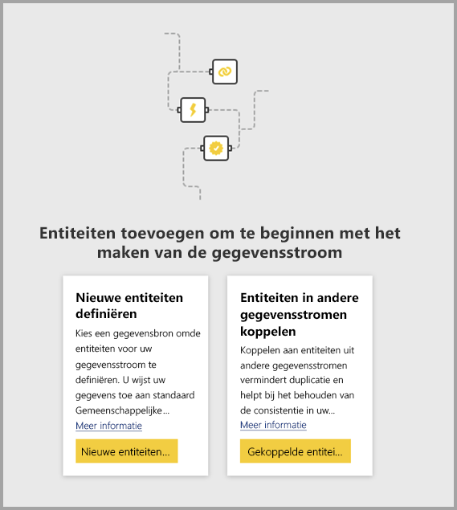

# Entiteiten koppelen tussen gegevensstromen in Power BI (preview)

Met gegevensstromen in Power BI kunt u één bron voor de opslag van gegevens in uw organisatie maken waarin bedrijfsanalisten hun gegevens eenmalig kunnen voorbereiden, centraal kunnen beheren en vervolgens kunnen hergebruiken in verschillende analyse-apps in de organisatie. 

Wanneer u entiteiten in verschillende gegevensstromen koppelt, kunt u entiteiten die al zijn opgenomen, opgeschoond en getransformeerd in gegevensstromen van anderen, hergebruiken zonder die gegevens te hoeven onderhouden. De gekoppelde entiteiten verwijzen eenvoudig naar de entiteiten in andere gegevensstromen. De gegevens worden *niet* gekopieerd of gedupliceerd.

Gekoppelde entiteiten zijn **alleen-lezen**. Als u transformaties voor een gekoppelde entiteit wilt maken, moet u een nieuwe berekende entiteit maken met een verwijzing naar de gekoppelde entiteit.

## Beschikbaarheid van gekoppelde entiteiten

Voor het vernieuwen van gekoppelde entiteiten is een [Power BI Premium](service-premium.md)-abonnement vereist. Gekoppelde entiteiten zijn beschikbaar in elke gegevensstroom voor een werkruimte die wordt gehost op Power BI Premium-capaciteit. Er zijn geen beperkingen met betrekking tot de brongegevensstroom.

Gekoppelde entiteiten werken alleen correct in nieuwe Power BI-werkruimten. U vindt hier meer informatie over [nieuwe Power BI-ruimten](service-create-the-new-workspaces.md). Alle gekoppelde gegevensstromen moeten zich in nieuwe werkruimten bevinden voor de juiste werking.

> [!NOTE]
> Er zijn verschillende entiteiten: standaardentiteiten of berekende entiteiten. Met standaardentiteiten (vaak kortweg entiteiten genoemd) kan een query worden uitgevoerd op een externe gegevensbron, bijvoorbeeld een SQL-database. Voor berekende entiteiten is Premium-capaciteit voor Power BI vereist. Er worden transformaties op gegevens mee uitgevoerd die al in de Power BI-opslag aanwezig zijn. 
>
>Als uw gegevensstroom zich niet in een werkruimte met Premium-capaciteit bevindt, kunt u desondanks naar één query of een combinatie van twee of meer query's verwijzen, mits de transformaties niet als transformaties in de opslag zijn gedefinieerd. Dergelijke verwijzingen worden als standaardentiteiten beschouwd. Schakel hiertoe de optie **Laden inschakelen** in voor de query's waarnaar wordt verwezen om te voorkomen dat de gegevens worden gerealiseerd en door de opslag opgenomen. Hierna kunt u verwijzen naar deze query's met de status **Laden inschakelen = onwaar** en **Laden inschakelen** instellen op **Aan** voor uitsluitend die query's die u wilt realiseren.

## Entiteiten koppelen tussen gegevensstromen

Er zijn meerdere manieren om entiteiten te koppelen tussen gegevensstromen in Power BI. U kunt **Gekoppelde entiteiten toevoegen** selecteer in het bewerkingsprogramma voor gegevensstromen, zoals wordt weergegeven in de volgende afbeelding. 

U kunt ook **Gekoppelde entiteiten toevoegen** selecteren via de menuoptie **Entiteiten toevoegen** in de Power BI-service.

Als u entiteiten wilt koppelen, moet u zich aanmelden met uw Power BI-referenties.

Er wordt een **navigatievenster** geopend waarin u kunt kiezen uit een verzameling standaardentiteiten waarmee u verbinding kunt maken. De weergegeven entiteiten zijn de entiteiten waarvoor u bent gemachtigd, in alle werkruimten in uw Power BI-tenant. 

Zodra uw gekoppelde entiteiten zijn geselecteerd, worden ze weergegeven in de lijst met entiteiten voor de gegevensstroom in het bewerkingsprogramma, met een speciaal pictogram om aan te geven dat het gekoppelde entiteiten zijn.

U kunt ook de brongegevensstroom weergeven vanuit de gegevensstroominstellingen van de gekoppelde entiteit.

## Vernieuwingslogica van gekoppelde entiteiten
De standaardlogica voor het vernieuwen van gekoppelde entiteiten kan variëren, afhankelijk van of de brongegevensstroom zich bevindt in dezelfde werkruimte als de doelgegevensstroom. Het verschil tussen beide wordt beschreven in de volgende secties.

### Koppelingen tussen werkruimten

Het vernieuwen voor koppelingen van entiteiten in verschillende werkruimten werkt zoals bij een externe gegevensbron. Wanneer de gegevensstroom wordt vernieuwd, worden de meest recente gegevens voor de entiteit van de brongegevensstroom opgehaald. Als de brongegevensstroom wordt vernieuwd, worden de gegevens in de doelgegevensstroom niet automatisch bijgewerkt.

### Koppelingen in dezelfde werkruimte

Als de gegevens voor een brongegevensstroom worden vernieuwd, wordt automatisch een proces voor het vernieuwen van afhankelijke entiteiten in alle doelgegevensstromen in dezelfde werkruimte gestart, met inbegrip van alle entiteiten die worden berekend op basis van deze gegevens. Alle andere entiteiten in de doelgegevensstroom worden vernieuwd volgens een gegevensstroomschema. Entiteiten die afhankelijk zijn van meer dan één bron, worden bijgewerkt als een van hun bronnen is bijgewerkt.

Het is handig om te weten dat het hele vernieuwingsproces in één keer wordt doorgevoerd. Als het vernieuwen van de doelgegevensstroom mislukt, mislukt ook het vernieuwen van de brongegevensstroom.

## Machtigingen voor het weergeven van rapporten over gegevensstromen

Wanneer u een Power BI-rapport maakt dat gegevens op basis van een gegevensstroom bevat, kunnen gebruikers eventuele gekoppelde entiteiten alleen zien als zij toegangsrechten voor de brongegevensstroom hebben.

## Beperkingen en overwegingen

Er zijn enkele beperkingen waarmee u rekening moet houden bij het werken met gekoppelde entiteiten:

* Er zijn maximaal vijf verwijzende hops toegestaan
* Cyclische afhankelijkheden van gekoppelde entiteiten zijn niet toegestaan
* De gegevensstroom moet zich bevinden in een [nieuwe Power BI-werkruimte](service-create-the-new-workspaces.md)

## Volgende stappen

De volgende artikelen zijn wellicht nuttig als u gegevensstromen maakt of ermee werkt. 

* [Selfservice voor gegevensvoorbereiding in Power BI (preview)](service-dataflows-overview.md)
* [Gegevensstromen maken en gebruiken in Power BI](service-dataflows-create-use.md)
* [Berekende entiteiten gebruiken in Power BI Premium (preview)](service-dataflows-computed-entities-premium.md)
* [Gegevensstromen gebruiken met on-premises gegevensbronnen (preview)](service-dataflows-on-premises-gateways.md)
* [Resources voor ontwikkelaars voor Power BI-gegevensstromen (preview)](service-dataflows-developer-resources.md)

U kunt de volgende artikelen lezen voor meer informatie over Power Query en geplande vernieuwing:
* [Queryoverzicht in Power BI Desktop](desktop-query-overview.md)
* [Geplande vernieuwing configureren](refresh-scheduled-refresh.md)

U kunt het overzichtsartikel lezen voor meer informatie over Common Data Model:
* [Overzicht van Common Data Model](https://docs.microsoft.com/powerapps/common-data-model/overview)

