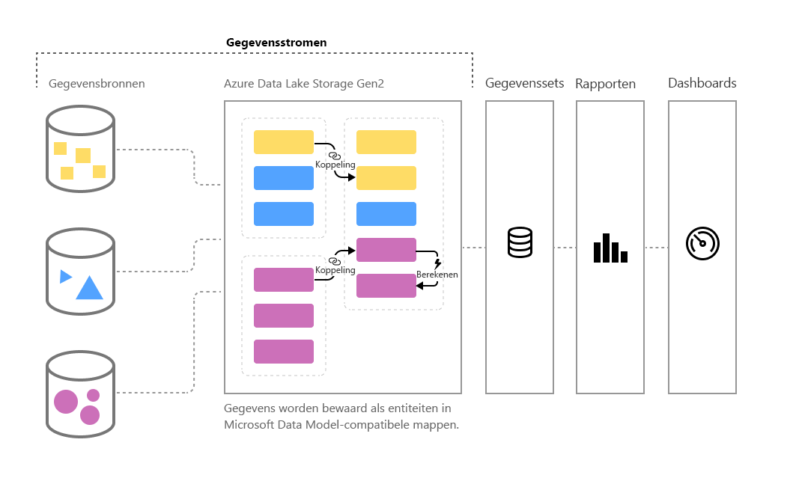

# Selfservice voor gegevensvoorbereiding in Power BI (preview)

Hoe meer gegevens, hoe groter de uitdaging om ze om te zetten in goed opgemaakte, bruikbare informatie. We willen gegevens die klaar zijn voor analyse, voor het vullen van visuele elementen, rapporten en dashboards, zodat we grote hoeveelheden gegevens snel kunnen omzetten in bruikbare inzichten. Met de **selfservice voor gegevensvoorbereiding** voor big data in Power BI transformeert u gegevens tot Power BI-inzichten met slechts een paar klikken.

Power BI introduceert **gegevensstromen** waarmee organisaties gegevens uit verschillende bronnen kunnen samenvoegen en voorbereiden voor modellering. Analisten kunnen gemakkelijk gegevensstromen maken met bekende selfservicehulpprogramma's. Gegevensstromen worden gebruikt voor het opnemen, transformeren, integreren en verrijken van big data door het definiëren van gegevensbronverbindingen, ETL-logica, vernieuwingsschema's en nog veel meer. Bovendien maakt de nieuwe modelgestuurde berekeningsengine bij gegevensstromen het proces voor het voorbereiden van gegevens gemakkelijker, deterministischer en minder omslachtig voor gegevensanalisten en makers van rapporten. Net als bij herberekeningen voor alle betrokken formules in spreadsheets, worden in gegevensstromen wijzigingen voor een entiteit of gegevenselement namens u beheerd om wijzigingen automatisch te verwerken. Dit voorkomt omslachtige en tijdrovende controles, zelfs voor het vernieuwen van basisgegevens. Dankzij gegevensstromen kunnen taken die voorheen moesten worden overzien door gegevenswetenschappers (en hen vele uren of dagen kostten om te voltooien) nu worden verwerkt met een paar klikken door analisten en makers van rapporten. 

Gegevens worden opgeslagen als entiteiten in [**Common Data Model**](https://docs.microsoft.com/powerapps/common-data-model/overview) in Azure Data Lake Storage Gen2. Gegevensstromen worden gemaakt en beheerd in app-werkruimten met behulp van de Power BI-service.  

> [!NOTE]
> De functionaliteit met betrekking tot gegevensstromen is in de preview-fase en is dus onderhevig aan wijzigingen en updates voordat deze algemeen beschikbaar wordt.

 
**Gegevensstromen** zijn ontworpen voor gebruik in **Common Data Model**, een gestandaardiseerde, modulaire, uitbreidbare verzameling gegevensschema's die door Microsoft is gepubliceerd en waarmee u eenvoudiger gegevens kunt samenstellen, gebruiken en analyseren. Met dit model kunt u gegevensbronnen soepel transformeren tot Power BI-dashboards.

U kunt gegevensstromen gebruiken voor het opnemen van gegevens uit een grote en groeiende verzameling ondersteunde on-premises en cloudgegevensbronnen, zoals Dynamics 365, Salesforce, Azure SQL Database, Excel, SharePoint en nog veel meer.

U kunt vervolgens gegevens toewijzen aan standaardentiteiten in Common Data Model, bestaande entiteiten wijzigen en uitbreiden en aangepaste entiteiten maken. Geavanceerde gebruikers kunnen volledig aangepaste gegevensstromen maken met een selfservice waarvoor niet of nauwelijks code hoeft te worden geschreven. Deze Power Query-selfservice is vergelijkbaar met de Power Query-ervaring die miljoenen gebruikers van Power BI Desktop en Excel al kennen.  

Als u een gegevensstroom hebt gemaakt, kunt u Power BI Desktop en de Power BI-service gebruiken om gegevenssets, rapporten, dashboards en apps te maken die gebruikmaken van de kracht van Common Data Model om diepe inzichten in uw zakelijke activiteiten te krijgen. 

Het schema voor vernieuwing van de gegevensstroom wordt rechtstreeks beheerd vanuit de werkruimte waarin uw gegevensstroom is gemaakt, net zoals bij uw gegevenssets. 

## De werking van gegevensstromen

Hier volgen enkele voorbeelden van wat gegevensstromen voor u kunnen betekenen:

* Organisaties kunnen hun gegevens toewijzen aan standaardentiteiten in Common Data Model of hun eigen aangepaste entiteiten maken. Deze entiteiten kunnen vervolgens worden gebruikt als bouwstenen voor het maken van kant-en-klare rapporten, dashboards en apps die werken en deze toewijzen aan gebruikers in hun organisatie. 

* Met behulp van de uitgebreide verzameling connectoren voor Microsoft-gegevens kunnen organisaties hun eigen gegevensbronnen verbinden met gegevensstromen, de gegevens vanaf de bron toewijzen met Power Query en overbrengen naar Power BI. Als de gegevens zijn geïmporteerd door een gegevensstroom (en vernieuwd met een opgegeven frequentie), kunnen die gegevensstroomentiteiten in de Power BI Desktop-toepassing worden gebruikt om aantrekkelijke rapporten en dashboards te maken. 

## Het gebruik van gegevensstromen

In de vorige sectie is een aantal manieren beschreven waarop u gegevensstromen kunt gebruiken om snel krachtige analyses te maken in Power BI. In deze sectie wordt beschreven hoe u snel inzichten kunt maken met behulp van gegevensstromen in een organisatie, hoe BI-professionals hun eigen gegevensstromen kunnen maken en inzichten kunnen aanpassen aan hun eigen organisatie.

### Common Data Model uitbreiden naar de behoeften van uw bedrijf
Voor organisaties die Common Data Model (CDM) willen uitbreiden, bieden gegevensstromen business intelligence-professionals de mogelijkheid om de standaardentiteiten aan te passen of nieuwe entiteiten te maken. Deze selfservice-aanpak voor aanpassing van het gegevensmodel kan vervolgens worden gebruikt in combinatie met gegevensstromen voor het opbouwen van apps en Power BI-dashboards die op een organisatie is aangepast.

### Gegevensstromen programmatisch definiëren
U kunt ook uw eigen programmatische oplossingen voor het maken van gegevensstromen ontwikkelen. Met openbare API's en de mogelijkheid om programmatisch definitiebestanden (model.json) voor aangepaste gegevensstromen te maken, creëert u een aangepaste oplossing die voldoet aan de unieke gegevens en analysebehoeften van uw organisatie. 

Met de openbare API's kunnen ontwikkelaars eenvoudig en gemakkelijk werken met Power BI en gegevensstromen.

### Uw mogelijkheden uitbreiden met Azure
Azure Data Lake Storage Gen2 is inbegrepen bij elk betaald Power BI-abonnement (10 GB per gebruiker, 100 TB per P1-knooppunt). U kunt eenvoudig aan de slag gaan met de selfservice voor gegevensvoorbereiding op Azure Data Lake. 

Power BI kan worden geconfigureerd voor het opslaan van gegevens van de gegevensstroom in uw organisatie-account voor Azure Data Lake Storage Gen2. Wanneer Power BI is verbonden met uw Azure-abonnement, kunnen gegevensontwikkelaars en wetenschappers gebruikmaken van krachtige Azure-producten, zoals Azure Machine Learning, Azure Databricks en Azure Data Factory.

Met Power BI kunt u ook verbinding maken met mappen met geschematiseerde gegevens in de Common Data Model-indeling, die zijn opgeslagen in uw organisatie-account voor Azure Data Lake Storage. Deze mappen kunnen worden gemaakt met services zoals Azure-gegevensservices. Door verbinding met deze mappen te maken, kunnen analisten naadloos met deze gegevens werken in Power BI. 

Zie [Integratie van gegevensstromen en Azure Data Lake (preview)](service-dataflows-azure-data-lake-integration.md) voor meer informatie over Azure Data Lake Storage Gen2 en integratie van gegevensstromen, waaronder het maken van gegevensstromen die in Azure Data Lake van uw organisatie aanwezig zijn.

## Mogelijkheden voor gegevensstromen in Power BI Premium

Om te kunnen profiteren van de functies en werkbelastingen voor gegevensstromen in een Power BI Premium-abonnement, moet de werkbelasting van de gegevensstroom voor die Premium-capaciteit worden ingeschakeld. Zie het artikel [Wat is Power BI Premium](service-premium.md) voor meer informatie over Power BI Premium. 

De volgende tabel bevat een beschrijving van de functies voor gegevensstromen en de bijbehorende mogelijkheden bij het gebruik van een Power BI Pro-account ten opzichte van het gebruik van Power BI Premium.

|Capaciteit van gegevensstroom | Power BI Pro |   Power BI Premium |
|---------|---------|---------|
|Geplande vernieuwing| 8 per dag|  48|
|Totale opslagruimte| 10 GB per gebruiker  |100 TB per knooppunt|
|Gegevensstroom ontwerpen met Power Query Online|    +   |+|
|Gegevensstroombeheer in Power BI|   +|  +|
|Gegevensconnector voor gegevensstroom in Power BI Desktop|  +|  +|
|Integratie met Azure|    +|  +|
|Berekende entiteiten (transformaties in de opslag via M) | |   +|
|Nieuwe connectoren|    +|  +|
|Incrementele vernieuwing van de gegevensstroom|  |   +|
|Uitvoeren op Power BI Premium-capaciteit / Parallelle uitvoering van transformaties|   |   +|
|Gekoppelde entiteiten in gegevensstromen| |        +|
|Gestandaardiseerd schema / Ingebouwde ondersteuning voor Common Data Model|  +|  +|

## Samenvatting van selfservice voor gegevensvoorbereiding voor big data in Power BI
Zoals eerder vermeld in dit artikel, zijn er meerdere scenario's en voorbeelden waarin **gegevensstromen** u in staat stellen om meer controle over - en sneller inzichten in - uw zakelijke gegevens te krijgen. Met behulp van een standaardgegevensmodel (schema) dat is gedefinieerd in Common Data Model, kunt u met gegevensstromen waardevolle bedrijfsgegevens importeren en deze in zeer korte tijd voorbereiden voor het maken van modellen en BI-inzichten... iets wat vroeger maanden of langer duurde. 

Door bedrijfsgegevens op te slaan in de gestandaardiseerde indeling van **Common Data Model**, kunnen uw BI-professionals (of ontwikkelaars) apps maken die snel en eenvoudig automatisch visuele elementen en rapporten genereren. Deze omvatten, maar zijn niet beperkt tot:

* Het toewijzen van uw gegevens aan standaardentiteiten in Common Data Model voor het samenvoegen van gegevens en het verkrijgen van kant-en-klare inzichten met het bekende schema
* Het maken van uw eigen aangepaste entiteiten voor het samenvoegen van gegevens in uw organisatie 
* Het gebruiken en vernieuwen van **externe gegevens** als onderdeel van een gegevensstroom, en het importeren van die gegevens om inzichten te verkrijgen
* Aan de slag met gegevensstromen voor ontwikkelaars

## Volgende stappen

Dit artikel geeft een overzicht van de selfservice voor gegevensvoorbereiding voor big data in Power BI en de vele manieren waarop u deze kunt gebruiken. In de volgende artikelen wordt dieper ingegaan op veelvoorkomende gebruiksmogelijkheden van gegevensstromen. 

* [Gegevensstromen maken en gebruiken in Power BI](service-dataflows-create-use.md)
* [Berekende entiteiten gebruiken in Power BI Premium (preview)](service-dataflows-computed-entities-premium.md)
* [Gegevensstromen gebruiken met on-premises gegevensbronnen (preview)](service-dataflows-on-premises-gateways.md)
* [Resources voor ontwikkelaars voor Power BI-gegevensstromen (preview)](service-dataflows-developer-resources.md)
* [Integratie van gegevensstromen en Azure Data Lake (preview)](service-dataflows-azure-data-lake-integration.md)

U kunt de volgende artikelen lezen voor meer informatie over Power Query en geplande vernieuwing:
* [Queryoverzicht in Power BI Desktop](desktop-query-overview.md)
* [Geplande vernieuwing configureren](refresh-scheduled-refresh.md)

U kunt het overzichtsartikel lezen voor meer informatie over Common Data Model:
* [Overzicht van Common Data Model](https://docs.microsoft.com/powerapps/common-data-model/overview)

