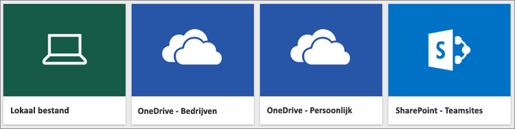
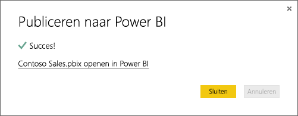

# Gegevens ophalen uit Power BI Desktop-bestanden

Met **Power BI Desktop** zijn Business Intelligence (BI) en rapportage voor iedereen toegankelijk. Ongeacht of u verbinding maakt met een groot aantal verschillende gegevensbronnen, gegevens opvraagt en transformeert, uw gegevens modelleert, en krachtige en dynamische rapporten maakt, met **Power BI Desktop** kunt u alle BI-taken gemakkelijk en snel uitvoeren. Raadpleeg [Aan de slag met Power BI Desktop](desktop-getting-started.md) als u nog geen ervaring hebt met het gebruik van **Power BI Desktop**.

Wanneer u gegevens hebt opgehaald in **Power BI Desktop** en een paar rapporten hebt gemaakt, is het tijd om het opgeslagen bestand over te brengen naar de **Power BI-service**.

## Het maakt een verschil waar uw bestand wordt opgeslagen
**Lokaal**: Als u het bestand opslaat op een lokale schijf van uw computer of op een andere locatie binnen uw organisatie, kunt u het bestand *importeren* of u kunt *publiceren* vanuit Power BI Desktop om de gegevens en rapporten over te brengen naar Power BI. Het bestand blijft gewoon op de lokale schijf staan en wordt dus niet verplaatst naar Power BI. Wat er wel gebeurt, is dat er een nieuwe gegevensset wordt gemaakt in Power BI en dat de gegevens en het gegevensmodel vanuit het bestand van Power BI Desktop in de gegevensset worden geladen. Als het bestand rapporten bevat, worden deze weergegeven op de Power BI-site, onder Rapporten.

**OneDrive voor Bedrijven** Als u OneDrive voor Bedrijven hebt en zich aanmeldt met hetzelfde account als voor Power BI, is dit verreweg de meest efficiënte manier om uw werk in Power BI te houden en uw gegevensset, rapporten en dashboards in Power BI gesynchroniseerd te houden. Omdat zowel Power BI als OneDrive zich in de cloud bevindt, maakt Power BI ongeveer om het uur *verbinding* met uw bestand in OneDrive. Als er wijzigingen worden gevonden, worden uw gegevensset, rapporten en dashboards in Power BI automatisch bijgewerkt.

**OneDrive - Persoonlijk** Als u de bestanden opslaat in uw eigen OneDrive-account, geniet u veelal dezelfde voordelen als met OneDrive voor Bedrijven. Het belangrijkste verschil is dat wanneer u voor het eerst verbinding maakt met het bestand (met Gegevens ophalen > Bestanden > OneDrive - Persoonlijk), u zich bij OneDrive moet aanmelden met uw Microsoft-account. Dit is doorgaans een ander account dan het account dat u gebruikt om u aan te melden bij Power BI. Wanneer u zich met uw Microsoft-account aanmeldt bij OneDrive, moet u ervoor zorgen dat u het selectievakje Aangemeld blijven inschakelt. Op deze manier kan er om het uur verbinding via Power BI worden gemaakt met uw bestand en zorgt u ervoor dat uw gegevensset in Power BI wordt gesynchroniseerd.

**SharePoint - Teamsites**: als u uw Power BI Dekstop-bestanden wilt opslaan naar SharePoint - Teamsites, doet u dit op vrijwel dezelfde manier als bij OneDrive voor Bedrijven. Het grootste verschil is de manier waarop u vanuit Power BI verbinding maakt met het bestand. U kunt een URL opgeven of verbinding maken met de hoofdmap.

## Importeren of verbinding maken met een Power BI Desktop-bestand vanuit Power BI
>[!IMPORTANT]
>De maximale bestandsgrootte die u in Power BI kunt importeren is 1 GB.

1. Klik in Power BI in het navigatievenster op Gegevens ophalen.
   
   
2. Klik in **Bestanden** op **Ophalen**.
   
   
3. Zoek het bestand. Power BI Desktop-bestanden hebben de extensie .pbix.
   
   

## Een bestand vanuit Power BI Desktop publiceren naar uw Power BI-site
De optie Publiceren van Power BI Desktop is in feite hetzelfde als het gebruik van de optie Gegevens ophalen in Power BI om uw bestand te importeren vanaf een lokaal station of om er verbinding mee te maken in OneDrive.  Hieronder volgen alleen de vereiste stappen. Ga voor meer informatie naar [Publish from Power BI Desktop](desktop-upload-desktop-files.md) (Publiceren vanuit Power BI Desktop).

1. Klik in Power BI Desktop op **Bestand** > **Publiceren** > **Publiceren naar Power BI** of klik op **Publiceren** op het lint.
   
   
2. Meld u aan bij Power BI. Dit hoeft u alleen de eerste keer te doen.
   
   Als u bent aangemeld, ziet u een koppeling om uw rapport op de Power BI-site te openen.
   
   

## Volgende stappen
**Uw gegevens verkennen** wanneer u gegevens en rapporten uit het bestand in Power BI hebt geïmporteerd, kunt u ze verkennen. Als het bestand al rapporten bevat, worden deze weergegeven in het navigatievenster in **Rapporten**. Als het bestand alleen gegevens bevat, kunt u nieuwe rapporten maken. Klik hiervoor met de rechtermuisknop op de nieuwe gegevensset en klik vervolgens op **Verkennen**.

**Externe gegevensbronnen vernieuwen** Als uw Power BI Desktop-bestand verbinding maakt met externe gegevensbronnen, kunt u een schema voor gepland vernieuwen opstellen om ervoor te zorgen dat uw gegevensset altijd actueel is. In de meeste gevallen is het instellen van geplande vernieuwing eenvoudig, maar de uitleg hiervan valt buiten het bereik van dit artikel. Zie [Gegevens vernieuwen in Power BI](refresh-data.md) voor meer informatie.

