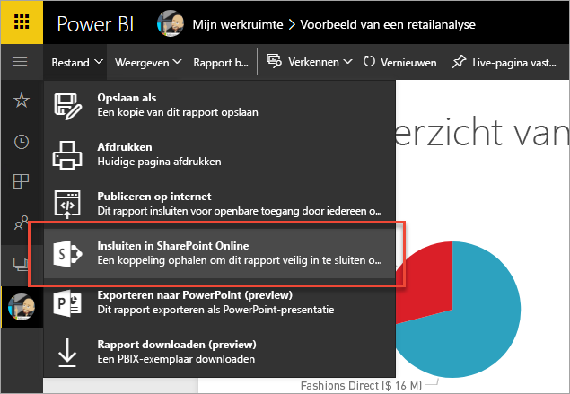
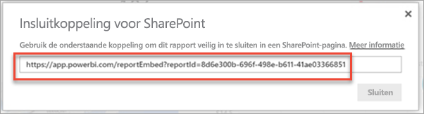
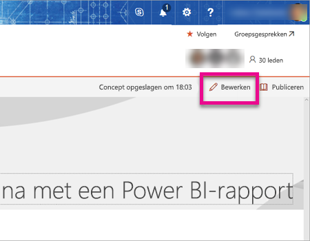
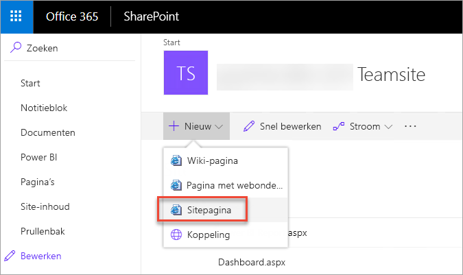
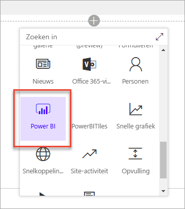
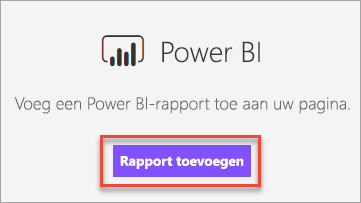
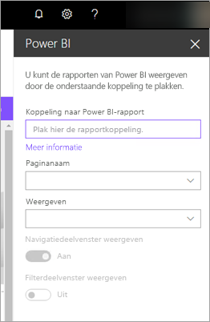
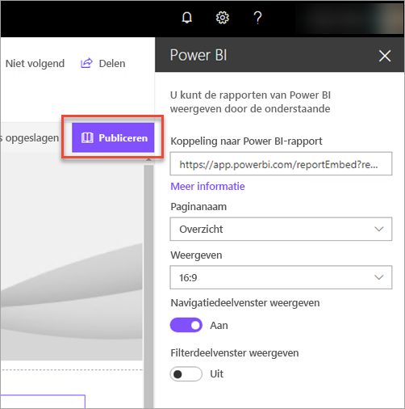
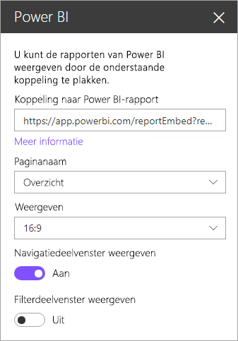
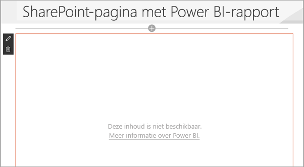

# Insluiten met webonderdeel Rapport in SharePoint Online

Met het nieuwe webonderdeel Rapport van Power BI voor SharePoint Online kunt u eenvoudig interactieve Power BI-rapporten insluiten in SharePoint Online-pagina's.

Wanneer u de nieuwe optie **Insluiten in SharePoint Online** gebruikt, zijn de ingesloten rapporten volledig beveiligd, zodat u eenvoudig beveiligde interne portals kunt maken.

## Vereisten

Er zijn enkele vereisten als u **Insluiten in SharePoint Online** wilt gebruiken voor rapporten.

* Voor het Power BI-webonderdeel voor SharePoint Online is [Moderne pagina's](https://support.office.com/article/Allow-or-prevent-creation-of-modern-site-pages-by-end-users-c41d9cc8-c5c0-46b4-8b87-ea66abc6e63b) vereist.

## Uw rapport insluiten

Als u uw rapport wilt insluiten in SharePoint Online, moet u eerst de URL voor het rapport ophalen. Vervolgens gebruikt u die URL binnen SharePoint Online met het nieuwe Power BI-webonderdeel.

### Een URL voor uw rapport ophalen

1. Geef het rapport weer in de Power BI-service.

2. Selecteer het menu-item **Bestand**.

3. Selecteer **Insluiten in SharePoint Online**.
   
    

4. Kopieer de URL vanuit het dialoogvenster.

    

   > [!NOTE]
   > U kunt ook de URL gebruiken die wordt weergegeven in de adresbalk van uw webbrowser wanneer u een rapport weergeeft. Die URL bevat de rapportpagina die u op dat moment weergeeft. U moet de rapportsectie verwijderen uit de URL als u een andere pagina wilt gebruiken.

### Het Power BI-rapport toevoegen aan een SharePoint Online-pagina

1. Open de gewenste pagina in SharePoint Online en selecteer **Bewerken**.

    

    Of maak een nieuwe moderne sitepagina door **+ Nieuw** te selecteren in SharePoint Online.

    

2. Selecteer  **+**  en selecteer het webonderdeel **Power BI**.

    

3. Selecteer **Rapport toevoegen**.

    

4. Plak de URL van het rapport in het deelvenster Eigenschappen. Dit is de URL die u in de vorige stappen hebt gekopieerd. Het rapport wordt automatisch geladen.

    

5. Selecteer **Publiceren** om de wijziging zichtbaar te maken voor uw SharePoint Online-gebruikers.

    

## Toegang verlenen tot rapporten

Wanneer een rapport wordt ingesloten in SharePoint Online, zijn gebruikers niet automatisch gemachtigd om het rapport weer te geven. De machtigingen om het rapport weer te geven, stelt u in de Power BI-service in.

> [!IMPORTANT]
> Controleer wie het rapport kan raadplegen in de Power BI-service en verleen toegang tot personen die niet worden vermeld.

Binnen de Power BI-service kunt u op twee manieren toegang verlenen tot het rapport. Als u een Office 365-groep gebruikt om uw SharePoint Online-teamsite te bouwen, geeft u aan dat de gebruiker lid is van de app-werkruimte binnen de Power BI-service. Hiermee garandeert u dat gebruikers de inhoud van die groep kunnen bekijken. Zie [Een app maken en distribueren in Power BI](service-create-distribute-apps.md) voor meer informatie.

U kunt gebruikers ook op de volgende manier toegang verlenen tot het rapport.

1. Voeg een tegel van het rapport toe aan een dashboard.

2. Deel het dashboard met de gebruikers die toegang moeten hebben tot het rapport. Zie [Een dashboard delen met collega's en anderen](service-share-dashboards.md) voor meer informatie.

## Instellingen van het webonderdeel

Hierna volgt een beschrijving van de instellingen die kunnen worden aangepast voor het Power BI-webonderdeel voor SharePoint Online.

| Eigenschap | Beschrijving |
| --- | --- |
| Paginanaam |Hiermee stelt u de standaardpagina in die door het webonderdeel wordt weergegeven. Selecteer een waarde in de vervolgkeuzelijst. Als er geen pagina's worden weergegeven, zijn er twee mogelijke redenen: uw rapport bestaat uit één pagina of de URL die u hebt geplakt, bevat de naam van een pagina. Verwijder de rapportsectie uit de URL om een specifieke pagina te selecteren. |
| Weergave |Een optie waarmee u kunt aanpassen hoe het rapport in de SharePoint Online-pagina past. |
| Navigatiedeelvenster weergeven |Geeft het navigatiedeelvenster van de pagina weer of verbergt het. |
| Filterdeelvenster weergeven |Geeft het Filterdeelvenster weer of verbergt het. |

## Meervoudige verificatie

Als uw zich voor uw Power BI-omgeving moet aanmelden met meervoudige verificatie, wordt u mogelijk gevraagd om u aan te melden met een beveiligingsapparaat om uw identiteit te verifiëren. Dit gebeurt als u zich niet hebt aangemeld bij SharePoint Online met meervoudige verificatie, maar uw Power BI-omgeving vereist een account dat is gevalideerd door een beveiligingsapparaat.

> [!NOTE]
> Meervoudige verificatie wordt nog niet ondersteund met Azure Active Directory 2.0. Gebruikers ontvangen een bericht waarin *fout* staat. Als dergelijke gebruikers zich met hun beveiligingsapparaat opnieuw aanmelden bij SharePoint Online, kunnen ze het rapport mogelijk weergeven.

## Rapporten die niet worden geladen

Het rapport kan mogelijk niet worden geladen in het Power BI-webonderdeel. Daarbij kan het volgende bericht worden weergegeven.

*Deze inhoud is niet beschikbaar.*

Er zijn twee gangbare redenen voor dit bericht.

1. U hebt geen toegang tot het rapport.
2. Het rapport is verwijderd.

Neem contact op met de eigenaar van de SharePoint Online-pagina, die u kan helpen het probleem op te lossen.

## Bekende problemen en beperkingen

* **Fout: "Er is een fout opgetreden. Meld u af en meld u opnieuw aan. Ga vervolgens opnieuw naar deze pagina. Correlatie-id: niet gedefinieerd, http-antwoordstatus: 400, serverfout, code 10001, bericht: Ontbrekend vernieuwingstoken"**
  
  Als u dit foutbericht ziet, kunt u een van de volgende acties uitvoeren.
  
  1. Meld u af bij SharePoint en meld u weer aan. Sluit alle browservensters voordat u zich weer aanmeldt.

  2. Als voor uw gebruikersaccount meervoudige verificatie (MFA) is vereist, meldt u zich aan bij SharePoint met uw apparaat voor meervoudige verificatie (telefoon-app, via een smartcard, enzovoort).

* Power BI ondersteunt niet dezelfde gelokaliseerde talen als SharePoint Online. U kunt hierdoor mogelijk niet de juiste lokalisatie zien in een ingesloten rapport.

* Er kunnen problemen optreden als u Internet Explorer 10 gebruikt. U kunt de [browserondersteuning voor Power BI](service-browser-support.md) en voor [Office 365](https://products.office.com/office-system-requirements#Browsers-section) onderzoeken.

* Het Power BI-webonderdeel is niet beschikbaar in [nationale clouds](https://powerbi.microsoft.com/en-us/clouds/). 

## Volgende stappen

[Toestaan of verhinderen dat eindgebruikers moderne sitepagina's maken](https://support.office.com/article/Allow-or-prevent-creation-of-modern-site-pages-by-end-users-c41d9cc8-c5c0-46b4-8b87-ea66abc6e63b)  
[Een app maken en distribueren in Power BI](service-create-distribute-apps.md)  
[Een dashboard delen met collega's en anderen](service-share-dashboards.md)  
[Power BI Premium - wat is het?](service-premium.md)  

Nog vragen? [Misschien dat de Power BI-community het antwoord weet](http://community.powerbi.com/) 

