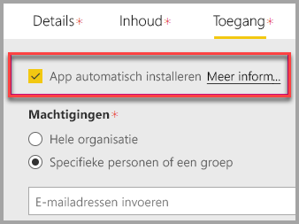

# Insluiten met webonderdeel Rapport in SharePoint Online

Met het nieuwe webonderdeel Rapport van Power BI voor SharePoint Online kunt u eenvoudig interactieve Power BI-rapporten insluiten in SharePoint Online-pagina's.

Wanneer u de nieuwe optie **Insluiten in SharePoint Online** gebruikt, zijn de ingesloten rapporten volledig beveiligd, zodat u eenvoudig beveiligde interne portals kunt maken.

## Vereisten

Er zijn enkele vereisten als u **Insluiten in SharePoint Online** wilt gebruiken voor rapporten.

* U hebt een Power BI Pro-licentie of een [Power BI Premium-capaciteit (EM of P-SKU)](service-premium.md#premium-capacity-nodes) nodig met een licentie voor Power BI.
* Voor het Power BI-webonderdeel voor SharePoint Online is [Moderne pagina's](https://support.office.com/article/Allow-or-prevent-creation-of-modern-site-pages-by-end-users-c41d9cc8-c5c0-46b4-8b87-ea66abc6e63b) vereist.

## Uw rapport insluiten

Als u uw rapport wilt insluiten in SharePoint Online, moet u eerst de URL voor het rapport ophalen. Vervolgens gebruikt u die URL binnen SharePoint Online met het nieuwe Power BI-webonderdeel.

### Een URL voor uw rapport ophalen

1. Geef het rapport weer in de Power BI-service.

2. Selecteer het menu-item **Bestand**.

3. Selecteer **Insluiten in SharePoint Online**.

    

4. Kopieer de URL vanuit het dialoogvenster.

    

### Het Power BI-rapport toevoegen aan een SharePoint Online-pagina

1. Open de gewenste pagina in SharePoint Online en selecteer **Bewerken**.

    

    Of maak een nieuwe moderne sitepagina door **+ Nieuw** te selecteren in SharePoint Online.

    

2. Selecteer **+** en selecteer het webonderdeel **Power BI**.

    

3. Selecteer **Rapport toevoegen**.

    

4. Plak de URL van het rapport in het deelvenster Eigenschappen. Deze rapport-URL is de URL die u in de vorige stappen hebt gekopieerd. Het rapport wordt automatisch geladen.

    

5. Selecteer **Publiceren** om de wijziging zichtbaar te maken voor uw SharePoint Online-gebruikers.

    

## Toegang verlenen tot rapporten

Wanneer een rapport wordt ingesloten in SharePoint Online, zijn gebruikers niet automatisch gemachtigd om het rapport weer te geven. De machtigingen om het rapport weer te geven, stelt u in de Power BI-service in.

> [!IMPORTANT]
> Controleer wie het rapport kan raadplegen in de Power BI-service en verleen toegang tot personen die niet worden vermeld.

Binnen de Power BI-service kunt u op twee manieren toegang verlenen tot het rapport. Als u een Office 365-groep gebruikt om uw SharePoint Online-teamsite te bouwen, geeft u aan dat de gebruiker lid is van de **app-werkruimte binnen de Power BI-service** en de **SharePoint-pagina**. Zie [Een app-werkruimte beheren](service-manage-app-workspace-in-power-bi-and-office-365.md) voor meer informatie.

U kunt ook een rapport rechtstreeks met gebruikers delen door het rapport in een app in te sluiten. Er zijn een paar stappen nodig om een rapport in te sluiten in een app.  

1. De auteur van de app is een Pro-gebruiker.

2. De auteur maakt een rapport in een app-werkruimte. *Om het rapport te delen met **gebruikers van de gratis versie van Power BI**, moet de app-werkruimte worden ingesteld als een **Premium-werkruimte**.*

3. De auteur publiceert de app en installeert deze vervolgens. *De auteur moet de app installeren om toegang te bieden tot de rapport-URL die wordt gebruikt voor het insluiten in SharePoint Online.*

4. Nu moeten alle eindgebruikers de app ook installeren. U kunt echter instellen dat de app vooraf wordt geïnstalleerd voor eindgebruikers met behulp van de functie **App automatisch installeren**, die kan worden ingeschakeld in de [Power BI-beheerportal](service-admin-portal.md).

   

5. De auteur opent de app en gaat naar het rapport.

6. De auteur kopieert de URL van het ingesloten rapport uit het rapport dat door de app is geïnstalleerd. *Gebruik niet de URL van het originele rapport uit de app-werkruimte.*

7. Maak een nieuwe teamsite in SharePoint Online.

8. Voeg de rapport-URL uit stap 6 toe aan het webonderdeel Power BI.

9. Voeg alle eindgebruikers en/of groepen die gebruik gaan maken van de gegevens toe aan de SharePoint Online-pagina en in de Power BI-app die u hebt gemaakt.

    > [!NOTE]
    > **Gebruikers of groepen hebben toegang nodig tot zowel de SharePoint Online-pagina als het rapport in de Power BI-app om het rapport te kunnen zien op de SharePoint-pagina.**

10. De eindgebruiker kan nu naar de teamsite in SharePoint Online gaan en de rapporten bekijken op de pagina.

## Meervoudige verificatie

Als u zich voor uw Power BI-omgeving moet aanmelden met meervoudige verificatie, krijgt u mogelijk het verzoek om u aan te melden met een beveiligingsapparaat om uw identiteit te verifiëren. Dit gebeurt als u zich niet hebt aangemeld bij SharePoint Online met meervoudige verificatie, maar uw Power BI-omgeving een account vereist dat is gevalideerd door een beveiligingsapparaat.

> [!NOTE]
> Meervoudige verificatie wordt nog niet ondersteund met Azure Active Directory 2.0. Gebruikers ontvangen een bericht waarin *fout* staat. Als dergelijke gebruikers zich met hun beveiligingsapparaat opnieuw aanmelden bij SharePoint Online, kunnen ze het rapport mogelijk weergeven.

## Instellingen van het webonderdeel

Hierna volgt een beschrijving van de instellingen die kunnen worden aangepast voor het Power BI-webonderdeel voor SharePoint Online.

| Eigenschap | Beschrijving |
| --- | --- |
| Paginanaam |Hiermee stelt u de standaardpagina in die door het webonderdeel wordt weergegeven. Selecteer een waarde in de vervolgkeuzelijst. Als er geen pagina's worden weergegeven, zijn er twee mogelijke redenen: uw rapport bestaat uit één pagina of de URL die u hebt geplakt, bevat de naam van een pagina. Verwijder de rapportsectie uit de URL om een specifieke pagina te selecteren. |
| Weergave |Een optie waarmee u kunt aanpassen hoe het rapport in de SharePoint Online-pagina past. |
| Navigatiedeelvenster weergeven |Geeft het navigatiedeelvenster van de pagina weer of verbergt het. |
| Filterdeelvenster weergeven |Geeft het Filterdeelvenster weer of verbergt het. |

## Rapporten die niet worden geladen

Het rapport kan mogelijk niet worden geladen in het Power BI-webonderdeel. Daarbij kan het volgende bericht worden weergegeven.

*Deze inhoud is niet beschikbaar.*

Er zijn twee gangbare redenen voor dit bericht.

1. U hebt geen toegang tot het rapport.
2. Het rapport is verwijderd.

Neem contact op met de eigenaar van de SharePoint Online-pagina om u te helpen het probleem op te lossen.

## Licentieverlening

Gebruikers die in SharePoint een rapport bekijken, moeten een **Power BI Pro-licentie** hebben of de inhoud moet zich in een werkruimte bevinden in een **[Power BI Premium-capaciteit (EM of P SKU)](service-admin-premium-purchase.md)**.

## Bekende problemen en beperkingen

* Fout: 'Er is een fout opgetreden. Meld u af en meld u opnieuw aan. Ga vervolgens opnieuw naar deze pagina. Correlatie-ID: niet-gedefinieerde HTTP-antwoordstatus: 400, serverfoutcode 10001, bericht: Ontbrekende vernieuwingstoken'
  
  Als u dit foutbericht ontvangt, probeert u een van de onderstaande stappen voor probleemoplossing.
  
  1. Meld u af bij SharePoint en meld u weer aan. Sluit alle browservensters voordat u zich weer aanmeldt.

  2. Als voor uw gebruikersaccount meervoudige verificatie (MFA) is vereist, meldt u zich aan bij SharePoint met uw apparaat voor meervoudige verificatie (telefoon-app, via een smartcard enzovoort).
  
  3. Accounts van Azure B2B-gastgebruikers worden niet ondersteund. Gebruikers zien het Power BI-logo in het onderdeel dat wordt geladen, maar het rapport wordt niet weergegeven.

* Power BI ondersteunt niet dezelfde gelokaliseerde talen als SharePoint Online. U kunt hierdoor mogelijk niet de juiste lokalisatie zien in een ingesloten rapport.

* Er kunnen problemen optreden als u Internet Explorer 10 gebruikt. U kunt de [browserondersteuning voor Power BI](consumer/end-user-browsers.md) en voor [Office 365](https://products.office.com/office-system-requirements#Browsers-section) onderzoeken.

* Het Power BI-webonderdeel is niet beschikbaar in [onafhankelijke clouds](https://powerbi.microsoft.com/clouds/).

* De klassieke SharePoint Server wordt niet ondersteund met dit webonderdeel.

* [URL-filters](service-url-filters.md) worden niet ondersteund met het SPO-webonderdeel.

## Volgende stappen

* [Toestaan of verhinderen dat eindgebruikers moderne sitepagina's maken](https://support.office.com/article/Allow-or-prevent-creation-of-modern-site-pages-by-end-users-c41d9cc8-c5c0-46b4-8b87-ea66abc6e63b)  
* [Een app maken en distribueren in Power BI](service-create-distribute-apps.md)  
* [Een dashboard delen met collega's en anderen](service-share-dashboards.md)  
* [Wat is Power BI Premium?](service-premium.md)
* [Rapport insluiten in een veilige portal of website](service-embed-secure.md)

Hebt u nog vragen? [Misschien dat de Power BI-community het antwoord weet](http://community.powerbi.com/)