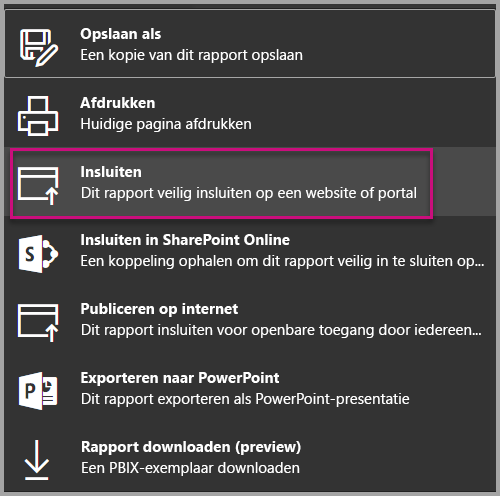
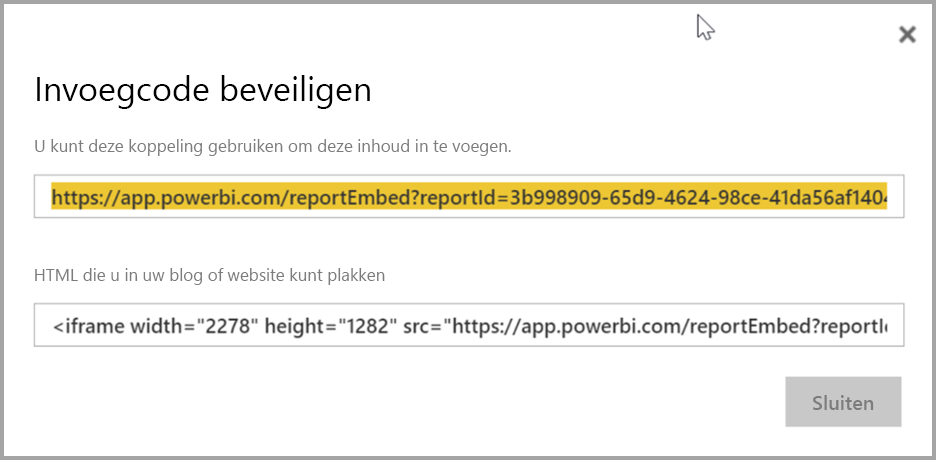
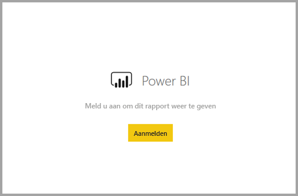
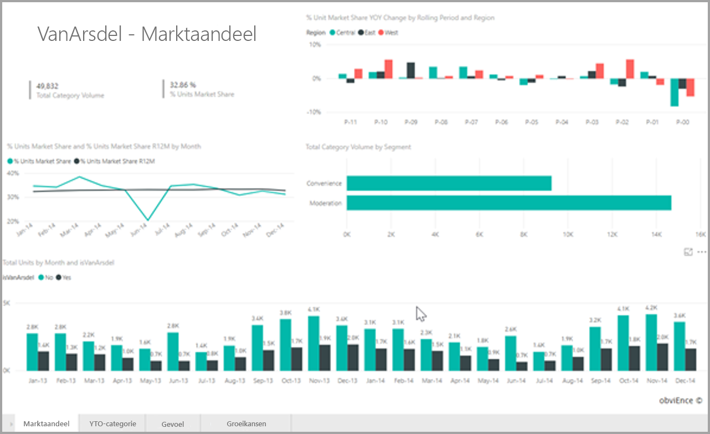

# <a name="embed-a-report-in-a-secure-portal-or-website"></a>Een rapport insluiten in een beveiligde portal of website

Met de nieuwe optie Beveiligd **insluiten** voor rapporten in Power BI kunnen gebruikers eenvoudig en veilig rapporten insluiten in interne webportals, ongedacht of deze **op de cloud gebaseerd** of **on-premises gehost** zijn, zoals SharePoint 2019. Rapporten die op deze manier zijn ingesloten, respecteren alle itemmachtigingen en gegevensbeveiliging via beveiliging op rijniveau (RLS). De functie is ontworpen om URL's of iFrames zonder enige codering te kunnen insluiten in portals waarin deze kunnen worden ingesloten.

De optie **Insluiten** ondersteunt ook [URL-filters](service-url-filters.md) en URL-instellingen. De optie **Insluiten** biedt een benadering voor integratie met portals waarvoor weinig codering en slechts basiskennis van HTML en JavaScript is vereist.

## <a name="how-to-embed-power-bi-reports-into-portals"></a>Power BI-rapporten **insluiten** in portals

1. De nieuwe optie **Insluiten** is beschikbaar in het menu **Bestand** voor rapporten in Power BI-service.

    

2. Selecteer de optie Insluiten om een dialoogvenster te openen dat een koppeling en een iFrame bevat waarmee het rapport veilig kan worden ingesloten.

    

3. Nadat u de URL in uw webportal hebt ingesloten of als u de URL rechtstreeks opent, wordt de gebruiker geverifieerd voordat deze toegang krijgt tot het rapport. Hieronder heeft de gebruiker zich in de browsersessie niet aangemeld bij Power BI. Wanneer de gebruiker op **Aanmelden** drukt, wordt er mogelijk een nieuw browservenster of tabblad geopend. Controleer op pop-upblokkeringen als er geen prompt wordt weergegeven om u aan te melden.

    

4. Wanneer de gebruiker zich heeft aangemeld, wordt het rapport geopend. De gegevens worden weergegeven en gebruikers kunnen tussen pagina's navigeren en filters instellen. Het rapport wordt alleen weergegeven voor gebruikers die gemachtigd zijn om het rapport in Power BI weer te geven. Alle RLS-regels (beveiliging op rijniveau) worden eveneens toegepast. Ten slotte moet de gebruiker over de juiste licentie beschikken: de gebruiker moet een licentie hebben voor Power BI Pro of het rapport moet zich bevinden in een werkruimte met Power BI Premium-capaciteit. Telkens wanneer de gebruiker een nieuw browservenster opent, moet hij zich aanmelden, maar wanneer de gebruiker eenmaal is aangemeld, worden andere rapporten automatisch geladen.

    

5. Wanneer u de optie iFrame gebruikt, is het raadzaam om de HTML-code te bewerken en de gewenste hoogte en breedte op te geven, zodat het rapport in de webpagina van de portal past.

    

## <a name="granting-access-to-reports"></a>Toegang verlenen tot rapporten

Met de optie Insluiten worden gebruikers niet automatisch gemachtigd om het rapport te bekijken. De machtigingen om het rapport weer te geven, stelt u in de Power BI-service in.

Als u toegang wilt geven tot het rapport in de Power BI-service, kunt u het rapport delen met de gebruikers die toegang tot het ingesloten rapport nodig hebben. Als u een Office 365-groep gebruikt, kunt u de gebruiker in de Power BI-service vermelden als lid van de app-werkruimte. Zie [Een app-werkruimte beheren](service-manage-app-workspace-in-power-bi-and-office-365.md) voor meer informatie.

## <a name="licensing"></a>Licentieverlening

Gebruikers die het ingesloten rapport willen bekijken, hebben een Power BI Pro-licentie nodig, of de inhoud moet zich bevinden in een werkruimte met [Power BI Premium-capaciteit (EM of P SKU)](service-admin-premium-purchase.md).

## <a name="customize-your-embed-experience-using-url-settings"></a>Uw insluitervaring aanpassen met behulp van URL-instellingen

De insluitings-URL ondersteunt diverse instellingen waarmee u de ervaring van uw gebruikers kunt aanpassen. Als u de verstrekte iFrame gebruikt, moet u ervoor zorgen dat u de URL bijwerkt in de SRC-instellingen van het iFrame.

| Eigenschap  | Beschrijving  |  |  |  |
|--------------|-----------------------------------------------------------------------------------------------------------------------------------------------------------------------------------------------------------------------|---|---|---|
| pageName  | Met de query-tekenreeksparameter **pageName** kunt u instellen welke pagina van het rapport u wilt openen. De waarde van **pageName** komt overeen met het einde van de rapport-URL wanneer u een rapport bekijkt in de Power BI-service, zoals hieronder wordt weergegeven. |  |  |  |
| URL-filters  | U kunt [URL-filters](service-url-filters.md) gebruiken in de insluitings-URL die u hebt ontvangen van de gebruikersinterface van Power BI om de inhoud van de in te sluiten inhoud te filteren. Op deze manier kunt u integraties bouwen met slechts weinig programmacode en alleen basiskennis van HTML en JavaScript.  |  |  |  |

## <a name="set-which-page-opens-when-the-report-is-embedded"></a>Instellen welke pagina wordt geopend wanneer het rapport wordt ingesloten

De waarde die in de instelling *pageName* wordt verstrekt, komt overeen met het einde van de rapport-URL wanneer u een rapport bekijkt in de Power BI-service.

1. Open het rapport vanuit de Power BI-service in uw webbrowser en kopieer de URL uit de adresbalk.

    

2. Voeg de waarde van *pageName* toe aan de URL.

    

## <a name="filter-report-content-using-url-filters"></a>Rapportinhoud filteren met behulp van URL-filters

Voor sommige geavanceerde functies kunt u [URL-filters](service-url-filters.md) gebruiken om meer ervaringen te creëren met het rapport. Met bijvoorbeeld de onderstaande URL wordt het rapport zo gefilterd dat alleen gegevens voor de energiesector worden weergegeven.

Het gebruik van de combinatie van **pageName** en [URL-filters](service-url-filters.md) kan zeer handig zijn. Met basiskennis van HTML en JavaScript kunt u ervaringen bouwen.

Hier ziet u bijvoorbeeld hoe u een knop kunt toevoegen aan een HTML-pagina:

```html
<button class="textLarge" onclick='show("ReportSection", "Energy");' style="display: inline-block;">Show Energy</button>
```

Wanneer op deze knop wordt gedrukt, wordt een functie geactiveerd die het iFrame bijwerkt met een bijgewerkte-URL, die het filter voor de energiesector bevat.

```javascript
function show(pageName, filterValue)

{

var newUrl = baseUrl + "&pageName=" + pageName;

if(null != filterValue && "" != filterValue)

{

newUrl += "&$filter=Industries/Industry eq '" + filterValue + "'";

}

//Assumes there’s an iFrame on the page with id=”iFrame”

var report = document.getElementById("iFrame")

report.src = newUrl;

}
```


U kunt zo veel knoppen toevoegen als u wilt, om met weinig programmacode een aangepaste ervaring te maken. 

## <a name="considerations-and-limitations"></a>Overwegingen en beperkingen

* Biedt geen ondersteuning voor externe gastgebruikers met Azure B2B (business to business).

* Beveiligd insluiten werkt voor rapporten die zijn gepubliceerd naar de Power BI-service.

* Telkens wanneer de gebruiker een nieuw browservenster opent, moet hij zich opnieuw aanmelden om het rapport te kunnen bekijken.

* In sommige browsers moet u de pagina na het aanmelden vernieuwen, met name in de InPrivate- of Incognito-modus.

* Voor een ervaring met eenmalige aanmelding gebruikt u de optie Insluiten in SharePoint Online of bouwt u een aangepaste integratie met de benadering [Gebruiker is eigenaar van gegevens](developer/embed-sample-for-your-organization.md). Meer informatie over [Gebruiker is eigenaar van gegevens](developer/embed-sample-for-your-organization.md).

* De mogelijkheid van automatische verificatie die bij de optie **Insluiten** wordt verstrekt, werkt niet met de Power BI JavaScript-API. Gebruik voor de Power BI JavaScript-API de benadering [Gebruiker is eigenaar van gegevens](developer/embed-sample-for-your-organization.md) voor het insluiten van inhoud. Meer informatie over [Gebruiker is eigenaar van gegevens](developer/embed-sample-for-your-organization.md).

## <a name="next-steps"></a>Volgende stappen

* [Manieren om uw werk te delen](service-how-to-collaborate-distribute-dashboards-reports.md)

* [URL-filters](service-url-filters.md)

* [Webonderdeel Rapport in SharePoint Online](service-embed-report-spo.md)

* [Publiceren op internet](service-publish-to-web.md)