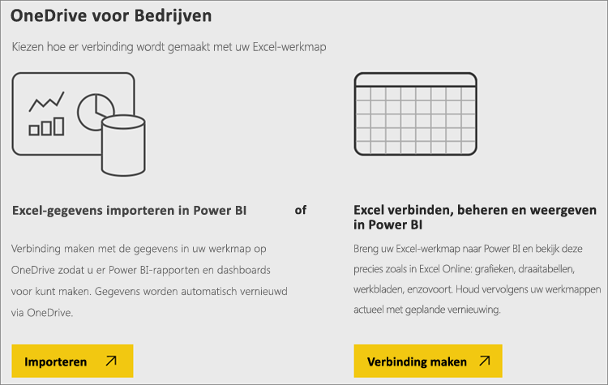
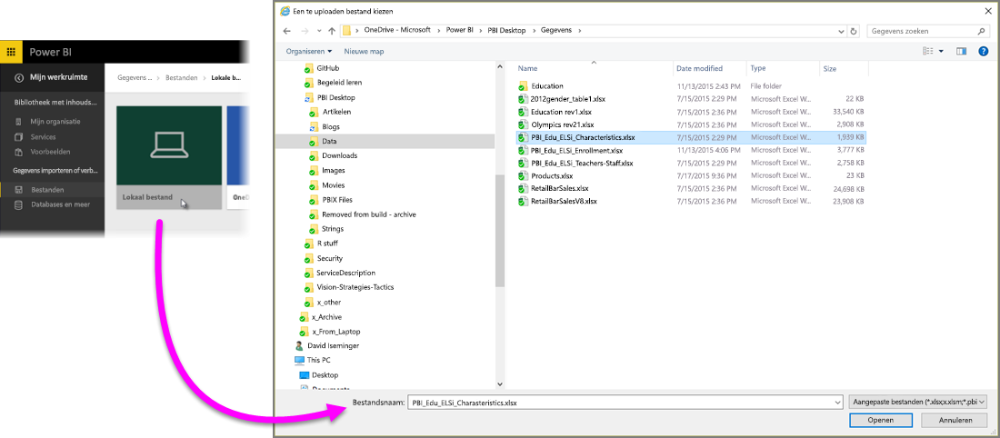
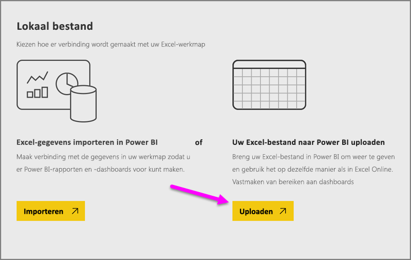
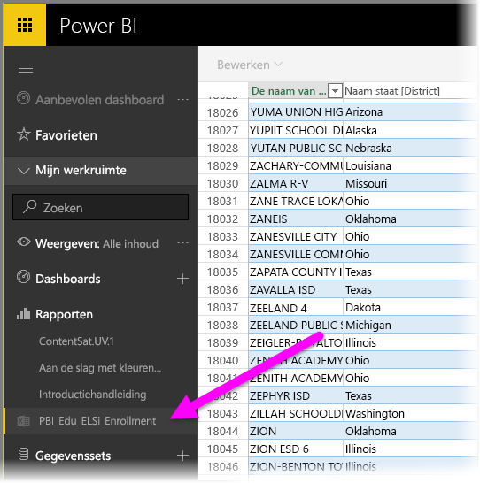

# Gegevens ophalen uit Excel-werkmappen

Microsoft Excel is een van de meest gebruikte bedrijfstoepassingen. Het is ook een van de meest gebruikelijke manieren om uw gegevens naar Power BI te versturen.

## Welke soorten werkmappen ondersteunt Power BI?
Power BI biedt ondersteuning voor het importeren van en verbinding maken met werkmappen die zijn gemaakt in Excel 2007 en hoger. Werkmappen moeten als .xlsx- of xlsm-bestand zijn opgeslagen en kleiner dan 1 GB zijn. Sommige functies die in dit artikel worden beschreven, zijn alleen beschikbaar in latere versies van Excel.

### Werkmappen met bereiken of tabellen met gegevens
Als uw werkmap eenvoudige werkbladen met gegevensbereiken bevat, kunt u die bereiken het beste opmaken als tabellen zodat u in Power BI alles uit uw gegevens kunt halen. Op deze manier worden er bij het maken van rapporten in Power BI tabellen en kolommen met naam weergegeven in het deelvenster Velden, waardoor het veel eenvoudiger is om uw gegevens te visualiseren.

### Werkmappen met gegevensmodellen
Werkmappen kunnen een gegevensmodel bevatten met een of meer tabellen waarin gegevens zijn geladen met behulp van gekoppelde tabellen, Power Query (Ophalen en Transformeren in Excel 2016) of Power Pivot. Power BI biedt ondersteuning voor alle eigenschappen van gegevensmodellen, zoals relaties, metingen, hiërarchieën en KPI's.

> [!NOTE]
> Werkmappen met gegevensmodellen kunnen niet worden gedeeld tussen Power BI-tenants. Een gebruiker die zich bijvoorbeeld bij Power BI aanmeldt met een *contoso.com*-account, kan niet een Excel-werkmap delen met een gebruiker die zich aanmeldt met een Power BI-aanmeldingsaccount van *woodgrovebank.com*.
> 
> 

### Werkmappen met verbindingen met externe gegevensbronnen
Als u Excel gebruikt om verbinding te maken met een externe gegevensbron, kunt u, zodra uw werkmap in Power BI staat, rapporten en dashboards maken die zijn gebaseerd op gegevens van de verbonden gegevensbron. U kunt ook Geplande vernieuwing instellen om automatisch direct verbinding met de gegevensbron te maken en updates op te halen. U hoeft dan niet meer handmatig te vernieuwen vanuit het tabblad Gegevens in Excel. Alle visualisaties in rapporten en tegels in dashboards die zijn gebaseerd op gegevens van die gegevensbron, worden automatisch bijgewerkt. Zie [Gegevens vernieuwen in Power BI](refresh-data.md) voor meer informatie.

### Werkmappen met Power View-bladen, draaitabellen en grafieken
Hoe uw Power View-bladen, draaitabellen en grafieken worden weergegeven (of niet worden weergegeven) in Power BI, is afhankelijk van waar uw werkmap is opgeslagen en hoe u deze in Power BI importeert. Hieronder gaan we daar dieper op in.

## Gegevenstypen
Power BI ondersteunt de volgende gegevenstypen: Geheel getal, Decimaal getal, Valuta, Datum, Waar/Onwaar, Tekst. Het markeren van gegevens als specifieke gegevenstypen in Excel verbetert uw gebruikservaring met Power BI.

## Uw werkmap voorbereiden voor Power BI
Bekijk deze handige video voor meer informatie over hoe u ervoor zorgt dat uw Excel-werkmappen gereed zijn voor Power BI.

<iframe width="500" height="281" src="https://www.youtube.com/embed/l2wy4XgQIu0" frameborder="0" allowfullscreen></iframe>

## Het maakt een verschil waar uw werkmap wordt opgeslagen
**Lokaal**: als u de werkmap opslaat op een lokaal station op uw computer of op een andere locatie binnen uw organisatie, kunt u het bestand in Power BI laden. Het bestand blijft op het lokale station staan. Het bestand wordt dus eigenlijk niet echt geïmporteerd in Power BI. Wat er wel gebeurt, is dat er een nieuwe gegevensset wordt gemaakt in Power BI en dat de gegevens en het gegevensmodel (indien van toepassing) in de gegevensset worden geladen. Als uw werkmap Power View-werkbladen bevat, worden deze weergegeven op de Power BI-site, onder Rapporten. Excel 2016 heeft ook de functie **Publiceren** (onder het menu **Bestand**). **Publiceren** doet in feite hetzelfde als wanneer u **Gegevens ophalen > Bestanden > Lokaal bestand** gebruikt vanuit Power BI, maar het is vaak eenvoudiger om uw gegevensset in Power BI bij te werken als u regelmatig wijzigingen in de werkmap aanbrengt.

**OneDrive Bedrijven**: als u OneDrive voor Bedrijven hebt en zich aanmeldt met hetzelfde account als voor Power BI, is dit verreweg de meest efficiënte manier om uw werk in Excel te houden en uw gegevensset, rapporten en dashboards in Power BI gesynchroniseerd te houden. Omdat zowel Power BI als OneDrive zich in de cloud bevinden, maakt Power BI ongeveer om het uur *verbinding* met uw werkmap in OneDrive. Als er wijzigingen worden gevonden, worden uw gegevensset, rapporten en dashboards in Power BI automatisch bijgewerkt. Net zoals wanneer u uw werkmap op een lokaal station hebt opgeslagen, kunt u Publiceren ook gebruiken om uw gegevensset en rapporten in Power BI onmiddellijk bij te werken. Anders wordt Power BI automatisch gesynchroniseerd, meestal binnen een uur.

**OneDrive - Persoonlijk**: als u de werkmappen opslaat in uw eigen OneDrive-account, geniet u veelal dezelfde voordelen als met OneDrive voor Bedrijven. Het belangrijkste verschil is dat wanneer u voor het eerst verbinding maakt met het bestand (met Gegevens ophalen > Bestanden > OneDrive - Persoonlijk), u zich bij OneDrive moet aanmelden met uw Microsoft-account. Dit is doorgaans een ander account dan het account dat u gebruikt om u aan te melden bij Power BI. Wanneer u zich met uw Microsoft-account aanmeldt bij OneDrive, moet u ervoor zorgen dat u het selectievakje Aangemeld blijven inschakelt. Op deze manier kan er om het uur verbinding via Power BI worden gemaakt met uw werkmap en zorgt u ervoor dat uw gegevensset en rapporten in Power BI worden gesynchroniseerd.

**SharePoint - Teamsites**: als u uw Power BI Dekstop-bestanden wilt opslaan naar SharePoint - Teamsites, doet u dit op vrijwel dezelfde manier als bij OneDrive voor Bedrijven. Het grootste verschil is de manier waarop u vanuit Power BI verbinding maakt met het bestand. U kunt een URL opgeven of verbinding maken met de hoofdmap.

## Twee manieren om een Excel-werkmap te gebruiken
Als u uw werkmappen naar **OneDrive** opslaat, kunt u op een aantal manieren uw gegevens in Power BI verkennen

### Excel-gegevens importeren in Power BI
Als u **Importeren** kiest, worden alle ondersteunde gegevens in tabellen en/of een gegevensmodel in een nieuwe gegevensset in Power BI geïmporteerd. Als u Power View-werkbladen hebt, worden deze opnieuw gemaakt in Power BI als rapporten.

U kunt uw werkmap blijven bewerken. Wanneer uw wijzigingen worden opgeslagen, worden ze gesynchroniseerd met de gegevensset in Power BI, meestal binnen een uur. Als u sneller resultaat nodig hebt, kunt u Opnieuw publiceren selecteren zodat uw wijzigingen direct worden geëxporteerd. Alle visualisaties in uw rapporten en dashboards worden ook bijgewerkt.

Kies deze optie als u gegevens ophalen en transformeren of Power Pivot hebt gebruikt om gegevens in een gegevensmodel te laden, of als uw werkmap Power View-bladen bevat met visualisaties die u in Power BI wilt weergeven.

In Excel 2016 kunt u ook Publiceren > Exporteren gebruiken. Dit werkt eigenlijk hetzelfde. Zie [Vanuit Excel 2016 publiceren naar Power BI](service-publish-from-excel.md) voor meer informatie.

### Excel verbinden, beheren en weergeven in Power BI
Wanneer u de optie **Verbinden** kiest, wordt uw werkmap weergegeven in Power BI, precies zoals in Excel Online. Maar anders dan in Excel Online hebt u een aantal handige functies waarmee u elementen uit uw werkbladen direct aan uw dashboards kunt vastmaken.

U kunt uw werkmap niet in Power BI bewerken. Maar als u wijzigingen wilt aanbrengen, kunt u op Bewerken klikken en uw werkmap vervolgens bewerken in Excel Online of openen in Excel op uw computer. Eventuele wijzigingen worden opgeslagen in de werkmap op OneDrive.

Wanneer u op deze manier werkt, wordt er geen gegevensset in Power BI gemaakt. Uw werkmap wordt weergegeven in het navigatiedeelvenster in de Power BI-werkruimte, onder Rapporten. Verbonden werkmappen hebben een speciaal Excel-pictogram.

Selecteer deze optie als er alleen gegevens in de werkbladen staan of als u bereiken, draaitabellen en grafieken hebt die u op dashboards wilt vastmaken.

In Excel 2016 kunt u ook Publiceren > Uploaden gebruiken. Dit werkt eigenlijk hetzelfde. Zie [Vanuit Excel 2016 publiceren naar Power BI](service-publish-from-excel.md) voor meer informatie.

## Een Excel-werkmap importeren of ermee verbinding maken vanuit Power BI
1. Klik in Power BI in het navigatievenster op **Gegevens ophalen**.
   
   
2. Klik in Bestanden op **Ophalen**.
   
   
3. Zoek het bestand.
   
   
4. Als uw werkmap op OneDrive of SharePoint - Teamsites staat, kiest u **Importeren** of **Verbinden**.

## Lokale Excel-werkmappen
U kunt ook een lokaal Excel-bestand gebruiken en deze naar Power BI uploaden. Selecteer in het vorige menu **Lokaal bestand** en navigeer vervolgens naar de locatie waar u uw Excel-werkmappen hebt opgeslagen.

Zodra u de locatie heb geselecteerd, kiest u voor Uw bestand uploaden naar Power BI.

Wanneer de werkmap is geüpload, ontvangt u een melding dat de werkmap gereed is.

Als de werkmap klaar is, kunt u deze vinden in het gedeelte **Rapporten** van Power BI.

## Van Excel 2016 naar uw Power BI-site publiceren
De functie **Publiceren naar Power BI** in Excel 2016 werkt vrijwel hetzelfde als wanneer u **Gegevens ophalen** in Power BI gebruikt om uw bestand te importeren of ermee verbinding te maken. We gaan er hier niet diep op in, maar u kunt [Vanuit Excel 2016 publiceren naar Power BI](service-publish-from-excel.md) bekijken voor meer informatie.

## Problemen oplossen
Is de werkmap te groot? Zie [De grootte van een Excel-werkmap reduceren voor weergave in Power BI](reduce-the-size-of-an-excel-workbook.md).

Wanneer u Importeren kiest, importeert Power BI momenteel alleen gegevens die deel uitmaken van een tabel of gegevensmodel met een naam. Dit betekent dat als de werkmap geen tabellen, Power View-bladen of Excel-gegevensmodellen met naam bevat, er mogelijk de volgende fout wordt weergegeven: **We couldn't find any data in your Excel workbook** (We kunnen geen gegevens in uw Excel-werkmap vinden). In [dit artikel](service-admin-troubleshoot-excel-workbook-data.md) wordt uitgelegd hoe u uw werkmap kunt herstellen en opnieuw importeren.

## Volgende stappen
**Verken uw gegevens**: wanneer u gegevens en rapporten uit het bestand in Power BI hebt geïmporteerd, kunt u ze verkennen. Klik met de rechtermuisknop op de nieuwe gegevensset en klik op Verkennen. Als u bij stap 4 verbinding hebt gemaakt met een werkmap op OneDrive, wordt uw werkmap in Rapporten weergegeven. Wanneer u erop klikt, wordt deze in Power BI geopend, net zoals wanneer deze in Excel Online zou staan.

**Vernieuwen plannen**: als uw Excel-werkmap verbinding met externe gegevensbronnen maakt, of u vanaf een lokaal station hebt geïmporteerd, kunt u gepland vernieuwen instellen om ervoor te zorgen dat uw gegevensset of rapport altijd actueel is. In de meeste gevallen is het instellen van geplande vernieuwing eenvoudig, maar de uitleg hiervan valt buiten het bereik van dit artikel. Zie [Gegevens vernieuwen in Power BI](refresh-data.md) voor meer informatie.

[Vanuit Excel 2016 publiceren naar Power BI](service-publish-from-excel.md)

[Power BI Publisher voor Excel](publisher-for-excel.md)

[Gegevens vernieuwen in Power BI](refresh-data.md)

