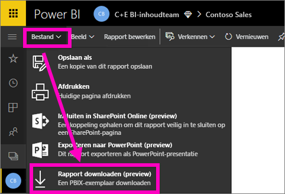
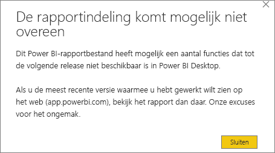
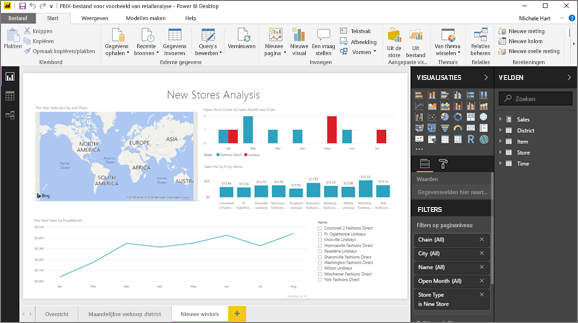

# Een rapport vanuit de Power BI-service exporteren naar Desktop (preview-versie)
In Power BI Desktop kunt u een rapport exporteren (ook wel *downloaden* genoemd) naar de Power BI-service door het rapport op te slaan en **Publiceren** te kiezen. U kunt ook de andere kant op exporteren en een rapport downloaden van de Power BI-service naar Desktop. De extensie voor bestanden die worden geëxporteerd in beide richtingen is *.pbix*.

U moet rekening houden met enkele beperkingen en overwegingen; deze worden later in dit artikel besproken.

## Het rapport downloaden als een .pbix-bestand
Volg deze stappen om het .pbix-bestand te downloaden:

1. Open in de **Power BI-service** het rapport dat u wilt downloaden in [Bewerkweergave](service-reading-view-and-editing-view.md).
2. Selecteer **Bestand > Rapport downloaden** in de menubalk.
   
   > [!NOTE]
   > Het rapport moet zijn [gemaakt met Power BI Desktop](guided-learning/publishingandsharing.yml#step-2) na 23 november 2016 (en sindsdien zijn bijgewerkt) om het te kunnen downloaden. Als dit niet het geval is, is de optie *Rapport downloaden* in de Power BI-service niet beschikbaar.
   > 
   > 
3. Terwijl het .pbix-bestand wordt gemaakt, wordt de voortgang weergegeven in een statusbanner. Wanneer het bestand klaar is, wordt u gevraagd om het .pbix-bestand te openen of op te slaan. De naam van het bestand komt overeen met de titel van het rapport.
   
    
   
    U hebt nu de optie om het . pbix-bestand te openen in de Power BI-service (app.powerbi.com) of Power BI Desktop.     
4. Als u het rapport direct in Desktop wilt openen, selecteert u **Openen**. Selecteer **Opslaan > Opslaan-als** om het bestand op een specifieke locatie op te slaan. Als u dat nog niet hebt gedaan, [installeert u Power BI Desktop](desktop-get-the-desktop.md).
   
    Wanneer u het rapport opent in Desktop, wordt mogelijk een waarschuwingsbericht weergegeven waarin staat dat sommige functies die beschikbaar zijn in het rapport van de Power BI-service mogelijk niet beschikbaar zijn in Desktop.
   
    

5. De rapporteditor in Desktop lijkt erg veel op de rapporteditor in Power BI-service.  
   
    

## Aandachtspunten en probleemoplossing
Er zijn enkele belangrijke overwegingen en beperkingen met betrekking tot het downloaden (exporteren) van een *.pbix*-bestand van de Power BI-service.

* Om het bestand te downloaden, moet u bewerkingstoegang tot het rapport hebben.
* Het rapport moet zijn gemaakt met **Power BI Desktop** en moet zijn *gepubliceerd* naar de **Power BI-service**, of het .pbix-bestand moet zijn *geüpload* naar de service.
* Rapporten moeten zijn gepubliceerd of bijgewerkt na 23 november 2016. Rapporten die voor deze datum zijn gepubliceerd, kunnen niet worden gedownload.
* Deze functie werkt niet met rapporten die oorspronkelijk zijn gemaakt in de **Power BI-service**, met inbegrip van inhoudspakketten.
* U moet altijd de nieuwste versie van **Power BI Desktop** gebruiken wanneer u gedownloade bestanden opent. Gedownloade *.pbix*-bestanden kunnen mogelijk niet worden geopend in versies van **Power BI Desktop** die niet up-to-date zijn.
* Als uw beheerder de mogelijkheid om gegevens te exporteren heeft uitgeschakeld, is deze functie niet meer zichtbaar in de **Power BI-service**.

## Volgende stappen
Bekijk de één minuut durende video **Guy in a Cube** over deze functie:

<iframe width="560" height="315" src="https://www.youtube.com/embed/ymWqU5jiUl0" frameborder="0" allowfullscreen></iframe>

Hier zijn nog enkele aanvullende artikelen met meer informatie over het gebruiken van **Power BI-service**:

* [Rapporten in Power BI](service-reports.md)
* [Power BI - basisconcepten](service-basic-concepts.md)

Als u **Power BI Desktop** hebt geïnstalleerd, kunt u met de volgende inhoud snel van start:

* [Aan de slag met Power BI Desktop](desktop-getting-started.md)

Nog vragen? [Misschien dat de Power BI-community het antwoord weet](http://community.powerbi.com/)   

