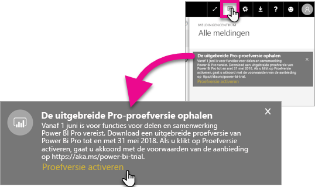
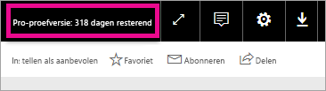

# De verlengde Pro-proefversie activeren
Vanaf 1 juni 2017 kunnen alle in aanmerking komende gebruikers zich aanmelden voor de verlengde Pro-proefversie voor de Power BI-service.

<iframe width="640" height="360" src="https://www.youtube.com/embed/tPsNoPyY9aA?showinfo=0" frameborder="0" allowfullscreen></iframe>

Als onderdeel van de [aankondiging van Power BI Premium op 3 mei 2017](https://powerbi.microsoft.com/blog/microsoft-accelerates-modern-bi-adoption-with-power-bi-premium/) heeft, Microsoft wijzigingen in de gratis Power BI-service aangekondigd die 1 juni 2017 van kracht worden. Deze wijzigingen omvatten uitgebreide toegang tot alle gegevensbronnen, hogere opslaglimieten voor werkruimten en hogere vernieuwings- en streamingfrequenties voor de gratis service, waardoor deze gelijk is aan Power BI Pro.

Er is ook aangekondigd dat functies voor delen en samenwerken uitsluitend van toepassing zijn op Power BI Pro-gebruikers. Hiertoe behoren functies als peer-to-peer delen van dashboards, groepswerkruimten (nu app-werkruimten genoemd), exporteren naar PowerPoint en analyseren in Excel met Power BI-apps. Het exporteren naar CSV/Excel en PowerPoint zijn in het bericht van 3 mei aangeduid als een functie die is beperkt tot Power BI Pro, maar na ontvangst van feedback van de brede gebruikersgemeenschap is de strategie verder ontwikkeld om de mogelijkheid ook beschikbaar te stellen aan gebruikers van de gratis service.

Vanaf 1 juni 2017 komen bestaande gebruikers van de gratis service die in het afgelopen jaar (op of vóór 2 mei 2017 zijn) actief zijn geweest, in aanmerking voor een gratis, 12 maanden durende verlengde evaluatieversie van Power BI Pro. Dankzij dit aanbod kunnen gebruikers het komende jaar profiteren van de volledige functionaliteit van Power BI Pro. Dit is een blijk van waardering aan de community en gebruikers hebben zo de tijd om zich aan te passen aan de veranderingen.

Op 1 juni 2017 ontvangen gebruikers die daarvoor in aanmerking komen een melding wanneer ze zich aanmelden bij de service. Deze melding geeft aan dat de wijzigingen van kracht zijn geworden en gebruikers worden gevraagd zich te registreren voor de verlengde Power BI Pro-proefversie. De IT-beheerder van een gebruiker heeft geen controle over de meldingen in het product en hij kan zich ook niet namens een gebruiker registreren voor de verlengde Power BI Pro-proefversie. Elke gebruiker die daarvoor in aanmerking komt, moet zelf actie ondernemen om dit proces te voltooien.

Gebruikers kunnen er op elk gewenst moment tijdens de periode van 12 maanden voor kiezen om zich te registreren voor de aanbieding. De verlengde Pro-proefversie wordt echter voor alle gebruikers beëindigd op 31 mei 2018, ongeacht of ze het aanbod wel of niet accepteren. Op dit moment hebben gebruikers de optie om Power BI Pro te kopen of om te worden omgezet naar de gratis versie van Power BI, zonder de mogelijkheden voor delen en samenwerking, als ze ervoor kiezen geen actie te ondernemen en Power BI Pro aan te schaffen.

Er worden geen wijzigingen aangebracht in Power BI Pro. De wijzigingen treffen deze gebruikers niet en ze ontvangen ook geen meldingen wanneer ze zich aanmelden bij de service op 1 juni 2017 of daarna. Gebruikers die het aanbod van de verlengde Power BI Pro-proefversie afwijzen of die niet in aanmerking komen voor het aanbod, blijven de gratis versie van Power BI gebruiken zonder de mogelijkheden tot delen en samenwerken. Ze kunnen zich op elk gewenst moment registreren voor een standaard Power BI Pro-proefversie van 60 dagen door naar de [website](https://powerbi.microsoft.com/get-started/) van Power BI te gaan.

## Geschiktheid voor verlengde Pro-proefversie
Uw account moet voldoen aan de volgende vereisten om in aanmerking te komen voor de aanbieding van de verlengde Pro-proefversie.

* Gebruikers van de gratis Power BI-versie die actief waren tussen 3 mei 2016 en 2 mei 2017 komen in aanmerking voor een verlengde Pro-proefversie.
* Gebruikers die de *Pro-proefversie van 60 dagen* eerder hebben gebruikt, of momenteel gebruiken, komen nog steeds in aanmerking voor de verlengde Pro-proefversie.

> [!NOTE]
> Gebruikers met licenties die zijn toegewezen op basis van de abonnementen op Power BI Pro of Power BI Pro-proefversie, binnen Office 365, zijn uitgesloten van deze aanbieding.
> 
> 

## Activeren
Er zijn twee manieren om de verlengde Pro-proefversie te activeren. Als eerste wanneer u zich aanmeldt bij Power BI. Als u dat hebt gesloten, ziet u ook een optie in het systeemvak.

> [!NOTE]
> De berichten in het product worden niet beheerd door de beheerder en gaan uit naar in aanmerking komende gebruikers.
> 
> 

### Ervaring bij het aanmelden
Wanneer u zich aanmeldt bij de Power BI-service en in aanmerking komt, ziet u een pop-upaankondiging. Wanneer u **Proefversie activeren** selecteert, wordt de verlengde Pro-proefversie gestart. Er is geen verdere actie vereist.

U hebt dan voor de duur van de evaluatieversie toegang tot alle bestaande gedeelde dashboards en rapporten.

Als u **Niet nu** hebt geselecteerd, kunt u de verlengde Pro-proefversie op elk gewenst moment activeren tot het einde van de proefperiode op 31 mei 2018.

### Activering op een later tijdstip
Als u het pop-upvenster hebt gesloten door **Niet nu** te selecteren, kunt u de verlengde Pro-proefversie op elk gewenst moment activeren tot het einde van de proefperiode op 31 mei 2018. Dit kunt u doen in het **Meldingencentrum**.

In het meldingencentrum ziet u een melding over de verlengde Pro-proefversie. De melding is beschikbaar totdat de gebruiker deze sluit.

In de melding kunt u **Proefversie activeren** selecteren om de proefversie te starten. Er is geen verdere actie vereist.

U hebt dan voor de duur van de evaluatieversie toegang tot alle bestaande gedeelde dashboards en rapporten.

## Na activering
Na activering ziet u rechtsboven hoeveel dagen u nog hebt in de proefversie.

U kunt de voorwaarden lezen in de [voorwaarden aanbieding Verlengde Pro-proefversie](https://aka.ms/power-bi-trial). De verlengde Pro-proefversie werkt tot en met 31 mei 2018 voor alle in aanmerking komende gebruikers.

## Veelgestelde vragen
**Wat gebeurt er met nieuwe gebruikers die zich hebben aangemeld na 3 mei 2017?**

Gebruikers die zich hebben geregistreerd voor Power BI op of na 3 mei 2017 komen niet in aanmerking voor de verlengde Power BI Pro-proefversie. Ze komen echter wel in aanmerking voor de gewone proefversie van 60 dagen.

**Hoe kom ik erachter wie in mijn organisatie in aanmerking komt voor de verlengde proefversie van Power BI Pro?**

Hoewel er geen directe manier is om dit vast te stellen, kunt u een rapport van Azure Active Directory genereren voor Power BI om te zien wie de actieve gebruikers zijn binnen uw organisatie in de afgelopen 30 dagen. Dit geeft u mogelijk een idee van wie in aanmerking komen. Zie [Power BI-gebruikers vinden die zich hebben geregistreerd](service-admin-access-usage.md) voor meer informatie.

Actieve gebruikers die zich voor of op de bovenstaande datum hebben geregistreerd, en die een gratis licentie hebben, ontvangen een pop-upmelding voor de verlenging. 

> [!NOTE]
> Het Azure AD-rapport geeft niet aan of een gebruiker de gratis versie of de Pro-versie van Power BI heeft. U ziet alleen welke gebruikers zich hebben geregistreerd voor Power BI en wanneer ze hebben ingelogd. Als gebruikers zijn opgenomen in dit rapport, betekent dit niet dat ze automatisch in aanmerking komen voor de verlengde Pro-proefversie.
> 
> 

**Kunnen beheerders een gebruiker ervan weerhouden de verlengde proefversie van Power BI Pro te activeren?**

Nee. Beheerders kunnen gebruikers er niet van weerhouden de verlengde proefversie van Power BI Pro te activeren of de Power BI Pro-proefversie van 60 dagen te activeren.

## Volgende stappen
[Voorwaarden aanbieding Verlengde Pro-proefversie](https://aka.ms/power-bi-trial)  
[Power BI-serviceovereenkomst voor afzonderlijke gebruikers](https://powerbi.microsoft.com/terms-of-service/)  
[Aankondiging Power BI Premium](https://aka.ms/pbipremium-announcement)  
[Power Bi-gebruikers zoeken die zich hebben aangemeld](service-admin-access-usage.md)

Nog vragen? [Misschien dat de Power BI-community het antwoord weet](https://community.powerbi.com/)

