# Microsoft Flow en Power BI

[Microsoft Flow](https://flow.microsoft.com/en-us/documentation/getting-started) is een SaaS voor het automatiseren van werkstromen voor het groeiende aantal apps en SaaS-services waarvan zakelijke gebruikers afhankelijk zijn. Met Flow kunt u taken automatiseren door uw favoriete apps en services (inclusief Power BI) te integreren om meldingen te ontvangen, bestanden te synchroniseren, gegevens te verzamelen en meer. U kunt eenvoudig herhalende taken uitvoeren door de werkstroom te automatiseren.

[Aan de slag met Flow.](https://flow.microsoft.com/documentation/getting-started)

Kijk hoe Sirui een stroom maakt waarmee een gedetailleerde e-mail naar collega's wordt verzonden wanneer een Power BI-waarschuwing wordt geactiveerd. Volg vervolgens de stapsgewijze instructies onder de video om het zelf te proberen.

<iframe width="560" height="315" src="https://www.youtube.com/embed/YhmNstC39Mw" frameborder="0" allowfullscreen></iframe>

## Een stroom maken die wordt geactiveerd door een Power BI-gegevensmelding

### Vereisten
In deze zelfstudie wordt uitgelegd hoe u twee verschillende stromen maakt: een stroom op basis van een sjabloon en een compleet nieuwe stroom. Als u alles op de voet wilt volgen, [maakt u een gegevensmelding in Power BI](service-set-data-alerts.md), maakt u een gratis Slack-account en [meldt u zich aan voor Microsoft Flow](https://flow.microsoft.com/en-us/#home-signup) (gratis).

## Een stroom maken die gebruikmaakt van Power BI - op basis van een sjabloon
In deze taak gebruiken we een sjabloon om een eenvoudige stroom te maken die wordt geactiveerd door een Power BI-gegevenswaarschuwing (melding).

1. Meld u aan bij Microsoft Flow (flow.microsoft.com).
2. Selecteer **Mijn stromen**.
   
   
3. Selecteer **Maken op basis van sjabloon**.
   
    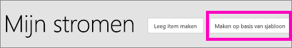
4. Gebruik het zoekvak om Power BI-sjablonen te zoeken en selecteer **Een e-mail versturen naar een doelgroep wanneer een waarschuwing met betrekking tot Power BI-gegevens wordt geactiveerd**.
   
    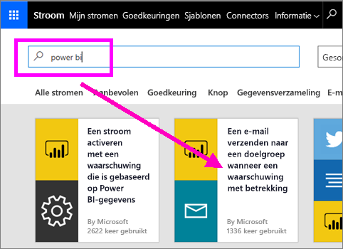

### De stroom bouwen
Deze sjabloon bevat één trigger (Power BI-gegevenswaarschuwing voor nieuwe Olympische medaille voor Ierland) en één actie (een e-mail versturen). Wanneer u een veld selecteert, wordt er dynamische inhoud in Flow weergegeven die u kunt opnemen.  In dit voorbeeld hebt we de waarde en de URL van de tegel opgenomen in de berichttekst.

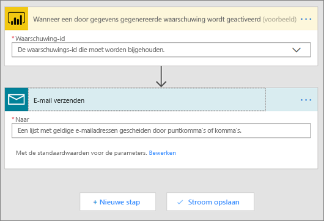

1. Selecteer in de vervolgkeuzelijst met triggers een Power BI-gegevenswaarschuwing. Selecteer **Nieuwe medaille voor Ierland**. Zie [Gegevenswaarschuwingen in Power BI](service-set-data-alerts.md) als u wilt weten hoe een waarschuwing maakt.
   
   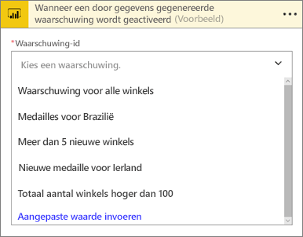
2. Voer één of meer geldige e-mailadressen in en selecteer vervolgens **Bewerken** (hieronder weergegeven) of **Dynamische inhoud toevoegen**. 
   
   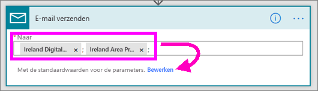

3. Flow maakt een titel en een bericht dat u kunt behouden of bewerken. Alle waarden die u hebt ingesteld toen u de waarschuwing in Power BI maakte, zijn beschikbaar voor uw gebruik. Plaats uw cursor en selecteer de waarden in het grijs gemarkeerde gebied. 

   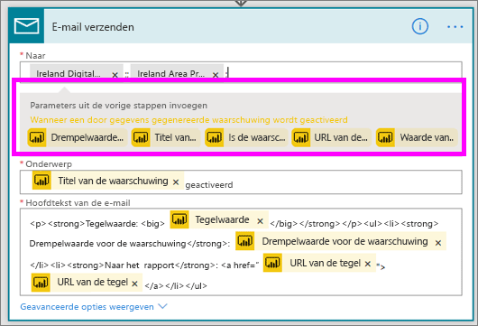

1.  Als u bijvoorbeeld een waarschuwingstitel in Power BI hebt gemaakt voor **We hebben nog een medaille gewonnen**, kunt u **Waarschuwingstitel** selecteren om die tekst toe te voegen aan het onderwerpsveld van uw e-mailbericht.

    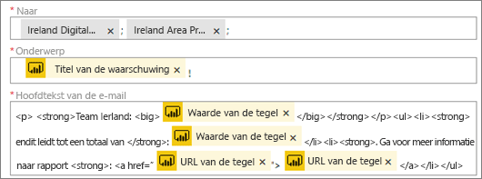

    En u kunt het standaard e-mailbericht behouden of uw eigen bericht maken. Het bovenstaande voorbeeld bevat enkele wijzigingen in het bericht.

1. Zodra u bent klaar bent, selecteert u **Stroom maken** of **Stroom opslaan**.  De stroom is gemaakt en geëvalueerd.  Als er fouten worden aangetroffen, laat Flow u dit weten.
2. Als er fouten worden aangetroffen, selecteert u **Stroom bewerken** om ze te corrigeren. Selecteer anders **Gereed** om de nieuwe stroom uit te voeren.
   
   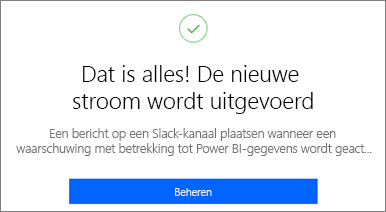
5. Wanneer de gegevenswaarschuwing wordt geactiveerd, wordt er een e-mail verzonden naar de door u opgegeven adressen.  
   
   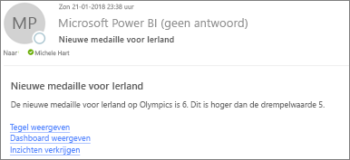

## Een stroom maken die gebruikmaakt van Power BI - compleet nieuw (leeg)
In deze taak maken we een eenvoudige maar volledig nieuwe stroom die wordt geactiveerd door een Power BI-gegevenswaarschuwing (melding).

1. Meld u aan bij Microsoft Flow.
2. Selecteer **Mijn stromen** > **Nieuwe stroom maken**.
   
   
3. Gebruik het zoekvak om een Power BI-trigger te zoeken en selecteer **Power BI - wanneer gegevensgebaseerde waarschuwing wordt geactiveerd**.

### Uw stroom maken
1. Selecteer in de vervolgkeuzelijst de naam van de waarschuwing.  Zie [Gegevenswaarschuwingen in Power BI](service-set-data-alerts.md) als u wilt weten hoe een waarschuwing maakt.
   
    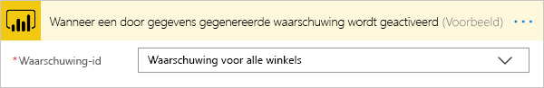
2. Selecteer **Nieuwe stap** > **Een actie toevoegen**.
   
   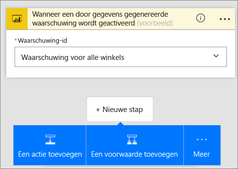
3. Zoek **Outlook** en selecteer **Gebeurtenis maken**.
   
   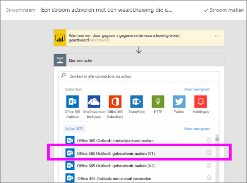
4. Vul de gebeurtenisvelden in. Wanneer u een veld selecteert, wordt er dynamische inhoud in Flow weergegeven die u kunt opnemen.
   
   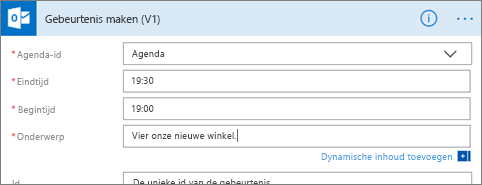
5. Als u klaar bent, selecteert u **Stroom maken**.  De stroom wordt opgeslagen in Flow en geëvalueerd. Als er geen fouten zijn, selecteert u **Gereed** om de stroom uit te voeren.  De nieuwe stroom wordt toegevoegd aan de pagina **Mijn stromen**.
   
   
6. Wanneer de stroom wordt geactiveerd door uw Power BI-gegevenswaarschuwing, ontvangt u een Outlook-gebeurtenismelding die vergelijkbaar is met de volgende.
   
    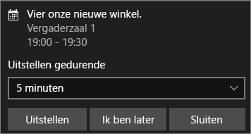

## Volgende stappen
* [Aan de slag met Microsoft-Flow](https://flow.microsoft.com/en-us/documentation/getting-started/)
* [Gegevenswaarschuwingen instellen in de Power BI-service](service-set-data-alerts.md)
* [Gegevenswaarschuwingen instellen op uw iPhone](mobile-set-data-alerts-in-the-mobile-apps.md)
* [Gegevenswaarschuwingen instellen in de mobiele Power BI-app voor Windows 10](mobile-set-data-alerts-in-the-mobile-apps.md)
* Nog vragen? [Misschien dat de Power BI-community het antwoord weet](http://community.powerbi.com/)

