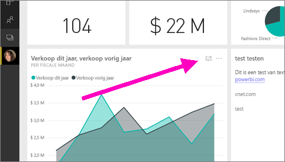
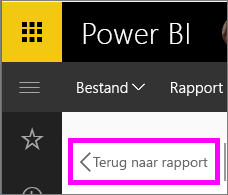

# Een dashboardtegel of rapportvisual weergeven in de focusmodus
<iframe width="560" height="315" src="https://www.youtube.com/embed/dtdLul6otYE" frameborder="0" allowfullscreen></iframe>

## Wat is de focusmodus?
In de ***focusmodus*** kunt u een dashboardtegel of rapportvisual uitbreiden (pop out) om meer details weer te geven.  U kunt in de focusmodus filters bekijken en wijzigen die zijn toegepast op het moment dat de visual is gemaakt.  

> [!NOTE]
> De focusmodus is niet hetzelfde als de [modus Volledig scherm](service-tile-fullscreen-mode.md).
> 
> 

1. Beweeg de muisaanwijzer over een tegel of visual en selecteer het pictogram **Focusmodus** .  
   
   
2. De tegel of visual wordt geopend en op het volledige canvas weergegeven. De focusmodus voor dashboardtegels en rapportvisualisaties is vrijwel identiek, maar er zijn enkele verschillen. Als u de focusmodus voor een rapport wilt sluiten, selecteert u **Terug naar rapport**. En als u de focusmodus voor een dashboard wilt sluiten, selecteert u **Focusmodus sluiten**. Zie **Overwegingen en probleemoplossing** hieronder voor andere verschillen.
   
   
3. Vouw het deelvenster Filters uit om alle filters weer te geven die zijn toegepast op deze visual.
   
   
4. U kunt verder experimenteren door de filters te wijzigen en, als u iets interessants ontdekt, de visual vastmaken aan een dashboard.   
5. U kunt de focusmodus sluiten en terugkeren naar het dashboard door **< Focusmodus sluiten** te selecteren (in de linkerbovenhoek van de visual).
   
        
   
    U kunt de focusmodus sluiten en terugkeren naar de rapportpagina door **Terug naar rapport** te selecteren.    
   
    

## Van de focusmodus naar een volledig scherm schakelen
Zodra u zich in de focusmodus bevindt, kunt u de tegel of visual [weergeven in een volledig scherm (tv-modus.)](service-tile-fullscreen-mode.md) In de modus Volledig scherm worden er geen menu's en navigatieknoppen weergegeven.

## Overwegingen en probleemoplossing
* Als u de focusmodus gebruikt voor een visualisatie in een rapport, kunt u alle filters weergeven en wijzigen, zowel op het niveau van visuele elementen, op paginaniveau als op rapportniveau.    
* Als u de focusmodus gebruikt voor een visualisatie in een dashboard, kunt u alleen de filters op het niveau van de visuele elementen weergeven en wijzigen.

Nog vragen? [Misschien dat de Power BI-community het antwoord weet](http://community.powerbi.com/).

