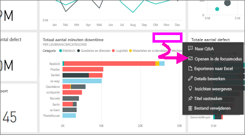
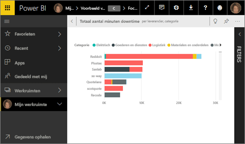
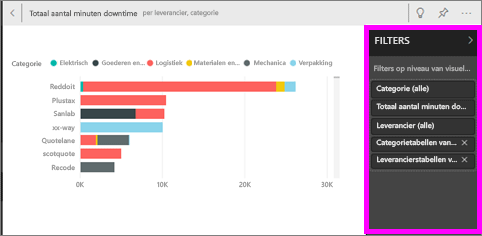
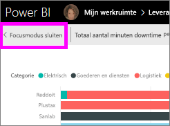

# Een dashboardtegel of rapportvisual weergeven in de focusmodus

<iframe width="560" height="315" src="https://www.youtube.com/embed/dtdLul6otYE" frameborder="0" allowfullscreen></iframe>

## Wat is de focusmodus?

U kunt met de modus ***Focus*** inhoud uitbreiden (pop-out) voor meer details.  In de focusmodus kunt u filters bekijken en wijzigen die zijn toegepast op het moment dat de visual is gemaakt.  In de Power BI-service kunt u de focusmodus gebruiken bij een dashboardtegel of rapportvisual en in Power BI Desktop kunt u de focusmodus voor een [rapportvisual](desktop-report-view.md) gebruiken.

> [!NOTE]
> De focusmodus is niet hetzelfde als de [modus Volledig scherm](service-fullscreen-mode.md).
> 

## Focusmodus voor dashboardtegels

1. Beweeg de muisaanwijzer over de tegelvisualisatie, selecteer het beletselteken (...) en kies **Openen in de focusmodus**. 

    .

2. De tegel wordt geopend en op het volledige rapportcanvas weergegeven. 

   

3. Vouw het deelvenster Filters uit om alle filters weer te geven die zijn toegepast op deze visual.
   
   

4. U kunt verder experimenteren door de filters te wijzigen en, als u iets interessants ontdekt, de visual vastmaken aan een dashboard.

5. U kunt de focusmodus sluiten en terugkeren naar het dashboard door **< Focusmodus sluiten** te selecteren (in de linkerbovenhoek van de visual).
   
        

## Focusmodus voor rapportvisualisaties

1. Beweeg de muisaanwijzer over de rapportvisualisatie en selecteer het pictogram **Focusmodus** .  
   
   
2. De visualisatie wordt geopend en op het volledige canvas weergegeven. 

   
3. Vouw het deelvenster Filters uit om alle filters weer te geven die zijn toegepast op deze visual.
   
   
4. U kunt verder experimenteren door de filters te wijzigen en, als u iets interessants ontdekt, de visual vastmaken aan een dashboard.   
5. U kunt de focusmodus sluiten en terugkeren naar het rapport door **< Terug naar rapport** te selecteren (in de linkerbovenhoek van de visual). 
   
      

## Van de focusmodus naar een volledig scherm schakelen
Zodra u zich in de focusmodus bevindt, kunt u de tegel of visual [weergeven in een volledig scherm (tv-modus.)](service-fullscreen-mode.md) In de modus Volledig scherm worden er geen menu's en navigatieknoppen weergegeven.

## Aandachtspunten en probleemoplossing
* Als u de focusmodus gebruikt voor een visualisatie in een rapport, kunt u alle filters weergeven en wijzigen, zowel op het niveau van visuals, op paginaniveau, bij drillthrough als op rapportniveau.    
* Als u de focusmodus gebruikt voor een visualisatie in een dashboard, kunt u alleen de filters op het niveau van de visuele elementen weergeven en wijzigen.

Hebt u nog vragen? [Misschien dat de Power BI-community het antwoord weet](http://community.powerbi.com/)

