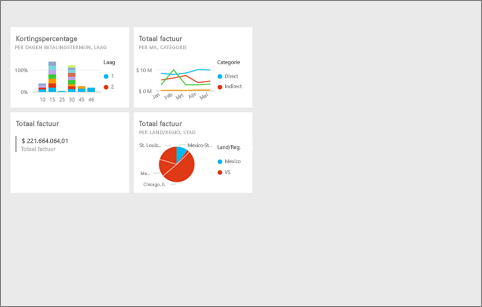
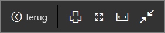
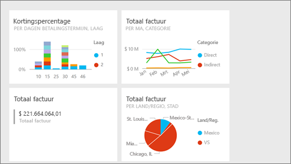
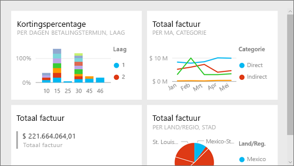

# De modus Volledig scherm in de Power BI-service
## Wat is de modus Volledig scherm?

Geef uw Power BI-inhoud (dashboards, rapportpagina's, tegels en visualisaties) weer zonder de afleiding van menu's en navigatiebalken.  U kunt uw tegel zonder andere storende factoren weergeven op het volledige scherm. Dit wordt ook wel de tv-modus genoemd. Welke functionaliteit beschikbaar is in de modus Volledig scherm, is afhankelijk van de inhoud. 

Als u Power BI mobiel gebruikt, [is de modus Volledig scherm beschikbaar voor Windows 10 Mobile-apps](mobile-windows-10-app-presentation-mode.md). Power BI Desktop beschikt niet over een modus Volledig scherm voor rapporten of visualisaties, maar heeft wel de optie Passend op pagina voor de [relatieweergave](desktop-report-view.md) en de [focusmodus voor rapportvisuals](service-focus-mode.md).

 

Enkele gebruikstoepassingen voor de modus Volledig scherm zijn:

* Uw dashboard, tegel, visual of rapport op een vergadering of conferentie presenteren.
* Het element op kantoor weergeven op een speciaal groot scherm of projector.
* Het element op een klein scherm weergeven.
* Controle in de vergrendelde modus: u kunt het scherm aanraken of de muis over tegels bewegen zonder het onderliggende rapport te openen.

> **Opmerking**: de modus Volledig scherm is niet hetzelfde als de [focusmodus (pop-outmodus)](service-focus-mode.md).
> 
> 

Kijk hoe Amanda haar dashboard in de modus Volledig scherm opent en navigeert, en vervolgens met enkele URL-parameters de standaardweergave bestuurt. Gebruik vervolgens de stapsgewijze instructies onder de video om het zelf te proberen.

<iframe width="560" height="315" src="https://www.youtube.com/embed/c31gZkyvC54" frameborder="0" allowfullscreen></iframe>

## Dashboards en rapportpagina's in de modus Volledig scherm
1. Selecteer in de menubalk van Power BI boven uw dashboard of rapport het pictogram **Volledig scherm** . Uw dashboardcanvas of rapportpagina wordt schermvullend weergegeven. Het voorbeeld hieronder is een dashboard.
   
      
2. In de modus Volledig scherm hebt u diverse menuopties.  Als u het menu wilt weergeven, beweegt u de muisaanwijzer of cursor. 
   
     Menu voor dashboards    
         
   
     Menu voor rapportpagina's    
        
   
        
    Met de knop **Terug** gaat u naar de vorige pagina in uw browser. Als de vorige pagina een Power BI-pagina was, wordt deze weergegeven in de modus Volledig scherm.  De modus Volledig scherm blijft actief totdat u de modus afsluit.
   
        
    Met deze knop drukt u uw dashboard of rapportpagina af in de modus Volledig scherm. 
   
        
    Met de knop **Aanpassen aan scherm** geeft u het dashboard zo groot mogelijk weer, zonder schuifbalken.     
   
    
   
           
    Soms hebt u geen behoefte aan schuifbalken, maar wilt u dat het dashboard wordt weergegeven over volledige breedte van de beschikbare ruimte. Selecteer de knop **Aanpassen aan breedte**.    
   
    
   
           
    Wanneer rapporten op het volledige scherm worden weergegeven, gebruikt u deze pijlen om door de pagina's in het rapport te bladeren.    
3. Als u de modus Volledig scherm wilt afsluiten, selecteert u het pictogram **Volledig scherm afsluiten**.
   
      

## Visualisaties en dashboardtegels in modus Volledig scherm
1. Als u dashboardtegels en rapportvisualisaties wilt weergeven in de modus Volledig scherm, moet u eerst die tegel of visualisatie direct in de [focusmodus](service-focus-mode.md) openen. 
   
    
2. Vervolgens selecteert u het pictogram Volledig scherm   voor die tegel of visual. De tegel of visual wordt weergegeven op het volledige scherm, zonder menu's of navigatiebalken.
   
    

## Volgende stappen
[Dashboards in Power BI](service-dashboards.md)  
[Focusmodus](service-focus-mode.md)    

Hebt u nog vragen? [Misschien dat de Power BI-community het antwoord weet](http://community.powerbi.com/)

