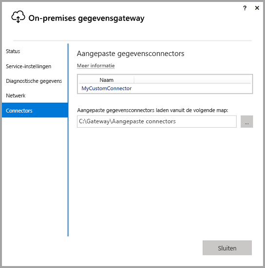
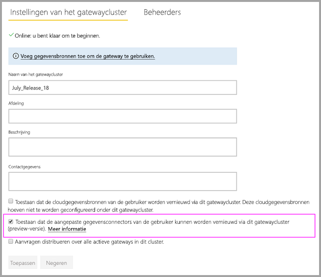
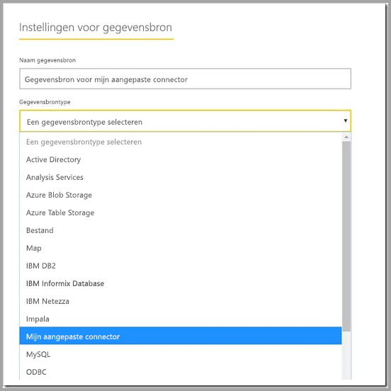

# Aangepaste gegevensconnectoren gebruiken met de on-premises gegevensgateway

Met gegevensconnectoren voor Power BI kunt u verbinding maken met en toegang krijgen tot gegevens vanuit een toepassing, service of gegevensbron. U kunt aangepaste gegevensconnectoren ontwikkelen en deze gebruiken in Power BI Desktop.

Bekijk [hier](http://aka.ms/dataconnectors) onze documentatie voor meer informatie over het ontwikkelen van aangepaste gegevensconnectoren voor Power BI.

Wanneer u in Power BI Desktop rapporten bouwt die gebruikmaken van aangepaste gegevensconnectoren, kunt u de on-premises gegevensgateway gebruiken om deze rapporten vanuit de Power BI-service te vernieuwen.

## Hier vindt u een handleiding voor het inschakelen en gebruiken van deze functionaliteit

Wanneer u de versie van juli 2018 van de on-premises gegevensgateway of een latere versie hebt geïnstalleerd, ziet u een tabblad 'Connectoren' in de configurator met een optie voor het kiezen van een map waaruit u aangepaste connectoren wilt laden. Zorg ervoor dat u een map kiest die door de gebruiker kan worden geopend met de gateway-service (dit is standaard NT SERVICE\PBIEgwService). De aangepaste connectorbestanden in die map worden automatisch in de gateway geladen en worden weergegeven in de lijst gegevensconnectoren.

Als u de persoonlijke versie van de on-premises gegevensgateway gebruikt, moet u op dit moment uw Power BI-rapport kunnen uploaden naar Power BI-service en de gateway kunnen gebruiken om dit te vernieuwen.

Voor de bedrijfsversie van de gateway moet u nog steeds een gegevensbron voor uw aangepaste connector maken. In de instellingenpagina van de gateway in de Power BI-service ziet u een nieuwe optie wanneer u aangeeft dat de gatewaycluster aangepaste connectoren mag gebruiken voor dit cluster. Zorg ervoor dat alle gateways in het cluster de updateversie van juli 2018 of later hebben om te kunnen beschikken over deze optie. Selecteer nu die optie om het gebruik van aangepaste connectoren in te schakelen voor dit cluster.

Wanneer deze optie is ingeschakeld, ziet u nu uw aangepaste connectoren als beschikbare gegevensbronnen die u onder dit gatewaycluster kunt maken. Als u een gegevensbron met behulp van de nieuwe aangepaste connector maakt, kunt u nu Power BI-rapporten vernieuwen met behulp van deze aangepaste connector in Power BI-service.

## Overwegingen en beperkingen

* Zorg ervoor dat de map die u maakt toegankelijk is voor de gatewayservice voor de achtergrond. Normaal gesproken zijn mappen onder de map Windows of systeemmappen van uw gebruiker niet toegankelijk. In de gatewayconfigurator wordt een bericht weergegeven als de map niet toegankelijk is (dit geldt niet voor de persoonlijke versie van de gateway)
* Een sectie TestConnection moet worden geïmplementeerd in de code voor aangepaste connectoren code om deze te laten werken met de on-premises gegevensgateway. Dit is niet vereist als u de aangepaste connectoren voor Power BI Desktop gebruikt. U kunt om deze reden een connector hebben die met Power BI Desktop werkt, maar niet met de gateway. Raadpleeg [deze documentatie](https://github.com/Microsoft/DataConnectors/blob/master/docs/m-extensions.md#implementing-testconnection-for-gateway-support) voor het implementeren van een TestConnection-sectie.

## Volgende stappen

* [Manage your data source - Analysis Services](service-gateway-enterprise-manage-ssas.md) (Uw gegevensbron beheren - Analysis Services)  
* [Manage your data source - SAP HANA](service-gateway-enterprise-manage-sap.md) (Uw gegevensbron beheren - SAP HANA)  
* [Manage your data source - SQL Server](service-gateway-enterprise-manage-sql.md) (Gegevensbron beheren - SQL Server)  
* [Manage your data source - Oracle](service-gateway-onprem-manage-oracle.md) (Gegevensbron beheren - Oracle)  
* [Manage your data source - Import/Scheduled refresh](service-gateway-enterprise-manage-scheduled-refresh.md) (Gegevensbron beheren - importeren/geplande vernieuwing)  
* [On-premises data gateway in-depth](service-gateway-onprem-indepth.md) (On-premises gegevensgateway - uitgebreid)  
* [On-premises data gateway (personal mode)](service-gateway-personal-mode.md) (On-premises gegevensgateway (persoonlijke modus))
* [Proxyinstellingen configureren voor de on-premises gegevensgateway](service-gateway-proxy.md)  
* [Kerberos gebruiken voor eenmalige aanmelding (SSO) in Power BI bij on-premises gegevensbronnen](service-gateway-sso-kerberos.md)  

Hebt u nog vragen? [Misschien dat de Power BI-community het antwoord weet](http://community.powerbi.com/)
