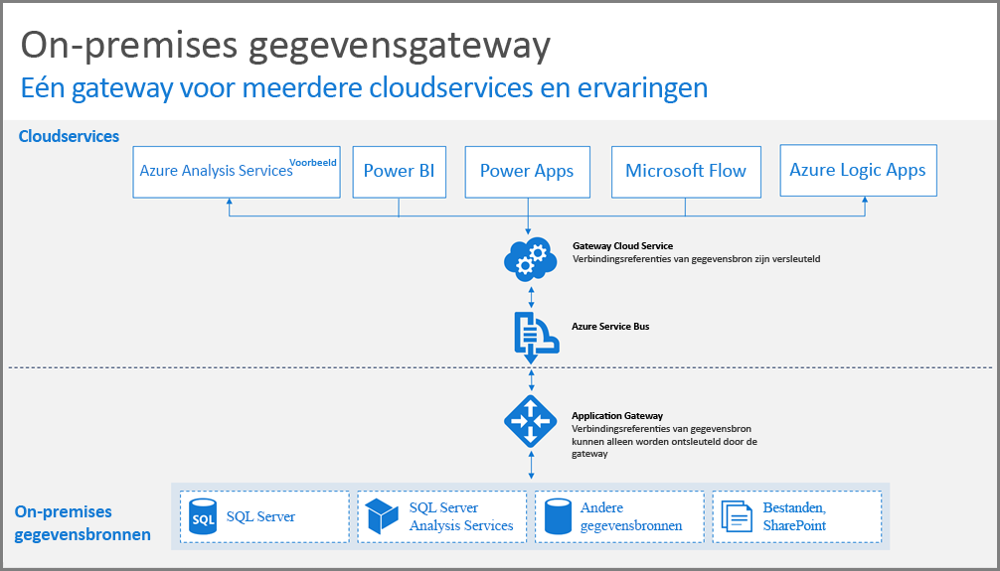
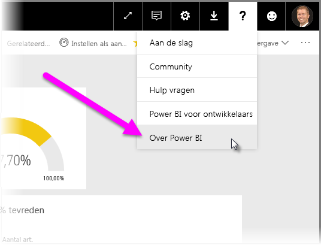
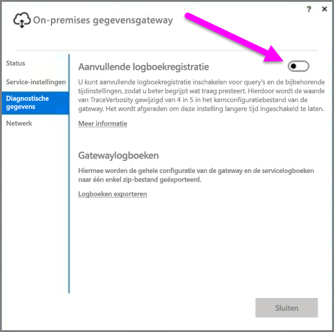
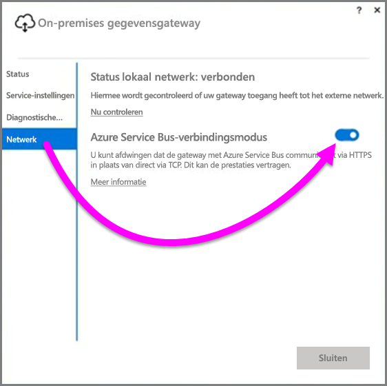
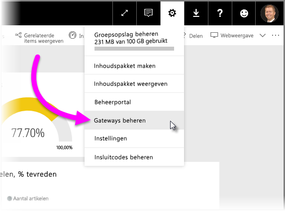

# Richtlijnen voor het implementeren van een gegevensgateway voor Power BI
Dit artikel bevat richtlijnen en overwegingen voor het implementeren van een gegevensgateway in uw netwerkomgeving. Een **gateway** is software die toegang mogelijk maakt tot gegevens die zich bevinden in een particulier, on-premises netwerk, waarna deze later kunnen worden gebruikt in een cloudservice zoals Power BI. In dit artikel vindt u stapsgewijze instructies en richtlijnen voor de implementatie van een **on-premises gegevensgateway**.

Lees dit [blogbericht](https://powerbi.microsoft.com/blog/power-bi-gateways-march-update/) voor meer informatie over een **on-premises gegevensgateway**. Dit artikel bevat ook een koppeling voor het installeren van een gateway.

## Overwegingen bij de installatie van een on-premises gegevensgateway
Voordat we ingaan op de details van de installatie en implementatie, zijn er een aantal overwegingen waarmee u rekening moet houden. In de volgende secties vindt u informatie over belangrijke aandachtspunten.

### Aantal gebruikers
Het aantal gebruikers dat via de gateway gebruikmaakt van een rapport is een belangrijke metrische factor bij het bepalen van de locatie van de gateway. Dit zijn enkele vragen die hier van belang zijn:

* Worden deze rapporten op verschillende tijdstippen van de dag gebruikt?
* Wat voor soorten verbindingen worden er gebruikt (DirectQuery of importeren)?
* Gebruiken alle gebruikers hetzelfde rapport?

Als alle gebruikers op hetzelfde moment een bepaald rapport raadplegen, moet u de gateway installeren op een computer die al deze aanvragen kan verwerken (zie de volgende secties voor prestatiemeters en de minimale vereisten die hierbij een rol spelen).

Er geldt een beperking in **Power BI** van *één* gateway per *rapport*. Dus zelfs als een rapport is gebaseerd op meerdere gegevensbronnen, moeten al deze gegevensbronnen via één gateway worden aangeboden. Als een dashboard echter is gebaseerd op *meerdere* rapporten, kunt u voor elk rapport een speciale gateway gebruiken en zo de belasting van de gateway verdelen over de meerdere rapporten die bijdragen aan één dashboard.

### Type verbinding
**Power BI** biedt twee typen verbindingen, **DirectQuery** en **Importeren**. Niet alle gegevensbronnen ondersteunen beide verbindingstypen en er zijn verschillende redenen waarom u juist voor het ene of het andere type zou kiezen, zoals beveiligingsvereisten, prestaties, gegevenslimieten en de grootte van het gegevensmodel. Meer informatie over verbindingstypen en ondersteunde gegevensbronnen vindt u in de *lijst met beschikbare gegevensbrontypen* in het artikel [On-premises gegevensgateway](service-gateway-onprem.md).

Afhankelijk van welk type verbinding u gebruikt, kan het gatewaygebruik verschillen. Zo moet u bijvoorbeeld proberen om gegevensbronnen van het type **DirectQuery** waar mogelijk te scheiden van gegevensbronnen van het type **Geplande vernieuwing** (ervan uitgaande dat ze zich in verschillende rapporten bevinden en kunnen worden gescheiden). Hierdoor wordt voorkomen dat de wachtrij van de gateway volloopt met duizenden DirectQuery aanvragen op hetzelfde moment dat 's ochtends de vernieuwing is gepland van een groot gegevensmodel dat wordt gebruikt voor het belangrijkste dashboard van het bedrijf. Dit zijn de overwegingspunten voor beide typen:

* Voor **geplande vernieuwing**: afhankelijk van de grootte van uw query en het aantal vernieuwingen per dag, kunt u ervoor kiezen om de aanbevolen minimale hardwarevereisten te blijven hanteren of te upgraden naar een machine met betere prestaties. Als een bepaalde query niet wordt teruggestuurd naar de bron, vinden transformaties plaats op de gatewaycomputer. Om die reden is het dus gunstig als voor de gatewaycomputer meer RAM-geheugen beschikbaar is.
* Voor **DirectQuery**: er wordt telkens een query verzonden wanneer een gebruiker het rapport opent of gegevens bekijkt. Als u verwacht dat meer dan 1000 gebruikers tegelijk toegang tot de gegevens moeten hebben, is het belangrijk om te controleren of uw computer is uitgerust met stabiele en geschikte hardware-onderdelen. Meer CPU-kernen zorgen voor een betere doorvoer voor een **DirectQuery**-verbinding.

Dit zijn de vereisten voor een computer waarop u een **on-premises gegevensgateway** installeert:

**Minimaal:**

* .NET 4.5 Framework
* 64-bits versie van Windows 7 of Windows Server 2008 R2 (of hoger)

**Aanbevolen:**

* CPU met acht kernen
* 8 GB geheugen
* 64-bits versie van Windows 2012 R2 (of hoger)

### Locatie
De locatie van de installatie van de gateway kan aanzienlijke invloed hebben op de prestaties van uw query's. Probeer er daarom voor te zorgen dat uw gateway, de gegevensbronnen en de Power BI-tenant zo dicht mogelijk bij elkaar zijn geplaatst om de netwerklatentie te minimaliseren. Om de locatie van uw Power BI-tenant te bepalen, selecteert u het vraagteken **?** in de Power BI-service (in de rechterbovenhoek) en selecteert u vervolgens **Over Power BI**.

### Gateways controleren
Er zijn een paar hulpprogramma's die u kunt gebruiken voor het controleren van het gebruik en de prestaties van uw geïnstalleerde gateways.

#### Prestatiemeters
Er zijn veel prestatiemeters die kunnen worden gebruikt om de activiteit op een gateway te evalueren en beoordelen. De prestatiemeters kunnen u helpen om vast te stellen of er een groot aantal activiteiten van hetzelfde type plaatsvinden. In dat geval kan het zinvol zijn om een nieuwe gateway te implementeren.

> [!NOTE]
> Deze meters bevatten geen informatie over de tijdsduur van taken.
> 
> 

De *gatewayteller* biedt samen met de tellers van computer een beeld van de belasting van uw computer, zodat u kunt zien of de resourcecapaciteit van de server bijna is bereikt of is overschreden.

Deze tellers zijn toegankelijk via **Prestatiemeter van Windows** en zijn geschikt voor alle hulpprogramma's voor rapportage die u voor dit doel inzet. Lees het onderstaande blogbericht (Engelstalig) uit de community voor een gedetailleerde beschrijving van de procedure voor het gebruiken van de prestatiemeter voor gateways met Power BI.

* [Monitor on-premises data gateways](https://insightsquest.com/2016/08/08/monitor-on-premises-data-gateways/)

#### Logboeken
Configuratie- en servicelogboeken bieden een andere dimensie van wat er met uw gateway gebeurt. Controleer altijd uw gatewaylogboeken wanneer de verbinding niet werkt zoals verwacht. Het is namelijk zo dat niet alle foutberichten in de Power BI-service worden weergegeven.

Een eenvoudige manier om de logboekbestanden op uw lokale computer te bekijken, is met de knop *Logboeken exporteren* op de pagina **On-premises gegevensgateway** wanneer u de gateway opnieuw opent nadat de eerste installatie voltooid is. Selecteer vervolgens **Diagnostische gegevens > Logboeken exporteren**.

#### Aanvullende logboekregistratie
Op de gateway worden standaard basisvermeldingen bijgehouden in de logboeken. Als u problemen met de gateway onderzoekt en meer informatie nodig hebt over de verbindingsgegevens van een query, kunt u tijdelijk *uitgebreide logboekregistratie* inschakelen om aanvullende logboekinformatie te verzamelen. Dit doet u door in de geïnstalleerde gateway **Diagnostische gegevens > Aanvullende logboekregistratie** te selecteren.

Als u deze instelling inschakelt, is de kans groot dat het logboek aanzienlijk in omvang toeneemt, afhankelijk van het gebruik van de gateway. Het is daarom raadzaam **Aanvullende logboekregistratie** weer uit te schakelen als u klaar bent met het controleren van de logboeken. Het wordt afgeraden om deze instelling ingeschakeld te laten tijdens normaal gatewaygebruik.

#### Netwerkconfiguratie
De gateway maakt een uitgaande verbinding met **Azure Service Bus**. De gateway communiceert op de volgende uitgaande poorten:

* TCP 443 (standaard)
* 5671
* 5672
* 9350 t/m 9354

De gateway vereist *geen* inkomende poorten. Alle vereiste poorten worden vermeld in de bovenstaande lijst.

Het wordt aanbevolen de IP-adressen voor uw gegevensregio op de goedgekeurde lijst voor de firewall te plaatsen. U kunt [hier een lijst met IP-adressen van Microsoft Azure-datacenters downloaden](https://www.microsoft.com/download/details.aspx?id=41653). Deze lijst wordt wekelijks bijgewerkt. De gateway communiceert met **Azure Service Bus** via het opgegeven IP-adres, samen met de volledig gekwalificeerde domeinnaam (FQDN). Als u de gateway geforceerd wilt laten communiceren via HTTPS, gebruikt de gateway alleen de FQDN en vindt er geen communicatie plaats met behulp van IP-adressen.

#### HTTPS-communicatie met Azure Service Bus afdwingen
U kunt afdwingen dat de gateway met **Azure Service Bus** communiceert via HTTPS in plaats van direct via TCP. In dat geval nemen de prestaties iets af. U kunt de gateway ook dwingen om via HTTPS te communiceren met **Azure Service Bus** met behulp van de gebruikersinterface van de gateway (dit kan vanaf de release van maart 2017 van de gateway).

Hiervoor selecteert u in de gateway **Netwerk** en zet u vervolgens de optie **Azure Service Bus-verbindingsmodus** op **Aan**.

### Aanvullende richtlijnen
In dit gedeelte vindt u aanvullende richtlijnen voor het implementeren en beheren van gateways.

* Vermijd een Single Point Of Failure. Verdeel uw on-premises gegevensbronnen indien mogelijk over meerdere gateways. Als er dan één computer niet beschikbaar is, hebt u nog steeds de mogelijkheid om delen van uw gegevens te vernieuwen en bent u die functionaliteit dus niet volledig kwijt.
* De gateway kan niet worden geïnstalleerd op een domeincontroller.
* U mag een gateway niet installeren op een computer die kan worden uitgeschakeld, die in de slaapstand kan gaan of die niet altijd is verbonden met internet (zoals een laptop). De reden hiervoor is dat de gateway in die omstandigheden niet kan worden uitgevoerd.
* Installeer een gateway niet in een draadloos netwerk, aangezien de prestaties dan kunnen afnemen.

#### Gateway herstellen
U kunt uw bestaande gateway herstellen of overbrengen naar een nieuwe computer met behulp van de **herstelsleutel**. De herstelsleutel wordt verstrekt aan de gebruiker die de gateway installeert en kan later *niet* worden gewijzigd. De herstelsleutel wordt gebruikt voor gegevensversleuteling en herstel van de gateway.

Als u de gateway wilt herstellen, moet u een beheerder zijn van de gateway, de naam van de gateway weten, beschikken over de juiste herstelsleutel en beschikken over een andere computer met vergelijkbare prestatiekenmerken.

Nadat u zich hebt aangemeld, selecteert u de optie **Bestaande gateway migreren**. Vervolgens kiest u de gateway die u wilt herstellen of migreren, voert u de herstelsleutel in en selecteert u Configureren. Als dat is gebeurd, wordt de oude gateway vervangen door de nieuwe gateway. De nieuwe gateway neemt hierbij de naam en alle eerder geconfigureerde gegevensbronnen over. Alle gegevensbronnen lopen nu via de nieuwe computer, zonder dat u iets opnieuw hoeft te publiceren. Automatische failover wordt nog niet ondersteund, maar is wel een functie die onze aandacht heeft.

#### Beheerders
U kunt een lijst met beheerders van de gateway bekijken in de **Power BI-service**. Meld u aan bij de **Power BI**-service en selecteer **Instellingen** (het tandwiel) **> Gateways beheren > Gateway UI**.  

U kunt nu een gateway selecteren en de lijst met beheerders van de gateway inzien. De vermelde beheerders kunnen de gateway openen, herstellen en verwijderen. Ze kunnen ook gegevensbronnen toevoegen en verwijderen op de gateway. Het volgende wordt aanbevolen om er zeker van te zijn dat alle beheerders in de organisatie toegang hebben tot alle gateways in hun groep:

* Maak een **AAD**-beveiligingsgroep en voeg hier andere gebruikers aan toe. Voeg deze beveiligingsgroep vervolgens toe aan de lijst met de respectieve gatewaybeheerders. Op deze manier heeft meer dan één persoon toegang tot de gateway in het geval van een storing, of wanneer u de gateway moet herstellen of migreren. Daarnaast kunnen andere beheerders nu ook zien welke gateways er in hun groepen worden gebruikt, en welke gegevensbronnen op elke gateway aanwezig zijn.

## Volgende stappen
[Proxyinstellingen configureren](service-gateway-proxy.md)  
[Problemen met de on-premises gegevensgateway oplossen](service-gateway-onprem-tshoot.md)  
[Veelgestelde vragen over on-premises gegevensgateways](service-gateway-onprem-faq.md)  

Nog vragen? [Misschien dat de Power BI-community het antwoord weet](http://community.powerbi.com/)

