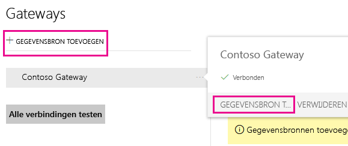
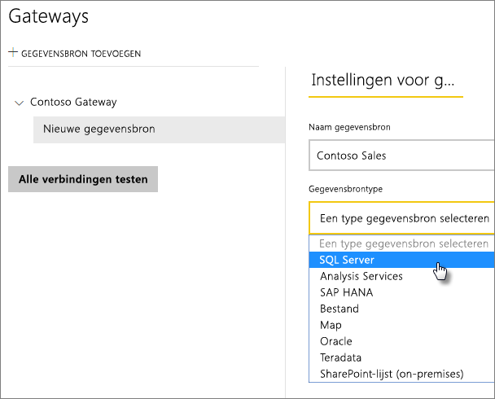
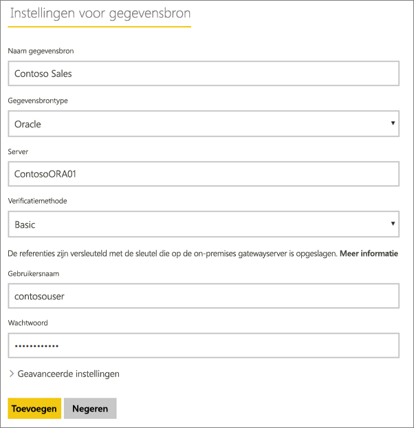
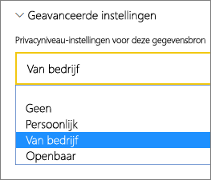
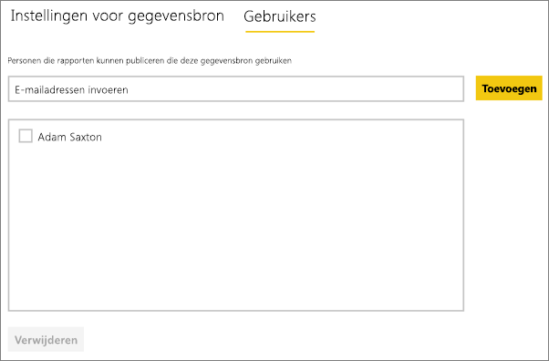
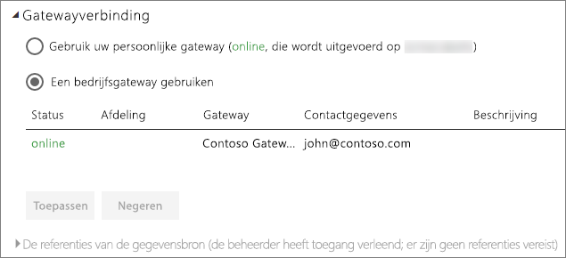

# Gegevensbron beheren - importeren/geplande vernieuwing
Nadat u de on-premises gegevensgateway hebt geïnstalleerd, moet u gegevensbronnen toevoegen die met de gateway kunnen worden gebruikt. In dit artikel wordt beschreven hoe u werkt met gateways en gegevensbronnen die worden gebruikt voor geplande vernieuwing in plaats van DirectQuery of liveverbindingen.

## De gateway downloaden en installeren
U kunt de gateway downloaden via de Power BI-service. Selecteer **Downloads** > **Gegevensgateway** of ga naar de [pagina voor het downloaden van gateways](https://go.microsoft.com/fwlink/?LinkId=698861).

## Een gateway toevoegen
Als u een gateway wilt toevoegen, moet u de ondernemingsgateway [downloaden](https://go.microsoft.com/fwlink/?LinkId=698863) en installeren op een server in uw omgeving. Nadat u de gateway hebt geïnstalleerd, wordt deze onder **Gateways beheren** weergegeven in de lijsten met gateways.

> [!NOTE]
> **Gateways beheren** wordt alleen weergegeven als u beheerder van ten minste één gateway bent geworden. Dit kan doordat een andere beheerder u toevoegt of door zelf een gateway te installeren en configureren.
> 
> 

## Een gateway verwijderen
Als u een gateway verwijdert, worden ook alle gegevensbronnen voor die gateway verwijderd.  De dashboards en rapporten die afhankelijk zijn van deze gegevensbronnen, werken hierdoor ook niet meer.

1. Selecteer het tandwielpictogram  in de rechterbovenhoek > **Gateways beheren**.
2. Gateway > **Verwijderen**
   
   

## Een gegevensbron toevoegen
U kunt een gegevensbron toevoegen door een gateway te selecteren en op **Gegevensbron toevoegen** te klikken of door naar Gateway > **Gegevensbron toevoegen** te gaan.

U kunt vervolgens in de lijst het **gegevensbrontype** selecteren. Alle vermelde gegevensbronnen kunnen worden gebruikt voor geplande vernieuwing met de ondernemingsgateway. Analysis Services, SQL Server en SAP HANA kunnen worden gebruikt voor geplande vernieuwing of DirectQuery/liveverbindingen.

Vervolgens moet u de informatie over de gegevensbron invullen, zoals de brongegevens en referenties voor toegang tot de gegevensbron.

> [!NOTE]
> Alle query's over de gegevensbron worden uitgevoerd met deze referenties. Meer informatie over hoe [referenties](service-gateway-onprem.md#credentials) worden opgeslagen vindt u in het hoofdartikel over on-premises gateways.
> 
> 

U kunt op **Toevoegen** klikken nadat u alles hebt ingevuld.  U kunt deze gegevensbron nu gebruiken voor geplande vernieuwing met uw on-premises gegevens. De tekst *Verbinding gemaakt* wordt weergegeven als deze bewerking is geslaagd.

<!-- Shared Install steps Include -->
[!INCLUDE [gateway-onprem-datasources-include](./includes/gateway-onprem-datasources-include.md)]

### Geavanceerde instellingen
U kunt het privacyniveau voor de gegevensbron configureren. Hiermee bepaalt u hoe gegevens kunnen worden gecombineerd. Dit wordt alleen gebruikt voor geplande vernieuwing. [Meer informatie](https://support.office.com/article/Privacy-levels-Power-Query-CC3EDE4D-359E-4B28-BC72-9BEE7900B540)

## Een gegevensbron verwijderen
Als u een gegevensbron verwijdert, zullen de dashboards of rapporten die afhankelijk zijn van de gegevensbron niet meer werken.  

Ga naar Gegevensbron > **Verwijderen** om een gegevensbron te verwijderen.

## Beheerders beheren
Op het tabblad Beheerders voor de gateway kunt u gebruikers toevoegen en verwijderen die de gateway kunnen beheren. Momenteel kunt u alleen gebruikers toevoegen. Beveiligingsgroepen kunnen niet worden toegevoegd.

## Gebruikers beheren
Op het tabblad Gebruikers voor de gegevensbron kunt u gebruikers (of beveiligingsgroepen) toevoegen en verwijderen die deze gegevensbron kunnen gebruiken.

> [!NOTE]
> De lijst met gebruikers wordt uitsluitend geraadpleegd om te bepalen wie er rapporten mag publiceren. De rapporteigenaren kunnen dashboards of inhoudspakketten maken en deze delen met andere gebruikers.
> 
> 

## De gegevensbron gebruiken voor geplande vernieuwing
Nadat u de gegevensbron hebt gemaakt, kan deze worden gebruikt met DirectQuery-verbindingen of via geplande vernieuwing.

> [!NOTE]
> De servernaam en databasenaam die worden gebruikt voor Power BI Desktop en de gegevensbron in de on-premises gegevensgateway moeten overeenkomen!
> 
> 

De koppeling tussen uw gegevensset en de gegevensbron in de gateway is gebaseerd op uw server- en databasenaam. Deze moeten overeenkomen. Als u bijvoorbeeld een IP-adres gebruikt als servernaam in Power BI Desktop, moet u dit IP-adres gebruiken voor de gegevensbron in de gatewayconfiguratie. Als u in Power BI Desktop *SERVER\EXEMPLAAR* gebruikt, moet u dat ook gebruiken in de gegevensbron die u voor de gateway configureert.

Als u wordt vermeld op het tabblad **Gebruikers** van de gegevensbron die is geconfigureerd op de gateway en de server- en databasenamen overeenkomen, wordt de gateway vermeld en kan deze worden gebruikt met geplande vernieuwing.

> [!WARNING]
> Als de gegevensset meerdere gegevensbronnen bevat, moet elke gegevensbron aan de gateway worden toegevoegd. Als een of meer gegevensbronnen niet aan de gateway zijn toegevoegd, is de gateway niet beschikbaar voor geplande vernieuwing.
> 
> 

## Beperkingen
* OAuth wordt niet ondersteund als verificatieschema voor de on-premises gegevensgateway. U kunt geen gegevensbronnen toevoegen waarvoor OAuth vereist is. Als uw gegevensset een gegevensbron bevat waarvoor OAuth vereist is, kunt u de gateway niet gebruiken voor geplande vernieuwing.

## Volgende stappen
[On-premises gegevensgateway](service-gateway-onprem.md)  
[On-premises data gateway in-depth](service-gateway-onprem-indepth.md) (On-premises gegevensgateway - uitgebreid)  
[Problemen met de on-premises gegevensgateway oplossen](service-gateway-onprem-tshoot.md)  
Hebt u nog vragen? [Misschien dat de Power BI-community het antwoord weet](http://community.powerbi.com/)

