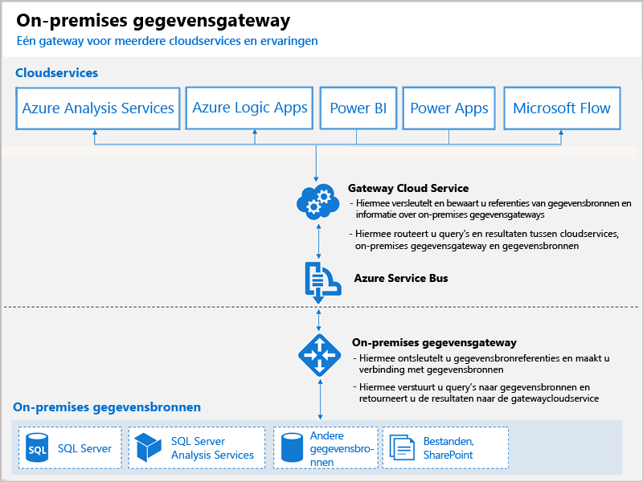

# Wat zijn Power BI-gateways?

Een Power BI-gateway is software die u in een on-premises netwerk installeert en waarmee de toegang tot gegevens in dit netwerk wordt vereenvoudigd. Een gateway is een soort poortwachter die luistert of er verbindingsaanvragen worden verzonden. Een aanvraag wordt alleen geaccepteerd wanneer deze voldoet aan bepaalde criteria. Op deze manier kunnen organisaties databases en andere gegevensbronnen in hun on-premises netwerken houden en die on-premises gegevens toch veilig gebruiken in Power BI-rapporten en -dashboards.

Een gateway kan worden gebruikt voor een enkele gegevensbron of meerdere gegevensbronnen. In het volgende diagram ziet u een eenvoudige weergave met de gatewayafhandelingsaanvragen van de cloud voor drie on-premises computers. Meer informatie hierover vindt u verderop in dit artikel.

## Typen gateways

Power BI biedt twee gateways, elk voor een ander scenario:

* **On-premises gegevensgateway (personal mode)**: Met deze gateway kan één gebruiker verbinding maken met bronnen. Kan niet worden gedeeld met anderen. Kan alleen worden gebruikt met Power BI. Deze gateway is geschikt voor scenario's waarbij u de enige bent die rapporten maakt en u de gegevensbronnen niet met anderen hoeft te delen.

* **On-premises gegevensgateway**: Met deze gateway kunnen meerdere gebruikers verbinding maken met meerdere on-premises gegevensbronnen. Deze gateway kan (met één gateway-installatie) worden gebruikt door Power BI, PowerApps Flow, Azure Analysis Services en Azure Logic-apps. Deze gateway is geschikt voor complexere scenario's waarbij meerdere personen toegang moeten krijgen tot meerdere gegevensbronnen. 

## Een gateway gebruiken

Als u een gateway wilt gebruiken, voert u deze vier hoofdstappen uit:

1. **Installeer de gateway** met de juiste modus op een lokale computer
2. **Voeg gebruikers aan de gateway toe**, zodat ze toegang hebben tot on-premises gegevensbronnen
3. **Maak verbinding met gegevensbronnen**, zodat ze kunnen worden gebruikt in rapporten en dashboards
4. **Vernieuw de on-premises gegevens**, zodat de Power BI-rapporten zijn bijgewerkt

U kunt een zelfstandige gateway installeren of een gateway toevoegen aan een *cluster* (aanbevolen voor hoge beschikbaarheid).

## De werking van gateways

De gateway die u installeert, wordt als een Windows-service, een **on-premises gegevensgateway** uitgevoerd. Deze lokale service is geregistreerd bij de Gateway-cloudservice via Azure Service Bus. In het volgende diagram ziet u de stroom tussen on-premises gegevens en de cloudservices die gebruikmaken van de gateway.

Query's en gegevensstroom:

1. Er wordt een query gemaakt door de cloudservice met de versleutelde referenties voor de on-premises gegevensbron. De query wordt vervolgens ter verwerking naar de gateway verzonden.
2. De query wordt met Gateway-cloudservice geanalyseerd, waarna de aanvraag naar the Azure Service Bus wordt gepusht.
3. De on-premises gegevensgateway peilt Azure Service Bus om te kijken of er aanvragen klaarstaan.
4. De gateway haalt de query op, ontsleutelt de referenties en maakt met behulp hiervan verbinding met de gegevensbronnen.
5. De gateway stuurt de query voor uitvoering naar de gegevensbron.
6. De resultaten worden vanuit de gegevensbron teruggezonden naar de gateway en vervolgens naar de cloudservice en uw server.

## Volgende stappen
[De on-premises gegevensgateway installeren](service-gateway-install.md)

Hebt u nog vragen? [Misschien dat de Power BI-community het antwoord weet](http://community.powerbi.com/)

