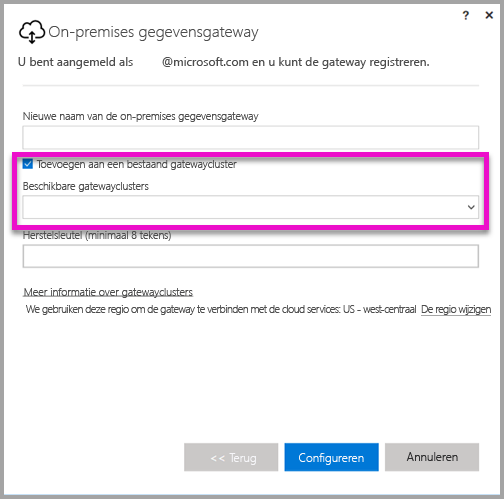
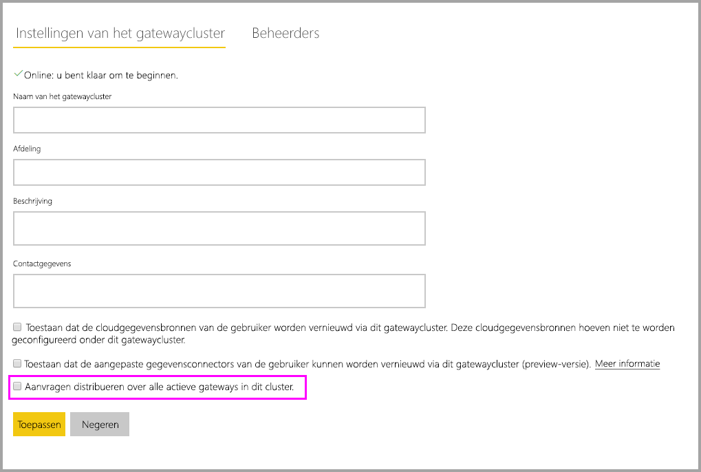

# <a name="high-availability-clusters-for-on-premises-data-gateway"></a>Clusters met hoge beschikbaarheid voor on-premises gegevensgateway

U kunt **clusters met hoge beschikbaarheid** maken van installaties van een **on-premises gegevensgateway** om te controleren of uw organisatie toegang heeft tot on-premises gegevensbronnen die worden gebruikt in Power BI-rapporten en -dashboards. Met dit soort clusters kunnen gatewaybeheerders gateways groeperen om storingen op één punt bij het openen van on-premises gegevensbronnen te voorkomen. De Power BI-service gebruikt altijd de primaire gateway in het cluster, tenzij deze niet beschikbaar is. In dat geval schakelt de service over naar de volgende gateway in het cluster, etc.

In dit artikel worden de stappen beschreven die u kunt nemen om een cluster on-premises gegevensgateways met hoge beschikbaarheid te maken. Ook vindt u in dit artikel aanbevolen procedures voor het instellen van deze clusters. Voor gatewayclusters met hoge beschikbaarheid is de update van november 2017 of hoger vereist voor de on-premises gegevensgateway.

## <a name="setting-up-high-availability-clusters-of-gateways"></a>Gatewayclusters met hoge beschikbaarheid instellen

Tijdens het installatieproces van de **on-premises gegevensgateway** kunt u opgeven of de gateway moet worden toegevoegd aan een bestaand gatewaycluster. 



Als u een gateway aan een bestaand cluster wilt toevoegen, moet u de *herstelsleutel* opgeven voor het primaire gatewayexemplaar voor het cluster waaraan u de nieuwe gateway wilt toevoegen. Voor de primaire gateway voor het cluster moet de gateway-update van november 2017 of later worden uitgevoerd. 

## <a name="managing-a-gateway-cluster"></a>Gatewayclusters beheren

Zodra een gatewaycluster uit twee of meer gateways bestaat, worden alle gatewaybeheerbewerkingen, zoals het toevoegen van een gegevensbron of het verlenen van beheerdersrechten aan een gateway, toegepast op alle gateways die deel uitmaken van het cluster.

Wanneer beheerders het menu-item **Gateways beheren** (onder het tandwielpictogram in de **Power BI-service**) gebruiken, zien zij een lijst met geregistreerde clusters van afzonderlijke gateways, maar niet de afzonderlijke gatewayexemplaren die lid van het cluster zijn.

Alle nieuwe aanvragen voor **Geplande vernieuwing** en DirectQuery-bewerkingen worden automatisch doorgestuurd naar het primaire exemplaar van een bepaald gatewaycluster. Als het primaire gatewayexemplaar niet online is, wordt de aanvraag doorgestuurd naar een ander gatewayexemplaar in het cluster.

## <a name="distribute-requests-traffic-across-all-gateways-in-a-cluster"></a>Verkeer van aanvragen verdelen over alle gateways in een cluster

U kunt ervoor kiezen om verkeer over alle gateways in een cluster te verdelen. Op de pagina **Gateways beheren** in de **Power BI-service** kunt u, wanneer u op een gatewaycluster in de lijst in de navigatiestructuur aan de linkerkant klikt, de optie inschakelen om aanvragen over alle actieve gateways in dit cluster te verdelen.



## <a name="powershell-support-for-gateway-clusters"></a>PowerShell-ondersteuning voor gatewayclusters

PowerShell-scripts zijn beschikbaar in de installatiemap op de on-premises gegevensgateway. Deze map is standaard *C:\Program Files\On-premises data gateway*. U moet gebruikmaken van PowerShell-versie 5 of hoger om deze scripts goed te laten werken. Met de PowerShell-scripts kunnen gebruikers de volgende bewerkingen uitvoeren:

-   De lijst met gatewayclusters die beschikbaar zijn voor een gebruiker ophalen
-   De lijst met gatewayexemplaren die in een cluster zijn geregistreerd en hun offline- of onlinestatus ophalen
-   De status inschakelen/uitschakelen voor een gatewayexemplaar in een cluster en andere gatewayeigenschappen ophalen
-   Een gateway verwijderen

Als u de PowerShell-opdrachten in de tabel wilt uitvoeren, moet u eerst de volgende stappen uitvoeren:

1. Open een PowerShell-opdrachtvenster als beheerder
2. Voer vervolgens de volgende eenmalige PowerShell-opdracht uit (hierbij wordt ervan uitgegaan dat u nog nooit PowerShell-opdrachten op de huidige computer hebt uitgevoerd):

    ```
    Set-ExecutionPolicy -ExecutionPolicy Unrestricted -Force
    ```

3. Vervolgens gaat u naar de installatiemap van de on-premises gegevensgateway in het PowerShell-venster en importeert u de benodigde module met de volgende opdracht:

    ```
    Import-Module .\OnPremisesDataGatewayHAMgmt.psm1
    ```

Als deze stappen zijn voltooid, kunt u de opdrachten in de volgende tabel gebruiken voor het beheren van uw gatewayclusters.

| **Opdracht** | **Beschrijving** | **Parameters** |
| --- | --- | --- |
| *Login-OnPremisesDataGateway* |Met deze opdracht kunnen gebruikers zich aanmelden om hun on-premises gegevensgatewayclusters te beheren.  U moet deze opdracht uitvoeren en u aanmelden *voordat* andere opdrachten met hoge beschikbaarheid naar behoren kunnen werken. Opmerking: het AAD-verificatietoken dat is verkregen als onderdeel van een aanmeldingsverzoek is slechts één uur geldig. Daarna verloopt het token. U kunt de aanmeldingsopdracht opnieuw uitvoeren om een nieuw token te krijgen.| AAD-gebruikersnaam en -wachtwoord (worden afgegeven op basis van het uitvoeren van de opdracht, niet bij de initiële aanroep)|
| *Get-OnPremisesDataGatewayClusters* | Hiermee wordt de lijst met gatewayclusters opgehaald voor de aangemelde gebruiker. | Optioneel kunt u parameters voor formatteren aan deze opdracht toevoegen voor een betere leesbaarheid, zoals *Format-Table -AutoSize -Wrap* |
| *Get-OnPremisesDataClusterGateways* | Hiermee wordt de lijst met gateways binnen de opgegeven cluster opgehaald, evenals aanvullende informatie voor elke gateway (online-/offlinestatus, computernaam, enzovoort) | *-ClusterObjectID xyz* (waar *xyz* wordt vervangen door een daadwerkelijke waarde voor de clusterobject-id, die kan worden opgehaald met de opdracht *Get-OnPremisesDataGatewayClusters*)|
| *Set-OnPremisesDataGateway* | Hiermee kunt u eigenschapswaarden instellen voor een bepaalde gateway in het cluster, waaronder de mogelijkheid om een specifiek gatewayexemplaar in of uit te schakelen  | *-ClusterObjectID xyz* (*xyz* moet worden vervangen door een daadwerkelijke waarde voor de clusterobject-id; deze kan worden opgehaald met de opdracht *Get-OnPremisesDataGatewayClusters*) *-GatewayObjectID abc* (*abc* moet worden vervangen door een daadwerkelijke waarde voor de gatewayobject-id; deze kan worden opgehaald met de opdracht *Get-OnPremisesDataClusterGateways*, die over een clusterobject-id beschikt) |
| *Get-OnPremisesDataGatewayStatus* | Hiermee kunt u de status voor een bepaald gatewayexemplaar binnen een cluster ophalen  | *-ClusterObjectID xyz* (*xyz* moet worden vervangen door een daadwerkelijke waarde voor de clusterobject-id; deze kan worden opgehaald met de opdracht *Get-OnPremisesDataGatewayClusters*) *-GatewayObjectID abc* (*abc* moet worden vervangen door een daadwerkelijke waarde voor de gatewayobject-id; deze kan worden opgehaald met de opdracht *Get-OnPremisesDataClusterGateways*, die over een clusterobject-id beschikt) |
| *Remove-OnPremisesDataGateway*  | Hiermee kunt u een gatewayexemplaar verwijderen uit een cluster; houd er rekening mee dat de primaire gateway in het cluster pas kan worden verwijderd zodra alle gateways in het cluster zijn verwijderd.| *-ClusterObjectID xyz* (*xyz* moet worden vervangen door een daadwerkelijke waarde voor de clusterobject-id; deze kan worden opgehaald met de opdracht *Get-OnPremisesDataGatewayClusters*) *-GatewayObjectID abc* (*abc* moet worden vervangen door een daadwerkelijke waarde voor de gatewayobject-id; deze kan worden opgehaald met de opdracht *Get-OnPremisesDataClusterGateways*, die over een clusterobject-id beschikt) |

## <a name="next-steps"></a>Volgende stappen

-   [Manage your data source - Analysis Services](service-gateway-enterprise-manage-ssas.md) (Uw gegevensbron beheren - Analysis Services)  
-   [Manage your data source - SAP HANA](service-gateway-enterprise-manage-sap.md) (Uw gegevensbron beheren - SAP HANA)  
-   [Manage your data source - SQL Server](service-gateway-enterprise-manage-sql.md) (Gegevensbron beheren - SQL Server)  
-   [Manage your data source - Oracle](service-gateway-onprem-manage-oracle.md) (Gegevensbron beheren - Oracle)  
-   [Manage your data source - Import/Scheduled refresh](service-gateway-enterprise-manage-scheduled-refresh.md) (Gegevensbron beheren - importeren/geplande vernieuwing)  
-   [On-premises data gateway in-depth](service-gateway-onprem-indepth.md) (On-premises gegevensgateway - uitgebreid)  
-   [On-premises data gateway (personal mode)](service-gateway-personal-mode.md) (On-premises gegevensgateway (persoonlijke modus))
-   [Proxyinstellingen configureren voor de on-premises gegevensgateway](service-gateway-proxy.md)  
-   [Use Kerberos for SSO (single sign-on) from Power BI to on-premises data sources](service-gateway-kerberos-for-sso-pbi-to-on-premises-data.md) (Kerberos gebruiken voor eenmalige aanmelding (SSO) van Power BI naar on-premises gegevensbronnen)  

Nog vragen? [Misschien dat de Power BI-community het antwoord weet](http://community.powerbi.com/)
