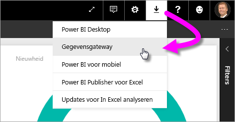
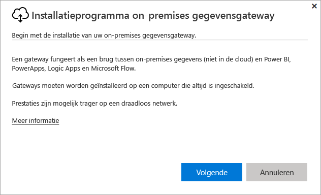
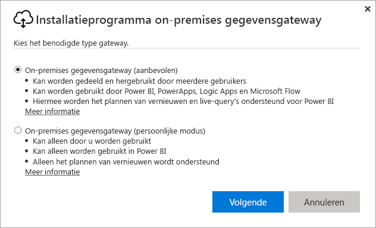
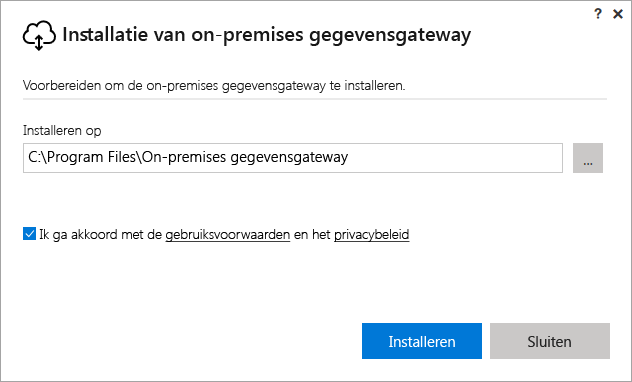
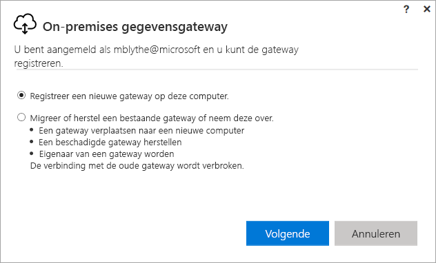
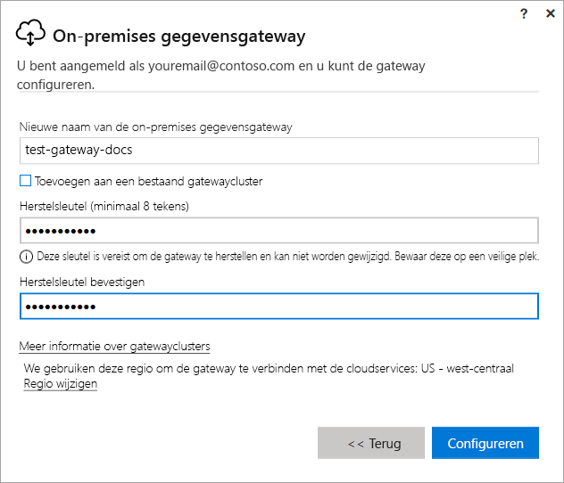
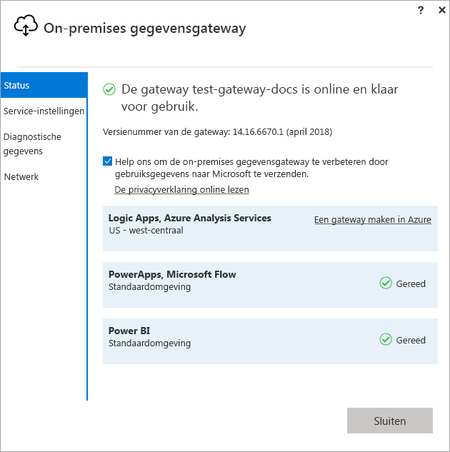
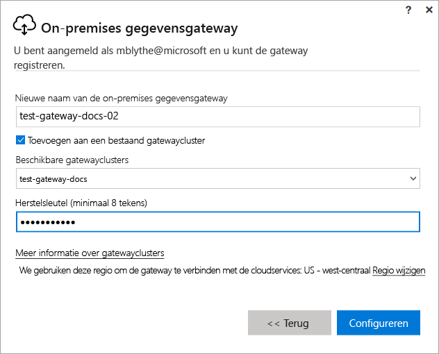

# Gateway installeren voor Power BI

Een Power BI-gateway is software die u in een on-premises netwerk installeert en waarmee de toegang tot gegevens in dit netwerk wordt vereenvoudigd. Zoals beschreven in het [overzicht](service-gateway-getting-started.md), kunt u een gateway installeren in persoonlijke modus of in standaardmodus (aanbevolen). In standaardmodus kunt u een zelfstandige gateway installeren of een gateway toevoegen aan een *cluster* (aanbevolen vanwege hoge beschikbaarheid). In dit artikel laten we zien hoe een standaard-gateway wordt geïnstalleerd en wordt een andere gateway toegevoegd om een cluster te maken.

Als u zich niet hebt geregistreerd voor Power BI, kunt u zich hier [aanmelden voor een gratis proefversie](https://app.powerbi.com/signupredirect?pbi_source=web) voordat u begint.

## Een gateway downloaden en installeren

De gateway wordt uitgevoerd op de computer waarop u deze installeert, dus zorg ervoor dat u de gateway installeert op een computer die altijd aan staat. Vanwege betere prestaties en betrouwbaarheid wordt u aangeraden dat de computer zich in een bedraad netwerk bevindt en niet in een draadloos netwerk.

1. In de Power BI-service in de rechterbovenhoek selecteert u het **downloadpictogram**  > **Gegevensgateway**.

    

2. Op de downloadpagina selecteert u de knop **GATEWAY DOWNLOADEN**.

3. Selecteer **Volgende**.     

    

4. Selecteer **On-premises gegevensgateway (aanbevolen)** > **Volgende**.

    

5. Wijzig het standaardinstallatiepad niet en accepteer de voorwaarden > **Installeren**.

    

6. Voer het account in dat u gebruikt om u aan te melden bij Power BI > **Aanmelden**.

    

    De gateway is gekoppeld aan uw Power BI-account en u beheert gateways vanuit de Power BI-service. U bent nu aangemeld bij uw account.

7. Selecteer **Een nieuwe gateway registreren op deze computer** > **Volgende**.

    

8. Voer een naam (deze moet uniek zijn voor de hele tenant) en een herstelsleutel voor de gateway in. U hebt deze sleutel nodig als u de gateway wilt herstellen of verplaatsen. Selecteer **Configureren**.

    

    Let op de optie **Toevoegen aan een bestaand gatewaycluster**. Deze optie wordt gebruikt in de volgende sectie van het artikel.

9. Lees de informatie in het laatste venster. De gateway is beschikbaar voor Power BI en tevens voor PowerApps en Flow, omdat ik voor deze drie hetzelfde account gebruik. Selecteer **Sluiten**.

    

U hebt een gateway geïnstalleerd. U kunt nu een andere gateway toevoegen om een cluster te maken.

## Een andere gateway toevoegen om een cluster te maken

Dankzij een cluster vermijden beheerders dat er een SPOF (Singel Point Of Failure) aanwezig is voor on-premises gegevenstoegang. Als de primaire gateway niet beschikbaar is, worden gegevensaanvragen omgeleid naar de secundaire gateway die u hebt toegevoegd, enzovoort. U kunt slechts één standaardgateway op een computer installeren, dus u moet de secundaire gateway voor het cluster op een andere computer installeren. Dit is zinvol omdat u voor redundantie in het cluster wilt zorgen.

Voor gatewayclusters met hoge beschikbaarheid is de update van november 2017 of hoger vereist voor de on-premises gegevensgateway.

1. Download de gateway op een andere computer en installeer deze.

2. Als u zich hebt aangemeld bij uw Power BI-account, registreert u de gateway. Selecteer **Toevoegen aan een bestaand cluster**. Onder **Beschikbare gatewayclusters** selecteert u de eerste gateway die u hebt geïnstalleerd (de *primaire gateway*) en voert u de herstelsleutel voor die gateway in. Selecteer **Configureren**.

    

## Volgende stappen

[Power BI-gateway beheren](service-gateway-manage.md)

Hebt u nog vragen? [Misschien dat de Power BI-community het antwoord weet](http://community.powerbi.com/)