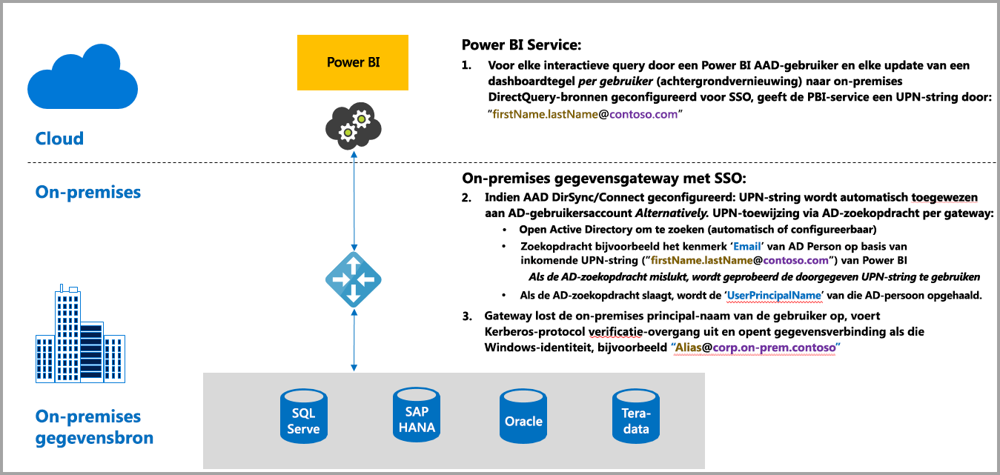
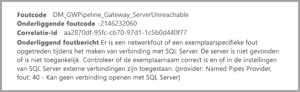
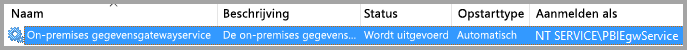
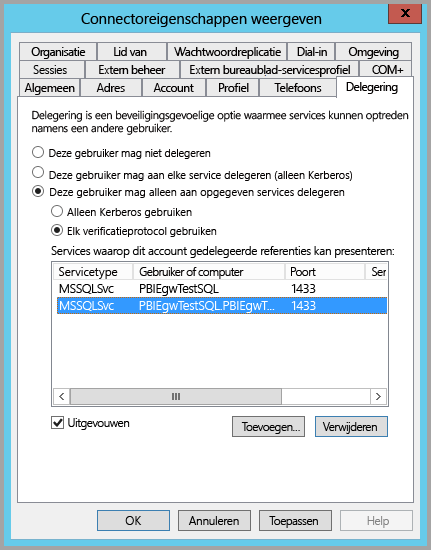
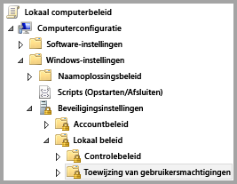
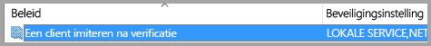
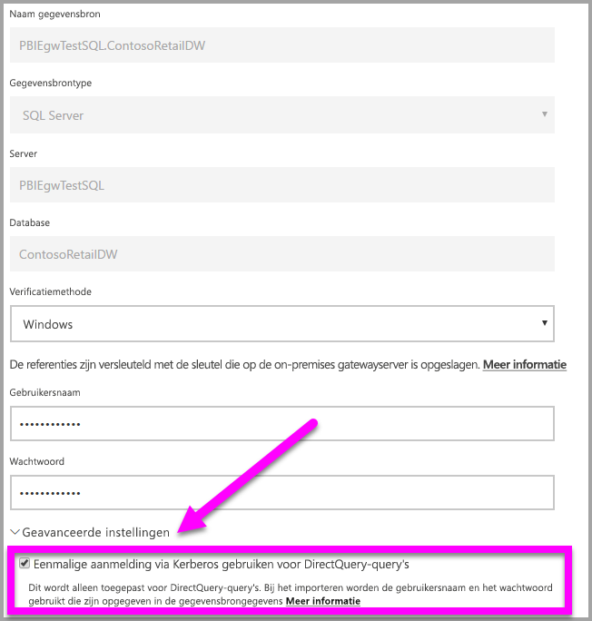
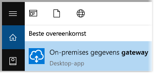
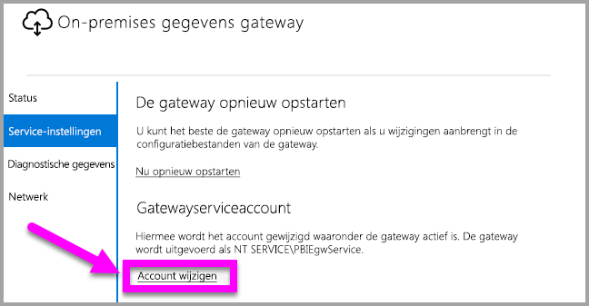

# Kerberos gebruiken voor eenmalige aanmelding (SSO) van Power BI naar on-premises gegevensbronnen
Door uw on-premises gegevensgateway te configureren met Kerberos kunt u connectiviteit met naadloze eenmalige aanmelding bewerkstelligen, zodat Power BI rapporten en dashboards kan bijwerken van uw on-premises gegevens. De on-premises gegevensgateway vergemakkelijkt eenmalige aanmelding (SSO) met behulp van DirectQuery, waarmee de gateway verbinding maakt met on-premises gegevensbronnen.

De volgende bronnen worden momenteel ondersteund, allemaal op basis van [beperkte Kerberos-delegering](https://technet.microsoft.com/library/jj553400.aspx): SQL Server, SAP HANA en Teradata.

* SQL Server
* SAP HANA
* Teradata

Wanneer een gebruiker in de Power BI-service een DirectQuery-rapport gebruikt, kan elke cross-filter, segmentering, sortering en bewerking van het rapport ertoe leiden dat er live query's worden uitgevoerd naar de onderliggende on-premises gegevensbron.  Wanneer eenmalige aanmelding is geconfigureerd voor de gegevensbron, worden query's uitgevoerd onder de identiteit van de gebruiker die Power BI gebruikt (dat wil zeggen, via de webervaring of de mobiele Power BI-apps). Iedere gebruiker ziet dus exact die gegevens waar hij of zij op de onderliggende gegevensbron voor is gemachtigd. Wanneer eenmalige aanmelding is ingesteld, vindt er geen gedeelde gegevenscaching plaats tussen verschillende gebruikers.

## Een query uitvoeren met SSO: de stappen die plaatsvinden
Een query die wordt uitgevoerd met eenmalige aanmelding bestaat uit drie stappen, zoals weergegeven in het volgende diagram.

> [!NOTE]
> Eenmalige aanmelding voor Oracle is nog niet ingeschakeld, maar is in ontwikkeling en wordt binnenkort beschikbaar gemaakt.
> 
> 

Hier vindt u aanvullende informatie over deze stappen:

1. Voor elke query stuurt de **Power BI-service** de *User Principal Name* (UPN) mee bij het verzenden van een query naar de geconfigureerde gateway.
2. De gateway moet de UPN van Azure Active Directory toewijzen aan een lokale Active Directory-identiteit.
   
   a.  Als AAD DirSync (ook wel bekend als *AAD Connect*) is geconfigureerd, wordt deze toewijzing automatisch verzorgd in de gateway.
   
   b.  Anders kan de gateway de Azure AD UPN opzoeken en toewijzen aan een lokale gebruiker door een zoekopdracht uit te voeren op basis van het lokale Active Directory-domein.
3. Het gatewayserviceproces imiteert de toegewezen lokale gebruiker, opent de verbinding met de onderliggende database en verstuurt de query. De gateway hoeft niet te zijn geïnstalleerd op dezelfde computer als de gegevensbron.
   
   - De gebruikersimitatie en de verbinding met de database slaagt alleen als het gatewayserviceaccount een domeinaccount (of service-SID) is en als de beperkte Kerberos-delegering zo is geconfigureerd dat de database Kerberos-tickets van de gatewayserviceaccount accepteert.  
   
   > [!NOTE]
   > Met betrekking tot de service-SID: als AAD DirSync/Connect is geconfigureerd en gebruikersaccounts worden gesynchroniseerd, hoeft de gatewayservice bij het uitvoeren geen lokale AD-zoekacties uit te voeren en kunt u de lokale service-SID gebruiken voor de gatewayservice (en is er dus geen domeinaccount vereist).  De stappen voor het configureren van beperkte Kerberos-delegering die in dit document worden beschreven zijn verder hetzelfde (deze worden alleen toegepast op de service-SID, in plaats van het domeinaccount).
   > 
   > 

> [!NOTE]
> Om eenmalige aanmelding in te schakelen voor SAP HANA, dient u ervoor te zorgen dat aan de volgende twee HANA-specifieke configuraties zijn voldaan voor SAP:
>    1. Zorg ervoor dat op de SAP HANA-server versie 2.00.022* of hoger/later wordt uitgevoerd. 
>    2. Installeer op de gatewaycomputer het meest recente HANA ODBC-stuurprogramma van SAP.  De minimaal vereiste versie is HANA ODBC versie 2.00.020.00, vrijgegeven in augustus 2017.
>
> De volgende koppelingen naar patches en upgrades van SAP kunnen nuttig zijn. Houd er rekening mee dat u zich moet aanmelden bij de volgende bronnen met behulp van uw SAP-ondersteuningsaccount en dat SAP deze koppelingen kan wijzigen of bijwerken.
> 
> * [HANA 2 SPS 01 Rev 012.03](https://launchpad.support.sap.com/#/notes/2557386) 
> * [HANA 2 SPS 02 Rev 22](https://launchpad.support.sap.com/#/notes/2547324) 
> * [HANA 1 SP 12 Rev 122.13](https://launchpad.support.sap.com/#/notes/2528439)

## Fouten als gevolg van een incorrecte Kerberos-configuratie
Als de onderliggende databaseserver en de gateway niet juist zijn geconfigureerd voor **beperkte Kerberos-delegering**, kan het volgende foutbericht worden weergegeven:

De technische gegevens die bij dit foutbericht horen, zien er dan mogelijk als volgt uit:

Het gevolg is dat de gateway door de incorrecte Kerberos-configuratie de oorspronkelijke gebruiker niet goed kan imiteren en de databaseverbindingspoging mislukt.

## Voorbereiden voor beperkte Kerberos-delegering
Meerdere items moeten worden geconfigureerd om te zorgen dat beperkte Kerberos-delegering goed werkt, waaronder *Service Principal Names* (SPN) en delegeringsinstellingen voor serviceaccounts.

### Vereiste 1: de on-premises gegevensgateway dient te zijn geïnstalleerd en geconfigureerd
Deze versie van de on-premises gegevensgateway biedt ondersteuning voor een upgrade ter plekke, evenals voor het overnemen van de instellingen van bestaande gateways.

### Vereiste 2: de gatewayservice in Windows dient te worden uitgevoerd als een domeinaccount
In een standaardinstallatie wordt de gateway uitgevoerd als een lokaal serviceaccount (als *NT Service\PBIEgwService*, om precies te zijn) zoals wordt weergegeven in de volgende afbeelding:

Om **beperkte Kerberos-delegering** in te schakelen, moet de gateway worden uitgevoerd als een domeinaccount, tenzij uw AAD al wordt gesynchroniseerd met uw lokale Active Directory (AAD DirSync/Connect). Om deze accountwijziging correct te laten werken, hebt u twee opties:

* Als u met een eerdere versie van de on-premises gegevensgateway bent gestart, dient u nauwkeurig en op volgorde alle vijf stappen te volgen (inclusief het uitvoeren van de gatewayconfigurator in stap 3) die worden beschreven in het volgende artikel:
  
  * [De gatewayserviceaccount wijzigen in een domeingebruiker](https://powerbi.microsoft.com/documentation/powerbi-gateway-proxy/#changing-the-gateway-service-account-to-a-domain-user)
  * Als u de Preview-versie van de on-premises gegevensgateway hebt geïnstalleerd, is er een nieuwe gebruikersinterface ingericht om rechtstreeks vanuit de gatewayconfigurator het serviceaccount te wijzigen. Zie de sectie **De gateway overschakelen naar een domeinaccount** aan het einde van dit artikel.

> [!NOTE]
> Als AAD DirSync/Connect is geconfigureerd en gebruikersaccounts worden gesynchroniseerd, hoeft de gatewayservice bij het uitvoeren geen lokale AD-zoekacties uit te voeren en kunt u de lokale service-SID gebruiken voor de gatewayservice (en is er dus geen domeinaccount vereist). De stappen voor het configureren van beperkte Kerberos-delegering die in dit artikel worden beschreven zijn verder hetzelfde als voor die configuratie (alleen toegepast op de service-SID, in plaats van het domeinaccount).
> 
> 

### Vereiste 3: u dient te beschikken over domeinbeheerdersrechten om instellingen voor SPN's (SetSPN) en de beperkte Kerberos-delegering te configureren
Hoewel het technisch mogelijk is dat een domeinbeheerder iemand anders tijdelijk of permanent rechten geeft om SPN's en Kerberos-delegering te configureren, zonder dat daarbij domeinbeheerdersrechten vereist zijn, is dat niet de aanbevolen aanpak. In de volgende sectie worden de configuratiestappen die nodig zijn voor **Vereiste 3** uitgebreid beschreven.

## Beperkte Kerberos-delegering configureren voor de gateway en de gegevensbron
Voor een correcte configuratie van het systeem, zullen we de volgende twee items moeten configureren of valideren:

1. Configureer zo nodig een SPN voor het domeinaccount van de gatewayservice (indien er nog geen is gemaakt).
2. Configureer de delegeringsinstellingen van het domeinaccount van de gatewayservice.

Houd er rekening mee dat u een domeinbeheerder moet zijn om deze twee configuratiestappen uit te voeren.

De volgende secties beschrijven deze twee stappen.

### Een SPN voor het gatewayserviceaccount configureren
Bepaal eerst of er al een SPN is gemaakt voor het domeinaccount dat wordt gebruikt als gatewayserviceaccount, met behulp van de volgende stappen:

1. Start als domeinbeheerder **Active Directory: gebruikers en computers**
2. Klik met de rechtermuisknop op het domein, selecteer **Zoeken** en typ de accountnaam van het gatewayserviceaccount
3. Klik in de zoekresultaten met de rechtermuisknop op het gatewayserviceaccount en selecteer **Eigenschappen**.
   
   * Als het tabblad **Delegering** wordt weergegeven in het dialoogvenster **Eigenschappen**, is er al een SPN gemaakt en kunt u direct verdergaan met de volgende sectie, over het configureren van de delegeringsinstellingen.

Als het tabblad **Delegering** niet wordt weergegeven in het dialoogvenster **Eigenschappen**, kunt u handmatig een SPN maken voor dat account, zodat het tabblad **Delegering** wordt toegevoegd (dit is de eenvoudigste manier om delegeringsinstellingen te configureren). U kunt een SPN maken met behulp van het [setspn-hulpprogramma](https://technet.microsoft.com/library/cc731241.aspx) dat standaard deel uitmaakt van Windows (u moet domeinbeheerderrechten hebben om de SPN te maken).

Stel u bijvoorbeeld voor dat het gatewayserviceaccount 'PBIEgwTest\GatewaySvc' heet en de naam van de computer waarop de gatewayservice wordt uitgevoerd **Machine1** heet. Om de SPN voor het gatewayserviceaccount in te stellen voor de computer in dit voorbeeld, zou u de volgende opdracht gebruiken:

Nu deze stap is voltooid, kunnen we verdergaan met het configureren van de delegeringsinstellingen.

### De delegeringsinstellingen configureren voor het gatewayserviceaccount
De tweede configuratievereiste betreft de delegeringsinstellingen voor het gatewayserviceaccount. Er zijn verschillende hulpprogramma's die u kunt gebruiken om deze stappen uit te voeren. In dit artikel gebruiken we **Active Directory: gebruikers en computers**, een Microsoft Management Console (MMC)-module die u kunt gebruiken om informatie in de directory te beheren en publiceren. Deze module is standaard beschikbaar op domeincontrollers. U kunt deze ook inschakelen via de configuratie van **Windows-onderdelen** op andere computers.

We moeten **beperkte Kerberos-delegering** met protocoldoorvoer configureren. Met beperkte delegering moet u expliciet aangeven naar welke services u wilt delegeren; alleen uw SQL-server of uw SAP HANA-server zal bijvoorbeeld delegereringsaanroepen van het gatewayserviceaccount accepteren.

In deze sectie wordt ervan uitgegaan dat u al SNP's hebt geconfigureerd voor uw onderliggende gegevensbronnen (zoals SQL Server, SAP HANA, Teradata, enzovoort). Raadpleeg voor meer informatie over het configureren van SPN's voor deze gegevensbronserver de technische documentatie voor de desbetreffende databaseserver. U kunt ook het volgende blogbericht doornemen: [*Welke SPN is vereist voor uw app?*](https://blogs.msdn.microsoft.com/psssql/2010/06/23/my-kerberos-checklist/)

In de volgende stappen gaan we uit van een on-premises-omgeving met twee systemen: een computer met de gateway en een databaseserver (SQL Server-database). Verder gaan we voor dit voorbeeldscenario uit van de volgende instellingen en de namen:

* Naam gatewaycomputer: **PBIEgwTestGW**
* Gatewayserviceaccount: **PBIEgwTest\GatewaySvc** (weergavenaam voor account: Gateway Connector)
* Computernaam SQL Server-gegevensbron: **PBIEgwTestSQL**
* Serviceaccount voor SQL Server-gegevensbron: **PBIEgwTest\SQLService**

Met deze voorbeeldnamen en -instellingen, worden de configuratiestappen als volgt:

1. Start als domeinbeheerder **Active Directory: gebruikers en computers**.
2. Klik met de rechtermuisknop op het gatewayserviceaccount (**PBIEgwTest\GatewaySvc**) en selecteer **Eigenschappen**.
3. Selecteer het tabblad **Delegering**.
4. Selecteer **Deze computer mag alleen aan opgegeven services delegeren**.
5. Selecteer **Elk verificatieprotocol gebruiken**.
6. Selecteer **Toevoegen** onder **Services waarop dit account gedelegeerde referenties kan presenteren**.
7. Selecteer **Gebruikers of computers** in het nieuwe dialoogvenster.
8. Voer het serviceaccount voor de SQL Server-databaseservice in (**PBIEgwTest\SQLService**) en selecteer **OK**.
9. Selecteer de SPN die u hebt gemaakt voor de databaseserver. In ons voorbeeld begint de SPN met **MSSQLSvc**. Als u zowel de FQDN als de NetBIOS SPN voor uw databaseservice hebt toegevoegd, selecteert u deze hier allebei. Mogelijk ziet u maar één.
10. Selecteer **OK**. De SPN staat nu in de lijst.
11. U kunt optioneel ook **Uitgevouwen** selecteren om zowel de FQDN als de NetBIOS SPN in de lijst weer te geven.
12. Het dialoogvenster ziet er als volgt uit als u **Uitgevouwen** hebt ingeschakeld.
    
    
13. Selecteer **OK**.
    
    Ten slotte moet op de computer waarop de gatewayservice wordt uitgevoerd (**PBIEgwTestGW** in ons voorbeeld), het lokale beleid 'Een client nabootsen na verificatie' aan het gatewayserviceaccount worden toegewezen. U kunt dit bewerkstelligen/controleren met de Editor voor lokaal groepsbeleid (**gpedit**).
14. Voer op de gatewaycomputer de volgende module uit: *gpedit.msc*
15. Navigeer naar **Lokaal computerbeleid > Computerconfiguratie > Windows-instellingen > Beveiligingsinstellingen > Lokaal beleid > Toewijzing van gebruikersrechten**, zoals afgebeeld in de volgende afbeelding.
    
    
16. Selecteer in de lijst met beleidsregels onder **Toewijzing van gebruikersrechten** de optie **Een client nabootsen na verificatie**.
    
    
    
    Klik hierop met de rechtermuisknop, open de **Eigenschappen** voor **Een client nabootsen na verificatie** en controleer de lijst met accounts. Hier moet het gatewayserviceaccount (**PBIEgwTest\GatewaySvc**) op staan.
17. Selecteer in de lijst met beleidsregels onder **Toewijzing van gebruikersrechten** de optie **Functioneren als deel van het besturingssysteem (SeTcbPrivilege)**. Zorg ervoor dat het gatewayserviceaccount ook wordt opgenomen in de lijst met accounts.
18. Start het serviceproces van de **on-premises gegevensgateway** opnieuw.

## Een Power BI-rapport uitvoeren
Nadat alle configuratiestappen zijn voltooid die eerder in dit artikel worden beschreven, kunt u de pagina **Gateway beheren** in Power BI gebruiken om de gegevensbron te configureren, bij de **Geavanceerde instellingen** eenmalige aanmelding in te schakelen en vervolgens rapporten en gegevenssets te publiceren die met de gegevensbron zijn gekoppeld.

Deze configuratie werkt in de meeste gevallen. Er kunnen echter andere Kerberos-configuraties nodig zijn, afhankelijk van uw omgeving. Als het rapport nog steeds niet wordt geladen, dient u contact op te nemen met uw domeinbeheerder voor verdere hulp.

## Overschakelen van de gateway naar een domeinaccount
Eerder in dit artikel werd de mogelijkheid genoemd om de gateway van een lokaal serviceaccount over te schakelen zodat deze wordt uitgevoerd als een domeinaccount, met behulp van de gebruikersinterface van de **on-premises gegevensgateway**. Hier volgen de stappen die u moet doorlopen om dit te doen.

1. Start het configuratiehulpprogramma voor de **on-premises gegevensgateway**.
   
   
2. Selecteer de knop **aanmelden** op de hoofdpagina en meld u aan met uw Power BI-account.
3. Selecteer nadat de aanmelding is voltooid het tabblad **Service-instellingen**.
4. Klik op **Account wijzigen** om de begeleide procedure te starten, zoals weergegeven in de volgende afbeelding.
   
   

## Volgende stappen
Raadpleeg de volgende bronnen voor meer informatie over de **on-premises gegevensgateway** en **DirectQuery**:

* [On-premises gegevensgateway](service-gateway-onprem.md)
* [DirectQuery in Power BI](desktop-directquery-about.md)
* [Data sources supported by DirectQuery](desktop-directquery-data-sources.md) (Gegevensbronnen die worden ondersteund door DirectQuery)
* [DirectQuery en SAP BW](desktop-directquery-sap-bw.md)
* [DirectQuery en SAP HANA](desktop-directquery-sap-hana.md)

