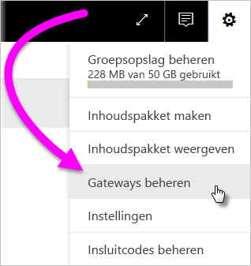
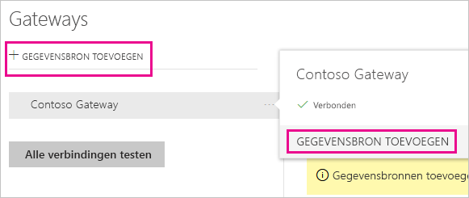
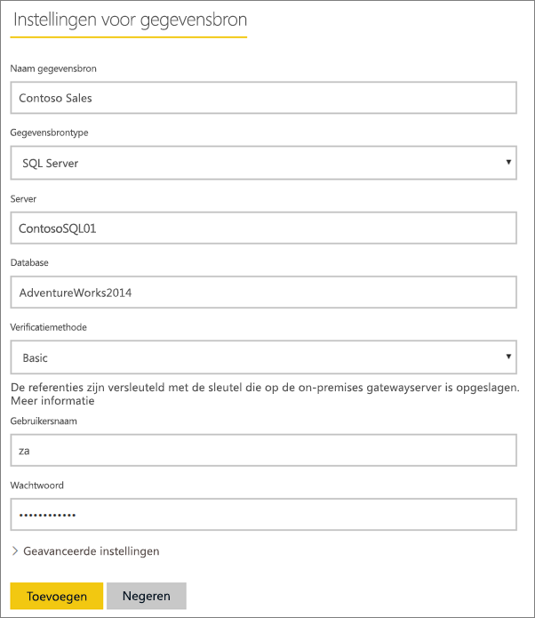
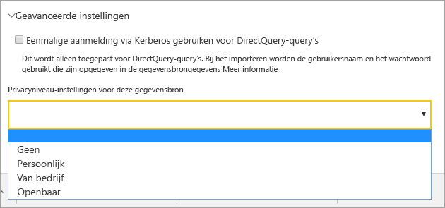
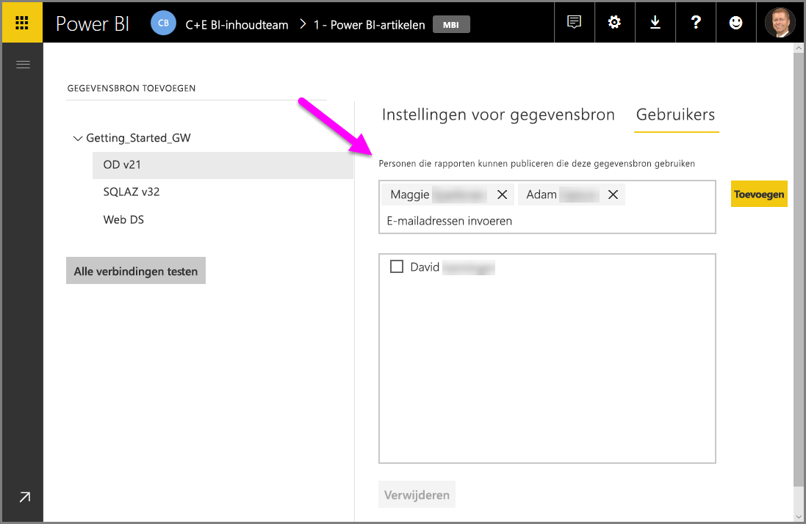
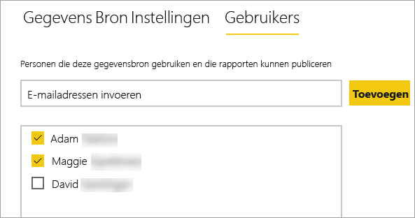
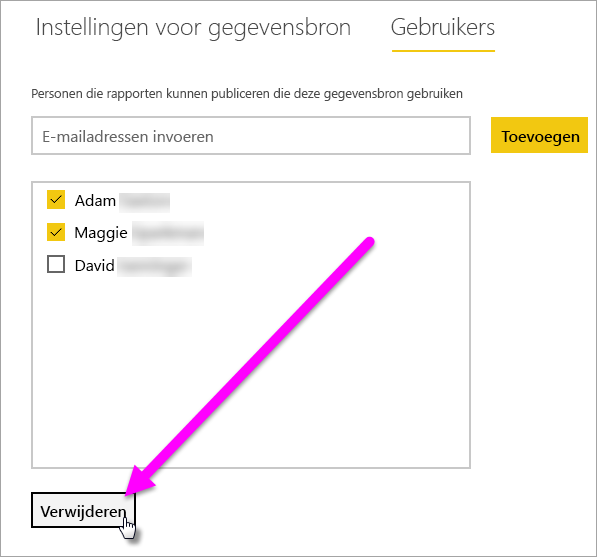
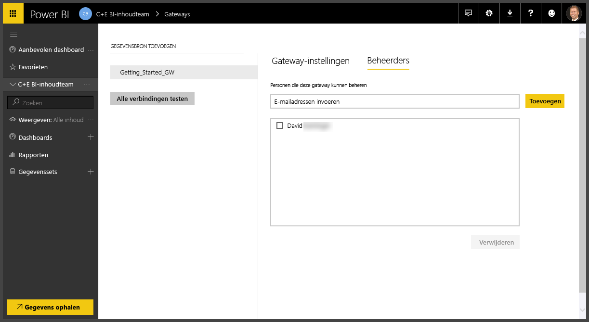
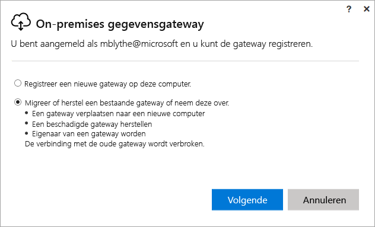
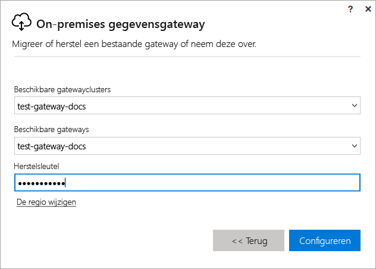

# Een Power BI on-premises gateway beheren

Nadat u [een Power BI-gegevensgateway hebt geïnstalleerd](service-gateway-install.md), beheert u deze op basis van uw vereisten. In dit onderwerp leert u hoe u: gegevensbronnen en gebruikers toevoegt en verwijdert; een gateway opnieuw opstart; en een gateway migreert, herstelt, overneemt en verwijdert.

U kunt een gateway beheren via het gedeelte **Gateways beheren** van de Power BI-service in de gateway-app op uw lokale computer en ook met PowerShell-scripts. Dit artikel richt zich op de Power BI-service.

Als u zojuist een gateway hebt geïnstalleerd, wordt u aangeraden vervolgens [een gegevensbron toe te voegen](#add-a-data-source) en vervolgens [gebruikers toe te voegen](#add-users-to-a-data-source), zodat ze de gegevensbron kunnen openen.

## Gegevensbronnen beheren

Power BI biedt ondersteuning voor veel on-premises gegevensbronnen en elke bron heeft zijn eigen vereisten. Een gateway kan worden gebruikt voor een enkele gegevensbron of meerdere gegevensbronnen. In dit voorbeeld leert u hoe u SQL Server toevoegt als gegevensbron, maar de stappen komen overeen met die voor andere gegevensbronnen.

### Een gegevensbron toevoegen

1. Selecteer rechtsboven in de Power BI-service het tandwielpictogram  > **Gateways beheren**.

    

2. Selecteer een gateway > **Gegevensbron toevoegen** of ga naar Gateways > **Gegevensbron toevoegen**.

    

3. Selecteer het **type gegevensbron**.

    

4. Voer gegevens voor de gegevensbron in. In dit voorbeeld zijn deze **Server**, **Database** en overige gegevens.  

    

5. Voor SQL Server kiest u een **Verificatiemethode** van **Windows** of **Basic** (SQL-verificatie).  Als u **Basic** kiest, voert u de referenties voor de gegevensbron in.

6. Onder **Geavanceerde instellingen** kunt u optioneel het [privacyniveau](https://support.office.com/article/Privacy-levels-Power-Query-CC3EDE4D-359E-4B28-BC72-9BEE7900B540) voor de gegevensbron configureren (geldt niet voor [DirectQuery](desktop-directquery-about.md)).

    

7. Selecteer **Toevoegen**. U ziet *Verbinding gemaakt* als de procedure is voltooid.

    

U kunt deze gegevensbron nu gebruiken om gegevens uit SQL Server op te nemen in uw Power BI-dashboards en -rapporten.

### Een gegevensbron verwijderen

U kunt een gegevensbron verwijderen als u deze niet meer nodig hebt. Houd er rekening mee dat als u een gegevensbron verwijdert, de dashboards en rapporten die afhankelijk zijn van de gegevensbron niet meer werken.

Ga naar de gegevensbron en selecteer **Verwijderen** als u een gegevensbron wilt verwijderen.

## Gebruikers en beheerders beheren

Als u een gegevensbron aan een gateway hebt toegevoegd, geeft u gebruikers en beveiligingsgroepen toegang tot die bepaalde gegevensbron (niet tot de hele gateway). Met de gebruikerslijst voor de gegevensbron wordt alleen gecontroleerd wie er rapporten mag publiceren die gegevens uit de gegevensbron bevatten. Rapporteigenaren kunnen dashboards, inhoudspakketten en apps maken en deze delen met andere gebruikers.

U kunt gebruikers en beveiligingsgroepen ook administratieve toegang tot de gateway geven.

### Gebruikers toevoegen aan een gegevensbron

1. Selecteer rechtsboven in de Power BI-service het tandwielpictogram  > **Gateways beheren**.

2. Selecteer de gegevensbron waar u gebruikers aan wilt toevoegen.

3. Selecteer **Gebruikers** en voer een gebruiker uit uw organisatie in die u toegang wilt verlenen tot de geselecteerde gegevensbron. In het volgende scherm kunt u zien dat ik Menna en Rolf heb toegevoegd.

    

4. Selecteer **Toevoegen** en het toegevoegde lid wordt in het vak weergegeven.

    

Zo eenvoudig werkt dat. Houd er rekening mee dat u gebruikers moet toevoegen aan elke gegevensbron waartoe u toegang wilt verlenen. Elke gegevensbron heeft een afzonderlijke lijst met gebruikers. De gebruikers moeten afzonderlijk worden toegevoegd aan de elke gegevensbron.

### Gebruikers uit een gegevensbron verwijderen

Op het tabblad **Gebruikers** voor de gegevensbron kunt u gebruikers en beveiligingsgroepen verwijderen die deze gegevensbron gebruiken.

### Administrators toevoegen en verwijderen

Op het tabblad **Administrators** voor de gateway kunt u gebruikers (of beveiligingsgroepen) toevoegen en verwijderen die de gateway kunnen beheren.

## Gatewaycluster beheren

Zodra u een cluster van twee of meer gateways maakt, worden alle beheerbewerkingen voor de gateway, zoals het toevoegen van een gegevensbron of het verlenen van beheerdersrechten aan een gateway, toegepast op alle gateways die deel uitmaken van het cluster. 

Wanneer beheerders het menu-item **Gateways beheren** (onder het tandwielpictogram in de **Power BI-service**) gebruiken, zien zij een lijst met geregistreerde clusters van afzonderlijke gateways, maar niet de afzonderlijke gatewayexemplaren die lid van het cluster zijn.

Alle nieuwe aanvragen voor **Geplande vernieuwing** en DirectQuery-bewerkingen worden automatisch doorgestuurd naar het primaire exemplaar van een bepaald gatewaycluster. Als het primaire gatewayexemplaar niet online is, wordt de aanvraag doorgestuurd naar een ander gatewayexemplaar in het cluster.

## Een gateway delen

U kunt gateways niet direct *delen*, maar u kunt wel beheerders toevoegen aan de gateway en u kunt gebruikers toevoegen aan de gegevensbronnen van de gateway. 

Nadat u een gateway hebt geïnstalleerd, bent u de beheerder van die gateway. Dit is een standaardinstelling. Zoals u al eerder zag, kunt u andere personen als beheerders toevoegen. Deze beheerders kunnen gegevensbronnen toevoegen en de gateway configureren en verwijderen.

U kunt ook gebruikers toewijzen aan de gegevensbronnen die u maakt onder elk van uw gateways. Gebruikers kunnen vervolgens die gegevensbronnen gebruiken om Power BI-rapporten te vernieuwen. Ze kunnen echter geen gegevensbronnen of gatewayinstellingen wijzigen.

## Gateway migreren, herstellen of overnemen

Voer het installatieprogramma voor de gateway uit op de computer waarop u de gateway wilt migreren, herstellen of overnemen.

1. Download de gateway installeer deze.

2. Als u zich hebt aangemeld bij uw Power BI-account, registreert u de gateway. Selecteer **Een bestaande gateway migreren, herstellen of overnemen** > **Volgende**.

    

3. Selecteer een cluster en gateway uit de beschikbare clusters en gateways en voer de herstelsleutel voor de geselecteerde gateway in. Selecteer **Configureren**.

    

## Gateway opnieuw starten

De gateway wordt uitgevoerd als een Windows-service. U kunt deze service net als alle andere Windows-services op meerdere manieren starten en stoppen. Hier volgt hoe u kunt dit kunt doen vanaf de opdrachtprompt.

1. Start een opdrachtprompt met administratorbevoegdheden op de machine waarop de gateway wordt uitgevoerd

2. Voer `net stop PBIEgwService` in om de service te stoppen.

3. Voer `net start PBIEgwService` in om de service opnieuw te starten.

## Een gateway verwijderen

U kunt een gateway verwijderen als u deze niet meer nodig hebt. Houd er echter rekening mee dat als u een gateway verwijdert, alle bijbehorende gegevensbronnen ook worden verwijderd. De dashboards en rapporten die afhankelijk zijn van deze gegevensbronnen, werken hierdoor ook niet meer.

1. Selecteer rechtsboven in de Power BI-service het tandwielpictogram  > **Gateways beheren**.

2. Selecteer de gateway > **Verwijderen**
   
   

## Volgende stappen

[Richtlijnen voor het implementeren van een gegevensgateway](service-gateway-deployment-guidance.md)

Hebt u nog vragen? [Misschien dat de Power BI-community het antwoord weet](http://community.powerbi.com/)
