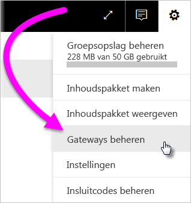
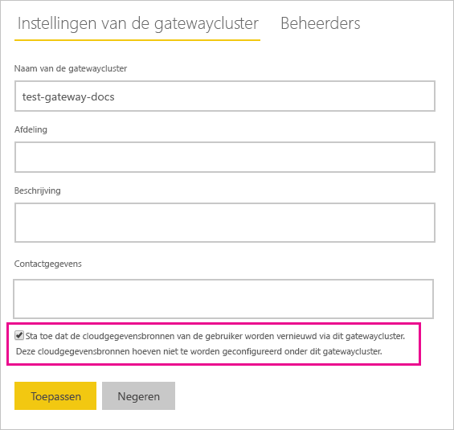
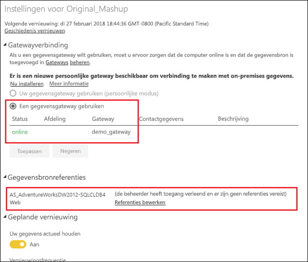

# On-premises en cloudgegevensbronnen samenvoegen of toevoegen

Met de on-premises gegevensgateway kunt u on-premises en cloudgegevensbronnen samenvoegen in of ze toevoegen aan één query. Dit is handig als u gegevens uit verschillende bronnen wilt samenvoegen zonder afzonderlijke query's te hoeven gebruiken.

## Vereisten

- Een [gateway die is geïnstalleerd](service-gateway-install.md) op een lokale computer.
- Een Power BI Desktop-bestand met query's waarin on-premises en cloudgegevensbronnen worden gecombineerd.

1. Selecteer rechtsboven in de Power BI-service het tandwielpictogram  > **Gateways beheren**.

    

2. Selecteer de gateway die u wilt configureren.

3. Onder **Clusterinstellingen van de gateway** selecteert u **Toestaan dat de cloudgegevensbronnen van gebruikers worden vernieuwd via dit gatewaycluster** > **Toepassen**.

    

4. Via dit gatewaycluster voegt u alle [on-premises gegevensbronnen](service-gateway-enterprise-manage-scheduled-refresh.md#add-a-data-source) toe die u gebruikt in uw query's. U hoeft hier niet de cloudgegevensbronnen toe te voegen.

4. Upload uw Power BI Desktop-bestand naar de Power BI-service. Dit bestand bevat de query's waarin on-premises en cloudgegevensbronnen worden gecombineerd.

5. Op de pagina **Gegevenssetinstellingen** van de nieuwe gegevensset:

    - Voor de on-premises bron selecteert u de gateway die is gekoppeld aan deze gegevensbron.

    - Bij **Gegevensbronreferenties** bewerkt u de referenties van de cloudgegevensbronnen waar nodig.

    

6. Als de cloudreferenties zijn ingesteld, kunt u de gegevensset vernieuwen via de optie **Nu vernieuwen**, of u kunt instellen dat er periodiek wordt vernieuwd.

## Volgende stappen

Zie [De gegevensbron gebruiken voor geplande vernieuwing](service-gateway-enterprise-manage-scheduled-refresh.md#using-the-data-source-for-scheduled-refresh) voor meer informatie over gegevensvernieuwing voor gateways.