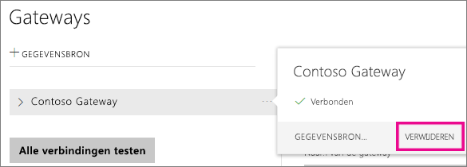
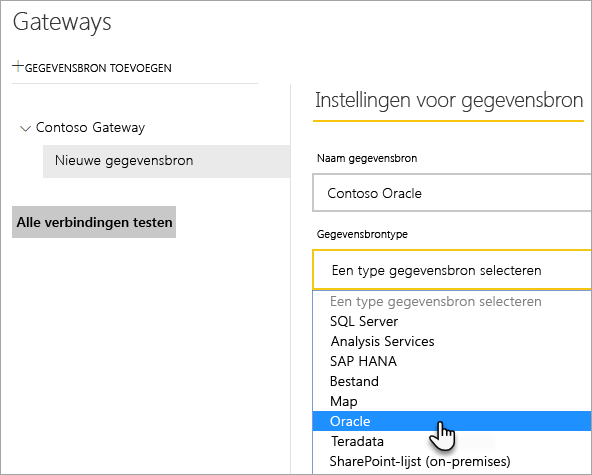
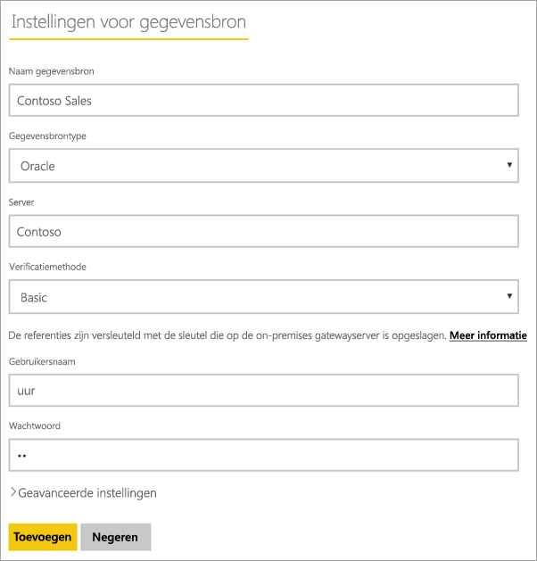
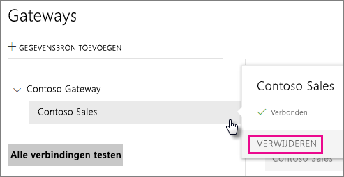
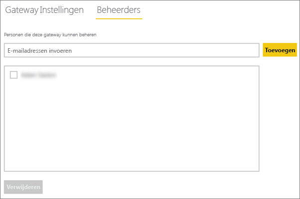
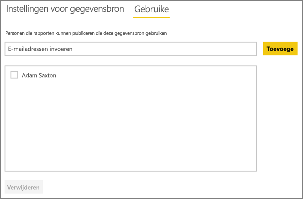

# <a name="manage-your-data-source---oracle"></a>De gegevensbron beheren - Oracle
Nadat u de on-premises gegevensgateway hebt geïnstalleerd, moet u gegevensbronnen toevoegen die met de gateway kunnen worden gebruikt. In dit artikel leest u hoe u met gateways en gegevensbronnen werkt. U kunt de Oracle-gegevensbron voor geplande vernieuwing of voor DirectQuery gebruiken.

## <a name="download-and-install-the-gateway"></a>De gateway downloaden en installeren
U kunt de gateway downloaden via de Power BI-service. Selecteer **Downloads** > **Gegegevensgateway** of ga naar de [pagina voor het downloaden van gateways](https://go.microsoft.com/fwlink/?LinkId=698861).


> [!WARNING]
> Voordat de gateway verbinding kan maken met uw Oracle-server, moet u de Oracle-gegevensprovider voor .NET (ODP.NET) installeren en configureren. Deze maakt deel uit van de Oracle Data Access Components (ODAC). Raadpleeg hieronder [De Oracle-client installeren](#installing-the-oracle-client) voor meer informatie over hoe u de Oracle-provider downloadt.
> 
> 

## <a name="installing-the-oracle-client"></a>De Oracle-client installeren
Gebruik voor **32-bits** versies van Power BI Desktop de volgende koppeling om de **32-bits** Oracle-client te downloaden en te installeren:

* [32-bits Oracle Data Access Components (ODAC) met Oracle-ontwikkelhulpprogramma's voor Visual Studio (12.1.0.2.4)](http://www.oracle.com/technetwork/topics/dotnet/utilsoft-086879.html)

Gebruik voor **64-bits** versies van Power BI Desktop, of voor de on-premises gegevensgateway, de volgende koppeling om de **64-bits** Oracle-client te downloaden en te installeren:

* [64-bits ODAC 12.2c release 1 (12.2.0.1.0) voor Windows x64](http://www.oracle.com/technetwork/database/windows/downloads/index-090165.html)

Nadat de Oracle-client is geïnstalleerd, moet u het bestand tnsnames.ora configureren met de juiste gegevens voor uw database. Power BI Desktop en de gateway gaan af op de net_service_name die is gedefinieerd in het bestand tnsnames.ora. Als het bestand niet is geconfigureerd, kunt u geen verbinding maken. Het standaardpad voor tnsnames.ora is: `[Oracle Home Directory]\Network\Admin\tnsnames.ora`. Raadpleeg [Oracle: Local Naming Parameters (tnsnames.ora)](https://docs.oracle.com/cd/B28359_01/network.111/b28317/tnsnames.htm) (Oracle: parameters voor lokale naamgeving (tnsnames.ora)) voor meer informatie over hoe u tnsnames.ora-bestanden configureert.

### <a name="example-tnsnamesora-file-entry"></a>Voorbeeld van invoer voor het bestand tnsnames.ora
De basisindeling voor invoer in tnsname.ora is de volgende.

```
net_service_name=
 (DESCRIPTION=
   (ADDRESS=(protocol_address_information))
   (CONNECT_DATA=
     (SERVICE_NAME=service_name)))
```

Hier volgt een voorbeeld van ingevulde server- en poortgegevens.

```
CONTOSO =
  (DESCRIPTION =
    (ADDRESS = (PROTOCOL = TCP)(HOST = oracleserver.contoso.com)(PORT = 1521))
    (CONNECT_DATA =
      (SERVER = DEDICATED)
      (SERVICE_NAME = CONTOSO)
    )
  )
```

## <a name="add-a-gateway"></a>Een gateway toevoegen
Als u een gateway wilt toevoegen, moet u deze gewoon [downloaden](https://go.microsoft.com/fwlink/?LinkId=698861) en installeren op een server in uw omgeving. Nadat u de gateway hebt geïnstalleerd, wordt deze weergegeven in de lijsten met gateways onder **Gateways beheren**.

> [!NOTE]
> **Gateways beheren** wordt alleen weergegeven als u beheerder van ten minste één gateway bent geworden. Dit kan doordat een andere beheerder u toevoegt of door zelf een gateway te installeren en configureren.
> 
> 

## <a name="remove-a-gateway"></a>Een gateway verwijderen
Als u een gateway verwijdert, worden ook alle gegevensbronnen voor die gateway verwijderd.  De dashboards en rapporten die afhankelijk zijn van deze gegevensbronnen, werken hierdoor ook niet meer.

1. Selecteer het tandwielpictogram  in de rechterbovenhoek > **Gateways beheren**.
2. Gateway > **Verwijderen**
   
   

## <a name="add-a-data-source"></a>Een gegevensbron toevoegen
U kunt een gegevensbron toevoegen door een gateway te selecteren en op **Gegevensbron toevoegen** te klikken of door naar Gateway > **Gegevensbron toevoegen** te gaan.


U kunt dan in de lijst het **gegevensbrontype** selecteren.



Vul vervolgens de gegevens in voor de gegevensbron, waaronder de **server** en de **database**.  

U moet ook een **verificatiemethode** kiezen.  Dit kan **Windows** of **Basic** zijn.  Kies **Basic** als u een account wilt gebruiken dat binnen Oracle is gemaakt, in plaats van Windows-verificatie. Voer de referenties in die u voor deze gegevensbron gaat gebruiken.

> [!NOTE]
> Alle query's in de gegevensbron worden uitgevoerd met deze referenties. Meer informatie over hoe [referenties](service-gateway-onprem.md#credentials) worden opgeslagen vindt u in het hoofdartikel over on-premises gateways.
> 
> 



Als u alles hebt ingevuld, klikt u op **Toevoegen**.  U kunt deze gegevensbron nu gebruiken voor geplande vernieuwing of DirectQuery op een on-premises Oracle-server. De tekst *Verbinding gemaakt* wordt weergegeven als deze bewerking is geslaagd.


### <a name="advanced-settings"></a>Geavanceerde instellingen
U kunt het privacyniveau voor de gegevensbron configureren. Hiermee bepaalt u hoe gegevens kunnen worden gecombineerd. Dit wordt alleen gebruikt voor geplande vernieuwing. Het geldt niet voor DirectQuery. [Meer informatie](https://support.office.com/article/Privacy-levels-Power-Query-CC3EDE4D-359E-4B28-BC72-9BEE7900B540)


## <a name="remove-a-data-source"></a>Een gegevensbron verwijderen
Als u een gegevensbron verwijdert, zullen de dashboards of rapporten die afhankelijk zijn van de gegevensbron niet meer werken.  

Ga naar Gegevensbron > **Verwijderen** om een gegevensbron te verwijderen.



## <a name="manage-administrators"></a>Beheerders beheren
Op het tabblad Beheerders voor de gateway kunt u gebruikers (of beveiligingsgroepen) toevoegen en verwijderen die de gateway kunnen beheren.



## <a name="manage-users"></a>Gebruikers beheren
Op het tabblad Gebruikers voor de gegevensbron kunt u gebruikers (of beveiligingsgroepen) toevoegen en verwijderen die deze gegevensbron kunnen gebruiken.

> [!NOTE]
> De lijst met gebruikers wordt uitsluitend geraadpleegd om te bepalen wie er rapporten mag publiceren. Rapporteigenaren kunnen dashboards of inhoudspakketten maken en deze delen met andere gebruikers. Gebruikers die het rapport of dashboard gebruiken, hoeven niet in de gebruikerslijst te worden opgenomen.
> 
> 



## <a name="using-the-data-source"></a>De gegevensbron gebruiken
Nadat u de gegevensbron hebt gemaakt, kan deze worden gebruikt met DirectQuery-verbindingen of via geplande vernieuwing.

> [!WARNING]
> De servernaam en databasenaam die worden gebruikt voor Power BI Desktop en de gegevensbron in de on-premises gegevensgateway moeten overeenkomen.
> 
> 

De koppeling tussen uw gegevensset en de gegevensbron in de gateway is gebaseerd op de servernaam en databasenaam. Deze moeten met elkaar overeenkomen! Als u bijvoorbeeld een IP-adres gebruikt als servernaam, moet u in Power BI Desktop dit IP-adres gebruiken voor de gegevensbron in de gatewayconfiguratie. Deze naam moet ook overeenkomen met een alias die is gedefinieerd in het bestand tnsnames.ora. Raadpleeg [De Oracle-client installeren](#installing-the-oracle-client) voor meer informatie over het bestand tnsnames.ora.

Dit geldt voor zowel DirectQuery als geplande vernieuwing.

### <a name="using-the-data-source-with-directquery-connections"></a>De gegevensbron gebruiken met DirectQuery-verbindingen
Zorg ervoor dat de servernaam en databasenaam voor Power BI Desktop en de geconfigureerde gegevensbron voor de gateway overeenkomen. Zorg er ook voor dat de gebruiker wordt vermeld op het tabblad **Gebruikers** voor de gegevensbron om gegevenssets met DirectQuery te kunnen publiceren. De selectie voor DirectQuery vindt plaats in Power BI Desktop wanneer u voor het eerst gegevens importeert. [Meer informatie](desktop-use-directquery.md)

Als het goed is, werken uw rapporten nadat u de gegevens hebt gepubliceerd vanuit Power BI Desktop of via **Gegevens ophalen**. Nadat u de gegevensbron in de gateway hebt gemaakt, kan het enkele minuten duren voordat de verbinding kan worden gebruikt.

### <a name="using-the-data-source-with-scheduled-refresh"></a>De gegevensbron gebruiken met geplande vernieuwing
Als u wordt vermeld op het tabblad **Gebruikers** voor de gegevensbron die in de gateway is geconfigureerd, en de servernaam en databasenaam overeenkomen, wordt de gateway weergegeven voor gebruik met geplande vernieuwing.


## <a name="troubleshooting"></a>Probleemoplossing
Als de naamgevingssyntaxis onjuist is of niet goed is geconfigureerd, kunnen er in Oracle diverse fouten optreden.

* ORA-12154: TNS: could not resolve the connect identifier specified  
* ORA-12514: TNS listener does not currently know of service requested in connect descriptor  
* ORA-12541: TNS: no listener  
* ORA-12170: TNS:Connect timeout occurred  
* ORA-12504: TNS listener was not given the SERVICE_NAME in CONNECT_DATA  

Deze fouten kunnen zich voordoen als de Oracle-client niet is geïnstalleerd of niet juist is geconfigureerd. Als de client is geïnstalleerd, kunt u controleren of het bestand tnsnames.ora goed is geconfigureerd en of u de juiste net_service_name gebruikt. Zorg er ook voor dat de net_service_name op de computer die Power BI Desktop gebruikt en op de computer die de gateway uitvoert, hetzelfde is. Raadpleeg [De Oracle-client installeren](#installing-the-oracle-client) voor meer informatie.

> [!NOTE]
> Er kunnen ook problemen optreden als de versie van de Oracle-server niet compatibel is met de versie van de Oracle-client. U doet er goed aan ervoor te zorgen dat deze overeenkomen.
> 
> 

Raadpleeg [Troubleshooting the on-premises data gateway](service-gateway-onprem-tshoot.md) (Problemen met de on-premises gegevensgateway oplossen) voor aanvullende informatie over probleemoplossing voor de gateway.

## <a name="next-steps"></a>Volgende stappen
[On-premises gegevensgateway](service-gateway-onprem.md)  
[On-premises gegevensgateway - uitgebreid](service-gateway-onprem-indepth.md)  
[Problemen met de on-premises gegevensgateway oplossen](service-gateway-onprem-tshoot.md)  
[Power BI Premium](service-premium.md)

Hebt u nog vragen? [Misschien dat de Power BI-community het antwoord weet](http://community.powerbi.com/)

