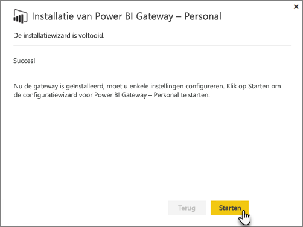
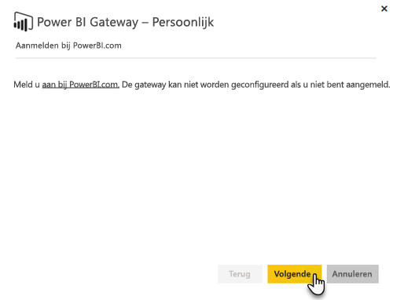
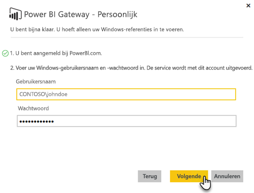

# On-premises gegevensgateway

De on-premises gegevensgateway fungeert als een brug waarmee u over snelle en veilige gegevensoverdracht beschikt tussen on-premises gegevens (gegevens die zich niet in de cloud bevinden) en de services van Power BI, Microsoft Flow, Logic Apps en PowerApps.

U kunt één gateway met verschillende services tegelijk gebruiken. Als u Power BI en PowerApps gebruikt, kan één gateway worden gebruikt voor beiden. Dit is afhankelijk van het account waarmee u zich aanmeldt.

> [!NOTE]
> Via de on-premises gegevensgateway worden gegevenscompressie en transportversleuteling in alle modi geïmplementeerd.

<!-- Shared Requirements Include -->
[!INCLUDE [gateway-onprem-requirements-include](./includes/gateway-onprem-requirements-include.md)]

### Beperkingen van liveverbindingen van Analysis Services

U kunt een liveverbinding gebruiken voor tabelvormige of multidimensionale exemplaren.

| **Server-versie** | **Vereiste SKU** |
| --- | --- |
| 2012 SP1 CU4 of hoger |Business Intelligence en Enterprise-SKU |
| 2014 |Business Intelligence en Enterprise-SKU |
| 2016 |Standaard-SKU of hoger |

* Opmaak op celniveau en vertaalfuncties worden niet ondersteund.
* Acties en benoemde sets zijn niet beschikbaar in Power BI, maar u kunt wel verbinding maken met multidimensionale kubussen die ook acties of benoemde sets bevatten. Ook kunt u visuele elementen en rapporten maken.

<!-- Shared Install steps Include -->
[!INCLUDE [gateway-onprem-datasources-include](./includes/gateway-onprem-datasources-include.md)]

## De on-premises gegevensgateway downloaden en installeren

Selecteer **Gegevensgateway** in het menu Downloads om de gateway te downloaden. Download de [On-premises gegevensgateway](http://go.microsoft.com/fwlink/?LinkID=820925).

U kunt de on-premises gegevensgateway bijwerken door de gateway opnieuw te installeren. Dit wordt in dit gedeelte beschreven. Zolang u een nieuwere versie van de gateway installeert, blijven uw bestaande instellingen bewaard. Als u dezelfde versie installeert, wordt deze versie als nieuwe versie behandeld en worden uw instellingen niet bewaard.

<!-- Shared Install steps Include -->
[!INCLUDE [gateway-onprem-install-include](./includes/gateway-onprem-install-include.md)]

## De gateway in persoonlijke modus installeren

> [!NOTE]
> De persoonlijke versie van de gateway werkt alleen met Power BI.

Nadat de persoonlijke gateway is geïnstalleerd, moet u de **Power BI Gateway - Persoonlijke configuratiewizard** starten.

Vervolgens moet u zich aanmelden bij Power BI om de gateway te registreren bij de cloudservice.

U moet ook de Windows-gebruikersnaam en het wachtwoord invoeren dat hoort bij de Windows-service. U kunt een ander Windows-account van uzelf opgeven. De gateway-service wordt uitgevoerd met dit account.

Nadat de installatie is voltooid, gaat u naar de gegevenssets in Power BI en controleert u of de referenties zijn ingevoerd voor uw on-premises gegevensbronnen.

## Versleutelde referenties opslaan in de cloud

Wanneer u een gegevensbron aan de gateway toevoegt, moet u referenties opgeven voor de gegevensbron. Alle query's over de gegevensbron worden uitgevoerd met deze referenties. Voordat de referenties worden opgeslagen in de cloud, worden ze veilig versleuteld met behulp van asymmetrische codering zodat ze in de cloud niet kunnen niet worden ontsleuteld. De referenties worden verzonden naar de machine waarop de gateway wordt uitgevoerd, waar ze worden ontsleuteld als de gegevensbronnen worden geopend.

<!-- Account and Port information -->
[!INCLUDE [gateway-onprem-accounts-ports-more](./includes/gateway-onprem-accounts-ports-more.md)]

<!-- How the gateway works -->
[!INCLUDE [gateway-onprem-how-it-works-include](./includes/gateway-onprem-how-it-works-include.md)]

## Beperkingen en overwegingen

* [Azure Information Protection](https://docs.microsoft.com/microsoft-365/enterprise/protect-files-with-aip
) wordt momenteel niet ondersteund.
* [Access Online](https://products.office.com/en-us/access) wordt momenteel niet ondersteund.
* R-scripts worden alleen ondersteund als de gateway wordt uitgevoerd in de persoonlijke modus.

## Beheer op tenantniveau

Er is momenteel geen centrale locatie waar tenantbeheerders alle gateways kunnen beheren die andere gebruikers hebben geïnstalleerd en geconfigureerd.  Als u een tenantbeheerder bent, kunt u het beste de gebruikers in uw organisatie vragen u toe te voegen als beheerder aan elke gateway die ze installeren. Op deze manier kunt u alle gateways in uw organisatie beheren via de pagina Gateway-instellingen of via [PowerShell-opdrachten](https://docs.microsoft.com/power-bi/service-gateway-high-availability-clusters#powershell-support-for-gateway-clusters). 

## Uitgaande Azure-verbindingen inschakelen

De on-premises gegevensgateway is afhankelijk van Azure Service Bus voor cloudconnectiviteit en brengt dienovereenkomstig uitgaande verbindingen naar de bijbehorende Azure-regio tot stand. Standaard is dit de locatie van uw Power BI-tenant. Zie [Waar bevindt mijn Power BI-tenant zich?](https://powerbi.microsoft.com/en-us/documentation/powerbi-admin-where-is-my-tenant-located/)
Als uitgaande verbindingen door een firewall worden geblokkeerd, moet u de firewall configureren zodat deze uitgaande verbindingen toestaat van de on-premises gegevensgateway naar de bijbehorende Azure-regio. Zie [Microsoft Azure Datacenter IP-bereiken](https://www.microsoft.com/download/details.aspx?id=41653) voor meer informatie over het IP-adressenbereik van elk Azure-datacenter.
> [!NOTE]
> Het IP-adressenbereik kan na verloop van tijd worden gewijzigd; download dus regelmatig de nieuwste informatie. 

## Problemen oplossen

Zie [Problemen met de on-premises gegevensgateway oplossen](service-gateway-onprem-tshoot.md) als u problemen hebt bij het installeren en configureren van een gateway. Als u denkt dat er een probleem is met uw firewall, raadpleegt u de sectie [Firewall of proxyserver](service-gateway-onprem-tshoot.md#firewall-or-proxy) in het artikel over probleemoplossing.

Zie [Proxy-instellingen voor de Power BI-gateways configureren](service-gateway-proxy.md) als u denkt dat er proxy-problemen met de gateway zijn.

## Volgende stappen

[Manage your data source - Analysis Services](service-gateway-enterprise-manage-ssas.md) (Uw gegevensbron beheren - Analysis Services)  
[Manage your data source - SAP HANA](service-gateway-enterprise-manage-sap.md) (Uw gegevensbron beheren - SAP HANA)  
[Manage your data source - SQL Server](service-gateway-enterprise-manage-sql.md) (Gegevensbron beheren - SQL Server)  
[Manage your data source - Oracle](service-gateway-onprem-manage-oracle.md) (Gegevensbron beheren - Oracle)  
[Manage your data source - Import/Scheduled refresh](service-gateway-enterprise-manage-scheduled-refresh.md) (Gegevensbron beheren - importeren/geplande vernieuwing)  
[On-premises data gateway in-depth](service-gateway-onprem-indepth.md) (On-premises gegevensgateway - uitgebreid)  
[On-premises gegevensgateway (persoonlijke modus): de nieuwe versie van de persoonlijke gateway](service-gateway-personal-mode.md)  
[Proxyinstellingen configureren voor de on-premises gegevensgateway](service-gateway-proxy.md)  

Hebt u nog vragen? [Misschien dat de Power BI-community het antwoord weet](http://community.powerbi.com/)
