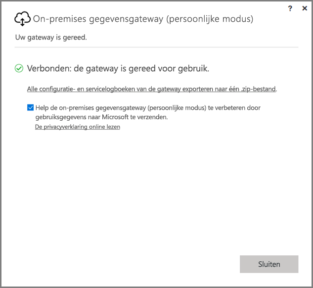
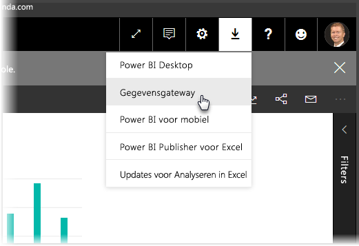
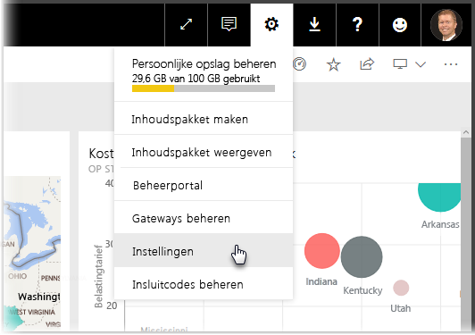
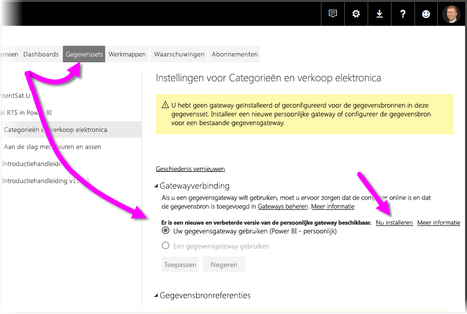
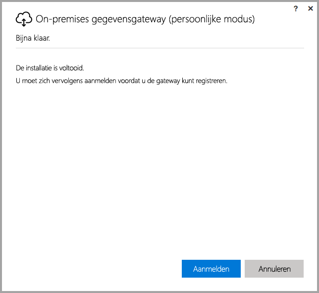
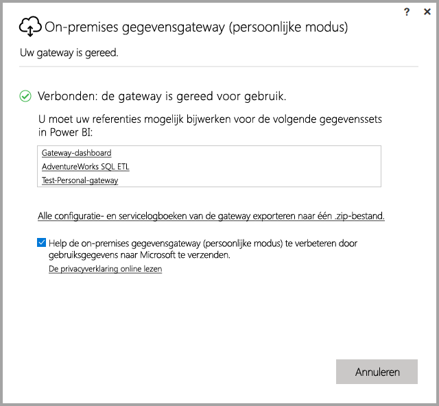

# <a name="on-premises-data-gateway-personal-mode"></a>On-premises gegevensgateway (persoonlijke modus)
U kunt on-premises gegevensbronnen gebruiken en Power BI-rapporten en -dashboards maken met behulp van een gateway. Een **gateway** is software die de toegang vereenvoudigt tot gegevens die zijn opgeslagen op een privé, on-premises netwerk en het vervolgens mogelijk maakt deze gegevens te gebruiken in onlineservices, zoals de **Power BI-service**. De **on-premises gegevensgateway (persoonlijke modus)** is een onlangs uitgebrachte update voor de Power BI-gateway waarmee personen een gateway kunnen installeren op hun eigen computer om zo toegang te krijgen tot on-premises gegevens.



> [!NOTE]
> De **on-premises gegevensgateway (persoonlijke modus)** vervangt de eerder ondersteunde versie van de persoonlijke gateway, genaamd **Power BI Gateway - Personal**. Deze vorige versie van de persoonlijke gateway blijft functioneel tot uiterlijk 31 juli 2017. Zie de secties hieronder voor meer informatie over hoe u deze kunt bijwerken naar de nieuwe versie.
> 
> 

## <a name="features-of-the-on-premises-data-gateway-personal-mode"></a>Functies van de on-premises gegevensgateway (persoonlijke modus)
Met de release van de **on-premises gegevensgateway (persoonlijke modus)** is een verzameling nieuwe functies en verbeteringen beschikbaar geworden. In de vorige versie van de persoonlijke gateway (genaamd **Power BI Gateway - Personal**), ging de implementatie gepaard met enkele beperkingen. Net als bij veel andere Power BI-producten hebben we geluisterd naar de behoeften van onze klanten, hun verzoeken en hoe zij het product gebruiken. Op basis van die informatie hebben we de **on-premises gegevensgateway (persoonlijke modus)** volledig opnieuw ontworpen en voorzien van de volgende functies en verbeteringen:

* **Verbeterde betrouwbaarheid**: de nieuwe versie van de persoonlijke gateway is betrouwbaarder dan de vorige versie, door verbeteringen in de code en structurele softwareverbeteringen.
* **Verbeterde uitbreidbaarheid**: als onderdeel van de structurele softwareverbeteringen, kunnen er eenvoudig extra functies worden toegevoegd aan de persoonlijke gateway, wanneer deze beschikbaar worden.
* **Persoonlijke gateway verwijderen uit de Power BI-service**: door de introductie van de nieuwe versie, kunt u nu uw oude persoonlijke gateway verwijderen uit de **Power BI-service**.
* **Configuratie- en servicelogboeken**: in de nieuwe versie kunt u eenvoudig met één klik configuratie- en servicelogboeken exporteren naar een ZIP-bestand.

## <a name="installing-on-premises-data-gateway-personal-mode"></a>On-premises gegevensgateway (persoonlijke modus)
Om de **on-premises gegevensgateway (persoonlijke modus)** te installeren wanneer u de vorige versie van de gateway niet hebt geïnstalleerd, selecteert u het tandwielpictogram in de **Power BI-service** en selecteert u vervolgens **Gegevensgateway**.



U kunt ook de gateway downloaden vanaf [deze locatie](https://go.microsoft.com/fwlink/?LinkId=820925&clcid=0x409). U kunt vervolgens de installatiestappen volgen, maar u dient hierbij wel op te letten dat u de **on-premises gegevensgateway (persoonlijke modus)** selecteert wanneer u wordt gevraagd welke versie van de gateway u wilt installeren, omdat het installatieproces de keuze biedt om ofwel de standaard-gateway te installeren (welke kan worden gedeeld met anderen) of de persoonlijke modus.

### <a name="updating-from-the-previous-personal-gateway"></a>Bijwerken van de vorige persoonlijke gateway
Als u de **Power BI Gateway - Personal** al hebt geïnstalleerd, wordt u gevraagd de nieuwe en verbeterde versie van de persoonlijke gateway installeren wanneer u **Gegevenssets** weergeeft via **Instellingen** in de **Power BI-service**.



Wanneer u een gegevensset selecteert en vervolgens **Gateway-verbinding** kiest, ontvangt u een melding dat er een nieuwe en verbeterde versie van de persoonlijke gateway beschikbaar is. Selecteer in dit geval **Nu installeren**.



> [!NOTE]
> Als u de vorige versie van **Power BI Gateway - Personal** uitvoert als een proces met verhoogde bevoegdheden, dient u te zorgen dat u de installatieprocedure voor de nieuwe gateway ook start met verhoogde bevoegdheden, zodat de referenties voor uw gegevenssets automatisch kunnen worden bijgewerkt. Anders zult u de referenties voor uw gegevenssets handmatig moeten bijwerken.
> 
> 

U wordt door het updateproces geleid, waarna u te zien krijgt of de installatie is geslaagd. Op dit punt dient u de openstaande vensters echter nog niet te sluiten, er volgt nog een laatste stap.



Dit is de laatste stap. Nadat de nieuwe persoonlijke gateway is geïnstalleerd (en het laatste installatiescherm nog steeds wordt weergegeven), dient u zich aan te melden bij de **Power BI-service** en vervolgens te wachten tot u ziet dat de gateway online is, zoals wordt weergegeven in de volgende afbeelding.



Als u de persoonlijke gateway op dezelfde computer hebt bijgewerkt als waarop de vorige gateway was geïnstalleerd, worden uw referenties automatisch bijgewerkt en worden alle vernieuwingsactiviteiten voortaan via de nieuwe gateway gestuurd. Als de vorige gateway was geïnstalleerd op een andere computer, wordt u gevraagd om uw referenties voor bepaalde gegevenssets bij te werken. In de vorige afbeelding ziet u een lijst met gegevenssets in het venster. In deze lijst wordt aangegeven voor welke gegevenssets de referenties mogelijk moeten worden bijgewerkt. Elke gegevensset die in de lijst wordt weergegeven is een directe koppeling waarop u kunt klikken om gelijk uw referenties bij te werken.

U bent bijna klaar. Nu de nieuwe gateway is geïnstalleerd, hoeft de vorige versie niet langer op uw computer geïnstalleerd te blijven, dus deze kunt u verwijderen. U kunt dit doen door op uw computer te zoeken naar **Power BI Gateway - Personal** en de installatie ongedaan te maken.

### <a name="determining-which-version-of-the-personal-gateway-you-have-installed"></a>Bepalen welke versie van de persoonlijke gateway u hebt geïnstalleerd
Om te bepalen welke versie van de persoonlijke gateway u momenteel hebt geïnstalleerd, kunt u het volgende doen:

* De vorige versie van de persoonlijke gateway heet **Power BI Gateway - Personal** en maakt gebruik van het Power BI-pictogram in het installatiedialoogvenster.
* De nieuwe versie van de persoonlijke gateway heet **On-premises gegevensgateway (persoonlijke modus)** en maakt gebruik van het gateway-pictogram (een wolk met verticale pijlen in twee richtingen onderaan).

U kunt navigeren naar **Programma's toevoegen/verwijderen** om te kijken of **Power BI Gateway - Personal** in de lijst staat. Indien dit het geval is, staat de vorige versie van de persoonlijke gateway geïnstalleerd.

## <a name="using-fast-combine-with-the-personal-gateway"></a>Fast Combine gebruiken in combinatie met de persoonlijke gateway
Als u **Fast Combine** gebruikte in combinatie met de vorige versie van de gateway, dient u de volgende stappen te doorlopen om **Fast Combine** weer in te schakelen voor gebruik met de **on-premises gegevensgateway (persoonlijke modus)**:

1. Open met behulp van de Verkenner het volgende bestand:
   
   ```
   %localappdata%\Microsoft\On-premises data gateway (personal mode)\Microsoft.PowerBI.DataMovement.Pipeline.GatewayCore.dll.config
   ```
2. Voeg onderaan het bestand de volgende tekst toe:
   
       ```
       <setting name="EnableFastCombine" serializeAs="String">```
       <value>true</value>
       </setting>
       ```
3. Ongeveer een minuut nadat u deze wijziging hebt opgeslagen, wordt de instelling doorgevoerd. Als u wilt controleren of deze correct werkt, kunt u in de **Power BI-service** handmatig opdracht geven een vernieuwing uit te voeren om te controleren of **Fast Combine** werkt.

## <a name="limitations-and-considerations"></a>Beperkingen en overwegingen
Er zijn enkele aandachtspunten bij het gebruik van de **on-premises gegevensgateway (persoonlijke modus)**, welke worden beschreven in de volgende lijst.

* Als u **Windows Hello** of een pincode gebruikt om aan te melden bij Windows, kunt u de volgende fout tegenkomen: 
  * *Het gebruikersaccount dat u hebt geselecteerd, voldoet niet aan de vereisten van de toepassing. Gebruik een ander account.*
  * Om deze fout op te lossen, selecteert u *Gebruik een ander account* en meldt u zich opnieuw aan. 

De volgende gegevensbronnen worden momenteel niet ondersteund voor de **on-premises gegevensgateway (persoonlijke modus)**:

* ADO.NET 
* CurrentWorkbook
* FTP
* HDFS
* SAP BusinessObjects         
* Spark

Ondersteuning voor Spark is gepland voor de tweede helft van het kalenderjaar 2017.

## <a name="frequently-asked-questions-faq"></a>Veelgestelde vragen
* Kan ik de **on-premises gegevensgateway (persoonlijke modus)** uitvoeren naast de **on-premises gegevensgateway** (voorheen bekend als de Enterprise-versie van de gateway)?
  
  * **Antwoord**: ja, met de nieuwe versie kunnen deze gelijktijdig worden uitgevoerd.
* Kan ik de **On-premises gegevensgateway (persoonlijke modus)** uitvoeren als een service?
  
  * **Antwoord:** nee. De **on-premises gegevensgateway (persoonlijke modus)** kan alleen worden uitgevoerd als een toepassing. Als u de gateway wilt uitvoeren als een service en/of met beheerdersrechten, zult u de [**on-premises gegevensgateway**](service-gateway-onprem.md) (voorheen bekend als de Enterprise-gateway) moeten gebruiken.
* Hoe vaak wordt de **on-premises gegevensgateway (persoonlijke modus)** bijgewerkt?
  
  * **Antwoord**: we zullen de persoonlijke gateway maandelijks bijwerken.
* Waarom word ik gevraagd mijn referenties bij te werken?
  
  * **Antwoord**: er kunnen diverse redenen zijn waarom u om uw referenties wordt gevraagd. De meest voorkomende reden is dat u de **on-premises gegevensgateway (persoonlijke modus)** hebt geïnstalleerd op een andere computer dan uw **Power BI - Personal**-gateway. Het is ook mogelijk dat er een probleem is opgetreden in de gegevensbron, waardoor Power BI geen testverbinding kon maken, of dat er een time-out of systeemfout is opgetreden. U kunt uw referenties voor de **Power BI-service** bijwerken door te navigeren naar het **tandwielpictogram**, **Instellingen** te selecteren en vervolgens op **Gegevenssets** te klikken. U kunt dan de gegevensset in kwestie zoeken en klikken op *Referenties bijwerken*.
* Hoelang is mijn vorige persoonlijke gateway offline tijdens de upgrade?
  
  * **Antwoord**: de upgrade van de persoonlijke gateway naar de nieuwe versie zou slechts enkele minuten moeten duren. 
* Wat gebeurt er als ik niet voor 31 juli 2017 overstap naar de nieuwe persoonlijke gateway?
  
  * **Antwoord**: als u uw rapporten met behulp van de oudere versie van de gateway vernieuwt, stopt het vernieuwproces. De enige manier om een nieuw vernieuwingsschema in te stellen is de nieuwe gateway te installeren en configureren.
* Ik gebruik R-scripts. Wordt dit ondersteund?
  
  * **Antwoord**: we verwachten snel ondersteuning voor R-scripts toe te voegen.
* Waarom wordt de melding om mijn gateway bij te werken niet weergegeven in de **Power BI-service**?
  
  * **Antwoord**: dit is waarschijnlijk omdat u één of meer gegevenssets gebruikt met een gegevensbron die nog niet wordt ondersteund.

## <a name="next-steps"></a>Volgende stappen
[Configuring proxy settings for the on-premises data gateway](service-gateway-proxy.md) (Proxy-instellingen voor de on-premises gegevensgateway configureren)  
Hebt u nog vragen? [Misschien dat de Power BI-community het antwoord weet](http://community.powerbi.com/)

