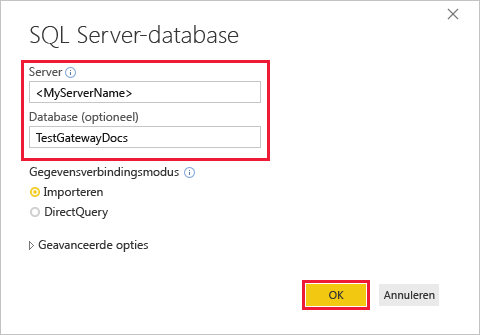
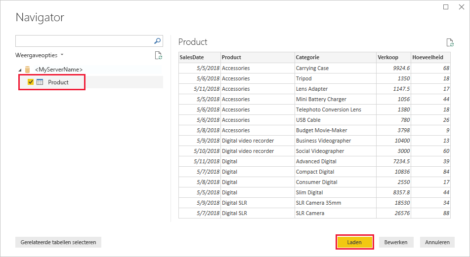
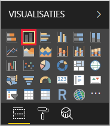
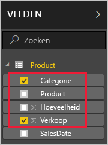
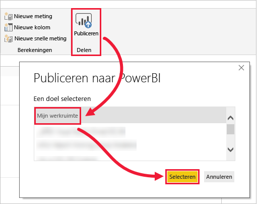
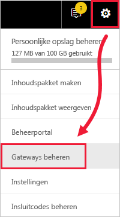
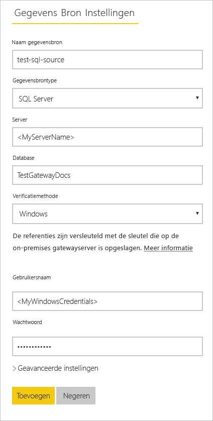
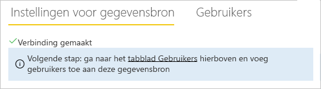
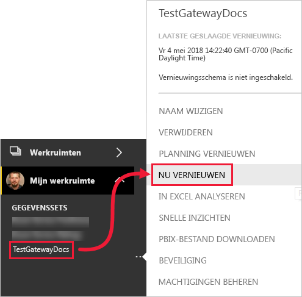
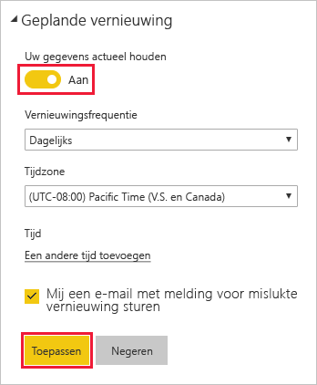

# <a name="tutorial-connect-to-on-premises-data-in-sql-server"></a>Zelfstudie: Verbinding maken met on-premises gegevens in SQL Server

Een on-premises gegevensgateway is software die u installeert in een on-premises netwerk en waarmee toegang tot de gegevens in dit netwerk mogelijk wordt gemaakt. In deze zelfstudie bouwt u een rapport in Power BI Desktop op basis van voorbeeldgegevens die zijn geïmporteerd uit SQL Server. Vervolgens publiceert u het rapport naar de Power BI-service en configureert u een gateway zodat de service toegang heeft tot de on-premises gegevens. Door de service toegang te verlenen kunnen de gegevens worden vernieuwd zodat het rapport up-to-date blijft.

In deze zelfstudie leert u het volgende:
> [!div class="checklist"]
> * Een rapport maken van gegevens in SQL Server
> * Dit rapport publiceren in de Power BI-service
> * SQL Server toevoegen als een gegevensbron van de gateway
> * De gegevens in het rapport vernieuwen

Als u zich niet hebt geregistreerd voor Power BI, kunt u zich hier [aanmelden voor een gratis proefversie](https://app.powerbi.com/signupredirect?pbi_source=web) voordat u begint.


## <a name="prerequisites"></a>Vereisten

* [Installer Power BI Desktop](https://powerbi.microsoft.com/desktop/)
* [Installeer SQL Server](https://docs.microsoft.com/sql/database-engine/install-windows/install-sql-server) op een lokale computer 
* [Installeer een on-premises gegevensgateway](service-gateway-install.md) op dezelfde lokale computer (in productie is het meestal een andere computer)


## <a name="set-up-sample-data"></a>Voorbeeldgegevens instellen

U begint met het toevoegen van voorbeeldgegevens in SQL Server, zodat u deze gegevens ook in de rest van de zelfstudie kunt gebruiken.

1. Maak in SSMS (SQL Server Management Studio) verbinding met uw exemplaar van SQL Server en maak een testdatabase.

    ```sql
    CREATE DATABASE TestGatewayDocs
    ```

2. Voeg een tabel toe in de database die u hebt gemaakt, en voeg gegevens in.

    ```sql
    USE TestGatewayDocs

    CREATE TABLE Product (
        SalesDate DATE,
        Category  VARCHAR(100),
        Product VARCHAR(100),
        Sales MONEY,
        Quantity INT
    )

    INSERT INTO Product VALUES('2018-05-05','Accessories','Carrying Case',9924.60,68)
    INSERT INTO Product VALUES('2018-05-06','Accessories','Tripod',1350.00,18)
    INSERT INTO Product VALUES('2018-05-11','Accessories','Lens Adapter',1147.50,17)
    INSERT INTO Product VALUES('2018-05-05','Accessories','Mini Battery Charger',1056.00,44)
    INSERT INTO Product VALUES('2018-05-06','Accessories','Telephoto Conversion Lens',1380.00,18)
    INSERT INTO Product VALUES('2018-05-06','Accessories','USB Cable',780.00,26)
    INSERT INTO Product VALUES('2018-05-08','Accessories','Budget Movie-Maker',3798.00,9)
    INSERT INTO Product VALUES('2018-05-09','Digital video recorder','Business Videographer',10400.00,13)
    INSERT INTO Product VALUES('2018-05-10','Digital video recorder','Social Videographer',3000.00,60)
    INSERT INTO Product VALUES('2018-05-11','Digital','Advanced Digital',7234.50,39)
    INSERT INTO Product VALUES('2018-05-07','Digital','Compact Digital',10836.00,84)
    INSERT INTO Product VALUES('2018-05-08','Digital','Consumer Digital',2550.00,17)
    INSERT INTO Product VALUES('2018-05-05','Digital','Slim Digital',8357.80,44)
    INSERT INTO Product VALUES('2018-05-09','Digital SLR','SLR Camera 35mm',18530.00,34)
    INSERT INTO Product VALUES('2018-05-07','Digital SLR','SLR Camera',26576.00,88)
    ```

3. Selecteer de gegevens uit te tabel om deze te controleren.

    ```sql
    SELECT * FROM Product
    ```

    


## <a name="build-and-publish-a-report"></a>Een rapport bouwen en publiceren

Nu u voorbeeldgegevens hebt om mee te werken, maakt u verbinding met SQL Server in Power BI Desktop en bouwt u een rapport op basis van deze gegevens. Vervolgens publiceert u het rapport in de Power BI-service.

1. Selecteer in Power BI Desktop, op het tabblad **Start**, de optie **Gegevens ophalen** > **SQL Server**.

2. Voer onder **Server** de servernaam in, en voer onder **Database** in: TestGatewayDocs. Selecteer **OK**. 

    

3. Controleer uw referenties en selecteer vervolgens **Verbinding maken**.

4. Selecteer onder **Navigator** de tabel **Product**. Selecteer vervolgens **Laden**.

    

5. Selecteer in de Power BI Desktop-**rapportweergave**, in het deelvenster **Visualisaties**, de optie **Gestapeld kolomdiagram**.

        

6. Selecteer met de kolomgrafiek geopend op het rapportcanvas vervolgens in het deelvenster **Velden** de velden **Categorie** en **Verkoop**.  

    

    De grafiek moet er nu ongeveer als volgt uitzien.

    

    U ziet dat **SLR Camera** de huidige marktleider is. Dit verandert wanneer u later in deze zelfstudie de gegevens bijwerkt en het rapport vernieuwt.

7. Sla het rapport op met de naam TestGatewayDocs.pbix.

8. Selecteer op het tabblad **Start** achtereenvolgens **Publiceren** > **Mijn werkruimte** > **Selecteren**. Meld u aan bij de Power BI-service wanneer u hierom wordt gevraagd. 

    

9. Selecteer op het scherm **Geslaagd** de optie **TestGatewayDocs.pbix openen in Power BI**.


## <a name="add-sql-server-as-a-gateway-data-source"></a>SQL Server toevoegen als een gegevensbron van de gateway

In Power BI Desktop maakt u rechtstreeks verbinding met SQL Server, maar voor de Power BI-service is een gateway nodig als overbrugging. Nu voegt u uw exemplaar van SQL Server toe als een gegevensbron voor de gateway die u hebt gemaakt in een vorig artikel (vermeld onder [Vereisten](#prerequisites)). 

1. Selecteer rechtsboven in de Power BI-service het tandwielpictogram  > **Gateways beheren**.

    

2. Selecteer **Gegevensbron toevoegen** en voer test-sql-source in bij **Naam gegevensbron**.

    

3. Selecteer een **Gegevensbrontype** van **SQL Server**. Voer vervolgens andere waarden weer zoals weergegeven.

    


   |          Optie           |                                               Waarde                                                |
   |---------------------------|----------------------------------------------------------------------------------------------------|
   |   **Naam gegevensbron**    |                                          test-sql-source                                           |
   |   **Gegevensbrontype**    |                                             SQL Server                                             |
   |        **Server**         | De naam van het SQL Server-exemplaar (moet identiek zijn aan de naam die u hebt opgegeven in Power BI Desktop) |
   |       **Database**        |                                          TestGatewayDocs                                           |
   | **Verificatiemethode** |                                              Windows                                               |
   |       **Gebruikersnaam**        |             Het account, zoals michael@contoso.com, dat u gebruikt om verbinding te maken met SQL Server             |
   |       **Wachtwoord**        |                   Het wachtwoord voor het account dat u gebruikt om verbinding te maken met SQL Server                    |


4. Selecteer **Toevoegen**. U ziet *Verbinding gemaakt* als de procedure is voltooid.

    

    U kunt deze gegevensbron nu gebruiken om gegevens uit SQL Server op te nemen in uw Power BI-dashboards en -rapporten.


## <a name="configure-and-use-data-refresh"></a>Gegevens vernieuwen configureren en gebruiken

U hebt een rapport gepubliceerd in de Power BI-service en de SQL Server-gegevensbron geconfigureerd. Nu dit is gedaan, brengt u een wijziging aan in de tabel Product. Deze wijziging wordt via de gateway doorgevoerd in het gepubliceerde rapport. U configureert ook een geplande vernieuwing om eventuele toekomstige wijzigingen te verwerken.

1. Werk in SSMS de gegevens bij in de tabel Product.

    ```sql
    UPDATE Product
    SET Sales = 32508, Quantity = 252
    WHERE Product='Compact Digital'     

    ```

2. Selecteer in de Power BI-service, in het navigatiedeelvenster aan de linkerkant, de optie **Mijn werkruimte**.

3. Selecteer onder **Gegevenssets** achtereenvolgens **meer** (**. . .**) > **Nu vernieuwen** voor de gegevensset **TestGatewayDocs**.

    

4. Selecteer **Mijn werkruimte** > **Rapporten** > **TestGatewayDocs**. U ziet dat de bijgewerkte gegevens zijn verwerkt, en dat de marktleider nu **Compact Digital** is. 

    

5. Selecteer **Mijn werkruimte** > **Rapporten** > **TestGatewayDocs**. Selecteer **meer** (**. . .**) > **Vernieuwen plannen**.

6. Stel onder **Vernieuwen plannen** vernieuwen in op **Aan**. Selecteer vervolgens **Toepassen**. De gegevensset wordt dagelijks standaard vernieuwd.

    

## <a name="clean-up-resources"></a>Resources opschonen
Als u geen gebruik meer wilt maken van de voorbeeldgegevens, voert u `DROP DATABASE TestGatewayDocs` uit in SSMS. Als u de SQL Server-gegevensbron niet wilt gebruiken, [verwijdert u de gegevensbron](service-gateway-manage.md#remove-a-data-source). 


## <a name="next-steps"></a>Volgende stappen
In deze zelfstudie heeft u het volgende geleerd:
> [!div class="checklist"]
> * Een rapport maken van gegevens in SQL Server
> * Dit rapport publiceren in de Power BI-service
> * SQL Server toevoegen als een gegevensbron van de gateway
> * De gegevens in het rapport vernieuwen

Ga naar het volgende artikel voor meer informatie
> [!div class="nextstepaction"]
> [Power BI-gateway beheren](service-gateway-manage.md)

