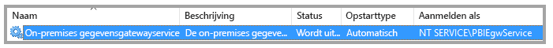
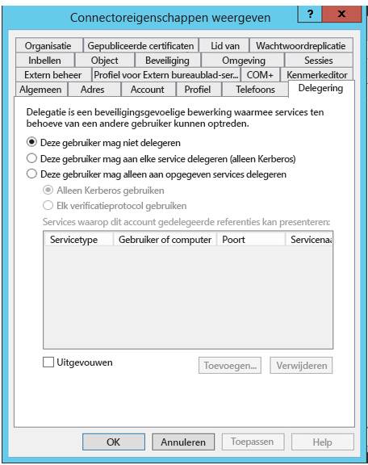
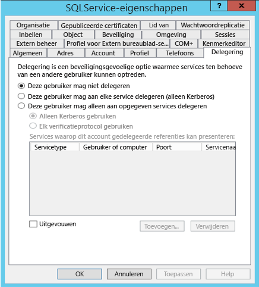
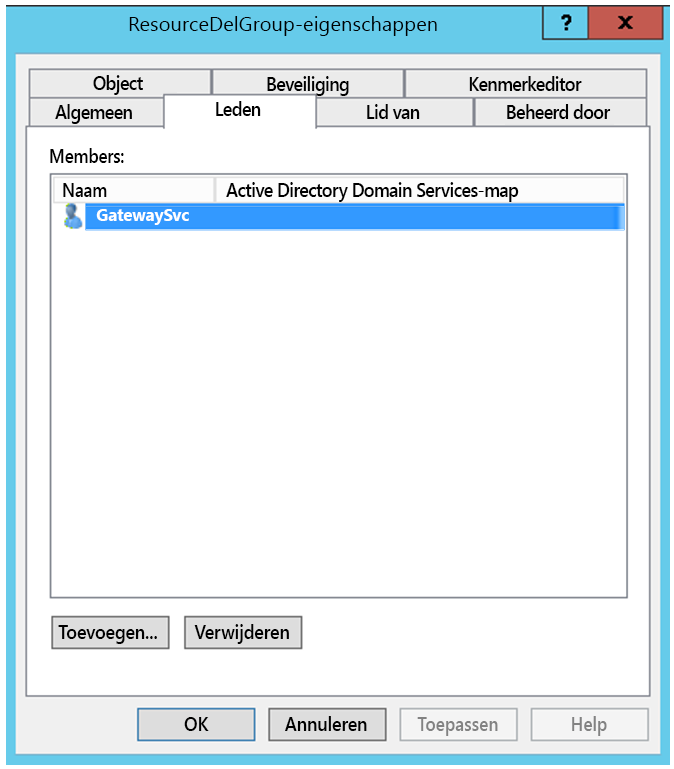
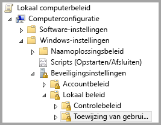
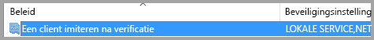
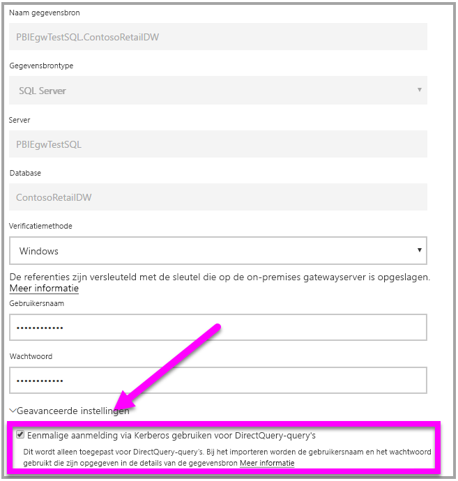

# <a name="use-resource-based-kerberos-for-single-sign-on-sso-from-power-bi-to-on-premises-data-sources"></a>Kerberos op basis van resources gebruiken voor eenmalige aanmelding (SSO) bij on-premises gegevensbronnen vanuit Power BI

Gebruik [beperkte Kerberos-delegering op basis van resources](/windows-server/security/kerberos/kerberos-constrained-delegation-overview) om eenmalige aanmelding voor Windows Server 2012 en later in te schakelen, zodat front-end- en back-end-services zich in verschillende domeinen kunnen bevinden. Om dit te laten werken, moet het domein van de back-end-service het domein van de front-end-service vertrouwen.

## <a name="preparing-for-resource-based-kerberos-constrained-delegation"></a>Beperkte Kerberos-delegering op basis van resources voorbereiden

Meerdere items moeten worden geconfigureerd om ervoor te zorgen dat beperkte Kerberos-delegering goed werkt, waaronder _Service Principal Names_ (SPN) en delegeringsinstellingen voor serviceaccounts.

### <a name="prerequisite-1-operating-system-requirements"></a>Vereiste 1: Vereisten voor het besturingssysteem

Beperkte delegering op basis van resources kan alleen worden geconfigureerd in een domeincontroller waarin Windows Server 2012 R2 of Windows Server 2012 of hoger wordt uitgevoerd.

### <a name="prerequisite-2-install-and-configure-the-on-premises-data-gateway"></a>Vereiste 2: De on-premises gegevensgateway installeren en configureren

Deze versie van de on-premises gegevensgateway biedt ondersteuning voor een upgrade ter plekke en voor het _overnemen van de instellingen_ van bestaande gateways.

### <a name="prerequisite-3-run-the-gateway-windows-service-as-a-domain-account"></a>Vereiste 3: De gatewayservice in Windows moet worden uitgevoerd als een domeinaccount

In een standaardinstallatie wordt de gateway uitgevoerd als een lokaal serviceaccount (als _NT Service\PBIEgwService_, om precies te zijn) zoals wordt weergegeven in de volgende afbeelding:



Om **beperkte delegatie van Kerberos in te schakelen, moet de gateway worden uitgevoerd als een domeinaccount, tenzij uw Azure AD al wordt gesynchroniseerd met uw lokale Active Directory (via Azure AD DirSync/Connect). Zie [Overschakelen van de gateway naar een domeinaccount](service-gateway-sso-kerberos.md) als u van het account wilt overschakelen naar een domeinaccount.

Als Azure AD DirSync/Connect is geconfigureerd en gebruikersaccounts zijn gesynchroniseerd, hoeft de gatewayservice tijdens runtime geen lokale AD-zoekacties uit te voeren. U kunt het lokale Service-SID gebruiken (in plaats van een domeinaccount) voor de gatewayservice. De stappen voor het configureren van beperkte Kerberos-delegering die in dit artikel worden beschreven zijn verder hetzelfde als voor die configuratie (ze worden eenvoudigweg toegepast op het computerobject van de gateway - in Active Directory in plaats van in het domeinaccount).

### <a name="prerequisite-4-have-domain-admin-rights-to-configure-spns-setspn-and-kerberos-constrained-delegation-settings"></a>Vereiste 4: U moet beschikken over domeinbeheerdersrechten om instellingen voor SPN's (SetSPN) en de beperkte Kerberos-delegering te configureren

Hoewel het technisch mogelijk is dat een domeinbeheerder iemand anders tijdelijk of permanent rechten geeft om SPN-namen en Kerberos-delegatie te configureren zonder dat daarbij domeinbeheerdersrechten vereist zijn, is dat niet de aanbevolen aanpak. In de volgende sectie worden de configuratiestappen die nodig zijn voor **Vereiste 3** uitgebreid beschreven.

## <a name="configuring-kerberos-constrained-delegation-for-the-gateway-and-data-source"></a>Beperkte Kerberos-delegering configureren voor de gateway en de gegevensbron

Voor een correcte configuratie van het systeem, zullen we de volgende twee items moeten configureren of valideren:

1. Configureer zo nodig een SPN voor het domeinaccount van de gatewayservice.

1. Configureer de delegeringsinstellingen van het domeinaccount van de gatewayservice.

Houd er rekening mee dat u een domeinbeheerder moet zijn om deze twee configuratiestappen uit te voeren.

De volgende secties beschrijven deze twee stappen.

### <a name="configure-an-spn-for-the-gateway-service-account"></a>Een SPN voor het gatewayserviceaccount configureren

Bepaal eerst of er al een SPN is gemaakt voor het domeinaccount dat wordt gebruikt als gatewayserviceaccount, met behulp van de volgende stappen:

1. Start als domeinbeheerder **Active Directory: gebruikers en computers**.

1. Klik met de rechtermuisknop op het domein, selecteer **Zoeken** en typ de accountnaam van het gatewayserviceaccount

1. Klik in de zoekresultaten met de rechtermuisknop op het gatewayserviceaccount en selecteer **Eigenschappen**.

1. Als het tabblad **Delegering** wordt weergegeven in het dialoogvenster **Eigenschappen**, is er al een SPN gemaakt en kunt u direct verdergaan met de volgende sectie, over het configureren van de delegeringsinstellingen.

    Als het tabblad **Delegatie** niet wordt weergegeven in het dialoogvenster **Eigenschappen**, kunt u handmatig een SPN-naam maken voor dat account, zodat het tabblad **Delegatie** wordt toegevoegd (dit is de eenvoudigste manier om delegatie-instellingen te configureren). U kunt een SPN maken met behulp van het [setspn-hulpprogramma](https://technet.microsoft.com/library/cc731241.aspx) dat standaard deel uitmaakt van Windows (u moet domeinbeheerderrechten hebben om de SPN te maken).

    Stel u bijvoorbeeld voor dat het gatewayserviceaccount 'PBIEgwTest\GatewaySvc' heet en de naam van de computer waarop de gatewayservice wordt uitgevoerd **Machine1** heet. Om de SPN voor het gatewayserviceaccount in te stellen voor de computer in dit voorbeeld, zou u de volgende opdracht gebruiken:

      

    Nu deze stap is voltooid, kunnen we verdergaan met het configureren van de delegeringsinstellingen.

### <a name="configure-delegation-settings"></a>Delegatie-instellingen configureren

In de volgende stappen wordt uitgegaan van een on-premises omgeving met twee machines in verschillende domeinen: een gatewaycomputer en een databaseserver met SQL Server. In dit voorbeeldscenario worden de volgende instellingen en namen gebruikt:

- Naam van de gatewaymachine: **PBIEgwTestGW**
- Gatewayserviceaccount: **PBIEgwTestFrontEnd\GatewaySvc** (weergavenaam account: Gateway Connector)
- Computernaam SQL Server-gegevensbron: **PBIEgwTestSQL**
- Serviceaccount voor SQL Server-gegevensbron: **PBIEgwTestBackEnd\SQLService**

Met deze voorbeeldnamen en -instellingen volgt u de volgende configuratiestappen:

1. Met **Active Directory-gebruikers en -computers**, een Microsoft Management Console-module (MMC), in de domeincontroller voor het domein **PBIEgwTestFront-end**, zorgt u ervoor dat er geen delegatie-instellingen zijn toegepast op het serviceaccount van de gateway.

    

1. Met **Active Directory-gebruikers en -computers**, in de domeincontroller voor het domein **PBIEgwTestBack-end**, zorgt u ervoor dat er geen delegatie-instellingen zijn toegepast op het serviceaccount van de back-end. Bovendien moet u ervoor dat het kenmerk 'msDS-AllowedToActOnBehalfOfOtherIdentity' ook niet is ingesteld. U vindt dit kenmerk in de 'Kenmerkeditor', zoals is weergegeven in de volgende afbeelding:

    

1. Maak een groep in **Active Directory-gebruikers en -computers**, in de domeincontroller voor het domein **PBIEgwTestBack-end**. Voeg het serviceaccount van de gateway toe aan deze groep, zoals is weergegeven in de volgende afbeelding. In de afbeelding wordt een nieuwe groep met de naam _ResourceDelGroup_ weergegeven en het serviceaccount voor de gateway **GatewaySvc** is toegevoegd aan deze groep.

    

1. Open het opdrachtprompt en voer de volgende opdrachten uit in de domeincontroller voor het domein **PBIEgwTestBack-end** om het kenmerk msDS-AllowedToActOnBehalfOfOtherIdentity van het serviceaccount van de back-end bij te werken:

    ```powershell
    $c=get-adgroupResourceDelGroup
    set-aduser **SQLService** -principalsAllowedToDelegateToAccount$c
    ```

1. U kunt controleren of de update terug is te zien in het tabblad 'Kenmerkeditor' in de eigenschappen voor het serviceaccount van de back-end in **Active Directory-gebruikers en -computers.**

Ten slotte moet op de computer waarop de gatewayservice wordt uitgevoerd (**PBIEgwTestGW** in ons voorbeeld), het lokale beleid 'Een client nabootsen na verificatie' aan het gatewayserviceaccount worden toegewezen. U kunt dit bewerkstelligen/controleren met de Editor voor lokaal groepsbeleid (**gpedit**).

1. Voer op de gatewaycomputer _gpedit.msc_ uit.

1. Navigeer naar **Lokaal computerbeleid > Computerconfiguratie > Windows-instellingen > Beveiligingsinstellingen > Lokaal beleid > Toewijzing van gebruikersrechten**, zoals is weergegeven in de volgende afbeelding.

    

1. Selecteer in de lijst met beleidsregels onder **Toewijzing van gebruikersrechten** de optie **Een client nabootsen na verificatie**.

    

1. Klik met de rechtermuisknop en open **Eigenschappen** voor **Een client imiteren na verificatie** en controleer de lijst met accounts. Hier moet het serviceaccount voor de gateway (**PBIEgwTestFront-end****\GatewaySvc**) op staan.

1. Selecteer in de lijst met beleidsregels onder **Toewijzing van gebruikersrechten** de optie **Functioneren als deel van het besturingssysteem (SeTcbPrivilege)**. Zorg ervoor dat het gatewayserviceaccount ook wordt opgenomen in de lijst met accounts.

1. Start het serviceproces van de **on-premises gegevensgateway** opnieuw op.

## <a name="running-a-power-bi-report"></a>Een Power BI-rapport uitvoeren

Nadat alle configuratiestappen zijn voltooid die eerder in dit artikel zijn beschreven, kunt u de pagina **Gateway beheren** in Power BI gebruiken om de gegevensbron te configureren. Schakel onder de **Geavanceerde instellingen** SSO in en publiceer rapporten en gegevenssets die een binding met die gegevensbron hebben.



Deze configuratie werkt in de meeste gevallen. Er kunnen echter andere Kerberos-configuraties nodig zijn, afhankelijk van uw omgeving. Als het rapport nog steeds niet wordt geladen, dient u contact op te nemen met uw domeinbeheerder voor verdere hulp.

## <a name="next-steps"></a>Volgende stappen

Raadpleeg de volgende bronnen voor meer informatie over de **on-premises gegevensgateway** en **DirectQuery**:

- [On-premises data gateway](service-gateway-onprem.md) (On-premises gegevensgateway)
- [DirectQuery in Power BI](desktop-directquery-about.md)
- [Data sources supported by DirectQuery](desktop-directquery-data-sources.md) (Gegevensbronnen die worden ondersteund door DirectQuery)
- [DirectQuery en SAP BW](desktop-directquery-sap-bw.md)
- [DirectQuery en SAP HANA](desktop-directquery-sap-hana.md)