# <a name="use-kerberos-for-single-sign-on-sso-from-power-bi-to-on-premises-data-sources"></a>Kerberos gebruiken voor eenmalige aanmelding (SSO) bij on-premises gegevensbronnen vanuit Power BI

Gebruik [beperkte delegatie van Kerberos](/windows-server/security/kerberos/kerberos-constrained-delegation-overview) om naadloze connectiviteit dankzij eenmalige aanmelding (SSO) mogelijk te maken. Met inschakeling van SSO is het eenvoudiger om gegevens van on-premises gegevensbronnen te vernieuwen in Power BI-rapporten en -dashboards.

## <a name="supported-data-sources"></a>Ondersteunde gegevensbronnen

Momenteel worden de volgende gegevensbronnen ondersteund:

* SQL Server
* SAP HANA
* SAP BW
* Teradata
* Spark
* Impala

Ook SAP HANA met [Security Assertion Markup Language (SAML)](service-gateway-sso-saml.md) wordt ondersteund.

### <a name="sap-hana"></a>SAP HANA

Volg eerst deze stappen om SSO in te schakelen voor SAP HANA:

* Zorg ervoor dat de SAP HANA-server de vereiste minimumversie uitvoert die afhankelijk is van het platform-niveau van uw SAP HANA-server:
  * [HANA 2 SPS 01 Rev 012.03](https://launchpad.support.sap.com/#/notes/2557386)
  * [HANA 2 SPS 02 Rev 22](https://launchpad.support.sap.com/#/notes/2547324)
  * [HANA 1 SP 12 Rev 122.13](https://launchpad.support.sap.com/#/notes/2528439)
* Installeer op de gatewaycomputer het meest recente HANA ODBC-stuurprogramma van SAP.  De minimaal vereiste versie is HANA ODBC versie 2.00.020.00, vrijgegeven in augustus 2017.

Zie [Eenmalige aanmelding met behulp van Kerberos](https://help.sap.com/viewer/b3ee5778bc2e4a089d3299b82ec762a7/2.0.03/1885fad82df943c2a1974f5da0eed66d.html) in de SAP HANA-beveiligingshandleiding voor meer informatie over het instellen van eenmalige aanmelding voor SAP HANA met behulp van Kerberos. Zie ook de koppelingen vanaf die pagina, met name SAP Note 1837331: HOWTO HANA DBSSO Kerberos/Active Directory.

## <a name="prepare-for-kerberos-constrained-delegation"></a>Voorbereiden voor beperkte Kerberos-delegering

U moet meerdere items configureren om ervoor te zorgen dat beperkte Kerberos-delegering goed werkt, waaronder *Service Principal Names* (SPN) en delegeringsinstellingen voor serviceaccounts.

### <a name="prerequisite-1-install-and-configure-the-microsoft-on-premises-data-gateway"></a>Vereiste 1: De on-premises gegevensgateway van Microsoft installeren en configureren

Deze versie van de on-premises gegevensgateway biedt ondersteuning voor een upgrade ter plekke, evenals voor het overnemen van de instellingen van bestaande gateways.

### <a name="prerequisite-2-run-the-gateway-windows-service-as-a-domain-account"></a>Vereiste 2: De gatewayservice in Windows moet worden uitgevoerd als een domeinaccount

In een standaardinstallatie wordt de gateway uitgevoerd als een lokaal serviceaccount (namelijk *NT Service\PBIEgwService*).

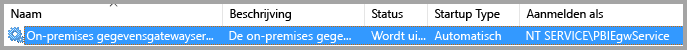

Om beperkte Kerberos-delegering in te schakelen, moet de gateway worden uitgevoerd als een domeinaccount, tenzij uw Azure AD-exemplaar (Azure Active Directory) al wordt gesynchroniseerd met uw lokale Active Directory-exemplaar (via Azure AD DirSync/Connect). Zie [Overschakelen van de gateway naar een domeinaccount](#switching-the-gateway-to-a-domain-account) verderop in dit artikel als u wilt overschakelen naar een domeinaccount.

> [!NOTE]
> Als Azure AD Connect is geconfigureerd en gebruikersaccounts zijn gesynchroniseerd, hoeft de gatewayservice tijdens runtime geen lokale Azure AD-zoekacties uit te voeren. U kunt de lokale service-SID gebruiken (in plaats van een domeinaccount) voor de gatewayservice. De stappen voor het configureren van beperkte Kerberos-delegering die in dit artikel worden beschreven zijn verder hetzelfde als voor die configuratie. Ze worden nu op het computerobject van de gateway in Azure AD toegepast in plaats van op het domeinaccount.

### <a name="prerequisite-3-have-domain-admin-rights-to-configure-spns-setspn-and-kerberos-constrained-delegation-settings"></a>Vereiste 3: U moet beschikken over domeinbeheerdersrechten om instellingen voor SPN's (SetSPN) en de beperkte Kerberos-delegering te configureren

Het wordt niet aanbevolen dat een domeinbeheerder iemand anders tijdelijk of permanent rechten geeft om SPN-namen en Kerberos-delegatie te configureren zonder dat daarbij domeinbeheerdersrechten vereist zijn. In het volgende gedeelte worden de aanbevolen configuratiestappen in meer detail besproken.

## <a name="configure-kerberos-constrained-delegation-for-the-gateway-and-data-source"></a>Beperkte Kerberos-delegering configureren voor de gateway en de gegevensbron

Configureer als domeinbeheerder een SPN-naam voor het domeinaccount van de gatewayservice en configureer delegeringsinstellingen in het domeinaccount van de gatewayservice.

### <a name="configure-an-spn-for-the-gateway-service-account"></a>Een SPN voor het gatewayserviceaccount configureren

Bepaal eerst of er al een SPN is gemaakt voor het domeinaccount dat wordt gebruikt als gatewayserviceaccount:

1. Open **Active Directory: gebruikers en computers** als domeinbeheerder.

2. Klik met de rechtermuisknop op het domein, selecteer **Zoeken** en voer de accountnaam van het gatewayserviceaccount in.

3. Klik in de zoekresultaten met de rechtermuisknop op het gatewayserviceaccount en selecteer **Eigenschappen**.

4. Als het tabblad **Delegering** zichtbaar is in het dialoogvenster **Eigenschappen**, is er al een SPN-naam gemaakt. U kunt direct doorgaan naar het configureren van de delegeringsinstellingen.

    Als het dialoogvenster **Eigenschappen** geen tabblad **Delegering** bevat, kunt u voor dat account handmatig een SPN-naam maken. Hierdoor wordt het tabblad **Delegering** toegevoegd. Gebruik het [setspn-hulpprogramma](https://technet.microsoft.com/library/cc731241.aspx) dat standaard deel uitmaakt van Windows (u moet domeinbeheerdersrechten hebben om de SPN te maken).

    Stel u bijvoorbeeld voor dat het gatewayserviceaccount 'PBIEgwTest\GatewaySvc' heet en de naam van de computer waarop de gatewayservice wordt uitgevoerd **Machine1** heet. Om de SPN voor het gatewayserviceaccount in te stellen voor de computer in dit voorbeeld, voert u de volgende opdracht uit:

    

    Nu deze stap is voltooid, kunnen we verdergaan met het configureren van de delegeringsinstellingen.

### <a name="configure-delegation-settings-on-the-gateway-service-account"></a>De delegeringsinstellingen configureren voor het gatewayserviceaccount

De tweede configuratievereiste betreft de delegeringsinstellingen voor het gatewayserviceaccount. Er zijn verschillende hulpprogramma's die u kunt gebruiken om deze stappen uit te voeren. Hier gebruiken we Active Directory: gebruikers en computers, een MMC-module (Microsoft Management Console) om informatie in de directory te beheren en te publiceren. Deze module is standaard beschikbaar op domeincontrollers. U kunt deze ook inschakelen via de configuratie van Windows-onderdelen op andere computers.

We moeten beperkte Kerberos-delegering met protocoldoorvoer configureren. Met beperkte delegatie moet u expliciet zijn wat betreft de services waarnaar u wilt delegeren. Zo worden delegatieaanroepen vanuit het gatewayserviceaccount alleen geaccepteerd door SQL-server of uw SAP HANA-server.

In deze sectie wordt ervan uitgegaan dat u al SNP's hebt geconfigureerd voor uw onderliggende gegevensbronnen (zoals SQL Server, SAP HANA, Teradata en Spark). Raadpleeg de technische documentatie voor de desbetreffende gegevensbronserver voor meer informatie over het configureren van SPN-namen voor de gegevensbronserver. Ook ziet u het blogbericht [What SPN does your app require?](https://blogs.msdn.microsoft.com/psssql/2010/06/23/my-kerberos-checklist/) (Welke SPN-naam hebt u voor uw app nodig?).

In de volgende stappen wordt uitgegaan van een on-premises omgeving met twee computers: een gatewaycomputer en een databaseserver met SQL Server. In dit voorbeeldscenario worden de volgende instellingen en namen gebruikt:

* Naam van de gatewaymachine: **PBIEgwTestGW**
* Gatewayserviceaccount: **PBIEgwTest\GatewaySvc** (weergavenaam account: Gateway Connector)
* Computernaam SQL Server-gegevensbron: **PBIEgwTestSQL**
* Serviceaccount voor SQL Server-gegevensbron: **PBIEgwTest\SQLService**

U kunt de delegeringsinstellingen als volgt configureren:

1. Start als domeinbeheerder **Active Directory: gebruikers en computers**.

2. Klik met de rechtermuisknop op het gatewayserviceaccount (**PBIEgwTest\GatewaySvc**) en selecteer **Eigenschappen**.

3. Selecteer het tabblad **Delegering**.

4. Selecteer **Deze computer mag alleen aan opgegeven services delegeren** > **Elk protocol voor authenticatie gebruiken**.

6. Selecteer **Toevoegen** onder **Services waaraan dit account gedelegeerde referenties kan presenteren**.

7. Selecteer **Gebruikers of computers** in het nieuwe dialoogvenster.

8. Voer het serviceaccount voor de SQL Server-gegevensbron in (**PBIEgwTest\SQLService**) en selecteer **OK**.

9. Selecteer de SPN die u hebt gemaakt voor de databaseserver. In ons voorbeeld begint de SPN-naam met **MSSQLSvc**. Als u zowel de FQDN als de NetBIOS SPN voor uw databaseservice hebt toegevoegd, selecteert u deze hier allebei. Mogelijk ziet u er maar één.

10. Selecteer **OK**. De SPN staat nu in de lijst.

    U kunt optioneel ook **Uitgevouwen** selecteren om zowel de FQDN als de SPN-naam van NetBIOS weer te geven. Het dialoogvenster ziet er als volgt uit als u **Uitgevouwen** hebt ingeschakeld. Selecteer **OK**.

    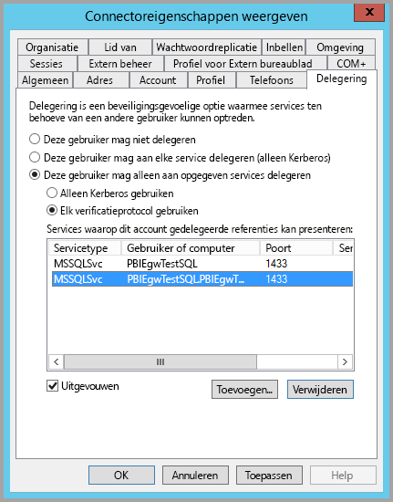

Ten slotte moet u op de computer waarop de gatewayservice wordt uitgevoerd (**PBIEgwTestGW** in ons voorbeeld), het lokale beleid **Een client nabootsen na verificatie** aan het gatewayserviceaccount toewijzen. U kunt dit bewerkstelligen en controleren met de Editor voor lokaal groepsbeleid (**gpedit**).

1. Voer op de gatewaycomputer *gpedit.msc* uit.

1. Ga naar **Lokaal computerbeleid** > **Computerconfiguratie** > **Windows-instellingen** > **Beveiligingsinstellingen** > **Lokaal beleid** > **Toewijzing van gebruikersmachtigingen**.

    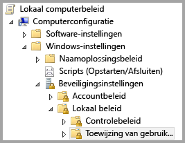

1. Selecteer onder **Toewijzing van gebruikersrechten** in de lijst met beleidsregels de optie **Een client nabootsen na verificatie**.

    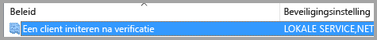

    Klik met de rechtermuisknop om **Eigenschappen** te openen. Controleer de lijst met accounts. Hier moet het gatewayserviceaccount (**PBIEgwTest\GatewaySvc**) op staan.

1. Selecteer onder **Toewijzing van gebruikersrechten** in de lijst met beleidsregels de optie **Functioneren als deel van het besturingssysteem (SeTcbPrivilege)**. Zorg ervoor dat het gatewayserviceaccount ook wordt opgenomen in de lijst met accounts.

1. Start het serviceproces van de **on-premises gegevensgateway** opnieuw op.

Als u van SAP HANA gebruikmaakt, is het aan te raden de volgende aanvullende stappen te volgen om de prestaties mogelijk iets te kunnen verbeteren.

1. Zoek en open dit configuratiebestand in de installatiemap van de gateway: *Microsoft.PowerBI.DataMovement.Pipeline.GatewayCore.dll.config*.

1. Zoek de eigenschap *FullDomainResolutionEnabled* en wijzig de waarde ervan in *True*.

    ```xml
    <setting name=" FullDomainResolutionEnabled " serializeAs="String">
          <value>True</value>
    </setting>
    ```

## <a name="run-a-power-bi-report"></a>Een Power BI-rapport uitvoeren

Nadat alle configuratiestappen zijn voltooid, kunt u de pagina **Gateway beheren** in Power BI gebruiken om de gegevensbron te configureren. Schakel onder de **Geavanceerde instellingen** SSO in en publiceer rapporten en gegevenssets die een binding met die gegevensbron hebben.


Deze configuratie werkt in de meeste gevallen. Er kunnen echter andere Kerberos-configuraties nodig zijn, afhankelijk van uw omgeving. Als het rapport nog steeds niet wordt geladen, neemt u contact op met uw domeinbeheerder voor verdere hulp.

## <a name="switch-the-gateway-to-a-domain-account"></a>Overschakelen van de gateway naar een domeinaccount

Indien nodig kunt u de gateway van een lokaal serviceaccount overschakelen zodat deze wordt uitgevoerd als een domeinaccount, met behulp van de gebruikersinterface van de **on-premises gegevensgateway**. U doet dit als volgt:

1. Open het configuratiehulpprogramma voor de **on-premises gegevensgateway**.

   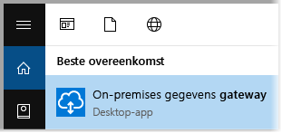

2. Selecteer de knop **aanmelden** op de hoofdpagina en meld u aan met uw Power BI-account.

3. Selecteer nadat de aanmelding is voltooid het tabblad **Service-instellingen**.

4. Selecteer **Account wijzigen** om de begeleide procedure te starten.

   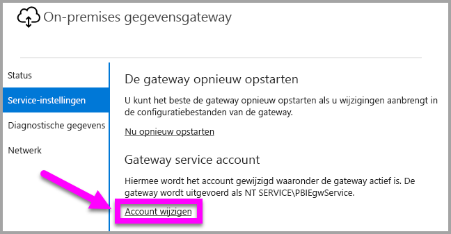

## <a name="configure-sap-bw-for-sso"></a>SAP BW voor eenmalige aanmelding configureren

Nu u inzicht hebt in de werking van Kerberos met een gateway, kunt u SSO configureren voor uw SAP Business Warehouse (SAP BW). In de volgende stappen wordt ervan uitgegaan dat u al bent [voorbereid voor beperkte delegatie van Kerberos](#preparing-for-kerberos-constrained-delegation), zoals eerder in dit artikel beschreven.

We hebben geprobeerd deze handleiding zo uitgebreid mogelijk te maken. Als u een aantal van deze stappen al hebt uitgevoerd, kunt u deze overslaan. Als u bijvoorbeeld al een servicegebruiker voor uw SAP BW-server hebt gemaakt en aan deze gebruiker een SPN hebt toegewezen, of als u de `gsskrb5`-bibliotheek al hebt geïnstalleerd.

### <a name="set-up-gsskrb5-on-client-machines-and-the-sap-bw-server"></a>gsskrb5 instellen op clientcomputers en de SAP BW-server

> [!NOTE]
> `gsskrb5` wordt niet meer actief ondersteund door SAP. Zie [SAP-notitie 352295](https://launchpad.support.sap.com/#/notes/352295) voor meer informatie. Houd er ook rekening mee dat met `gsskrb5` geen SSO-verbinding (met eenmalige aanmelding) kan worden gemaakt met de SAP BW-berichtenservers via de gegevensgateway. Er kan alleen verbinding worden gemaakt met SAP BW-toepassingsservers.

`gsskrb5` moet zowel op de client als op de server worden gebruikt om een SSO-verbinding te voltooien via de gateway. De Common Crypto Library (sapcrypto) wordt momenteel niet ondersteund.

1. Download `gsskrb5` - `gx64krb5` van [SAP Note 2115486](https://launchpad.support.sap.com/) (SAP S-gebruiker vereist). Zorg dat u over minimaal versie 1.0.11.x van gsskrb5.dll en gx64krb5.dll beschikt.

1. Plaats de bibliotheek op een locatie op de gatewaycomputer die toegankelijk is voor uw gatewayinstantie (en voor de SAP-GUI als u de SSO-verbinding wilt testen met behulp van SAP-aanmelding).

1. Plaats een andere kopie op uw SAP BW-servercomputer op een locatie die toegankelijk is voor de SAP BW-server.

1. Stel op de client- en op de servercomputer de omgevingsvariabelen `SNC\_LIB` en `SNC\_LIB\_64` in om te verwijzen naar de locatie van respectievelijk gx64krb5.dll en gx64krb5.dll.

### <a name="create-a-sap-bw-service-user-and-enable-snc-communication"></a>Een SAP BW-servicegebruiker maken en SNC-communicatie inschakelen

Naast de configuratie van de gateway die u al hebt voltooid, zijn er enkele aanvullende stappen specifiek voor SAP BW. In het gedeelte [Instellingen voor het configureren van delegatie op het gatewayserviceaccount](#configure-delegation-settings-on-the-gateway-service-account) van de documentatie wordt ervan uitgegaan dat u al SPN-namen hebt geconfigureerd voor uw onderliggende gegevensbronnen. De gatewayconfiguratie voor SAP BW voltooien:

1. Maak op een Active Directory-domeincontrollerserver een servicegebruiker (in eerste instantie een gewone Active Directory-gebruiker) voor de SAP BW-toepassingsserver in de Active Directory-omgeving. Wijs er vervolgens een SPN-naam aan toe.

    U wordt aangeraden om de SPN-naam te beginnen met `SAP/`, maar u kunt ook andere voorvoegsels gebruiken, zoals `HTTP/`. Wat u na `SAP/` invoert is aan u. Gebruik bijvoorbeeld de gebruikersnaam van de servicegebruiker van de SAP BW-server. Als u bijvoorbeeld `BWServiceUser@\<DOMAIN\>` als uw servicegebruiker maakt, kunt u de `SAP/BWServiceUser` van de SPN gebruiken. Eén manier om de SPN-naam toe te wijzen is met de opdracht setspn. Als u de SPN-naam bijvoorbeeld wilt instellen op de servicegebruiker die zojuist is gemaakt, moet u de volgende opdracht uitvoeren vanuit een cmd-venster op een domeincontrollercomputer: `setspn -s SAP/ BWServiceUser DOMAIN\ BWServiceUser`. Zie de SAP BW-documentatie voor meer informatie.

1. Geef de servicegebruiker toegang tot de SAP BW-toepassingsserver:

    1. Voeg op de SAP BW-servercomputer de servicegebruiker toe aan de lokale beheerdersgroep voor de SAP BW-server. Open het programma Computerbeheer en dubbelklik op de lokale beheerdersgroep voor uw server.

        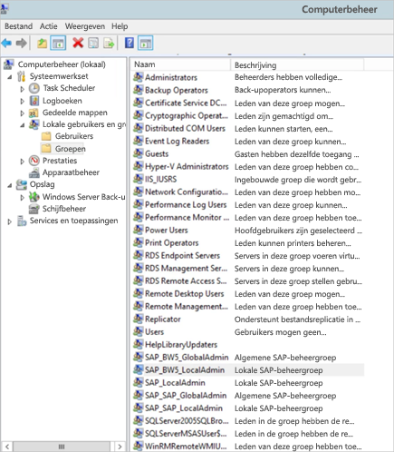

    1. Dubbelklik op de groep Lokale beheerders en selecteer vervolgens **Toevoegen** om uw servicegebruiker toe te voegen aan de groep. Selecteer **Namen controleren** om te controleren of u de naam goed hebt ingevoerd. Selecteer **OK**.

1. Stel de servicegebruiker van de SAP BW-server in als de gebruiker die de SAP BW-serverservice start op de SAP BW-servercomputer.

    1. Open **Uitvoeren** en voer 'Services.msc' in. Zoek de service die overeenkomt met uw instantie van de SAP BW-toepassingsserver. Klik er met de rechtermuisknop op en selecteer **Eigenschappen**.

        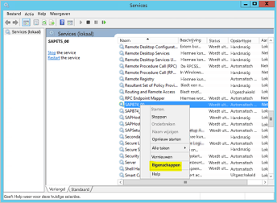

    1. Schakel over naar het tabblad **Aanmelden** en wijzig de gebruiker in uw SAP BW-servicegebruiker. Voer het wachtwoord van de gebruiker in en selecteer **OK**.

1. Meld u bij uw server aan bij SAP-aanmelding en stel de volgende profielparameters in met behulp van de transactie RZ10:

    1. Stel de profielparameter snc/identity/as in op p:\<de SAP BW-servicegebruiker die u hebt gemaakt\>, bijvoorbeeld p:BWServiceUser@MYDOMAIN.COM. Let op de p: die voorafgaat aan de UPN van de servicegebruiker. Het is geen p:CN=like wanneer Common Crypto Lib als de SNC-bibliotheek wordt gebruikt.

    1. Stel de profielparameter snc/gssapi\_lib in op \<pad naar gsskrb5.dll/gx64krb5.dll op de servercomputer (de bibliotheek die u gaat gebruiken hangt af van de hoeveelheid bits van het besturingssysteem)\>. Vergeet niet om de bibliotheek te plaatsen op een locatie die toegankelijk is voor de SAP BW-toepassingsserver.

    1. Stel ook de volgende aanvullende profielparameters in en wijzig zo nodig de waarden naar behoefte. Houd er rekening mee dat bij de laatste vijf opties clients via SAP-aanmelden verbinding kunnen maken met de SAP BW-server zonder dat de SNC is geconfigureerd.

        | **Instelling** | **Waarde** |
        | --- | --- |
        | snc/data\_protection/max | 3 |
        | snc/data\_protection/min | 1 |
        | snc/data\_protection/use | 9 |
        | snc/accept\_insecure\_cpic | 1 |
        | snc/accept\_insecure\_gui | 1 |
        | snc/accept\_insecure\_r3int\_rfc | 1 |
        | snc/accept\_insecure\_rfc | 1 |
        | snc/permit\_insecure\_start | 1 |

    1. Stel de eigenschap snc/enable in op 1.

1. Open na het instellen van deze profielparameters de SAP-beheerconsole op de servercomputer en start de SAP BW-instantie opnieuw op. Als de server niet start, controleert u of u de profielparameters juist hebt ingesteld. Zie de [SAP-documentatie](https://help.sap.com/saphelp_nw70ehp1/helpdata/en/e6/56f466e99a11d1a5b00000e835363f/frameset.htm) voor meer informatie over de profielparameterinstellingen. U kunt ook onze probleemoplossingsinformatie verderop in deze sectie raadplegen als u problemen ondervindt.

### <a name="map-a-sap-bw-user-to-an-active-directory-user"></a>Een SAP BW-gebruiker toewijzen aan een Active Directory-gebruiker

Wijs een Active Directory-gebruiker toe aan een SAP BW-toepassingsservergebruiker en test de SSO-verbinding bij SAP-aanmelding.

1. Meld u met behulp van SAP-aanmelding aan bij uw SAP BW-server. Voer transactie SU01 uit.

1. Voer bij **Gebruiker** de SAP BW-gebruiker in voor wie u SSO-verbindingen wilt inschakelen (in de vorige schermafbeelding worden machtigingen ingesteld voor BIUSER). Selecteer het pictogram **Bewerken** in de linkerbovenhoek van het SAP-aanmeldingsvenster (de afbeelding van een pen).

    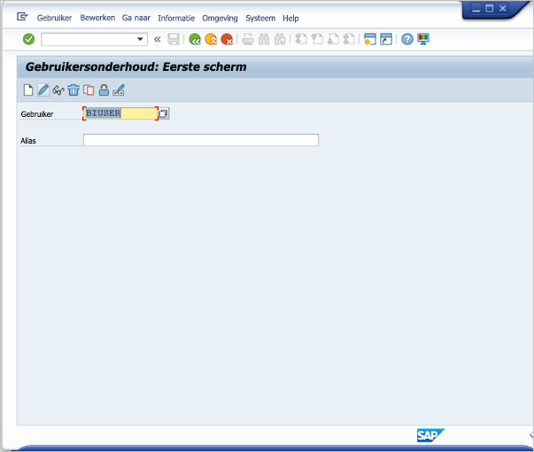

1. Selecteer het tabblad **SNC**. Voer in het invoervak voor de SNC-naam p:\<uw Active Directory-gebruiker\>@\<uw domein\> in. Let op de verplichte p: die vooraf moet gaan aan de UPN van de Active Directory-gebruiker. De Active Directory-gebruiker die u opgeeft, moet horen bij de persoon of organisatie waarvoor u SSO-toegang tot de SAP BW-toepassingsserver wilt inschakelen. Als u bijvoorbeeld SSO-toegang wilt inschakelen voor de gebruiker [testuser@TESTDOMAIN.COM](mailto:testuser@TESTDOMAIN.COM), voert u p:testuser@TESTDOMAIN.COM in.

    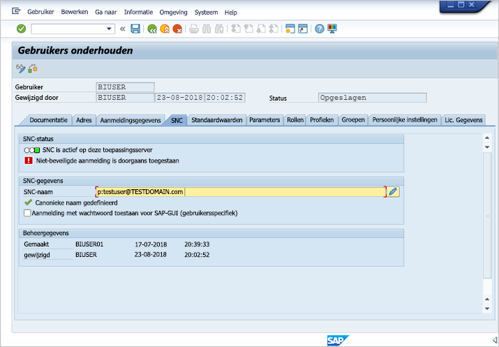

1. Selecteer het pictogram **Opslaan** (de diskette in de linkerbovenhoek van het scherm).

### <a name="test-sign-in-by-using-sso"></a>Aanmelding met behulp van SSO testen

Controleer of u zich bij de server kunt aanmelden. Gebruik SAP-aanmelding via eenmalige aanmelding als de Active Directory-gebruiker voor wie u zojuist toegang via eenmalige aanmelding hebt ingeschakeld.

1. Meld u op een computer waarop SAP-aanmelding is geïnstalleerd aan als de Active Directory-gebruiker voor wie u zojuist SSO-toegang hebt ingeschakeld. Start SAP-aanmelding en maak een nieuwe verbinding.

1. Selecteer in het scherm **Nieuwe systeemvermelding maken** de optie **Gebruikergespecificeerd systeem** > **Volgende**.

    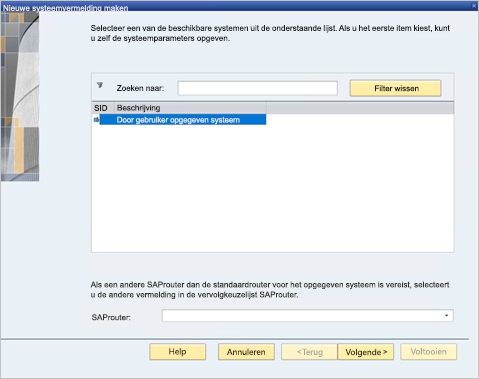

1. Vul de relevante gegevens in op het volgende scherm, met inbegrip van de toepassingsserver, het instantienummer en de systeem-id. Selecteer vervolgens **Voltooien**.

1. Klik met de rechtermuisknop op de nieuwe verbinding en selecteer **Eigenschappen**. Selecteer het tabblad **Netwerk**. In het tekstvak **SNC Name** voert u p:\<UPN van de SAP BW-servicegebruiker\> in, bijvoorbeeld p:BWServiceUser@MYDOMAIN.COM. Selecteer **OK**.

    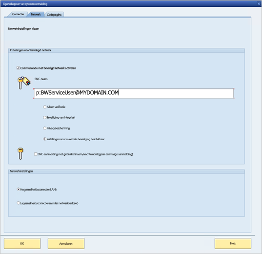

1. Dubbelklik op de verbinding die u zojuist hebt gemaakt, om te proberen een SSO-verbinding met de BS-server tot stand te brengen. Als deze verbindingspoging lukt, gaat u verder met de volgende stap. Anders bekijkt u de eerdere stappen in dit document om te controleren of deze correct zijn uitgevoerd of controleert u de sectie met probleemoplossingen hieronder. Houd er rekening mee dat als u in deze context niet via SSO verbinding kunt maken met de SAP BW-server, u ook geen verbinding met de SAP BW-server kunt maken in de gatewaycontext.

### <a name="troubleshoot-installation-and-connections"></a>Installatie- en verbindingsproblemen oplossen

Als u problemen ondervindt, volgt u deze stappen om de problemen met de gsskrb5-installatie en SSO-verbindingen vanuit SAP-aanmelding op te lossen.

- Het kan nuttig zijn om de serverlogboeken (...work\dev\_w0 op de servercomputer) te bekijken om eventuele fouten op te lossen wanneer u de stappen voor het instellen van gsskrb5 voltooit. Dit is met name het geval wanneer de SAP BW-server niet kan worden gestart nadat u de profielparameters hebt gewijzigd.

- Als u de SAP BW-service niet kunt starten vanwege een aanmeldingsfout, hebt u mogelijk het verkeerde wachtwoord opgegeven bij het instellen van de SAP BW-'starten als'-gebruiker. Controleer het wachtwoord door u als de SAP BW-servicegebruiker aan te melden bij een computer in uw Active Directory-omgeving.

- Als de foutmelding wordt weergegeven dat SQL-referenties verhinderen dat de server wordt gestart, controleert u of u de servicegebruiker toegang tot de SAP BW-database hebt verleend.

- Mogelijk krijgt u het volgende bericht: '(GSS-API) specified target is unknown or unreachable' ((GSS-API) Opgegeven doel is onbekend of niet bereikbaar). Dit betekent doorgaans dat u de verkeerde SNC-naam hebt opgegeven. Zorg ervoor dat u in de clienttoepassing naast de UPN van de servicegebruiker alleen 'p:' gebruikt, niet 'p:CN=' of iets anders.

- Mogelijk krijgt u het volgende bericht: '(GSS-API) An invalid name was supplied' ((GSS-API) Mogelijk is er een ongeldige naam opgegeven). Zorg ervoor dat 'p:' de waarde heeft van de profielparameter voor de SNC-identiteit van de server.

- Mogelijk krijgt u het volgende bericht: '(SNC error) the specified module could not be found' ((SNC-fout) Kan de opgegeven module niet vinden). Dit wordt doorgaans veroorzaakt doordat u de `gsskrb5.dll/gx64krb5.dll` op een locatie hebt geplaatst waarvoor verhoogde bevoegdheden (beheerdersrechten) zijn vereist om er toegang tot te krijgen.

### <a name="add-registry-entries-to-the-gateway-machine"></a>Registervermeldingen toevoegen aan de gatewaycomputer

Voeg vereiste registervermeldingen toe aan het register van de computer waarop de gateway is geïnstalleerd. U moet deze opdrachten uitvoeren:

1. REG ADD HKLM\SOFTWARE\Wow6432Node\SAP\gsskrb5 /v ForceIniCredOK /t REG\_DWORD /d 1 /f

1. REG ADD HKLM\SOFTWARE\SAP\gsskrb5 /v ForceIniCredOK /t REG\_DWORD /d 1 /f

### <a name="set-configuration-parameters-on-the-gateway-machine"></a>Configuratieparameters instellen op de gatewaycomputer

Er zijn twee opties voor het instellen van configuratieparameters, afhankelijk van of Azure AD Connect is geconfigureerd zodat gebruikers zich kunnen aanmelden bij de Power BI-service als een Azure AD-gebruiker.

Volg deze stappen als u Azure AD Connect hebt geconfigureerd.

1. Open het configuratiebestand van de hoofdgateway, `Microsoft.PowerBI.DataMovement.Pipeline.GatewayCore.dll`. Dit bestand bevindt zich standaard in C:\Program Files\On-premises data gateway.

1. Zorg ervoor dat de eigenschap **FullDomainResolutionEnabled** is ingesteld op **True** en dat **SapHanaSsoRemoveDomainEnabled** is ingesteld op **False**.

1. Sla het configuratiebestand op.

1. Klik op het tabblad **Services** met de rechtermuisknop op de gateway-service en selecteer **Opnieuw opstarten**.

    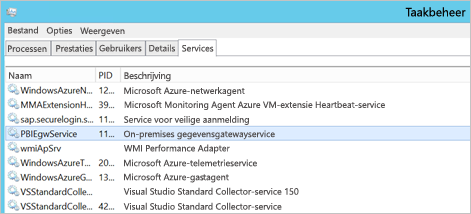

Als u Azure AD Connect niet hebt geconfigureerd, volgt u deze stappen voor elke Power BI-service die u wilt toewijzen aan een Azure AD-gebruiker. Met deze stappen wordt een Power BI-servicegebruiker handmatig gekoppeld aan een Active Directory-gebruiker met machtigingen voor aanmelden bij SAP BW.

1. Open het configuratiebestand van de hoofdgateway, `Microsoft.PowerBI.DataMovement.Pipeline.GatewayCore.dll`. Dit bestand bevindt zich standaard in C:\Program Files\On-premises data gateway.

1. Stel **ADUserNameLookupProperty** in op `msDS-cloudExtensionAttribute1` en **ADUserNameReplacementProperty** op `SAMAccountName`. Sla het configuratiebestand op.

1. Klik op het tabblad **Services** met de rechtermuisknop op de gateway-service en selecteer **Opnieuw opstarten**.

    

1. Stel de eigenschap `msDS-cloudExtensionAttribute1` van de Active Directory-gebruiker in. Dit is de gebruiker die u aan een SAP BW-gebruiker hebt toegewezen. Stel de eigenschap in op de Power BI-servicegebruiker voor wie u eenmalige aanmelding van Kerberos wilt inschakelen. U kunt de eigenschap `msDS-cloudExtensionAttribute1` onder andere instellen door de module Active Directory-gebruikers en Computers MMC te gebruiken. (U kunt ook andere methoden gebruiken.)

    1. Meld u als beheerder aan bij een domeincontrollercomputer.

    1. Open de map **Gebruikers** in het modulevenster en dubbelklik op de Active Directory-gebruiker die u hebt toegewezen aan een SAP BW-gebruiker.

    1. Selecteer het tabblad **Kenmerkeditor**.

        Als u dit tabblad niet ziet, moet u zoeken naar instructies over het inschakelen ervan of een andere methode gebruiken om de eigenschap in te stellen. Selecteer een van de kenmerken en vervolgens de M-sleutel om naar de Active Directory-eigenschappen die met een M beginnen te navigeren. Zoek de eigenschap `msDS-cloudExtensionAttribute1` en dubbelklik hierop. Stel de waarde in op de gebruikersnaam die u gebruikt om u aan te melden bij de Power BI-service, als YourUser@YourDomain.

    1. Selecteer **OK**.

        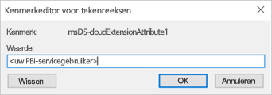

    1. Selecteer **Toepassen**. Controleer of de juiste waarde is ingesteld in de kolom **Waarde**.

### <a name="add-a-new-sap-bw-application-server-data-source-to-the-power-bi-service"></a>Een nieuwe gegevensbron van de SAP BW-toepassingsserver toevoegen aan de Power BI-service

Voeg de SAP BW-gegevensbron toe aan uw gateway: volg de instructies eerder in dit artikel voor het [uitvoeren van een rapport](#running-a-power-bi-report).

1. Voer in het venster voor gegevensbronconfiguratie de **Hostnaam**, het **Systeemnummer** en de **client-id** van de toepassingsserver in zoals u zou doen om u vanuit Power BI Desktop aan te melden bij uw SAP BW-server. Selecteer **Windows** als **Verificatiemethode**.

1. Voer in het veld **Naam van SNC-partner** p: \<de SPN die u hebt toegewezen aan de SAP BW-servicegebruiker\> in. Als de SPN bijvoorbeeld SAP/BWServiceUser@MYDOMAIN.COM is, voert u p:SAP/BWServiceUser@MYDOMAIN.COM in het veld **Naam van SNC-partner** in.

1. Als SNC-bibliotheek selecteert u **SNC\_LIB** of **SNC\_LIB\_64**.

1. De **Gebruikersnaam** en het **Wachtwoord** moeten de gebruikersnaam en het wachtwoord van een Active Directory-gebruiker zijn die gemachtigd is om zich met eenmalige aanmelding met de SAP BW-server aan te melden. Met andere woorden: deze gegevens moeten bij een Active Directory-gebruiker horen die via de SU01-transactie aan een SAP BW-gebruiker is toegewezen. Deze referenties worden alleen gebruikt als het vak **Eenmalige aanmelding via Kerberos gebruiken voor DirectQuery-query's** niet is ingeschakeld.

1. Selecteer het vak **Eenmalige aanmelding via Kerberos gebruiken voor DirectQuery-query's** en selecteer **Toepassen**. Als de testverbinding mislukt, controleert u of de vorige installatie- en configuratiestappen correct zijn voltooid.

    In de gateway worden altijd de ingetypte referenties gebruikt om een testverbinding met de server tot stand te brengen en om geplande vernieuwingen van importrapporten uit te voeren. Er wordt alleen geprobeerd om een SSO-verbinding tot stand te brengen als de optie **SSO gebruiken via Kerberos voor DirectQuery-query's** is geselecteerd, en als de gebruiker een DirectQuery-rapport of gegevensset wil openen.

### <a name="test-your-setup"></a>Uw configuratie testen

Publiceer een DirectQuery-rapport vanuit Power BI Desktop in de Power BI-service om uw configuratie te controleren. Zorg ervoor dat u bij de Power BI-service bent aangemeld als een Azure AD-gebruiker of als een gebruiker die u hebt toegewezen aan de eigenschap `msDS-cloudExtensionAttribute1` van een Azure AD-gebruiker. Als de installatie is voltooid, kunt u een rapport maken op basis van de gepubliceerde gegevensset in de Power BI-service. Ook kunt u gegevens ophalen via de visuals in het rapport.

### <a name="troubleshoot-gateway-connectivity-issues"></a>Het oplossen van problemen met de gatewayconnectiviteit

1. Controleer de gatewaylogboeken. Open de toepassing Gatewayconfiguratie en selecteer **Diagnostische gegevens** > **Logboeken exporteren**. De recentste fouten bevinden zich onder in de logboekbestanden die u onderzoekt.

    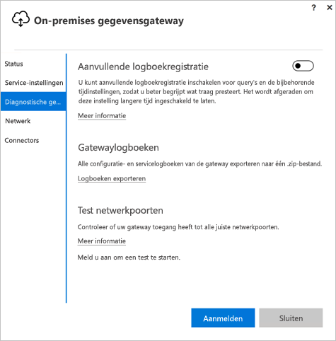

1. Schakel SAP BW-tracering in en controleer de gegenereerde logboekbestanden. Er zijn verschillende soorten SAP BW-tracering beschikbaar. Raadpleeg de SAP-documentatie voor meer informatie.

## <a name="errors-from-an-insufficient-kerberos-configuration"></a>Fouten als gevolg van een incorrecte Kerberos-configuratie

Als de onderliggende databaseserver en de gateway niet juist zijn geconfigureerd voor beperkte Kerberos-delegering, kan het volgende foutbericht over het niet kunnen laden van gegevens worden weergegeven:


De technische gegevens die horen bij dit foutbericht (DM_GWPipeline_Gateway_ServerUnreachable), kunnen er als volgt uitzien:

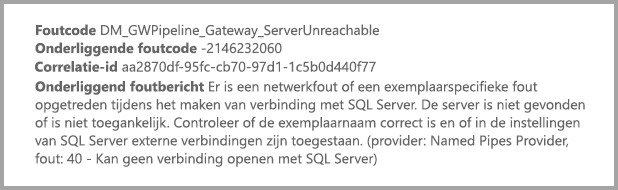

Het gevolg is dat de gateway de oorspronkelijke gebruiker niet goed kan imiteren en de poging om verbinding te maken met de database mislukt.

## <a name="next-steps"></a>Volgende stappen

Raadpleeg de volgende bronnen voor meer informatie over de **on-premises gegevensgateway** en **DirectQuery**:

* [On-premises data gateway](service-gateway-onprem.md) (On-premises gegevensgateway)
* [DirectQuery in Power BI](desktop-directquery-about.md)
* [Data sources supported by DirectQuery](desktop-directquery-data-sources.md) (Gegevensbronnen die worden ondersteund door DirectQuery)
* [DirectQuery en SAP BW](desktop-directquery-sap-bw.md)
* [DirectQuery en SAP HANA](desktop-directquery-sap-hana.md)
