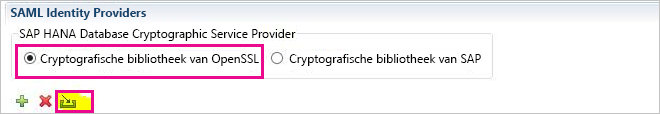
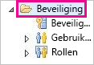
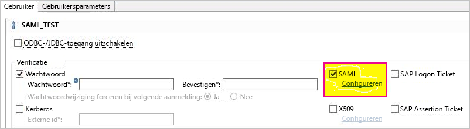
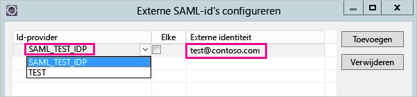
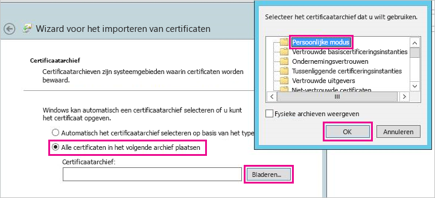
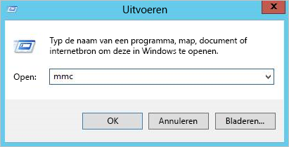
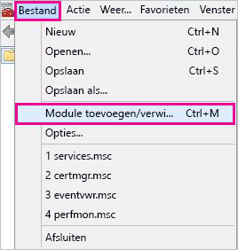
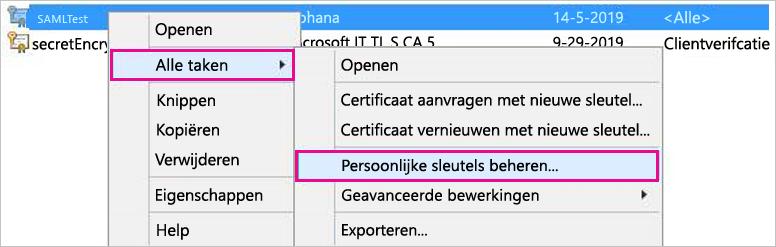
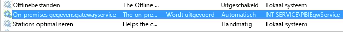
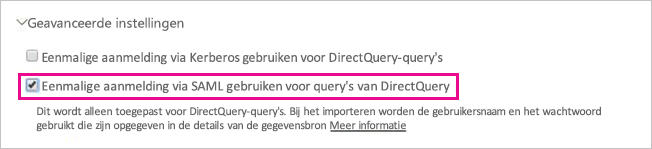

# <a name="use-security-assertion-markup-language-saml-for-single-sign-on-sso-from-power-bi-to-on-premises-data-sources"></a>Security Assertion Markup Language (SAML) gebruiken om eenmalige aanmelding (SSO) bij on-premises gegevensbronnen vanuit Power BI mogelijk te maken

Gebruik [Security Assertion Markup Language (SAML)](https://www.onelogin.com/pages/saml) om naadloze connectiviteit dankzij eenmalige aanmelding mogelijk te maken. Met inschakeling van SSO is het eenvoudiger om gegevens van on-premises gegevensbronnen te vernieuwen in Power BI-rapporten en -dashboards.

## <a name="supported-data-sources"></a>Ondersteunde gegevensbronnen

Momenteel wordt SAP HANA met SAML ondersteund. Zie het onderwerp [SAML SSO voor BI-Platform voor HANA](https://wiki.scn.sap.com/wiki/display/SAPHANA/SAML+SSO+for+BI+Platform+to+HANA) in de documentatie van SAP HANA voor meer informatie over het instellen en configureren van eenmalige aanmelding voor SAP HANA met behulp van SAML.

Er worden extra gegevensbronnen ondersteund met [Kerberos](service-gateway-sso-kerberos.md).

## <a name="configuring-the-gateway-and-data-source"></a>De gateway en de gegevensbron configureren

Als u gebruik wilt maken van SAML, moet u eerst een certificaat voor de SAML-id-provider genereren en vervolgens een Power BI-gebruiker toewijzen aan de identiteit.

1. Genereer een certificaat. Zorg ervoor dat u de FQDN van de SAP HANA-server gebruikt bij het invullen van de *algemene naam*. Het certificaat verloopt over 365 dagen.

    ```
    openssl req -newkey rsa:2048 -nodes -keyout samltest.key -x509 -days 365 -out samltest.crt
    ```

1. In SAP HANA Studio klikt u met de rechtermuisknop op uw SAP HANA-server en navigeert u vervolgens naar **Beveiliging** > **Beveiligingsconsole openen** > **SAML-identiteitsprovider** > **OpenSSL Cryptographic Library**.

1. Selecteer **Importeren**, navigeer naar samltest.crt en importeer dit bestand.

    

1. Selecteer in SAP HANA Studio de map **Beveiliging**.

    

1. Vouw **Gebruikers** uit en selecteer vervolgens de gebruiker die u wilt toewijzen aan uw Power BI-gebruiker.

1. Selecteer **SAML** en vervolgens **Configureren**.

    

1. Selecteer de id-provider die u in stap 2 hebt gemaakt. Voer bij **Externe id** de UPN van de Power BI-gebruiker in en selecteer **Toevoegen**.

    

Valideer de configuratie vervolgens met een *SAML-verklaring* met behulp van het hulpprogramma [xmlsec1](http://sgros.blogspot.com/2013/01/signing-xml-document-using-xmlsec1.html).

1. Sla de verklaring hieronder op als assertion-template.xml. Vervang \<MyUserId\> door de UPN van de Power BI-gebruiker die u hebt ingevoerd in stap 7.

    ```xml
    <?xml version="1.0" encoding="UTF-8" ?>
    <saml2:Assertion ID="Assertion12345789" IssueInstant="2015-07-16T04:47:49.858Z" Version="2.0" xmlns:saml2="urn:oasis:names:tc:SAML:2.0:assertion">
      <saml2:Issuer></saml2:Issuer> 
      <Signature xmlns="http://www.w3.org/2000/09/xmldsig#">
        <SignedInfo>
          <CanonicalizationMethod Algorithm="http://www.w3.org/TR/2001/REC-xml-c14n-20010315"/>
          <SignatureMethod Algorithm="http://www.w3.org/2000/09/xmldsig#rsa-sha1"/>
          <Reference URI="">
            <Transforms>
              <Transform Algorithm="http://www.w3.org/2000/09/xmldsig#enveloped-signature"/>
              <Transform Algorithm="http://www.w3.org/2001/10/xml-exc-c14n#"/>
            </Transforms>
            <DigestMethod Algorithm="http://www.w3.org/2000/09/xmldsig#sha1"/>
            <DigestValue />
          </Reference>
        </SignedInfo>
        <SignatureValue />
        <KeyInfo>
          <X509Data />
        </KeyInfo>
      </Signature>
      <saml2:Subject>
        <saml2:NameID Format="urn:oasis:names:tc:SAML:1.1:nameid-format:unspecified"><MyUserId></saml2:NameID>
      </saml2:Subject>
      <saml2:Conditions NotBefore="2010-01-01T00:00:00Z" NotOnOrAfter="2050-01-01T00:00:00Z"/>
    </saml2:Assertion>
    ```

1. Voer de volgende opdracht uit. saltest.key en samltest.crt zijn de sleutel en het certificaat die u in stap 1 hebt gegenereerd.

    ```
    xmlsec1 --sign --privkey-pem samltest.key, samltest.crt --output signed.xml assertion-template.xml
    ```

1. Open in SAP HANA Studio een SQL-consolevenster en voer de volgende opdracht uit. Vervang \<SAMLAssertion\> met de XML-inhoud van de vorige stap.

    ```SQL
    CONNECT WITH SAML ASSERTION '<SAMLAssertion>'
    ```

Als de query slaagt, betekent dit dat de SAML SSO-configuratie voor SAP HANA is voltooid.

Nu u het certificaat en de identiteit hebt geconfigureerd, kunt u het certificaat converteren naar pfx-indeling en het gateway-apparaat configureren voor gebruik van het certificaat.

1. Converteer het certificaat naar pfx-indeling door de volgende opdracht uit te voeren.

    ```
    openssl pkcs12 -inkey samltest.key -in samltest.crt -export -out samltest.pfx
    ```

1. Kopieer het pfx-bestand naar het gatewayapparaat:

    1. Dubbelklik op samltest.pfx en selecteer vervolgens **Lokale machine** > **Volgende**.

    1. Voer het wachtwoord in en selecteer vervolgens **Volgende**.

    1. Selecteer **Alle certificaten in het onderstaande archief opslaan** en selecteer vervolgens **Bladeren** > **Persoonlijk** > **OK**.

    1. Selecteer **Volgende** en vervolgens **Voltooien**.

    

1. Geef het gatewayserviceaccount toegang tot de persoonlijke sleutel van het certificaat:

    1. Voer op de gatewaycomputer de Microsoft Management Console (MMC) uit.

        

    1. Selecteer onder **Bestand** de optie **Module toevoegen/verwijderen**.

        

    1. Selecteer **Certificaten** > **Toevoegen** en vervolgens **Computeraccount** > **Volgende**.

    1. Selecteer **Lokale computer** > **Voltooien** > **OK**.

    1. Vouw **Certificaten** > **Persoonlijk** > **Certificaten** uit en zoek het certificaat.

    1. Klik met de rechtermuisknop op het certificaat en navigeer naar **Alle taken** > **Persoonlijke sleutels beheren**.

        

    1. Voeg het gatewayserviceaccount toe aan de lijst. Het account is standaard **NT SERVICE\PBIEgwService.** U ontdekt in welk account de gatewayservice wordt uitgevoerd door **services.msc** uit te voeren en te zoeken naar **On-premises data gateway service**.

        

Ga ten slotte als volgt te werk om de vingerafdruk van het certificaat toe te voegen aan de gatewayconfiguratie.

1. Voer de volgende PowerShell-opdracht uit om de certificaten op uw computer weer te geven.

    ```powershell
    Get-ChildItem -path cert:\LocalMachine\My
    ```
1. Kopieer de vingerafdruk voor het certificaat dat u hebt gemaakt.

1. Ga naar de map van de gateway. Standaard is dat C:\Program Files\On-premises data gateway.

1. Open PowerBI.DataMovement.Pipeline.GatewayCore.dll.config en zoek de sectie \*SapHanaSAMLCertThumbprint\*. Plak de vingerafdruk die u hebt gekopieerd.

1. Start de gatewayservice opnieuw op.

## <a name="running-a-power-bi-report"></a>Een Power BI-rapport uitvoeren

Nu kunt u de pagina **Gateway beheren** in Power BI gebruiken om de gegevensbron te configureren en onder **Geavanceerde instellingen** SSO in te schakelen. Vervolgens kunt u rapporten en gegevenssets publiceren die een binding met die gegevensbron hebben.



## <a name="next-steps"></a>Volgende stappen

Raadpleeg de volgende bronnen voor meer informatie over de **on-premises gegevensgateway** en **DirectQuery**:

* [On-premises data gateway](service-gateway-onprem.md) (On-premises gegevensgateway)
* [DirectQuery in Power BI](desktop-directquery-about.md)
* [Data sources supported by DirectQuery](desktop-directquery-data-sources.md) (Gegevensbronnen die worden ondersteund door DirectQuery)
* [DirectQuery en SAP BW](desktop-directquery-sap-bw.md)
* [DirectQuery en SAP HANA](desktop-directquery-sap-hana.md)