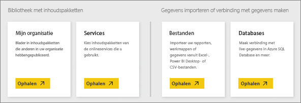
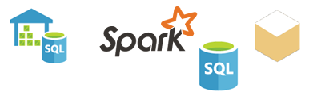

# Gegevensbronnen voor de Power BI-service
Gegevens vormen de kern van Power BI. Wanneer u gegevens verkent, grafieken of dashboards maakt en vragen stelt met Q & A, halen al deze visualisaties en de antwoorden die u de hun onderliggende gegevens uit een gegevensset. Maar waar komt deze gegevensset vandaan? Deze komt uit een gegevensbron.

In dit artikel gaan we in op de verschillende soorten gegevensbronnen waarmee u verbinding kunt maken vanuit de Power BI-service. Vergeet niet dat er nog veel meer soorten gegevensbronnen zijn waaruit u gegevens kunt ophalen. Maar daarvoor moeten mogelijk eerst Power BI Desktop of de geavanceerde gegevensquery en de modelleringsfuncties van Excel worden gebruikt. Daar gaan we later op in. Nu gaan we kijken naar de verschillende soorten gegevensbronnen waarmee u direct verbinding kunt maken vanuit uw Power BI-service.

U kunt gegevens ophalen uit een van deze gegevensbronnen in Power BI door te klikken op **Mijn werkruimte** > **Gegevens ophalen**.

## Bestanden

**Excel** (.xlsx, xlxm): Excel is uniek omdat een werkmap zowel gegevens kan bevatten die u zelf in de werkbladen hebt ingevoerd als gegevens die u opvraagt en laadt uit externe gegevensbronnen met Power Query (ophalen en transformeren in Excel 2016) of Power Pivot. U kunt gegevens importeren die in tabellen in de werkbladen staan (de gegevens *moeten* in een tabel zijn opgenomen), of gegevens importeren die worden geladen in een gegevensmodel. Zie [Gegevens ophalen vanuit Excel](service-get-data-from-files.md) voor meer informatie.

**Power BI Desktop** (pbix) - met Power BI Desktop kunt u gegevens opvragen en laden uit externe gegevensbronnen, uw gegevensmodel met metingen en relaties uitbreiden en rapporten maken. U kunt uw Power BI Desktop-bestand importeren in uw Power BI-site. Power BI Desktop wordt aanbevolen voor gevorderde gebruikers die een goede kennis hebben van hun gegevensbronnen, gegevensquery’s en -transformatie en concepten van gegevensmodellering. Zie [Verbinding maken met gegevens in Power BI Desktop](desktop-connect-to-data.md) voor meer informatie.

**Door komma's gescheiden waarden** (.csv) - bestanden van dit type zijn eenvoudige tekstbestanden met rijen gegevens. Elke rij kan een of meer waarden bevatten, van elkaar gescheiden door komma's. Een .csv-bestand met naam- en adresgegevens kan bijvoorbeeld een aantal rijen bevatten waarin elke rij waarden heeft voor voornaam, achternaam, adres, stad, postcode enzovoort. U kunt geen gegevens importeren in een .csv-bestand, maar veel toepassingen, zoals Excel, kunnen eenvoudige tabelgegevens opslaan als .csv-bestand.

Voor andere bestandstypen zoals XML-tabel (.xml) of tekstbestanden (.txt) kunt u met behulp van Ophalen en transformeren gegevens eerst opvragen, transformeren en laden in een Excel- of Power BI Desktop-bestand. U kunt het Excel- of Power BI Desktop-bestand vervolgens importeren in Power BI.

Het maakt ook een groot verschil waar u uw bestanden opslaat. OneDrive voor Bedrijven biedt de grootste mate van flexibiliteit en integratie met Power BI. Als u uw bestanden op uw lokale schijf wilt houden, kan dat. Als u uw gegevens echter moet vernieuwen, moeten een paar extra stappen worden uitgevoerd. Meer informatie vindt u in de gekoppelde artikelen.

## Inhoudspakketten

Inhoudspakketten bevatten alle gegevens en rapporten die u nodig hebt. In Power BI worden twee typen inhoudspakketten gebruikt: die van services zoals Google Analytics, Marketo of Salesforce en pakketten die zijn gemaakt en gedeeld door andere gebruikers in uw organisatie.

**Services**: er zijn talloze services met inhoudspakketten voor Power BI en er worden er steeds meer toegevoegd. Voor de meeste services hebt u een account nodig. Zie [Verbinding maken met services](service-connect-to-services.md) voor meer informatie.

**Organisatiespecifieke pakketten**: als u en andere gebruikers in uw organisatie een Power BI Pro-account hebben, kunt u inhoudspakketten maken, delen en gebruiken. Zie [Organisatie-inhoudspakketten](service-organizational-content-pack-introduction.md) voor meer informatie.

## Databases

**Databases in de cloud**: vanuit de Power BI-service kunt u live verbinding maken met Azure SQL Database, Azure SQL Data Warehouse, Spark on Azure HD Insight en SQL Server Analysis Services met behulp van DirectQuery. Verbindingen van Power BI met deze databases zijn live. Als u verbinding hebt gemaakt met bijvoorbeeld een Azure SQL Database, en u begint met het verkennen van de gegevens door rapporten te maken in Power BI, wordt op elk moment dat u uw gegevens filtert of een ander veld toevoegt aan een visualisatie, rechtstreeks in de database een query uitgevoerd. Zie [Azure en Power BI](service-azure-and-power-bi.md) voor meer informatie.

**Lokale databases**: vanuit de Power BI-service kunt u rechtstreeks verbinding maken met databases van het tabelmodel van SQL Server Analysis Services. Een Power BI-bedrijfsgateway is vereist. Als u niet zeker weet hoe u verbinding kunt maken met uw organisatiedatabase in tabelvorm, neemt u contact op met de systeembeheerder of IT-afdeling. Zie [SQL Server Analysis-tabelgegevens in Power BI](sql-server-analysis-services-tabular-data.md) voor meer informatie.

Voor andere soorten databases in uw organisatie moet u eerst met Power BI Desktop of Excel verbinding maken met gegevens, deze op te vragen en ze in een gegevensmodel te laden. U kunt het bestand vervolgens importeren in Power BI, waar een gegevensset wordt aangemaakt. Als u geplande vernieuwing hebt ingesteld, gebruikt Power BI verbindingsinformatie uit het bestand samen met de vernieuwingsinstellingen die u configureert om rechtstreeks verbinding te maken met de gegevensbron en een query op updates uit te voeren. Deze updates worden vervolgens in de gegevensset in Power BI geladen. Zie [Verbinding maken met gegevens in Power BI Desktop](desktop-connect-to-data.md) voor meer informatie.

## Wat gebeurt er als mijn gegevens afkomstig zijn van een andere bron?
Er zijn letterlijk honderden verschillende gegevensbronnen die u kunt gebruiken met Power BI. Maar ongeacht waar u uw gegevens vandaan haalt, ze moeten in een indeling zijn die de Power BI-service kan gebruiken om rapporten en dashboards te maken, vragen te beantwoorden met Q&A enzovoort.

Vanuit sommige gegevensbronnen komen de gegevens al in een indeling die gereed is voor de Power BI-service, zoals inhoudspakketten van serviceproviders zoals Google Analytics en Twilio. Ook databases in tabelmodel van SQL Server Analysis Services zijn klaar voor gebruik. En u kunt live verbinding maken met databases in de cloud zoals Azure SQL Database en Spark on HDInsight.

In andere gevallen moet u de gewenste gegevens mogelijk opvragen en in een bestand laden. Stel dat u logistieke gegevens bewaart in een magazijndatabase op een server in uw organisatie. In de Power BI-service kunt u niet rechtstreeks verbinding maken met deze database om de gegevens te gaan verkennen (tenzij dit een database met een tabelmodel is). U kunt echter met Power BI Desktop of Excel de logistieke gegevens opvragen en in een gegevensmodel laden dat u als een bestand opslaat. U kunt het bestand vervolgens importeren in Power BI, waar een gegevensset wordt aangemaakt.

U denkt nu waarschijnlijk: ‘Maar logistieke gegevens in deze database veranderen elke dag’. Hoe zorg ik ervoor dat mijn gegevensset in Power BI wordt vernieuwd?" De verbindingsgegevens voor het Power BI Desktop- of Excel-bestand worden samen met de gegevens geïmporteerd in de gegevensset. Als u geplande vernieuwing instelt of de gegevensset handmatig vernieuwt, gebruikt Power BI de verbindingsgegevens uit de gegevensset, samen met een aantal andere instellingen om direct verbinding te maken met de database, om een query op updates uit te voeren en om die updates in de gegevensset te laden. Er is waarschijnlijk een Power BI-gateway vereist om de gegevensoverdracht tussen uw lokale server en Power BI te beveiligen. Uw visualisaties in rapporten en dashboards worden automatisch vernieuwd.

Omdat u vanuit de Power BI-service geen verbinding kunt maken met uw gegevensbron, betekent dit dus niet dat u die gegevens niet in Power BI kunt ophalen. Er zijn alleen een paar stappen extra nodig en misschien wat hulp van uw IT-afdeling. Zie [Gegevensbronnen in Power BI Desktop](desktop-data-sources.md) voor meer informatie.

## Nog enkele details
U ziet dat de termen gegevensset en gegevensbron veel worden gebruikt in Power BI. Ze worden vaak als synoniem gebruikt, maar het zijn twee verschillende dingen, die wel met elkaar in verband staan.

Een ***gegevensset*** wordt automatisch in Power BI gemaakt wanneer u gegevens ophaalt om verbinding mee te maken en gegevens importeert uit een inhoudspakket of bestand of als u verbinding maakt met een live gegevensbron. Een gegevensset bevat informatie over de gegevensbron en de referenties van de gegevensbron en in veel gevallen een deelverzameling van gegevens die zijn gekopieerd uit de gegevensbron. Als u visualisaties in rapporten en dashboards maakt, kijkt u in de meeste gevallen naar gegevens in de gegevensset.

Een ***gegevensbron*** is de plek waar de gegevens in een gegevensset werkelijk vandaan komen. Dit kan bijvoorbeeld een online service zijn zoals Google Analytics of QuickBooks, een database in de cloud zoals Azure SQL Database, of een database of bestand op een lokale computer of server in uw eigen organisatie.

### Gegevens vernieuwen
Als u uw bestanden op uw lokale schijf of een station ergens in uw organisatie opslaat, is mogelijk een Power BI-gateway vereist om de gegevensset in Power BI te vernieuwen. Ook moet de computer waarop het bestand wordt opgeslagen, zijn ingeschakeld wanneer de gegevens worden vernieuwd. U kunt het bestand ook opnieuw importeren of Publiceren vanuit Excel of Power BI Desktop gebruiken, maar dit zijn geen geautomatiseerde processen.

Als u uw bestanden op OneDrive voor Bedrijven of SharePoint - Teamsites opslaat en er vervolgens verbinding mee maakt of ze importeert in Power BI, zijn uw gegevenssets, rapporten en dashboard altijd actueel. Omdat OneDrive en Power BI beide in de cloud zijn, kan Power BI rechtstreeks verbinding maken met uw opgeslagen bestand, ongeveer één keer per uur, en controleren op updates. Als deze worden gevonden, worden de gegevensset en alle visualisaties automatisch vernieuwd.

Inhoudspakketten van services worden automatisch bijgewerkt. In de meeste gevallen eenmaal per dag. U kunt handmatig vernieuwen, maar het hangt af van de serviceprovider of ui bijgewerkte gegevens wel of niet ziet. Inhoudspakketten van anderen binnen uw organisatie zijn afhankelijk van de gegevensbronnen die worden gebruikt en hoe de persoon die het inhoudspakket heeft gemaakt de optie voor vernieuwen heeft ingesteld.

Azure SQL Database, Azure SQL Data Warehouse en Spark op Azure HDInsight zijn unieke gegevensbronnen in de cloud. Omdat de Power BI-service ook in de cloud is, kan Power BI hier live mee verbinden, met behulp van DirectQuery. Wat u ziet in Power BI is altijd synchroon en vernieuwen hoeft niet te worden ingesteld.

SQL Server Analysis Services is uniek omdat het een live verbinding is als u er verbinding mee maakt vanuit Power BI, net als een Azure-database in de cloud, maar dat de database zelf op een server in uw organisatie staat. Voor dit type verbinding is een Power BI-gateway vereist, die meestal wordt geconfigureerd door een IT-afdeling.

Gegevens vernieuwen is een uiterst belangrijk onderdeel van Power BI en is veel te complex om hier verder te behandelen. Zie [Gegevens vernieuwen in Power BI](refresh-data.md) als u er diepgaand inzicht in wilt krijgen.

## Overwegingen en beperkingen
Voor alle gegevensbronnen in de Power BI-service gelden de volgende overwegingen en beperkingen. Er zijn andere beperkingen die gelden voor specifieke functies, maar de volgende lijst is van toepassing op de Power BI-service in het algemeen:

* **Maximale grootte van de gegevensset** - er is een limiet van 1 GB per gegevensset in de Power BI-service.
* **Rijlimiet** - het maximumaantal rijen in uw gegevensset (als u geen DirectQuery gebruikt) is 2 miljard, waarbij drie van de rijen zijn gereserveerd (waardoor maximaal 1.999.999.997 rijen bruikbaar zijn). Als DirectQuery wordt gebruikt, is het maximumaantal 1 miljoen rijen.
* **Kolomlimiet** - het maximum aantal kolommen dat is toegestaan in een gegevensset in alle tabellen in de gegevensset is 16.000 kolommen. Dit geldt voor de Power BI-service en voor gegevenssets die worden gebruikt in Power BI Desktop. Power BI gebruikt een interne kolom met rijnummers per tabel in de gegevensset, wat betekent dat het maximumaantal kolommen 16.000 min één is voor elke tabel die in de gegevensset wordt gebruikt.

