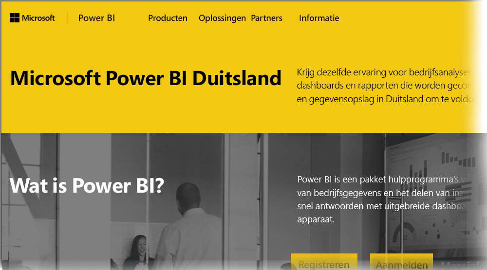

# Veelgestelde vragen over Power BI voor Duitse Cloud-klanten
Er is een versie van de **Power BI-service** beschikbaar voor de EU-/EFTA-klanten (Europese Unie/Europese Vrijhandelsovereenkomst), ook vaak Microsoft Cloud Deutschland (MCD) genoemd. De versie van de **Power BI-service** die in dit artikel wordt besproken, is specifiek voor EU-/EFTA-klanten en staat los en verschilt van de commerciële versie van de **Power BI-service** of Power BI-services die aan overheidsklanten worden geleverd.

De volgende vragen en antwoorden bieden belangrijke informatie voor Power BI Pro-Service in Microsoft Cloud Deutschland (MCD). Dit is de Power BI-servicecloud die specifiek voor EU-/EFTA-klanten wordt geleverd.

1. **Wat is de Power BI-service voor de Duitse cloud?**
   
   De Power BI-service voor EU-/EFTA-klanten, ook wel aangeduid als Microsoft Cloud Deutschland (MCD), is een cloud die voldoet aan de EU-/EFTA-regels waarbij de Power BI-service wordt geleverd vanuit Duitse datacenters. Alle klantgegevens in de Power BI-service voor de EU-/EFTA-cloud worden als inactieve gegevens opgeslagen in Duitsland, onder supervisie van de Duitse onafhankelijke data trustee T-systems. Daarnaast is de Duitse wet- en regelgeving van toepassing op de fysieke en logische toegang tot de gegevens. Voor de Power BI-service voor de EU-/EFTA-cloud is een afzonderlijk account vereist dat verschilt van de commerciële versie van de Power BI-service. Meer informatie over Microsoft Cloud Deutschland vindt u [hier](https://www.microsoft.com/trustcenter/cloudservices/nationalcloud).
2. **Waar kan ik de prijzen en aanmeldingsgegevens voor de Power BI-service voor de Duitse cloud vinden?**
   
   De [startpagina van de Power BI-service voor de Duits cloud](https://powerbi.microsoft.com/power-bi-germany/) bevat uitgebreide informatie, inclusief informatie over de prijzen. Deze pagina bevat tevens een koppeling waarmee u zich kunt registreren voor een proefabonnement van 30 dagen op de **Power BI Pro-service** met 25 gebruikerslicenties. Als u zich registreert voor het proefabonnement, beschikt u over de optie om indien nodig extra licenties te kopen of toe te voegen. We bieden speciale prijzen voor EA (Enterprise Agreement), overheidsinstellingen en non-profitorganisaties. Neem contact op met uw Microsoft-vertegenwoordiger voor meer informatie.
3. **Ik beschik als onderdeel van Azure Duitsland- en/of Office 365 Germany-abonnementen over een Duitse Cloud-tenant. Kan ik de bestaande tenant gebruiken om mij aan te melden voor Power BI Duitsland?**
   
   Ja. Als onderdeel van het aanmeldingsproces beschikt u over de optie om u aan te melden met een bestaand tenantbeheerderaccount voor de Duitse cloud en de Power BI Pro-servicelicenties toe te voegen aan uw bestaande tenant in de Duitse cloud. Houd er rekening mee dat de Cloud-tenants en -gebruikersaccounts voor Duitsland verschillen van de Power BI-service voor de Duitse cloud.
4. **Bevat de Power BI-service voor de Duitse cloud een gratis service?**
   
   Nee. We kunnen geld geen gratis licentieversies in de Power BI-service voor de Duitse cloud. Als u de gratis versie van Power BI echter voldoet aan uw bedrijfsbehoeften, kunt u zich het beste aanmelden voor de [gratis versie van Power BI in de openbare cloud](https://powerbi.microsoft.com/get-started/).
5. **Kan ik Power BI Desktop, Power BI - Mobiel, On-premises gegevensgateway en Publisher voor Excel gebruiken met de Power BI-service voor de Duitse cloud?**
   
   Ja. We hebben onze Power BI-clientproducten zodanig bijgewerkt dat ze probleemloos werken in combinatie met de Power BI-service voor de Duits cloud. Meld u aan met uw Power BI-serviceaccount voor de Duitse cloud om dezelfde clientproducten te gebruiken voor de Power BI-service voor de Duitse cloud. U kunt op de volgende locaties de nieuwste versie van de clientproducten downloaden:
   
   * [Power BI Desktop](https://powerbi.microsoft.com/desktop/)
   * [Power BI - Mobiel](https://powerbi.microsoft.com/mobile/)
   * [On-premises gegevensgateway](https://powerbi.microsoft.com/gateway/)
   * [Power BI Publisher voor Excel](https://powerbi.microsoft.com/excel-dashboard-publisher/)
6. **Zijn er functiebeperkingen van toepassing voor de Power BI-service voor de Duitse cloud?**
   
   De volgende servicefuncties zijn momenteel niet beschikbaar in de Power BI-service voor de Duitse cloud:
   
   * Publiceren op internet
   * ArcGIS-kaarten van Esri
   * Power BI Embedded (afzonderlijke ISV-licentieverlening naar verbruik, zal in de toekomst worden aangeboden via [Microsoft Azure Duitsland](https://azure.microsoft.com/overview/clouds/germany/))
7. **Waar vind ik de specifieke configuratiegegevens voor het gebruik en de integratie van de Power BI-service voor de Duitse cloud in mijn toepassingen?**
   
   We hebben onze [SaaS Embedding-voorbeelden voor ontwikkelaars](https://github.com/Microsoft/PowerBI-Developer-Samples) bijgewerkt met specifieke configuratiegegevens voor de Duitse en andere Power BI-clouds. Bekijk de map **Cloudconfiguraties** in de voorbeelden voor cloudspecifieke configuratie-eindpunten. De volgende tabel bevat verschillende configuratie-eindpunten voor de Power BI-service voor de Duitse cloud (en ter vergelijking van de openbare cloud).

| **Eindpuntnaam en/of -gebruik** | **URL van Power BI-service voor de Duitse cloud** | **Equivalente URL in de openbare cloud (ter vergelijking)** |
| --- | --- | --- |
| Startpagina, registreren en aanmelden |[https://powerbi.microsoft.com/power-bi-germany/](https://powerbi.microsoft.com/power-bi-germany/) |[https://powerbi.microsoft.com/](https://powerbi.microsoft.com/) |
| Rechtstreeks aanmelden bij de Power BI-service |[https://app.powerbi.de/?noSignUpCheck=1](https://app.powerbi.de/?noSignUpCheck=1) |[https://app.powerbi.com/?noSignUpCheck=1](https://app.powerbi.com/?noSignUpCheck=1) |
| Service-API |[https://api.powerbi.de/](https://api.powerbi.de/) |[https://api.powerbi.com/](https://api.powerbi.com/) |
| Office-portal voor het beheren van gebruikerslicenties, servicestatus- en ondersteuningsaanvragen door beheerders |[https://portal.office.de/](https://portal.office.de/) |[https://portal.office.com/](https://portal.office.com/) |
| URI van AAD-instantie |[https://login.microsoftonline.de/common/oauth2/authorize/](https://login.microsoftonline.de/common/oauth2/authorize/) |[https://login.microsoftonline.com/common/oauth2/authorize/](https://login.microsoftonline.com/common/oauth2/authorize/) |
| Resource-URI van de Power BI-service |[https://analysis.cloudapi.de/powerbi/api](https://analysis.cloudapi.de/powerbi/api) |[https://analysis.windows.net/powerbi/api](https://analysis.windows.net/powerbi/api) |
| Bibliotheek met aangepaste visuals |[https://app.powerbi.de/visuals/](https://app.powerbi.de/visuals/) |[https://app.powerbi.com/visuals/](https://app.powerbi.com/visuals/) |
| Een toepassing registreren voor Power BI (voor Embedded) |[https://app.powerbi.de/apps](https://app.powerbi.de/apps) |[https://app.powerbi.com/apps](https://app.powerbi.com/apps) |
| Azure Portal (voor Embedded) |[https://portal.microsoftazure.de/](https://portal.microsoftazure.de/) |[https://portal.azure.com/](https://portal.azure.com/) |
| Community |[https://community.powerbi.com/](https://community.powerbi.com/) |[https://community.powerbi.com/](https://community.powerbi.com/) |

### Volgende stappen
Er zijn veel verschillende dingen die u met Power BI kunt doen. Bekijk de volgende resources voor meer informatie en trainingen, inclusief een artikel waarin wordt uitgelegd hoe zich voor de service kunt aanmelden:

* [Begeleide training voor Power BI](guided-learning/gettingstarted.yml?tutorial-step=1)
* [Aan de slag met de Power BI-service](service-get-started.md)
* [Aan de slag met Power BI Desktop](desktop-getting-started.md)

