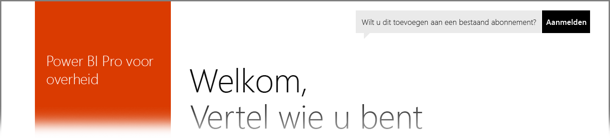

# Power BI voor klanten uit de Amerikaanse overheid
Er is als onderdeel van **Office 365 US Government Community**-abonnement een versie van de **Power BI-service** beschikbaar voor Amerikaanse overheidsklanten. De versie van de **Power BI-service** die in dit artikel wordt besproken, is specifiek ontworpen voor Amerikaanse overheidsklanten en staat los en verschilt van de commerciële versie van de **Power BI-service**.

In de volgende secties wordt beschreven welke *functies* beschikbaar zijn in de versie voor de Amerikaanse overheid van de **Power BI-service**, wordt uitleg gegeven over enkele van de *beperkingen*, worden veelgestelde vragen (**FAQ**) vermeld met antwoorden (waaronder over het registreren) en worden koppelingen opgegeven naar meer informatie.

## Kenmerken van Power BI voor de Amerikaanse overheid
Het is belangrijk om te weten dat **Power BI voor de Amerikaanse overheid** alleen beschikbaar is met een **Pro-licentie** en niet beschikbaar is met een Free-licentie. Alleen bepaalde functies van de Power BI-service zijn beschikbaar in de **Power BI-versie voor de Amerikaanse overheid**.

De volgende functies beschikbaar zijn voor **Power BI voor Amerikaanse overheidsklanten**, in overeenstemming met de kenmerken van de **Pro**-licentie:

* Dashboards en rapporten maken en bekijken
* [Limieten voor gegevenscapaciteit](service-admin-manage-your-data-storage-in-power-bi.md)
* [Geplande gegevensvernieuwing](refresh-data.md)
* Vernieuwbare teamdashboards
* Active Directory-groepen voor het delen en beheren van toegangsbeheer
* [Gegevens en rapporten importeren](service-get-data.md) vanuit Excel-, CSV- en Power BI Desktop-bestanden
* Gegevensbeheergateway
* Alle gegevens worden voor Power BI versleuteld in zowel Azure SQL als Blob Storage
* Verbinding maken met services met [inhoudspakketten](service-connect-to-services.md)

## Connectiviteit tussen Azure Government en openbare Azure Cloud Services 

Azure wordt gedistribueerd over meerdere clouds. Standaard zijn tenants toegestaan om firewallregels van een cloudspecifieke instantie te openen, maar netwerken binnen de cloud is anders en vereist dat u specifieke firewallregels opent voor de communicatie tussen services. Als u een Power BI-klant bent en u over bestaande SQL-instanties beschikt in de openbare cloud die u dient te openen, moet u specifieke firewall-regels in SQL openen op de IP-adresruimte van de Azure Government-cloud voor de volgende datacenters:

* USGov Iowa
* USGov Virginia
* USGov Texas
* USGov Arizona

De IP-adresruimten zijn beschikbaar in de openbare cloud, maar voor de cloud van de overheid moet u een Azure-ondersteuningsticket openen om de IP-bereiken voor de hierboven vermelde datacenters aan te vragen. 

## Beperkingen van Power BI voor de Amerikaanse overheid
Enkele van de functies die beschikbaar in de commerciële versie van de **Power BI-service** zijn *niet* beschikbaar in de **Power BI-service** voor Amerikaanse overheidsklanten. Het Power BI-team is actief bezig met het beschikbaar maken van deze functies voor Amerikaanse overheidsklanten. Dit artikel wordt bijgewerkt zodra de functies beschikbaar zijn.

* **Power BI voor de Amerikaanse overheid** is alleen beschikbaar met een **Pro**-licentie. Power BI Free-licenties waarnaar wordt verwezen in een beheerportal (of een portal voor gebruikers) worden uitgevoerd in een commerciële Power BI-servicecloud.
* **Controleren** - Controleren is niet beschikbaar via de Office 365-portal Beveiliging en naleving.
* **Power BI-inhoud in Cortana** - resultaten voor Power BI wordt niet weergegeven in zoekresultaten van Cortana, waaronder resultaten voor uw Power BI-inhoud (dashboards, rapporten en apps) en tevens resultaten die voor Cortana geoptimaliseerde rapportpagina's weergeven voor specifieke trefwoorden.
* **Externe gebruiker delen**: delen is alleen toegestaan binnen een Power BI-tenant. U kunt niet met gebruikers buiten uw Power BI-tenant delen.

Als er **Power BI** Free-licenties zijn toegewezen aan uw account, worden die accounts uitgevoerd in een commerciële versie van de **Power BI**-service en maken ze geen deel uit van **Power BI voor de Amerikaanse overheid**. Bij deze Free-accounts kunnen de volgende problemen optreden:

* Gateway, Mobile en Desktop kunnen niet worden geverifieerd
* U hebt geen toegang tot de commerciële gegevensbronnen van Azure
* PBIX-bestanden moeten handmatig via de commerciële service worden geüpload
* Er zijn geen mobiele Power BI-apps beschikbaar

Neem contact op met uw accountvertegenwoordiger om mogelijke problemen op te lossen.

## Veelgestelde vragen (FAQ) over de Power BI-service voor de Amerikaanse overheid
Met behulp van de volgende vragen (en antwoorden) kunt u snel de informatie over de service vinden die u nodig hebt.

**Vraag:** hoe migreer ik mijn commerciële **Power BI**-gegevens naar de **Power BI-service** voor de Amerikaanse overheid?

**Antwoord:** uw beheerder moet een nieuw exemplaar van **Power BI** maken via een afzonderlijk abonnement speciaal voor de Amerikaanse overheid. U kunt vervolgens uw commerciële gegevens repliceren in de **Power BI-service** voor de Amerikaanse overheid, uw commerciële licentie verwijderen en uw bestaande domein koppelen aan de nieuwe service speciaal voor de Amerikaanse overheid.

**Vraag:** waarom kan ik geen verbinding maken met een specifiek inhoudspakket?

**Antwoord:** u moet ervoor zorgen dat uw abonnement is ingeschakeld. Daarna kunt u pas verbinding maken met inhoudspakketten.

**Vraag:** ik wil graag **Power BI** gaan gebruiken in mijn organisatie binnen de Amerikaanse overheid. Hoe ga ik aan de slag?

**Antwoord:** het registratieproces (ook wel *onboarding* genoemd) kan verschillen op basis van uw bestaande licentie en abonnement. Zie het artikel [Registreren voor Power BI voor de Amerikaanse overheid](service-govus-signup.md) voor meer informatie.

**Vraag:** is de URL voor het verbinden met **Power BI** voor de Amerikaanse overheid anders dan de commerciële **Power BI**-URL?

**Antwoord:** ja, de URL's verschillen. In de volgende tabel worden de URL's weergegeven:

| URL van de commerciële versie | URL van de versie voor de Amerikaanse overheid |
| --- | --- |
| https://app.powerbi.com/ |[https://app.powerbigov.us](https://app.powerbigov.us) |

## Volgende stappen
Er zijn veel verschillende dingen die u met Power BI kunt doen. Bekijk de volgende resources voor meer informatie en trainingen, inclusief een artikel waarin wordt uitgelegd hoe zich voor de service kunt aanmelden:

* [Registreren voor Power BI voor de Amerikaanse overheid](service-govus-signup.md)
* <a href="https://channel9.msdn.com/Blogs/Azure/Cognitive-Services-HDInsight-and-Power-BI-on-Azure-Government">Demo van Power BI voor de Amerikaanse overheid</a>
* [Begeleide training voor Power BI](guided-learning/gettingstarted.yml#step-1)
* [Aan de slag met de Power BI-service](service-get-started.md)
* [Aan de slag met Power BI Desktop](desktop-getting-started.md)

