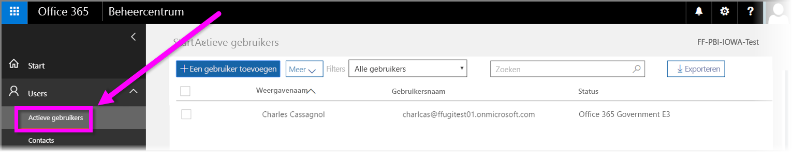

# Uw Amerikaanse overheidsorganisatie registreren in de Power BI-service
Er is als onderdeel van **Office 365 US Government Community**-abonnement een versie van de **Power BI-service** beschikbaar voor Amerikaanse overheidsklanten. De versie van de **Power BI-service** die in dit artikel wordt besproken, is specifiek ontworpen voor Amerikaanse overheidsklanten en staat los en verschilt van de commerciële versie van de **Power BI-service**.

Voor meer informatie over de **Power BI-service** voor de Amerikaanse overheid, inclusief de functies en beperkingen, gaat u naar [Overzicht van Power BI voor Amerikaanse overheidsklanten](service-govus-overview.md).

> [!NOTE]
> Dit artikel is bedoeld voor beheerders die de bevoegdheid hebben hun Amerikaanse overheidsorganisatie te registreren voor Power BI. Als u een eindgebruiker bent, neemt u contact met uw beheerder op voor een abonnement op Power BI for US Government.
> 
> 

## Het juiste aanmeldingsproces voor uw Amerikaanse overheidsorganisatie selectere.
Mogelijk maakt uw Amerikaanse overheidsorganisatie nog geen gebruik van **Office Government Cloud** of heeft de organisatie al een abonnement. In de volgende secties worden de registratiestappen uiteengezet op basis van de wel of niet aanwezige abonnementen en kunnen afhankelijke van de bestaande abonnementen variëren.

Zodra u zich hebt aangemeld voor Power BI US Government, is het mogelijk dat bepaalde functies pas werken nadat de verkoop- of ondersteuningsmedewerker uw onboardingproces heeft voltooid. Zie [Een overzicht van Power BI voor Amerikaanse overheidsklanten](service-govus-overview.md) voor meer informatie. Neem contact op met uw verkoop- of ondersteuningsmedewerker om het onboardingproces te voltooien, zodat deze functies worden ingeschakeld.

### Amerikaanse overheidsorganisaties die nieuw Office Cloud-klanten zijn
Als uw organisatie een nieuwe **Office Government Cloud** klant is, voert u de volgende stappen uit:

> [!NOTE]
> Deze stappen moeten worden uitgevoerd door de portalbeheerder.
>

1. Ga naar [https://products.office.com/en-us/government/office-365-web-services-for-government](https://products.office.com/en-us/government/office-365-web-services-for-government).

>[!NOTE]
>Als u zich op dit moment niet wilt aanmelden voor Office Government Cloud, kunt u contact opnemen met de verkoopmedewerker.
>

2. Selecteer Office G3 en vul het formulier in voor een evaluatieversie van Office.
3. Zodra u klant van Office Cloud bent, gaat u verder met de onderstaande stappen voor bestaande Office Government Cloud-klanten.

### Bestaande Office Government Cloud-klanten
Als uw organisatie een bestaand **Office Government Cloud**-klant, maar u geen **Power BI**-abonnement hebt (gratis of anderszins), volgt u deze stappen:

> [!NOTE]
> Deze stappen moeten worden uitgevoerd door de portalbeheerder.
> 
> 

1. Meld u aan bij uw bestaande Office Government Cloud-account en ga naar de beheerportal.
2. Selecteer **Facturering**.
3. Selecteer **Service kopen**.
4. Selecteer de optie Power BI Pro Government en kies **Proberen** en **Nu kopen**.
5. Voltooi uw bestelling.
6. Wijs gebruikers aan het account toe.
   
   
7. Meld u aan bij de **Power BI-service** voor Amerikaanse overheidsklanten op [https://app.powerbigov.us](https://app.powerbigov.us)

## Aanvullende registratie-informatie
Hieronder vindt u aanvullende informatie om u te registreren voor **Power BI US Government** met verschillende scenario's voor licentiemigratie.

### Direct Power BI Trial naar Pro Customer Onboarding
* Klik achtereenvolgens op Facturering > Service kopen > Power BI Pro Gov en selecteer de aankoopoptie, niet de optie voor een evaluatieversie.
* Vul de benodigde informatie in om de licenties te verkrijgen.
* Verwijder de evaluatieversie van Power BI Pro of verwijder de oude licenties en wijs de nieuwe licenties aan de gebruikers toe.
* Meld u aan bij [https://app.powerbigov.us](https://app.powerbigov.us)

### Reseller Power BI Trial naar Pro Customer Onboarding
Ga naar **Facturering > Abonnementen** en selecteer **Power BI Pro for Government**-abonnement. Hier ziet u het volgende:

* Beschikbaar
* Toegewezen
* Toewijzen aan gebruikerskoppelingen
* Als de evaluatieversie nog is toegewezen:
  * Klik onder het proefabonnement op **Toegewezen** en verwijder de gebruikers die u wilt toevoegen aan de betaalde versie.
  * Ga naar het betaalde abonnement en wijs de desbetreffende gebruikers toe.

### Instructies voor opname in de whitelist (whitelisting)
*Whitelisting* is een proces dat door het engineeringteam van Power BI wordt gebruikt om klanten van de commerciële cloudomgeving over te zetten naar de veilige cloudomgeving voor de overheid. Zodoende zorgt u ervoor de functies in de US Government-cloud naar verwachting werken. Alle bestaande (of nieuwe) Amerikaanse overheidsklanten die voor het eerste **Power BI**-services voor de Amerikaanse overheid aanschaffen, *moeten* het volgende whitelistingproces starten. Het proces moet worden uitgevoerd vóór de installatie of de migratie naar **Power BI**-services voor de Amerikaanse overheid. 

Neem contact op met het Microsoft-accountteam voor hulp bij opname in de whitelist als u uw tenant wilt laten opnemen in de *whitelist* voor de US Government-cloud. Houd er rekening mee dat alleen beheerders deze aanvraag kunnen indienen. Het proces voor *opnamen in de whitelist* neemt ongeveer drie weken in beslag. Tijdens die drie weken brengt het engineeringteam van Power BI de benodigde wijzigingen aan ervoor te zorgen dat uw tenant goed werkt in de US Government-cloud.

Klanten die migreren van de **gratis** Power BI-licenties naar **Power BI US Government** (en per definitie migreren naar de bijbehorende **Pro**-licentiefuncties die eerder in dit artikel zijn beschreven), ondervinden de problemen die worden beschreven in de volgende sectie van dit artikel, totdat hun tenant door het engineeringteam van Power BI is *opgenomen in de whitelist*.

### Combinatie van gratis en Pro-licenties in US Government-tenants
Als u zowel gratis als US Government Pro-licenties in uw tenant hebt, blijven zowel de gratis als (US Government) Pro-licenties beschikbaar, maar een de twee licentietypen werkt dan niet naar behoren. Zodra uw tenant is *opgenomen in de whitelist*, gebeurt het volgende:

* Gebruikers van de gratis licentie kunnen zich niet langer via **Power BI Desktop** aanmelden bij Power BI. Bovendien beschikken ze niet meer over de volledige functionaliteit, zoals in de volgende sectie.
* Alle clients die zijn toegewezen aan US Government Pro-licenties, werken zoals verwacht, met inbegrip van het gebruik van gateways, Power BI Desktop en mobiele apps.

Wanneer een combinatie van gratis en Pro-licenties wordt gebruikt in een US Government-tenant, kunt u het volgende verwachten wanneer het *whitelistingproces* wordt uitgevoerd:

**Vóór *opname in de whitelist***:

* Gebruikers met gratis licenties maken gebruik van de commerciële cloud.
* Pro US Government-licenties worden weergegeven in de portal en beheerders kunnen deze licenties toewijzen aan gebruikers. Gebruikers van Pro US Government verliezen geen gegevens uit hun gratis licenties wanneer een beheerder een US Government Pro-licentie toewijst. De toegewezen gebruikers hebben toegang tot de Power BI Pro-functies voor Amerikaanse overheidsklanten. Echter, zolang de tenant nog niet is *opgenomen in de whitelist*, zijn bepaalde functies niet beschikbaar:
  
  * Gateway, Mobile en Power BI Desktop kunnen niet worden geverifieerd.
  * U hebt geen toegang tot de commerciële gegevensbronnen van Azure.
  * PBIX-bestanden moeten handmatig via de commerciële Power BI-service worden geüpload.
  * Er zijn geen mobiele Power BI-apps beschikbaar

**Na *opname in de whitelist***:

* Gratis gebruikers die gebruikmaken van de commerciële Power BI-service, kunnen hier gebruik van blijven maken, maar de verificatie werkt niet meer zoals verwacht.
* Pro-gebruikers die gebruikmaken van US Government-cloud, kunnen de **Power BI-service voor Amerikaanse overheidsklanten** gebruiken zoals verwacht.

Beheerders kunnen het licentierapport uitvoeren om gebruikers in uw tenant te identificeren die gebruikmaken van de gratis licentie. Dergelijke gebruikers worden in het rapport aangeduid met **Power BI Standard**.

## Volgende stappen
Er zijn veel verschillende dingen die u met Power BI kunt doen. Bekijk de volgende resources voor meer informatie en trainingen, inclusief een artikel waarin wordt uitgelegd hoe zich voor de service kunt aanmelden:

* [Overzicht van Power BI voor de Amerikaanse overheid](service-govus-overview.md)
* [Begeleide training voor Power BI](guided-learning/gettingstarted.yml#step-1)
* [Aan de slag met de Power BI-service](service-get-started.md)
* [Aan de slag met Power BI Desktop](desktop-getting-started.md)

