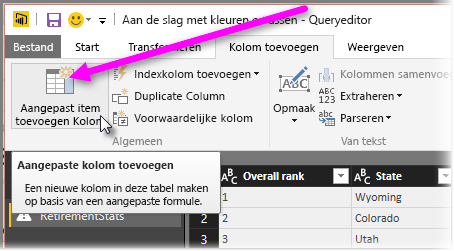

# Histogrammen
Er zijn verschillende manieren voor het bouwen van histogrammen in Power BI. We beginnen met de eenvoudigste en gaan van daaruit verder.

## Eenvoudige histogrammen
Bepaal eerst welke query het veld bevat dat u wilt gebruiken om een histogram te maken.  Gebruik de optie *Verwijzing* voor de query om een nieuwe query te maken en geef deze de naam *FieldName Histogram*. Gebruik de optie **Groeperen op** in het lint **Transformatie** en selecteer de aggregatie **Rijen tellen**. Zorg dat het gegevenstype een getal is voor de resulterende cumulatieve kolom. Vervolgens kunt u deze gegevens op de rapportpagina visualiseren. Deze aanpak is snel en eenvoudig te maken, maar werkt niet goed als u veel gegevenspunten hebt en u kunt zo niet eenvoudig door visualisaties bladeren.

## Buckets voor het bouwen van een histogram definiëren
Bepaal welke query het veld bevat dat u wilt gebruiken om een histogram te maken. Gebruik de optie *Verwijzing* voor de query om een nieuwe query te maken en geef deze de naam *FieldName*.  Definieer vervolgens de buckets met behulp van een regel. Gebruik de optie **Aangepaste kolom toevoegen** op het lint **Kolom toevoegen** en maak een aangepaste regel.

Zorg dat het gegevenstype een getal is voor de resulterende cumulatieve kolom. U kunt nu de techniek voor Groeperen op gebruiken die wordt beschreven bij het **Eenvoudigste histogram** (eerder in dit artikel) om het histogram te maken. Deze optie kan meer gegevenspunten verwerken, maar u kunt nog steeds niet eenvoudiger door visualisaties bladeren.

## Een histogram definiëren met ondersteuning voor bladeren door visualisaties
U kunt door visualisaties bladeren als u in de ene visualisatie een gegevenspunt kunt selecteren en er vervolgens in andere visualisaties op de rapportpagina gegevenspunten worden uitgelicht of gefilterd die te maken hebben met het geselecteerde gegevenspunt.  Omdat we gegevens op query-niveau bewerken, moeten we een relatie maken tussen tabellen en zorgen dat we weten welk detailitem is gekoppeld aan de bucket in het histogram en vice versa.

U kunt dit proces beginnen met behulp van de optie *Verwijzing* voor de query die het veld bevat waarop u een histogram wilt baseren.  Noem de nieuwe query *Buckets*.  In dit voorbeeld noemen we de oorspronkelijke query *Details*.  Verwijder vervolgens alle kolommen behalve de kolom die u als bucket voor het histogram wilt gebruiken.  Vervolgens klikt u met de rechtermuisknop op de kolom en selecteert u uit het query-menu de functie *Duplicaten verwijderen*, zodat alle overgebleven waarden in de kolom uniek zijn. Als de kolom decimale getallen bevat, kunt u om een beheerbare sets buckets te maken eerst de tip opvolgen die wordt genoemd bij Buckets definiëren om een histogram te maken.  Controleer vervolgens de gegevens die in de query-preview worden weergegeven. Als u lege waarden of 'null' ziet, dient u deze eerst te corrigeren voordat u een relatie maakt. Raadpleeg 'Creating a relationship if my data has null or blank values' (Een relatie maken als mijn gegevens velden met 'null' of lege waarden bevatten). Deze benadering kan problematisch zijn vanwege de noodzaak om te sorteren. Raadpleeg 'Sorting order: make categories appear in the order I want' (Sorteervolgorde: zorgen dat categorieën worden weergegeven in de juiste volgorde) om te zorgen dat de buckets correct worden gesorteerd. 

> [!NOTE]
> We raden aan na te denken over de sorteervolgorde voordat u visualisaties maakt.   
> 
> 

De volgende stap in het proces is een relatie te definiëren tussen de query's *Buckets* en *Details*, in de buckets-kolom.  Klik in *Power BI Desktop* in het lint op *Relaties beheren*.  Maak een relatie waarbij *Buckets* zich bevindt in de linkertabel en *Details* in de rechtertabel en selecteer vervolgens het veld dat u voor het histogram gebruikt. 

Tot slot maakt u het histogram. Sleep het veld Bucket uit de tabel *Buckets*. Verwijder het standaardveld uit de resulterende kolomdiagram.  Sleep nu het histogramveld uit de tabel *Details* naar dezelfde visualisatie. Wijzig voor de velden de standaardaggregatie naar Aantal. Nu wordt het histogram gemaakt. Als u nog een visualisatie maakt, zoals een treemap van de tabel Details, kunt u een gegevenspunt in de treemap selecteren om dit gegevenspunt uit te lichten in het histogram en om het histogram weer te geven voor het geselecteerde gegevenspunt, ten opzichte van de trend voor de volledige gegevensset.

