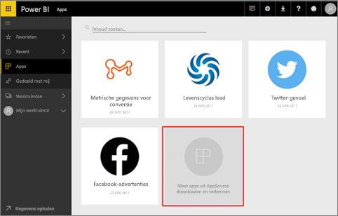
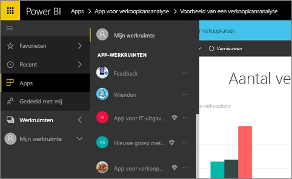
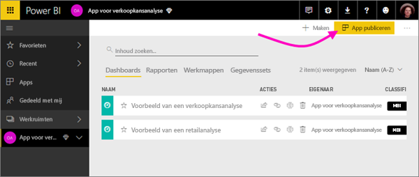
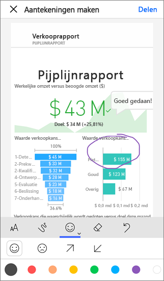

# Hoe kan ik samenwerken en inhoud delen in Power BI?

U hebt dashboards en rapporten gemaakt. Misschien werkt u er ook wel samen aan met collega's. In dat geval moeten anderen toegang hebben tot de dashboards en rapporten. Wat is de beste manier om ze te distribueren?

In dit artikel vergelijken we deze opties voor samenwerken en delen in Power BI: 

* Samenwerken met collega's om betekenisvolle rapporten en dashboards te maken in *app-werkruimten*.
* Deze dashboards en rapporten opnemen in *apps* en ze publiceren naar een grotere groep of de hele organisatie.
* Dashboards of rapporten delen met een paar personen, vanuit de service of de mobiele Power BI-apps.
* Publiceren op internet, waar iedereen ze kan zien en ermee kan werken.
* Afdrukken. 

Ongeacht welke optie u kiest, hebt u voor het delen van een dashboard een [licentie voor Power BI Pro](service-free-vs-pro.md) nodig of moet de inhoud zich in een [Premium capaciteit](service-premium.md) bevinden. De licentievereisten verschillen voor de collega's die uw dashboards raadplegen, afhankelijk van welke optie u kiest. In de volgende secties gaan we in op de details. 

*Apps in de Power BI-service*

## Samenwerken met collega's om een app te maken
Stel dat u en uw teamleden uw Power BI-inzichten willen publiceren naar uw organisatie. De beste manier om dat te doen, is door een *app* te maken. Een app is een verzameling dashboards en rapporten die is gebouwd om belangrijke metrische gegevens voor uw organisatie te leveren. 

Voor het maken van een app hebt u een *app-werkruimte* nodig, met uw teamleden als leden. Zie de app-werkruimte als een werkgebied waar u en uw collega's kunnen samenwerken aan uw Power BI-dashboards en -rapporten. Alle teamleden kunnen rapporten maken in Power BI Desktop en deze publiceren rapporten naar de app-werkruimte, en iedereen heeft een Power BI Pro-licentie nodig.

**Als u alleen een voltooid dashboard wilt delen met collega's, moet u ze niet toevoegen aan de app-werkruimte.** U [maakt het dashboard dan in een app-werkruimte](service-create-distribute-apps.md) en publiceert de app naar de collega's. 

## Uw app publiceren naar een brede doelgroep
Stel dat u uw dashboard wilt distribueren naar een brede doelgroep. U en uw collega's hebben een *app-werkruimte* gemaakt, en daarna dashboards, rapporten en gegevenssets gemaakt en verfijnd in de app-werkruimte. Nu gaat u de gewenste dashboards en rapporten selecteren en publiceren als een app, hetzij bedoeld voor leden van een beveiligingsgroep of distributielijst of voor de hele organisatie. 

Apps zijn gemakkelijk te vinden en installeren in de Power BI-service ([https://powerbi.com](https://powerbi.com)). U kunt gebruikers in uw bedrijf een directe koppeling sturen naar de app of ze kunnen ernaar zoeken in AppSource. Als de Power BI-beheerder u hiervoor toestemming geeft, kunt u een app automatisch installeren in de Power BI-accounts van uw collega's. Lees meer over het [publiceren van uw apps](service-create-distribute-apps.md#publish-your-app). 

Nadat ze een app hebben geïnstalleerd, kunnen ze deze bekijken in hun browser of op een mobiel apparaat.

Gebruikers die de app willen bekijken, moeten ook beschikken over een Power BI Pro-licentie, of de app moet worden opgeslagen in een Premium-capaciteit van Power BI. Lees [Wat is Power BI Premium?](service-premium.md) voor meer informatie.

## Dashboards en rapporten delen
Stel dat u een dashboard en een rapport hebt voltooid in uw eigen Mijn werkruimte of in een app-werkruimte en u een paar andere personen toegang tot de onderdelen wilt geven. Eén manier om dat te doen, is door ze te *delen*. 

U hebt een Power BI Pro-licentie nodig om uw inhoud te delen. Dit geldt ook voor de personen met wie u de inhoud deelt, tenzij de inhoud zich bevindt in een [Premium-capaciteit](service-premium.md). Wanneer u een dashboard of rapport deelt, kunnen de personen het dashboard of rapport bekijken en de inhoud ervan op verschillende manieren weergeven, maar niet bewerken. Ze zien dezelfde gegevens die u ziet in het dashboard en rapporten, tenzij beveiliging op rijniveau wordt toegepast op de onderliggende gegevensset. De collega's met wie u het dashboard deelt, kunnen het weer delen met andere collega's, maar alleen als u dat toestaat. 

U kunt ook delen met personen buiten uw organisatie. Deze personen kunnen het dashboard en rapport ook bekijken en de inhoud ervan op verschillende manieren weergeven, maar niet delen. 

Meer informatie over het [delen van dashboards en rapporten](service-share-dashboards.md) vanuit de Power BI-service. U kunt ook een filter toevoegen aan een koppeling en [ een gefilterde weergave van uw rapport delen](service-share-reports.md).

## Aantekeningen toevoegen en delen vanuit de mobiele Power BI-apps
In de mobiele Power BI-apps voor iOS en Android kunt u aantekeningen toevoegen aan een tegel, rapport of visueel element en het onderdeel vervolgens via e-mail delen met anderen. 

U deelt een momentopname van de tegel, het rapport of het visuele element. Dit betekent dat de ontvangers een weergave van het onderdeel zien precies zoals deze was op het moment dat u het e-mailbericht hebt verstuurd. Het e-mailbericht bevat ook een koppeling naar het dashboard of rapport. Als de ontvangers een licentie voor Power BI Pro hebben, of als de inhoud zich bevindt in een [Premium capaciteit](service-premium.md), en u het object al met ze hebt gedeeld, kunnen ze het openen. U kunt momentopnamen van tegels naar iedereen verzenden, niet alleen naar collega's in hetzelfde e-maildomein.

Lees hier meer over het [toevoegen van aantekeningen en het delen van tegels, rapporten en visuele elementen](mobile-annotate-and-share-a-tile-from-the-mobile-apps.md) vanuit de mobiele apps voor iOS en Android.

U kunt ook [een momentopname van een tegel delen](mobile-share-tile-windows-10-phone-app.md) vanuit de Power BI-app voor Windows 10-apparaten.

## Publiceren op internet
U kunt Power BI-rapporten publiceren op internet door interactieve visualisaties in te sluiten in blogberichten, op websites, in social media en in andere middelen voor onlinecommunicatie. Dit kan voor alle mogelijke apparaten. Iedereen op internet kan uw rapporten dan weergeven en u hebt geen controle over wie kan zien wat u hebt gepubliceerd. Er is ook geen licentie voor Power BI nodig. Publiceren op internet is alleen beschikbaar voor rapporten die u kunt bewerken. U kunt geen rapporten op internet publiceren als deze met u zijn gedeeld of als ze zijn opgenomen in een app. Lees hier meer over [publiceren op internet](service-publish-to-web.md).

## Afdrukken of opslaan als PDF of een ander statisch bestand
U kunt vanuit de Power BI-service een dashboard, dashboardtegel, rapportpagina of visualisatie in zijn geheel afdrukken of opslaan als PDF-bestand (of andere statische bestandsindeling). Rapporten kunnen alleen pagina voor pagina worden afgedrukt. U kunt niet het hele rapport in één keer afdrukken. Lees hier meer over het [afdrukken of opslaan als een statisch bestand](service-print.md).

## Volgende stappen
* Wilt u feedback geven? Dit kan op de [site van de Power BI-community](https://community.powerbi.com/).
* [Dashboards delen met collega's en anderen](service-share-dashboards.md)
* [Een app opslaan en publiceren in PowerApps](service-create-distribute-apps.md)
* Nog vragen? [Misschien dat de Power BI-community het antwoord weet](http://community.powerbi.com/).

