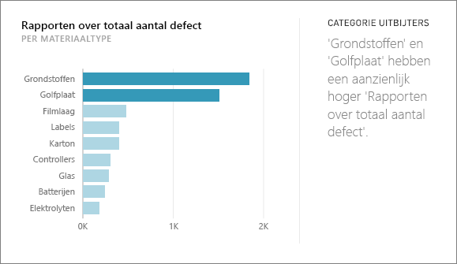
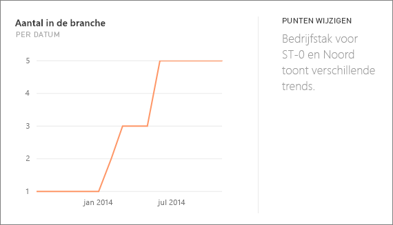
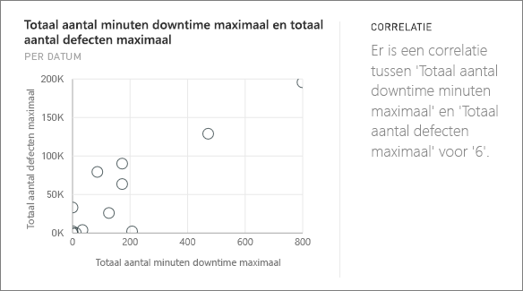
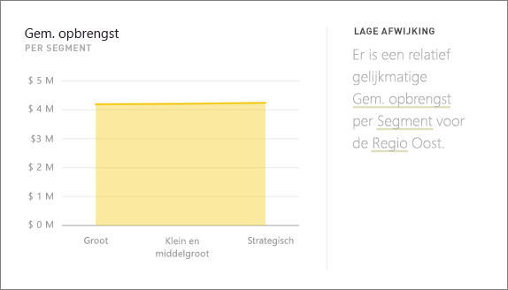
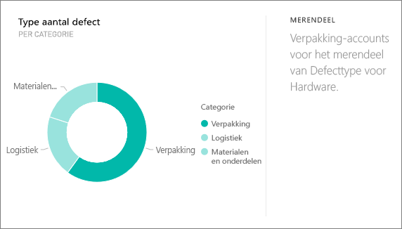
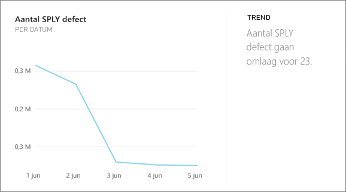
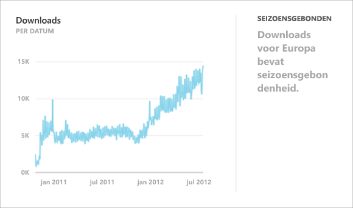
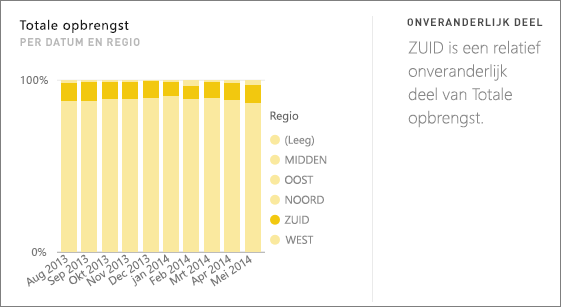
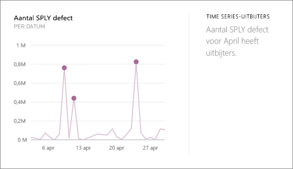

# Typen inzichten die door Power BI worden ondersteund
## Hoe werkt Inzichten?
Power BI doorzoekt snel verschillende subsets van uw gegevensset terwijl er tegelijkertijd een geavanceerde algoritmen worden toegepast om potentieel interessante inzichten te detecteren. Power BI probeert binnen de toegewezen hoeveelheid tijd zo veel mogelijk van een gegevensset te scannen.

U kunt inzichten uitvoeren op basis van een gegevensset of dashboardtegel.   

## Wat voor typen inzichten kunnen er worden gezocht?
Hier volgen enkel van de algoritmen die we gebruiken:

## Categorie-uitbijters (boven/onder)
Markeert gevallen, voor een meting in het model, waarbij een of twee leden van een dimensie veel hogere waarden hebben dan andere leden van de dimensie.  

## Punten wijzigen in een tijdreeks
Geeft aan wanneer er belangrijke wijzigingen in trends in een tijdreeks van gegevens plaatsvinden.

## Correlatie
Detecteert gevallen waarbij meerdere metingen een correlatie tussen elkaar laten zien wanneer ze worden afgezet tegen een dimensie in de gegevensset.

## Lage afwijking
Detecteert gevallen waarbij de gegevenspunten niet ver van het gemiddelde liggen.

## Meerderheid (belangrijke factoren)
Wanneer een meerderheid van de totale waarde kan worden toegeschreven aan één factor wanneer de waarde wordt onderverdeeld op basis van een andere dimensie.  

## Algemene trends in Time Series
Detecteren van opwaartse of neerwaartse trends in Time Series-gegevens.

## Seizoensgebondenheid in Time Series
Hiermee worden periodieke patronen in Time Series-gegevens gedetecteerd, zoals wekelijkse, maandelijkse of jaarlijkse seizoensgebondenheid.

## Onveranderlijk deel
Markeert gevallen waarbij voor een continue variabele er een correlatie bestaat tussen het aandeel van de waarde van een onderliggend item in relatie tot de totale waarde van een bovenliggend item.

## Time Series-uitbijters
Detecteert of er specifieke datums of tijden voor verschillende tijdreeksen zijn met waarden die aanzienlijk afwijken van de andere datum-/tijdwaarden.

## Volgende stappen
[Power BI-inzichten](service-insights.md)

Als u de eigenaar van een gegevensset bent, kunt u deze [optimaliseren voor inzichten](service-insights-optimize.md)

Nog vragen? [Misschien dat de Power BI-community het antwoord weet](http://community.powerbi.com/)

